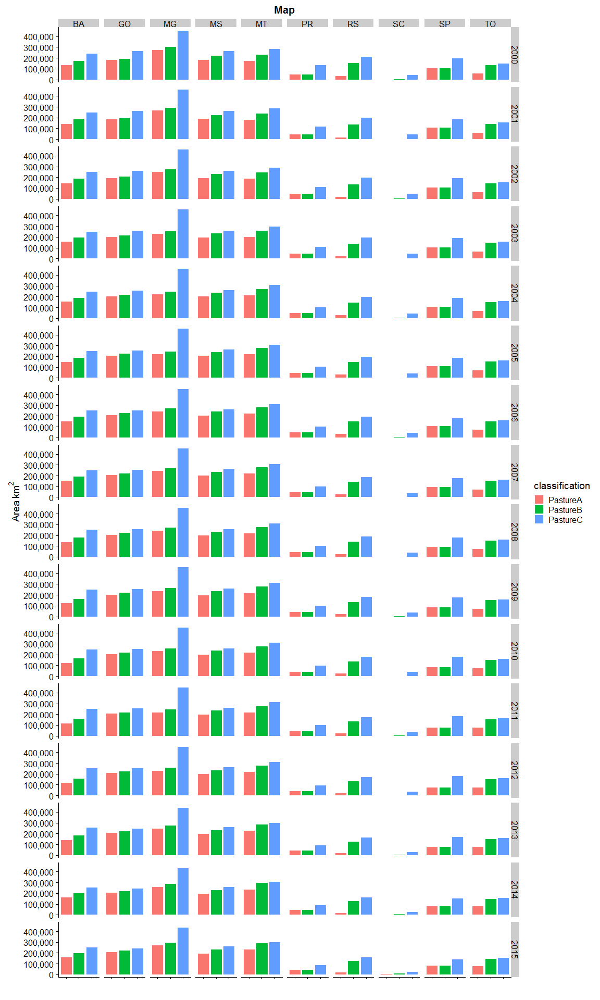

This script analyses pasture areas, meat production and dairy production (and intensities) for all states and years, and multiple classifications (see accompanying Excel file) for two data sources:

- _MB_ is the original 30m MapBiomas data
- _Map_ is our aggregated 5km map data


```r
rm(list=ls())
library(tidyverse)
library(raster)
library(readxl)      #for reading Excel sheets
library(scales)      #useful for ggplotting
library(knitr)
library(rasterVis)   #more useful raster plotting
library(cowplot)     #useful for ggplotting
```


```r
#raster to xyz  (with help from https://stackoverflow.com/a/19847419)
#sepcify input raster, whether nodata cells should be output, whether a unique cell ID should be added
#return is a matrix. note format is row (Y) then col (X)
extractXYZ <- function(raster, nodata = FALSE, addCellID = TRUE){
  
  vals <- raster::extract(raster, 1:ncell(raster))   #specify raster otherwise dplyr used
  xys <- rowColFromCell(raster,1:ncell(raster))
  combine <- cbind(xys,vals)
  
  if(addCellID){
    combine <- cbind(1:length(combine[,1]), combine)
  }
  
  if(!nodata){
    combine <- combine[!rowSums(!is.finite(combine)),]  #from https://stackoverflow.com/a/15773560
  }
  
  return(combine)
}


getLCs <- function(data)
{
  #calculates proportion of each LC in the muni (ignoring NAs, help from https://stackoverflow.com/a/44290753)
  data %>%
    group_by(muniID) %>%
    dplyr::summarise(LC1 = round(sum(map == 1, na.rm = T) / sum(!is.na(map)), 3),
                     LC2 = round(sum(map == 2, na.rm = T) / sum(!is.na(map)), 3),
                     LC3 = round(sum(map == 3, na.rm = T) / sum(!is.na(map)), 3),
                     LC4 = round(sum(map == 4, na.rm = T) / sum(!is.na(map)), 3),
                     LC5 = round(sum(map == 5, na.rm = T) / sum(!is.na(map)), 3),
                     NonNAs = sum(!is.na(map)),
                     NAs = sum(is.na(map))
    ) -> LCs

  return(LCs)
}
```


```r
unzip(zipfile="MapBiomas_23_ASCII_unclassified_allYears.zip")  # unzip all files 

#for 'suppressMessages' see https://stackoverflow.com/a/41229387
mb_data <- suppressMessages(read_csv("LandCover Data - MapBiomas - Collection 2.3 - 2018.01.04 Municipios.csv"))

unzip(zipfile="sim10_BRmunis_latlon_5km_2018-04-27.zip",files="sim10_BRmunis_latlon_5km_2018-04-27.asc",exdir="ASCII")  # unzip file 
munis.r <- raster("ASCII/sim10_BRmunis_latlon_5km_2018-04-27.asc")  #do this with zip file

#extract cell values to table format
munis.t <- extractXYZ(munis.r, addCellID = F)
munis.t <- as.data.frame(munis.t)
munis.t <- plyr::rename(munis.t, c("vals" = "muniID"))
```


```r
#Specify classifications and years to examine. Classifications should be the names of Sheets in the Classifications Excel file. Years should be between 2000 and 2015 

#classifications to loop through 
cls <- c("PastureA", "PastureB", "PastureC")

yrls <- seq(2000,2015,1)
```


```r
#lists to hold data tables 
CData_ls <- vector('list', length(cls))
CDataW_ls <- vector('list', length(cls))
SDataW_ls <- vector('list', length(cls))
Stotals_ls <- vector('list', length(cls))
SDataW_Adj_ls <- vector('list', length(cls))
mapStack_ls <- vector('list', length(cls))

names(CData_ls) <- cls
names(CDataW_ls) <- cls
names(SDataW_ls) <- cls
names(Stotals_ls) <- cls
names(SDataW_Adj_ls) <- cls
names(mapStack_ls) <- cls

#loop over classifications
for(i in seq_along(cls)){
  
  classification <- read_excel("MapBiomas_CRAFTY_classifications.xlsx", sheet = cls[i], range="B2:C21", col_names=F) 
  
  #reset mapStack for this Classification
  mapStack <- stack()

  #loop over years  
  for(j in seq_along(yrls)){

  #print(paste0("Classification: ",cls[i],", Year: ",yrls[j]))
  
  map <- raster(paste0("ASCII/brazillc_",yrls[j],"_5km_int.txt"))
  map <- reclassify(map, rcl=as.matrix(classification))
  
  
  #add categories for later plotting etc. (see https://stackoverflow.com/a/37214431)
  map <- ratify(map)     #tell R that the map raster is categorical 
  rat <- levels(map)[[1]]    #apply the levels (i.e. categories) 
 
  #not all classes may be present after classification, so conditionally construct labels
  labs <- c()
  if(1 %in% levels(map)[[1]]$ID) { labs <- c(labs, "Nature") }
  if(2 %in% levels(map)[[1]]$ID) { labs <- c(labs, "OtherAgri") }
  if(3 %in% levels(map)[[1]]$ID) { labs <- c(labs, "Agriculture") }
  if(4 %in% levels(map)[[1]]$ID) { labs <- c(labs, "Other") }
  if(5 %in% levels(map)[[1]]$ID) { labs <- c(labs, "Pasture") }
    
  rat$landcover <- labs  
  levels(map) <- rat 
  
  #add to mapStack for later plotting
  mapStack <- stack(map, mapStack)

  #extract cell values to table format
  map.t <- extractXYZ(map, addCellID = F)
  map.t <- as.data.frame(map.t)
  map.t <- plyr::rename(map.t, c("vals" = "map"))

  #so need to join 
  map_munis <- left_join(as.data.frame(munis.t), as.data.frame(map.t), by = c("row" = "row", "col" = "col"))

  #now summarise by muniID
  lcs_map_munis <- getLCs(map_munis)

  #convert cell counts to areas (km2) and add state id
  map_areas_munis <- lcs_map_munis %>%
    mutate(LC1area = round(LC1 * NonNAs) * 25) %>%
    mutate(LC2area = round(LC2 * NonNAs) * 25) %>%
    mutate(LC3area = round(LC3 * NonNAs) * 25) %>%
    mutate(LC4area = round(LC4 * NonNAs) * 25) %>%
    mutate(LC5area = round(LC5 * NonNAs) * 25) %>%
    mutate(state = substr(muniID, 1, 2))

  #drop original cell-count columns (work with area km2 from now on)
  map_areas_munis <- map_areas_munis %>% dplyr::select(-LC1, -LC2, -LC3, -LC4, -LC5, -NonNAs, -NAs)

  #summarise muni areas to state level
  map_areas <- map_areas_munis %>%
    group_by(state) %>%
    dplyr::summarise_at(vars(LC1area:LC5area),sum, na.rm=T) %>%  #use _at so state is not summarised
    mutate_if(is.character, as.integer)

  #gather to long format for union below
  map_areas <- map_areas %>%
    gather(key = LCa, value = area, -state)
  
  #recode LCs for union below
  map_areas <- map_areas %>%
    mutate(LC = if_else(LCa == "LC1area", 1, 
      if_else(LCa == "LC2area", 2,
      if_else(LCa == "LC3area", 3,
      if_else(LCa == "LC4area", 4,
      if_else(LCa == "LC5area", 5, 0)
      )))))

  #add source variable for plotting below (re-order to match map table for union below)
  map_areas <- map_areas %>%
    dplyr::select(-LCa) %>%
    mutate(source = "Map") %>%
    dplyr::select(state, LC, source, area)

  ###Summarise MapBiomas data to the states we are simulating

  #filter to get only the states we want
  mb_areas <- mb_data %>%
    filter(Estados == "TOCANTINS" | 
        Estados == "BAHIA" |
        Estados == "MINAS GERAIS" |
        Estados == "SÃO PAULO" |
        Estados == "PARANÁ" |
        Estados == "SANTA CATARINA" |
        Estados == "RIO GRANDE DO SUL" |
        Estados == "MATO GROSSO DO SUL" |
        Estados == "MATO GROSSO" |
        Estados == "GOIÁS")
  
  #add state column containing state ids
  mb_areas <- mb_areas %>%
    mutate(state = if_else(Estados == "TOCANTINS", 17, 
      if_else(Estados == "BAHIA", 29,
      if_else(Estados == "MINAS GERAIS", 31,
      if_else(Estados == "SÃO PAULO", 35,
      if_else(Estados == "PARANÁ", 41,
      if_else(Estados == "SANTA CATARINA", 42,
      if_else(Estados == "RIO GRANDE DO SUL", 43, 
      if_else(Estados == "MATO GROSSO DO SUL", 50, 
      if_else(Estados == "MATO GROSSO", 51,
      if_else(Estados == "GOIÁS", 52, 0
      ))))))))))
    )
  
      
  #select only columns we want    
  mb_areas <- mb_areas %>%
    dplyr::select(state, paste0(yrls[j]), `Classe Nivel 3`) %>% 
    dplyr::rename(area = paste0(yrls[j]))
  
  #because there is no consistency between land cover labels
  legenda = c("Forest Formations"=1, "Natural Forest Formations"=2, "Dense Forest"=3, "Savanna Formations"=4, "Mangroves"=5,"Forest Plantations"=9, "Non-Forest Natural Formations"=10, "Non Forest Wetlands"=11, "Grasslands"=12, "Other Non Forest Natural Formations"=13, "Farming"=14, "Pasture"=15, "Agriculture"=18, "Agriculture or Pasture"=21, "Non-Vegetated Areas"=22, "Dunes and Beaches"=23, "Urban Infrastructure"=24,"Other Non-Vegetated Area"=25,"Water Bodies"=26, "Non-Observed"=27)
  
  #recode to values (which match the map)
  mb_areas <- mb_areas %>%
    mutate(LC = recode(`Classe Nivel 3`, !!!legenda))
  
  #use the classification values from above to relassify land covers
  mb_areas$LC <- plyr::mapvalues(mb_areas$LC, from=as.numeric(classification$X__1), to=as.numeric(classification$X__2))
  
  #calculate total LC area by state
  mb_areas <- mb_areas %>%
    group_by(state, LC) %>%
    dplyr::summarise_at(vars(area),sum, na.rm=T) 
  
  #round to integer
  mb_areas <- mb_areas %>%
    mutate(area_km2 = round(area,0))
  
  #add source variable for plotting below (re-order to match map table for union below)
  mb_areas <- mb_areas %>%
    dplyr::select(-area) %>%
    mutate(source = "MB") %>%
    rename(area = area_km2) %>%
    dplyr::select(state, LC, source, area)
    

  CData_yr <- union_all(map_areas, mb_areas)

  #relabel states to characters
  CData_yr <- CData_yr %>%
    mutate(state = if_else(state == 17, "TO", 
      if_else(state == 29, "BA",
      if_else(state == 31, "MG",
      if_else(state == 35, "SP",
      if_else(state == 41, "PR",
      if_else(state == 42, "SC",
      if_else(state == 43, "RS", 
      if_else(state == 50, "MS",
      if_else(state == 51, "MT",
      if_else(state == 52, "GO", "NA"
      ))))))))))
    )
  
  #relabel LCs to characters
  CData_yr <- CData_yr %>%
    mutate(LC = if_else(LC == 1, "Nature", 
      if_else(LC == 2, "OtherAgri",
      if_else(LC == 3, "Agri",
      if_else(LC == 4, "Other",
      if_else(LC == 5, "Pasture", "NA"
      )))))
    )
  
  #add year column
  CData_yr <- CData_yr %>%
    mutate(year = yrls[j])
  
  #union CData for years here.
  #if first iteration of classification loop (re)create the tibble
  if(j == 1){
      CData <- CData_yr
  }
    
  #else join data to tibble (by creating another tibble, then join (ensure rows are not lost)
  else {
      CData <- union_all(CData, CData_yr)
  }
  }
  
  CData_ls[[i]] <- CData
  
  names(mapStack) <- yrls
  mapStack_ls[[i]] <- mapStack
}
```

#Maps
For 2015 for the three different classifications (for quick visual comparison)

```r
for(i in seq_along(mapStack_ls)){
  
  clabs <- c()
  if(1 %in% levels(mapStack_ls[[i]])[[1]]$ID) { clabs <- c(clabs, 'forestgreen') }
  if(2 %in% levels(mapStack_ls[[i]])[[1]]$ID) { clabs <- c(clabs, 'wheat1') }
  if(3 %in% levels(mapStack_ls[[i]])[[1]]$ID) { clabs <- c(clabs, 'orange2') }
  if(4 %in% levels(mapStack_ls[[i]])[[1]]$ID) { clabs <- c(clabs, 'gray') }
  if(5 %in% levels(mapStack_ls[[i]])[[1]]$ID) { clabs <- c(clabs, 'darkolivegreen') }
  
  print(cls[i])

  print(rasterVis::levelplot(mapStack_ls[[i]]$X2015, pretty=T,att = 'landcover', col.regions=clabs, main=paste0(cls[[i]], "2015")))
  
}
```

```
## [1] "PastureA"
```

<!-- -->

```
## [1] "PastureB"
```

<!-- -->

```
## [1] "PastureC"
```

<!-- -->


##Pasture area by state, year and classification

```r
#add classification lable to the CData tables
for(i in seq_along(cls)){
  
  CData_ls[[i]] <- CData_ls[[i]] %>%
    mutate(classification = cls[i])
}

#union the CData tables for the different classifications
for(i in seq_along(cls)){
  
  if(i == 1) { CDataU <- CData_ls[[i]] }
  else { CDataU <- dplyr::union(CDataU, CData_ls[[i]]) }
}

#filter to pasture only
CData_Pas <- CDataU %>%
  dplyr::filter(LC == "Pasture")
```


```r
CData_Pas %>% 
  dplyr::filter(source == "Map") %>%
  ggplot(aes(x=classification, y=area, fill=classification)) + 
    geom_bar(stat="identity", colour="white", position = "dodge") +
    scale_y_continuous(name=expression(Area~km^{2}), labels = scales::comma) +
  #labs(x=expression(Data~Source),y=expression(Area~km^{2})) +
    facet_grid(year~state) +
    xlab("") +
    #ylab("Pasture Area km2") +
    theme(axis.text.x = element_blank()) +
  ggtitle("Map")
```

<!-- -->

```r
CData_Pas %>% 
  dplyr::filter(source == "MB") %>%
  ggplot(aes(x=classification, y=area, fill=classification)) + 
    geom_bar(stat="identity", colour="white", position = "dodge") +
    scale_y_continuous(name=expression(Area~km^{2}), labels = scales::comma) +
    facet_grid(year~state) +
    xlab("")+
    #ylab("Pasture Area km2") +
    theme(axis.text.x = element_blank()) +
  ggtitle("MB")
```

<!-- -->


```r
#Load Production Data
meat_prod_Astates <- read_excel("Cattle_meat_production_Kg_2000_2017_all_states.xlsx", sheet = "Plan1", skip = 1)  #data for all states Astates

#dairy data are by municiaplity for all states (Amunis)
dairy_prod_Amunis <- read_excel("dairy_Municipalities_Brazil.xlsx", sheet = "Tabela", skip = 1, na = c("", "-", "..."))
```


```r
#join to pasture areas
meat_areas <- inner_join(CData_Pas, meat_prod_Fstates_long, by = c("year", "state"))
dairy_areas <- inner_join(CData_Pas, dairy_prod_Fstates_long, by = c("year", "state"))

#calculate intensities
meat_areas <- meat_areas %>%
  mutate(intensity = kg / area)

dairy_areas <- dairy_areas %>%
  mutate(intensity = kg / area)
```

#Meat
##Production by state, year and classification
Differentiated between original 30m MapBiomas reported data ( _MB_ ) and our aggregated 5km map data ( _map_ ) and

The next two plots have the same variables on the y-axis (Intensity) but the second plot is differently scaled (some bars are not plotted because their value is greater than the limit of the axis).

```r
meat_areas %>% 
  filter(source == "Map") %>%
  ggplot(aes(x=classification, y=intensity, fill=classification)) + 
    geom_bar(stat="identity", colour="white", position = "dodge") +
    scale_y_continuous(name=expression(Intensity~kg~km^{2}),limits = c(0, 30000)) +
    facet_grid(year~state) +
    xlab("")+
    theme(axis.text.x = element_blank()) +
  ggtitle("Meat, Map")
```

```
## Warning: Removed 9 rows containing missing values (geom_bar).
```

<!-- -->

```r
meat_areas %>% 
  filter(source == "MB") %>%
  ggplot(aes(x=classification, y=intensity, fill=classification)) + 
    geom_bar(stat="identity", colour="white", position = "dodge") +
    scale_y_continuous(name=expression(Intensity~kg~km^{2}),limits = c(0, 30000)) +
    facet_grid(year~state) +
    xlab("") +
    theme(axis.text.x = element_blank()) +
  ggtitle("Meat, MB")
```

<!-- -->

We see SC, SP and RS are all high relative to other states. We also see that intensities are generally greatest for _PatureA_ classification, lower for _PastureB_ and lowest for _PastureC_.  


##Summary stats over time
Now let's summarise the data over time and examine their means and medians (with variation - error bar is one SE)


```r
meat_summary %>%
  #filter(source == "MB") %>%
  ggplot(aes(x=classification, y=int_mn, fill=classification)) + 
  geom_errorbar(aes(ymin=int_mn-int_se, ymax=int_mn+int_se), width=.1) +
  geom_bar(stat="identity", colour="white", position = "dodge") +
  facet_grid(source~state) +
  scale_y_continuous(name=expression(Intensity~kg~km^{2}), labels = scales::comma) +
  xlab("")+
  theme(axis.text.x = element_blank()) +
  ggtitle("Meat, Mean")
```

<!-- -->

```r
meat_summary %>%
  #filter(source == "Map") %>%
  ggplot(aes(x=classification, y=int_md, fill=classification)) + 
  geom_errorbar(aes(ymin=int_md-int_se, ymax=int_md+int_se), width=.1) +
  geom_bar(stat="identity", colour="white", position = "dodge") +
  facet_grid(source~state) +
  scale_y_continuous(name=expression(Intensity~kg~km^{2}), labels = scales::comma) +
  xlab("")+
  theme(axis.text.x = element_blank()) +
  ggtitle("Meat, Median")
```

<!-- -->

Again we see the same patterns; SC, SP and RS are greater than other states and _PastureA_ > _PastureB_ > _PastureC_.

If we plot again, but this time limiting the y-axis to 15,000 kg/km2

```r
meat_summary %>%
  #filter(source == "MB") %>%
  ggplot(aes(x=classification, y=int_mn, fill=classification)) + 
  geom_errorbar(aes(ymin=int_mn-int_se, ymax=int_mn+int_se), width=.1) +
  geom_bar(stat="identity", colour="white", position = "dodge") +
  facet_grid(source~state) +
  scale_y_continuous(name=expression(Intensity~kg~km^{2}), labels = scales::comma,limits = c(0, 15000)) +
  xlab("")+
  theme(axis.text.x = element_blank()) +
  ggtitle("Meat, Mean")
```

```
## Warning: Removed 1 rows containing missing values (geom_errorbar).
```

```
## Warning: Removed 1 rows containing missing values (geom_bar).
```

<!-- -->

```r
meat_summary %>%
  #filter(source == "Map") %>%
  ggplot(aes(x=classification, y=int_md, fill=classification)) + 
  geom_errorbar(aes(ymin=int_md-int_se, ymax=int_md+int_se), width=.1) +
  geom_bar(stat="identity", colour="white", position = "dodge") +
  facet_grid(source~state) +
  scale_y_continuous(name=expression(Intensity~kg~km^{2}), labels = scales::comma,limits = c(0, 15000)) +
  xlab("")+
  theme(axis.text.x = element_blank()) +
  ggtitle("Meat, Median")
```

```
## Warning: Removed 1 rows containing missing values (geom_errorbar).

## Warning: Removed 1 rows containing missing values (geom_bar).
```

<!-- -->

We can now more clearly compare classifications. In some states (PR, SP) _PastureA_ and _PastureB_ are very similar values, but in many others _PastureB_ is lower; _PastureC_ is noticably smaller than the other classifications. We also see that Intensity is greater for  _MB_ data compared to _Map_. 

**Seems feasible to use _PastureB_ classification?**

If so, the 'perfect' meat intensity would be ~9,100 kg km2 (see raw table of summary data below)

```r
kable(arrange(meat_summary, desc(int_mn), state, classification), caption="Meat data, sorted on mean production values descending")
```


Table: Meat data, sorted on mean production values descending

state   classification   source    area_mn   area_md   area_sd     prod_mn      prod_md     prod_sd   int_mn   int_md   int_sd     int_se
------  ---------------  -------  --------  --------  --------  ----------  -----------  ----------  -------  -------  -------  ---------
SC      PastureA         Map          3144      2175      2656    74131260     73967400    21868077    33072    31647    18435   1152.179
SC      PastureA         MB           6009      4734      3375    74131260     73967400    21868077    14079    12221     5689    355.539
RS      PastureA         Map         27769     27562      5014   359173016    383339288    72758858    13197    12254     3099    193.717
SP      PastureA         MB          72811     72982      8244   878686400    885858229   119385323    12191    12844     1883    117.663
SP      PastureB         MB          72872     73064      8246   878686400    885858229   119385323    12181    12834     1881    117.584
RS      PastureA         MB          35380     35848      3905   359173016    383339288    72758858    10197    10047     2099    131.188
SC      PastureB         Map          8431      7325      2603    74131260     73967400    21868077     9245     7849     3373    210.792
SP      PastureA         Map         96892     96938     12772   878686400    885858229   119385323     9202     9637     1534     95.869
SP      PastureB         Map         96908     96962     12762   878686400    885858229   119385323     9200     9637     1533     95.801
SC      PastureB         MB          10558      9354      3361    74131260     73967400    21868077     7345     6239     2613    163.312
PR      PastureA         MB          38772     39042      2489   280084706    288614877    49929771     7306     7776     1599     99.965
PR      PastureB         MB          38773     39043      2489   280084706    288614877    49929771     7306     7776     1599     99.964
MS      PastureA         MB         140393    140576      4251   833020798    816012972    77083654     5938     5787      578     36.142
PR      PastureA         Map         48111     48988      2616   280084706    288614877    49929771     5867     6187     1222     76.394
PR      PastureB         Map         48111     48988      2616   280084706    288614877    49929771     5867     6187     1222     76.394
SP      PastureC         MB         156563    156830     10074   878686400    885858229   119385323     5636     5734      818     51.112
MT      PastureA         MB         183946    188248     15110   958318285   1020597324   289662995     5125     5427     1248     78.018
SP      PastureC         Map        182548    185688     14370   878686400    885858229   119385323     4846     4869      751     46.952
GO      PastureA         MB         138150    139554      4854   643774060    655177836   123381231     4644     4631      797     49.808
MS      PastureB         MB         183896    184818      5083   833020798    816012972    77083654     4530     4436      404     25.220
MT      PastureA         Map        216455    221850     18345   958318285   1020597324   289662995     4353     4600     1048     65.507
MS      PastureA         Map        200350    201550      5324   833020798    816012972    77083654     4159     4072      378     23.611
GO      PastureB         MB         158894    159752      5393   643774060    655177836   123381231     4039     4009      707     44.183
MT      PastureB         MB         248766    254522     16432   958318285   1020597324   289662995     3799     4012      975     60.938
MS      PastureC         MB         231828    231526      2783   833020798    816012972    77083654     3596     3530      359     22.434
MS      PastureB         Map        237114    238938      5595   833020798    816012972    77083654     3514     3442      322     20.148
MT      PastureB         Map        275080    281712     19073   958318285   1020597324   289662995     3433     3627      871     54.410
TO      PastureA         MB          62120     64202      4264   204120756    208454298    57704451     3242     3250      755     47.167
RS      PastureB         MB         114163    114683      6112   359173016    383339288    72758858     3159     3288      690     43.123
MS      PastureC         Map        264227    264362      1304   833020798    816012972    77083654     3153     3092      293     18.301
GO      PastureA         Map        205253    208900      8725   643774060    655177836   123381231     3122     3112      511     31.908
MT      PastureC         Map        307350    312275      9468   958318285   1020597324   289662995     3102     3237      904     56.477
MT      PastureC         MB         318825    323696      7208   958318285   1020597324   289662995     3003     3149      913     57.044
GO      PastureC         MB         221946    221405      6000   643774060    655177836   123381231     2916     2967      629     39.285
GO      PastureB         Map        220059    223062      9109   643774060    655177836   123381231     2913     2893      484     30.266
PR      PastureC         MB         100541     99522      6494   280084706    288614877    49929771     2821     2912      631     39.446
MG      PastureA         MB         185439    186648      8655   508972814    555300819   154613474     2754     3034      828     51.729
TO      PastureA         Map         74369     76375      6235   204120756    208454298    57704451     2703     2721      594     37.131
PR      PastureC         Map        106378    105425     11194   280084706    288614877    49929771     2696     2745      680     42.489
RS      PastureB         Map        141067    140112      7721   359173016    383339288    72758858     2560     2662      570     35.650
GO      PastureC         Map        258145    258550      6681   643774060    655177836   123381231     2506     2539      539     33.678
MG      PastureB         MB         215311    216750      8344   508972814    555300819   154613474     2370     2602      712     44.507
RS      PastureC         MB         167217    169520      9757   359173016    383339288    72758858     2169     2258      516     32.264
MG      PastureA         Map        246389    246750     18155   508972814    555300819   154613474     2078     2306      615     38.457
RS      PastureC         Map        188600    191212     15415   359173016    383339288    72758858     1935     1976      495     30.954
SC      PastureC         Map         42070     42738      6608    74131260     73967400    21868077     1874     1743      815     50.962
MG      PastureB         Map        273078    274412     17617   508972814    555300819   154613474     1871     2070      551     34.411
SC      PastureC         MB          43342     43526      2828    74131260     73967400    21868077     1746     1712      612     38.257
TO      PastureB         MB         130148    131276      3763   204120756    208454298    57704451     1560     1572      420     26.264
BA      PastureA         MB         139045    140580     10877   210624063    239675206    81054216     1533     1695      622     38.902
BA      PastureA         Map        145261    148025     15042   210624063    239675206    81054216     1477     1622      618     38.608
TO      PastureB         Map        151998    153412      4818   204120756    208454298    57704451     1336     1339      358     22.403
TO      PastureC         MB         157748    157824       632   204120756    208454298    57704451     1294     1322      366     22.862
MG      PastureC         MB         400390    401018      6321   508972814    555300819   154613474     1276     1392      403     25.172
TO      PastureC         Map        162411    163225      2860   204120756    208454298    57704451     1254     1268      348     21.756
BA      PastureB         Map        185330    190238     14493   210624063    239675206    81054216     1151     1272      468     29.250
BA      PastureB         MB         186961    189788     10680   210624063    239675206    81054216     1135     1262      452     28.263
MG      PastureC         Map        454398    455775      8366   508972814    555300819   154613474     1125     1220      357     22.297
BA      PastureC         Map        253878    254375      3213   210624063    239675206    81054216      828      944      315     19.692
BA      PastureC         MB         279060    278120      2968   210624063    239675206    81054216      753      864      285     17.836

#Dairy
##Production by state, year and classification
Differentiated between original 30m MapBiomas data ( _MB_ ) and our aggregated 5km map data ( _map_ ).


```r
dairy_areas %>%
  group_by(state, classification, source) %>%
  summarise(
    area_mn = round(mean(area),0),
    area_md = round(median(area),0),
    area_sd = round(sd(area),0),
    prod_mn = round(mean(kg),0),
    prod_md = round(median(kg),0),
    prod_sd = round(sd(kg),0),
    int_mn = round(mean(intensity),0),
    int_md = round(median(intensity),0),
    int_sd = round(sd(intensity),0),
    int_se = round(sd(intensity) / length(intensity), 3)
    ) -> dairy_summary
```


```r
dairy_areas %>% 
  filter(source == "Map") %>%
  ggplot(aes(x=classification, y=intensity, fill=classification)) + 
    geom_bar(stat="identity", colour="white", position = "dodge") +
    scale_y_continuous(name=expression(Intensity~kg~km^{2}), labels = scales::comma) +
    facet_grid(year~state) +
    xlab("") +
    theme(axis.text.x = element_blank()) +
  ggtitle("Dairy, Map")
```

<!-- -->

```r
dairy_areas %>% 
  filter(source == "MB") %>%
  ggplot(aes(x=classification, y=intensity, fill=classification)) + 
    geom_bar(stat="identity", colour="white", position = "dodge") +
    scale_y_continuous(name=expression(Intensity~kg~km^{2}), labels = scales::comma) +
    facet_grid(year~state) +
    xlab("") +
    theme(axis.text.x = element_blank()) +
  ggtitle("Dairy, MB")
```

<!-- -->

The magnitude of Intensity for dairy in SC (and to some extent RS) is even more stark than for meat production, especially for our _Map_ data.   

Let's not re-scale the y-axis here, and instead go direct to the summary values. 

##Summary stats over time

```r
dairy_summary %>%
  #filter(source == "MB") %>%
  ggplot(aes(x=classification, y=int_mn, fill=classification)) + 
  geom_errorbar(aes(ymin=int_mn-int_se, ymax=int_mn+int_se), width=.1) +
  geom_bar(stat="identity", colour="white", position = "dodge") +
  facet_grid(source~state) +
  scale_y_continuous(name=expression(Intensity~kg~km^{2}), labels = scales::comma) +
  xlab("")+
  theme(axis.text.x = element_blank()) +
  ggtitle("Dairy, Mean")
```

<!-- -->

```r
dairy_summary %>%
  #filter(source == "Map") %>%
  ggplot(aes(x=classification, y=int_md, fill=classification)) + 
  geom_errorbar(aes(ymin=int_md-int_se, ymax=int_md+int_se), width=.1) +
  geom_bar(stat="identity", colour="white", position = "dodge") +
  facet_grid(source~state) +
  scale_y_continuous(name=expression(Intensity~kg~km^{2}), labels = scales::comma) +
  xlab("")+
  theme(axis.text.x = element_blank()) +
  ggtitle("Dairy, Median")
```

<!-- -->

Again, we see the very high intensities for SC, RS and PR. 

Plot the summary stats again, but this time limit the y-axis to 250,000 kg km2

```r
dairy_summary %>%
  #filter(source == "MB") %>%
  ggplot(aes(x=classification, y=int_mn, fill=classification)) + 
  geom_errorbar(aes(ymin=int_mn-int_se, ymax=int_mn+int_se), width=.1) +
  geom_bar(stat="identity", colour="white", position = "dodge") +
  facet_grid(source~state) +
  scale_y_continuous(name=expression(Intensity~kg~km^{2}), labels = scales::comma, limits = c(0, 250000)) +
  xlab("")+
  theme(axis.text.x = element_blank()) +
  ggtitle("Dairy, Mean")
```

```
## Warning: Removed 3 rows containing missing values (geom_errorbar).
```

```
## Warning: Removed 3 rows containing missing values (geom_bar).
```

<!-- -->

```r
dairy_summary %>%
  #filter(source == "Map") %>%
  ggplot(aes(x=classification, y=int_md, fill=classification)) + 
  geom_errorbar(aes(ymin=int_md-int_se, ymax=int_md+int_se), width=.1) +
  geom_bar(stat="identity", colour="white", position = "dodge") +
  facet_grid(source~state) +
  scale_y_continuous(name=expression(Intensity~kg~km^{2}), labels = scales::comma, limits = c(0, 250000)) +
  xlab("")+
  theme(axis.text.x = element_blank()) +
  ggtitle("Dairy, Median")
```

```
## Warning: Removed 2 rows containing missing values (geom_errorbar).
```

```
## Warning: Removed 2 rows containing missing values (geom_bar).
```

<!-- -->

_PastureA_ for SC is not plotted at its value is so large. 

**I think we maybe need to ignore SC as it has such high intensity?**  (High intensity is due to very low area - see plots at top, and raw areas table at bottom, of this file)

**And we should use the** _PastureB_ **classification?**

If we ignore SC and use _PastureB_ the next largest _PastureB_ dairy intensity value (for Map) is PR (around 67,000; see Table below)


```r
kable(arrange(dairy_summary, desc(int_mn), state, classification), caption="Dairy data, sorted on mean values descending")
```


Table: Dairy data, sorted on mean values descending

state   classification   source    area_mn   area_md   area_sd      prod_mn      prod_md      prod_sd   int_mn   int_md   int_sd      int_se
------  ---------------  -------  --------  --------  --------  -----------  -----------  -----------  -------  -------  -------  ----------
SC      PastureA         Map          3144      2175      2656   2070105459   2055584390    725687768   897633   867759   485135   30320.969
SC      PastureA         MB           6009      4734      3375   2070105459   2055584390    725687768   379992   325408   134876    8429.780
SC      PastureB         Map          8431      7325      2603   2070105459   2055584390    725687768   254388   224853    90480    5654.972
SC      PastureB         MB          10558      9354      3361   2070105459   2055584390    725687768   200655   173254    65116    4069.739
RS      PastureA         Map         27769     27562      5014   3311088728   3223015745    946065583   124673   112529    47374    2960.882
RS      PastureA         MB          35380     35848      3905   3311088728   3223015745    946065583    95554    83993    33051    2065.716
PR      PastureA         MB          38772     39042      2489   3172269512   2848738465    999189621    83189    76060    29213    1825.810
PR      PastureB         MB          38773     39043      2489   3172269512   2848738465    999189621    83188    76060    29212    1825.742
PR      PastureA         Map         48111     48988      2616   3172269512   2848738465    999189621    66777    59834    22972    1435.754
PR      PastureB         Map         48111     48988      2616   3172269512   2848738465    999189621    66777    59834    22972    1435.754
SC      PastureC         Map         42070     42738      6608   2070105459   2055584390    725687768    53262    48092    28132    1758.259
SC      PastureC         MB          43342     43526      2828   2070105459   2055584390    725687768    48979    47239    20138    1258.612
MG      PastureA         MB         185439    186648      8655   7835349179   7690273035   1283492202    42405    41320     7503     468.928
MG      PastureB         MB         215311    216750      8344   7835349179   7690273035   1283492202    36492    35321     6373     398.294
PR      PastureC         MB         100541     99522      6494   3172269512   2848738465    999189621    32173    28673    11752     734.477
MG      PastureA         Map        246389    246750     18155   7835349179   7690273035   1283492202    31988    31845     5728     357.971
PR      PastureC         Map        106378    105425     11194   3172269512   2848738465    999189621    30905    27093    12426     776.656
RS      PastureB         MB         114163    114683      6112   3311088728   3223015745    946065583    29407    27145     9852     615.731
MG      PastureB         Map        273078    274412     17617   7835349179   7690273035   1283492202    28816    28487     5016     313.509
SP      PastureA         MB          72811     72982      8244   1756185084   1789903615     85668315    24350    23321     2438     152.356
SP      PastureB         MB          72872     73064      8246   1756185084   1789903615     85668315    24329    23294     2434     152.153
RS      PastureB         Map        141067    140112      7721   3311088728   3223015745    946065583    23824    22185     7981     498.815
GO      PastureA         MB         138150    139554      4854   3019283097   2843906735    527365834    21812    20315     3474     217.130
RS      PastureC         MB         167217    169520      9757   3311088728   3223015745    946065583    20180    19016     6994     437.154
MG      PastureC         MB         400390    401018      6321   7835349179   7690273035   1283492202    19617    19183     3499     218.713
GO      PastureB         MB         158894    159752      5393   3019283097   2843906735    527365834    18974    17550     3097     193.586
SP      PastureA         Map         96892     96938     12772   1756185084   1789903615     85668315    18366    17417     2112     131.991
SP      PastureB         Map         96908     96962     12762   1756185084   1789903615     85668315    18363    17415     2109     131.839
RS      PastureC         Map        188600    191212     15415   3311088728   3223015745    946065583    18062    16858     6697     418.547
MG      PastureC         Map        454398    455775      8366   7835349179   7690273035   1283492202    17288    16808     3109     194.288
GO      PastureA         Map        205253    208900      8725   3019283097   2843906735    527365834    14669    13600     2226     139.146
GO      PastureB         Map        220059    223062      9109   3019283097   2843906735    527365834    13687    12652     2123     132.673
GO      PastureC         MB         221946    221405      6000   3019283097   2843906735    527365834    13661    12824     2682     167.625
GO      PastureC         Map        258145    258550      6681   3019283097   2843906735    527365834    11743    11004     2300     143.737
SP      PastureC         MB         156563    156830     10074   1756185084   1789903615     85668315    11260    11064      917      57.322
SP      PastureC         Map        182548    185688     14370   1756185084   1789903615     85668315     9686     9417     1031      64.417
BA      PastureA         MB         139045    140580     10877   1004733199    987882785    185718641     7313     6744     1730     108.096
BA      PastureA         Map        145261    148025     15042   1004733199    987882785    185718641     7050     6285     1832     114.510
BA      PastureB         Map        185330    190238     14493   1004733199    987882785    185718641     5490     5050     1313      82.048
BA      PastureB         MB         186961    189788     10680   1004733199    987882785    185718641     5416     5119     1197      74.823
BA      PastureC         Map        253878    254375      3213   1004733199    987882785    185718641     3955     3892      717      44.802
TO      PastureA         MB          62120     64202      4264    241787865    228198045     50921549     3865     3666      622      38.904
BA      PastureC         MB         279060    278120      2968   1004733199    987882785    185718641     3597     3563      646      40.381
MS      PastureA         MB         140393    140576      4251    504674186    508378130     32498977     3595     3524      211      13.178
MT      PastureA         MB         183946    188248     15110    633995771    669891400    113637798     3425     3531      412      25.767
TO      PastureA         Map         74369     76375      6235    241787865    228198045     50921549     3224     3086      453      28.308
MT      PastureA         Map        216455    221850     18345    633995771    669891400    113637798     2910     2993      340      21.246
MS      PastureB         MB         183896    184818      5083    504674186    508378130     32498977     2743     2707      143       8.939
MT      PastureB         MB         248766    254522     16432    633995771    669891400    113637798     2533     2625      333      20.801
MS      PastureA         Map        200350    201550      5324    504674186    508378130     32498977     2518     2481      132       8.242
MT      PastureB         Map        275080    281712     19073    633995771    669891400    113637798     2291     2371      294      18.375
MS      PastureC         MB         231828    231526      2783    504674186    508378130     32498977     2178     2201      153       9.549
MS      PastureB         Map        237114    238938      5595    504674186    508378130     32498977     2128     2104      114       7.131
MT      PastureC         Map        307350    312275      9468    633995771    669891400    113637798     2056     2139      329      20.573
MT      PastureC         MB         318825    323696      7208    633995771    669891400    113637798     1987     2069      348      21.776
MS      PastureC         Map        264227    264362      1304    504674186    508378130     32498977     1910     1927      125       7.804
TO      PastureB         MB         130148    131276      3763    241787865    228198045     50921549     1854     1725      372      23.262
TO      PastureB         Map        151998    153412      4818    241787865    228198045     50921549     1586     1478      315      19.693
TO      PastureC         MB         157748    157824       632    241787865    228198045     50921549     1533     1444      324      20.220
TO      PastureC         Map        162411    163225      2860    241787865    228198045     50921549     1487     1387      308      19.265

Table of raw areas data

```r
kable(arrange(CData_Pas, area, state, year), caption="Pasture areas, sorted on state and area ")
```


Table: Pasture areas, sorted on state and area 

state   LC        source      area   year  classification 
------  --------  -------  -------  -----  ---------------
SC      Pasture   Map         1150   2009  PastureA       
SC      Pasture   Map         1375   2003  PastureA       
SC      Pasture   Map         1425   2002  PastureA       
SC      Pasture   Map         1625   2004  PastureA       
SC      Pasture   Map         1625   2008  PastureA       
SC      Pasture   Map         1675   2010  PastureA       
SC      Pasture   Map         1975   2012  PastureA       
SC      Pasture   Map         2150   2011  PastureA       
SC      Pasture   Map         2200   2007  PastureA       
SC      Pasture   Map         2225   2001  PastureA       
SC      Pasture   Map         2850   2005  PastureA       
SC      Pasture   Map         3150   2006  PastureA       
SC      Pasture   MB          3490   2002  PastureA       
SC      Pasture   Map         3550   2000  PastureA       
SC      Pasture   MB          3616   2001  PastureA       
SC      Pasture   MB          4070   2010  PastureA       
SC      Pasture   MB          4078   2009  PastureA       
SC      Pasture   MB          4271   2003  PastureA       
SC      Pasture   MB          4366   2011  PastureA       
SC      Pasture   MB          4431   2008  PastureA       
SC      Pasture   Map         4450   2013  PastureA       
SC      Pasture   MB          4546   2000  PastureA       
SC      Pasture   MB          4922   2004  PastureA       
SC      Pasture   MB          4945   2007  PastureA       
SC      Pasture   MB          5125   2012  PastureA       
SC      Pasture   MB          5636   2005  PastureA       
SC      Pasture   MB          5707   2006  PastureA       
SC      Pasture   Map         6100   2009  PastureB       
SC      Pasture   Map         6850   2008  PastureB       
SC      Pasture   Map         6850   2012  PastureB       
SC      Pasture   Map         6875   2003  PastureB       
SC      Pasture   Map         6875   2010  PastureB       
SC      Pasture   Map         6975   2004  PastureB       
SC      Pasture   Map         7100   2002  PastureB       
SC      Pasture   Map         7125   2011  PastureB       
SC      Pasture   Map         7525   2007  PastureB       
SC      Pasture   Map         7800   2001  PastureB       
SC      Pasture   Map         8075   2014  PastureA       
SC      Pasture   MB          8265   2010  PastureB       
SC      Pasture   Map         8275   2005  PastureB       
SC      Pasture   MB          8316   2002  PastureB       
SC      Pasture   MB          8372   2009  PastureB       
SC      Pasture   MB          8386   2001  PastureB       
SC      Pasture   MB          8467   2011  PastureB       
SC      Pasture   Map         8550   2006  PastureB       
SC      Pasture   MB          8944   2008  PastureB       
SC      Pasture   MB          8959   2003  PastureB       
SC      Pasture   MB          9122   2013  PastureA       
SC      Pasture   MB          9305   2012  PastureB       
SC      Pasture   Map         9375   2000  PastureB       
SC      Pasture   MB          9404   2004  PastureB       
SC      Pasture   MB          9471   2007  PastureB       
SC      Pasture   Map         9550   2013  PastureB       
SC      Pasture   MB          9874   2000  PastureB       
SC      Pasture   MB         10229   2005  PastureB       
SC      Pasture   MB         10381   2006  PastureB       
SC      Pasture   Map        10800   2015  PastureA       
SC      Pasture   MB         12685   2014  PastureA       
SC      Pasture   Map        13350   2014  PastureB       
SC      Pasture   MB         13752   2013  PastureB       
SC      Pasture   MB         15137   2015  PastureA       
SC      Pasture   Map        15725   2015  PastureB       
SC      Pasture   MB         17374   2014  PastureB       
SC      Pasture   MB         19433   2015  PastureB       
RS      Pasture   Map        20450   2001  PastureA       
RS      Pasture   Map        22575   2002  PastureA       
RS      Pasture   Map        22900   2014  PastureA       
RS      Pasture   Map        23400   2003  PastureA       
RS      Pasture   Map        23600   2013  PastureA       
RS      Pasture   Map        23975   2015  PastureA       
RS      Pasture   Map        24950   2012  PastureA       
RS      Pasture   Map        26975   2011  PastureA       
RS      Pasture   Map        28150   2010  PastureA       
RS      Pasture   Map        28350   2009  PastureA       
RS      Pasture   MB         29163   2001  PastureA       
SC      Pasture   Map        29650   2015  PastureC       
SC      Pasture   Map        29775   2014  PastureC       
RS      Pasture   MB         30173   2015  PastureA       
RS      Pasture   Map        30175   2008  PastureA       
RS      Pasture   MB         30547   2002  PastureA       
RS      Pasture   Map        31175   2007  PastureA       
RS      Pasture   Map        31225   2004  PastureA       
RS      Pasture   MB         31775   2014  PastureA       
SC      Pasture   Map        31950   2013  PastureC       
RS      Pasture   MB         32789   2013  PastureA       
RS      Pasture   MB         33359   2003  PastureA       
RS      Pasture   MB         33540   2012  PastureA       
RS      Pasture   Map        33575   2005  PastureA       
RS      Pasture   MB         35430   2011  PastureA       
PR      Pasture   MB         35640   2011  PastureA       
PR      Pasture   MB         35641   2011  PastureB       
PR      Pasture   MB         35747   2012  PastureA       
PR      Pasture   MB         35748   2012  PastureB       
PR      Pasture   MB         35796   2009  PastureA       
PR      Pasture   MB         35796   2009  PastureB       
PR      Pasture   MB         35837   2010  PastureA       
PR      Pasture   MB         35838   2010  PastureB       
RS      Pasture   Map        35950   2006  PastureA       
RS      Pasture   MB         36265   2010  PastureA       
PR      Pasture   MB         36539   2013  PastureA       
PR      Pasture   MB         36539   2013  PastureB       
RS      Pasture   MB         36643   2009  PastureA       
RS      Pasture   Map        36875   2000  PastureA       
PR      Pasture   MB         37203   2008  PastureA       
PR      Pasture   MB         37203   2008  PastureB       
PR      Pasture   MB         37684   2007  PastureA       
PR      Pasture   MB         37684   2007  PastureB       
RS      Pasture   MB         37949   2000  PastureA       
RS      Pasture   MB         38173   2008  PastureA       
RS      Pasture   MB         38419   2004  PastureA       
PR      Pasture   MB         38470   2014  PastureA       
PR      Pasture   MB         38471   2014  PastureB       
SC      Pasture   MB         38973   2015  PastureC       
SC      Pasture   Map        39000   2012  PastureC       
RS      Pasture   MB         39253   2007  PastureA       
SC      Pasture   MB         39303   2014  PastureC       
PR      Pasture   MB         39613   2015  PastureA       
PR      Pasture   MB         39615   2015  PastureB       
PR      Pasture   MB         39709   2006  PastureA       
PR      Pasture   MB         39709   2006  PastureB       
PR      Pasture   MB         40006   2005  PastureA       
PR      Pasture   MB         40006   2005  PastureB       
SC      Pasture   MB         40165   2013  PastureC       
PR      Pasture   MB         40414   2004  PastureA       
PR      Pasture   MB         40414   2004  PastureB       
RS      Pasture   MB         40475   2005  PastureA       
SC      Pasture   Map        40525   2009  PastureC       
SC      Pasture   MB         40620   2012  PastureC       
PR      Pasture   MB         40889   2003  PastureA       
PR      Pasture   MB         40889   2003  PastureB       
SC      Pasture   MB         41193   2011  PastureC       
SC      Pasture   MB         41200   2010  PastureC       
SC      Pasture   Map        41550   2010  PastureC       
SC      Pasture   Map        41575   2011  PastureC       
PR      Pasture   MB         41709   2002  PastureA       
PR      Pasture   MB         41710   2002  PastureB       
SC      Pasture   MB         42062   2009  PastureC       
RS      Pasture   MB         42121   2006  PastureA       
PR      Pasture   MB         42131   2001  PastureA       
PR      Pasture   MB         42132   2001  PastureB       
SC      Pasture   Map        42650   2007  PastureC       
SC      Pasture   Map        42825   2008  PastureC       
PR      Pasture   MB         42965   2000  PastureA       
PR      Pasture   MB         42966   2000  PastureB       
SC      Pasture   MB         43371   2008  PastureC       
SC      Pasture   MB         43680   2007  PastureC       
PR      Pasture   Map        44075   2009  PastureA       
PR      Pasture   Map        44075   2009  PastureB       
PR      Pasture   Map        44275   2011  PastureA       
PR      Pasture   Map        44275   2011  PastureB       
PR      Pasture   Map        44750   2010  PastureA       
PR      Pasture   Map        44750   2010  PastureB       
PR      Pasture   Map        44800   2012  PastureA       
PR      Pasture   Map        44800   2012  PastureB       
SC      Pasture   Map        45375   2000  PastureC       
SC      Pasture   MB         45442   2006  PastureC       
SC      Pasture   MB         45506   2005  PastureC       
PR      Pasture   Map        45625   2013  PastureA       
PR      Pasture   Map        45625   2013  PastureB       
SC      Pasture   MB         45885   2004  PastureC       
SC      Pasture   MB         46182   2000  PastureC       
SC      Pasture   Map        46450   2004  PastureC       
SC      Pasture   MB         46485   2002  PastureC       
SC      Pasture   MB         46676   2003  PastureC       
SC      Pasture   MB         46730   2001  PastureC       
SC      Pasture   Map        46750   2005  PastureC       
PR      Pasture   Map        47225   2008  PastureA       
PR      Pasture   Map        47225   2008  PastureB       
SC      Pasture   Map        47350   2006  PastureC       
PR      Pasture   Map        47975   2007  PastureA       
PR      Pasture   Map        47975   2007  PastureB       
PR      Pasture   Map        48350   2014  PastureA       
PR      Pasture   Map        48350   2014  PastureB       
SC      Pasture   Map        49000   2003  PastureC       
SC      Pasture   Map        49275   2001  PastureC       
SC      Pasture   Map        49425   2002  PastureC       
PR      Pasture   Map        49625   2005  PastureA       
PR      Pasture   Map        49625   2005  PastureB       
PR      Pasture   Map        49750   2015  PastureA       
PR      Pasture   Map        49750   2015  PastureB       
PR      Pasture   Map        49900   2004  PastureA       
PR      Pasture   Map        49900   2004  PastureB       
PR      Pasture   Map        50200   2003  PastureA       
PR      Pasture   Map        50200   2003  PastureB       
PR      Pasture   Map        50350   2000  PastureA       
PR      Pasture   Map        50350   2000  PastureB       
PR      Pasture   Map        50425   2006  PastureA       
PR      Pasture   Map        50425   2006  PastureB       
PR      Pasture   Map        51150   2001  PastureA       
PR      Pasture   Map        51150   2001  PastureB       
PR      Pasture   Map        51300   2002  PastureA       
PR      Pasture   Map        51300   2002  PastureB       
TO      Pasture   MB         52944   2000  PastureA       
TO      Pasture   MB         54736   2001  PastureA       
TO      Pasture   MB         56129   2002  PastureA       
TO      Pasture   MB         58778   2003  PastureA       
TO      Pasture   MB         60033   2004  PastureA       
TO      Pasture   Map        60925   2000  PastureA       
TO      Pasture   MB         62246   2005  PastureA       
SP      Pasture   MB         62726   2013  PastureA       
SP      Pasture   MB         62773   2013  PastureB       
SP      Pasture   MB         63286   2011  PastureA       
SP      Pasture   MB         63335   2014  PastureA       
SP      Pasture   MB         63344   2011  PastureB       
SP      Pasture   MB         63392   2014  PastureB       
SP      Pasture   MB         63588   2015  PastureA       
SP      Pasture   MB         63598   2012  PastureA       
SP      Pasture   MB         63648   2012  PastureB       
SP      Pasture   MB         63654   2015  PastureB       
TO      Pasture   MB         63999   2008  PastureA       
TO      Pasture   MB         64169   2009  PastureA       
TO      Pasture   MB         64236   2007  PastureA       
TO      Pasture   MB         64315   2010  PastureA       
TO      Pasture   Map        64500   2001  PastureA       
TO      Pasture   MB         64714   2006  PastureA       
TO      Pasture   MB         64778   2015  PastureA       
TO      Pasture   Map        65400   2002  PastureA       
TO      Pasture   MB         65400   2013  PastureA       
TO      Pasture   MB         65624   2011  PastureA       
SP      Pasture   MB         65692   2010  PastureA       
TO      Pasture   MB         65697   2014  PastureA       
SP      Pasture   MB         65753   2010  PastureB       
TO      Pasture   MB         66115   2012  PastureA       
SP      Pasture   MB         68516   2009  PastureA       
SP      Pasture   MB         68571   2009  PastureB       
TO      Pasture   Map        69800   2003  PastureA       
SP      Pasture   MB         71613   2008  PastureA       
SP      Pasture   MB         71695   2008  PastureB       
TO      Pasture   Map        71800   2004  PastureA       
TO      Pasture   Map        73450   2005  PastureA       
SP      Pasture   MB         74352   2007  PastureA       
SP      Pasture   MB         74432   2007  PastureB       
TO      Pasture   Map        75975   2006  PastureA       
TO      Pasture   Map        76350   2007  PastureA       
TO      Pasture   Map        76400   2008  PastureA       
TO      Pasture   Map        77025   2009  PastureA       
TO      Pasture   Map        77750   2010  PastureA       
TO      Pasture   Map        79325   2011  PastureA       
TO      Pasture   Map        79700   2012  PastureA       
TO      Pasture   Map        79775   2013  PastureA       
SP      Pasture   Map        79800   2012  PastureA       
SP      Pasture   Map        79825   2012  PastureB       
SP      Pasture   MB         79988   2006  PastureA       
SP      Pasture   MB         80055   2006  PastureB       
SP      Pasture   Map        80125   2011  PastureA       
SP      Pasture   Map        80150   2011  PastureB       
TO      Pasture   Map        80325   2015  PastureA       
SP      Pasture   MB         80537   2001  PastureA       
SP      Pasture   MB         80598   2000  PastureA       
SP      Pasture   MB         80604   2001  PastureB       
SP      Pasture   MB         80689   2000  PastureB       
SP      Pasture   Map        81225   2013  PastureA       
SP      Pasture   Map        81250   2013  PastureB       
TO      Pasture   Map        81400   2014  PastureA       
SP      Pasture   MB         81495   2005  PastureA       
SP      Pasture   MB         81540   2005  PastureB       
SP      Pasture   MB         81565   2002  PastureA       
SP      Pasture   MB         81627   2002  PastureB       
SP      Pasture   MB         81749   2003  PastureA       
SP      Pasture   MB         81810   2003  PastureB       
SP      Pasture   MB         82331   2004  PastureA       
SP      Pasture   MB         82370   2004  PastureB       
SP      Pasture   Map        84375   2014  PastureA       
SP      Pasture   Map        84400   2014  PastureB       
SP      Pasture   Map        85000   2010  PastureA       
SP      Pasture   Map        85025   2010  PastureB       
SP      Pasture   Map        86950   2015  PastureA       
SP      Pasture   Map        86975   2015  PastureB       
PR      Pasture   Map        90175   2015  PastureC       
SP      Pasture   Map        90175   2009  PastureA       
SP      Pasture   Map        90200   2009  PastureB       
PR      Pasture   MB         92166   2015  PastureC       
PR      Pasture   Map        92575   2014  PastureC       
PR      Pasture   MB         93245   2014  PastureC       
PR      Pasture   Map        93250   2013  PastureC       
PR      Pasture   MB         93410   2013  PastureC       
SP      Pasture   Map        94400   2008  PastureA       
SP      Pasture   Map        94425   2008  PastureB       
PR      Pasture   MB         95845   2012  PastureC       
PR      Pasture   MB         97839   2010  PastureC       
PR      Pasture   Map        98300   2012  PastureC       
PR      Pasture   MB         98977   2007  PastureC       
PR      Pasture   MB         99279   2009  PastureC       
PR      Pasture   MB         99466   2006  PastureC       
SP      Pasture   Map        99475   2007  PastureA       
SP      Pasture   Map        99500   2007  PastureB       
PR      Pasture   MB         99577   2011  PastureC       
PR      Pasture   MB         99626   2008  PastureC       
PR      Pasture   MB        100592   2005  PastureC       
PR      Pasture   MB        101220   2004  PastureC       
RS      Pasture   MB        102718   2015  PastureB       
PR      Pasture   Map       103850   2010  PastureC       
PR      Pasture   MB        104532   2003  PastureC       
RS      Pasture   MB        104626   2014  PastureB       
PR      Pasture   Map       104675   2009  PastureC       
PR      Pasture   Map       105025   2008  PastureC       
PR      Pasture   Map       105275   2006  PastureC       
PR      Pasture   MB        105343   2002  PastureC       
PR      Pasture   Map       105575   2007  PastureC       
PR      Pasture   Map       106275   2011  PastureC       
PR      Pasture   Map       106650   2005  PastureC       
RS      Pasture   MB        106885   2013  PastureB       
PR      Pasture   Map       107125   2004  PastureC       
SP      Pasture   Map       108500   2006  PastureA       
SP      Pasture   Map       108525   2006  PastureB       
RS      Pasture   MB        109559   2012  PastureB       
SP      Pasture   Map       109575   2000  PastureA       
SP      Pasture   Map       109575   2000  PastureB       
SP      Pasture   Map       109575   2003  PastureA       
SP      Pasture   Map       109575   2003  PastureB       
PR      Pasture   MB        109726   2001  PastureC       
SP      Pasture   Map       109850   2002  PastureA       
SP      Pasture   Map       109850   2002  PastureB       
SP      Pasture   Map       110200   2004  PastureA       
SP      Pasture   Map       110200   2004  PastureB       
SP      Pasture   Map       110375   2001  PastureA       
SP      Pasture   Map       110375   2001  PastureB       
SP      Pasture   Map       110675   2005  PastureB       
SP      Pasture   Map       110675   2005  PastureA       
RS      Pasture   MB        111141   2001  PastureB       
RS      Pasture   MB        112374   2002  PastureB       
RS      Pasture   MB        112750   2011  PastureB       
PR      Pasture   Map       113150   2002  PastureC       
PR      Pasture   Map       113300   2003  PastureC       
RS      Pasture   MB        114186   2010  PastureB       
RS      Pasture   MB        115180   2003  PastureB       
RS      Pasture   MB        115302   2009  PastureB       
RS      Pasture   MB        117567   2008  PastureB       
PR      Pasture   MB        117808   2000  PastureC       
RS      Pasture   MB        119494   2000  PastureB       
RS      Pasture   MB        119669   2004  PastureB       
BA      Pasture   Map       119825   2012  PastureA       
BA      Pasture   Map       119900   2011  PastureA       
RS      Pasture   MB        120079   2007  PastureB       
PR      Pasture   Map       121025   2001  PastureC       
BA      Pasture   MB        121163   2011  PastureA       
TO      Pasture   MB        121319   2000  PastureB       
RS      Pasture   MB        121542   2005  PastureB       
BA      Pasture   MB        121667   2012  PastureA       
RS      Pasture   MB        123533   2006  PastureB       
TO      Pasture   MB        124029   2001  PastureB       
BA      Pasture   MB        124895   2010  PastureA       
TO      Pasture   MB        125434   2002  PastureB       
BA      Pasture   Map       126575   2010  PastureA       
GO      Pasture   MB        126586   2000  PastureA       
BA      Pasture   MB        127729   2009  PastureA       
GO      Pasture   MB        128377   2001  PastureA       
TO      Pasture   MB        128444   2003  PastureB       
BA      Pasture   Map       128675   2009  PastureA       
TO      Pasture   MB        128806   2015  PastureB       
RS      Pasture   Map       129200   2015  PastureB       
TO      Pasture   MB        129395   2004  PastureB       
TO      Pasture   MB        130189   2014  PastureB       
TO      Pasture   MB        130745   2013  PastureB       
SP      Pasture   MB        130958   2015  PastureC       
RS      Pasture   Map       131000   2014  PastureB       
BA      Pasture   MB        131009   2000  PastureA       
RS      Pasture   Map       131275   2013  PastureB       
TO      Pasture   MB        131806   2005  PastureB       
MS      Pasture   MB        132347   2000  PastureA       
TO      Pasture   MB        132516   2009  PastureB       
TO      Pasture   MB        132665   2010  PastureB       
TO      Pasture   MB        132698   2008  PastureB       
GO      Pasture   MB        132815   2002  PastureA       
TO      Pasture   MB        133061   2012  PastureB       
TO      Pasture   MB        133196   2007  PastureB       
MS      Pasture   MB        133860   2001  PastureA       
RS      Pasture   Map       133975   2012  PastureB       
TO      Pasture   MB        134005   2011  PastureB       
TO      Pasture   MB        134064   2006  PastureB       
PR      Pasture   Map       135825   2000  PastureC       
BA      Pasture   Map       136525   2000  PastureA       
MS      Pasture   MB        136913   2015  PastureA       
MS      Pasture   MB        137156   2014  PastureA       
BA      Pasture   MB        137160   2008  PastureA       
RS      Pasture   Map       137300   2011  PastureB       
BA      Pasture   MB        137359   2013  PastureA       
GO      Pasture   MB        137788   2003  PastureA       
BA      Pasture   MB        137978   2001  PastureA       
MS      Pasture   MB        138127   2013  PastureA       
MS      Pasture   MB        138139   2002  PastureA       
GO      Pasture   MB        138143   2010  PastureA       
GO      Pasture   MB        138212   2009  PastureA       
RS      Pasture   Map       138400   2010  PastureB       
RS      Pasture   Map       138950   2001  PastureB       
SP      Pasture   MB        139041   2014  PastureC       
GO      Pasture   MB        139185   2011  PastureA       
TO      Pasture   Map       139500   2000  PastureB       
GO      Pasture   MB        139523   2015  PastureA       
RS      Pasture   Map       139575   2009  PastureB       
GO      Pasture   MB        139586   2008  PastureA       
GO      Pasture   MB        139814   2013  PastureA       
MS      Pasture   MB        139815   2011  PastureA       
GO      Pasture   MB        139904   2007  PastureA       
MS      Pasture   MB        140187   2012  PastureA       
RS      Pasture   Map       140650   2002  PastureB       
GO      Pasture   MB        140742   2004  PastureA       
MS      Pasture   MB        140964   2010  PastureA       
GO      Pasture   MB        140979   2014  PastureA       
RS      Pasture   Map       141225   2003  PastureB       
MS      Pasture   MB        141591   2009  PastureA       
BA      Pasture   Map       141775   2008  PastureA       
GO      Pasture   MB        142134   2012  PastureA       
MS      Pasture   MB        142140   2003  PastureA       
MS      Pasture   MB        142313   2008  PastureA       
SP      Pasture   Map       142350   2015  PastureC       
GO      Pasture   MB        142569   2005  PastureA       
MS      Pasture   MB        143096   2007  PastureA       
BA      Pasture   MB        143182   2002  PastureA       
RS      Pasture   Map       143950   2008  PastureB       
GO      Pasture   MB        144037   2006  PastureA       
TO      Pasture   Map       145050   2001  PastureB       
BA      Pasture   Map       145125   2013  PastureA       
BA      Pasture   MB        145283   2005  PastureA       
MS      Pasture   MB        145733   2004  PastureA       
BA      Pasture   Map       145800   2001  PastureA       
TO      Pasture   Map       145950   2002  PastureB       
BA      Pasture   MB        146149   2007  PastureA       
GO      Pasture   MB        146247   2000  PastureB       
RS      Pasture   Map       146800   2007  PastureB       
MS      Pasture   MB        146811   2006  PastureA       
BA      Pasture   MB        147087   2006  PastureA       
MS      Pasture   MB        147102   2005  PastureA       
GO      Pasture   MB        148105   2001  PastureB       
SP      Pasture   MB        148414   2013  PastureC       
RS      Pasture   Map       148500   2004  PastureB       
BA      Pasture   MB        148568   2004  PastureA       
RS      Pasture   Map       149500   2005  PastureB       
RS      Pasture   MB        149664   2015  PastureC       
BA      Pasture   Map       150250   2002  PastureA       
TO      Pasture   Map       150500   2015  PastureB       
TO      Pasture   Map       150650   2003  PastureB       
TO      Pasture   Map       151450   2004  PastureB       
RS      Pasture   Map       151575   2006  PastureB       
BA      Pasture   MB        151689   2015  PastureA       
BA      Pasture   MB        151798   2014  PastureA       
BA      Pasture   MB        152008   2003  PastureA       
MT      Pasture   MB        152013   2000  PastureA       
TO      Pasture   Map       152500   2013  PastureB       
TO      Pasture   Map       153025   2014  PastureB       
GO      Pasture   MB        153163   2002  PastureB       
RS      Pasture   MB        153221   2013  PastureC       
BA      Pasture   Map       153600   2005  PastureA       
TO      Pasture   Map       153800   2005  PastureB       
RS      Pasture   MB        153877   2014  PastureC       
TO      Pasture   Map       154325   2012  PastureB       
BA      Pasture   Map       154600   2007  PastureA       
TO      Pasture   Map       154700   2000  PastureC       
TO      Pasture   Map       155025   2008  PastureB       
SP      Pasture   MB        155028   2010  PastureC       
RS      Pasture   Map       155200   2000  PastureB       
SP      Pasture   MB        155201   2009  PastureC       
TO      Pasture   Map       155425   2007  PastureB       
BA      Pasture   Map       155475   2006  PastureA       
TO      Pasture   Map       155550   2009  PastureB       
TO      Pasture   Map       155900   2010  PastureB       
BA      Pasture   Map       156000   2004  PastureA       
TO      Pasture   MB        156105   2000  PastureC       
TO      Pasture   Map       156150   2006  PastureB       
SP      Pasture   MB        156155   2012  PastureC       
SP      Pasture   MB        156326   2008  PastureC       
MT      Pasture   MB        156357   2001  PastureA       
SP      Pasture   MB        156696   2011  PastureC       
TO      Pasture   MB        156841   2015  PastureC       
SP      Pasture   MB        156964   2007  PastureC       
SP      Pasture   Map       157025   2014  PastureC       
TO      Pasture   Map       157175   2011  PastureB       
RS      Pasture   MB        157213   2012  PastureC       
TO      Pasture   MB        157370   2014  PastureC       
TO      Pasture   MB        157410   2013  PastureC       
TO      Pasture   MB        157600   2009  PastureC       
TO      Pasture   MB        157664   2002  PastureC       
TO      Pasture   MB        157745   2006  PastureC       
TO      Pasture   MB        157820   2005  PastureC       
TO      Pasture   MB        157829   2001  PastureC       
TO      Pasture   MB        157830   2004  PastureC       
TO      Pasture   MB        157847   2010  PastureC       
TO      Pasture   MB        158157   2008  PastureC       
TO      Pasture   MB        158263   2007  PastureC       
TO      Pasture   MB        158321   2003  PastureC       
GO      Pasture   MB        158438   2003  PastureB       
TO      Pasture   MB        158551   2011  PastureC       
TO      Pasture   MB        158619   2012  PastureC       
GO      Pasture   MB        158776   2010  PastureB       
TO      Pasture   Map       158925   2002  PastureC       
SP      Pasture   MB        159006   2006  PastureC       
TO      Pasture   Map       159375   2001  PastureC       
GO      Pasture   MB        159381   2015  PastureB       
GO      Pasture   MB        159463   2009  PastureB       
GO      Pasture   MB        159657   2011  PastureB       
GO      Pasture   MB        159846   2013  PastureB       
TO      Pasture   Map       159950   2015  PastureC       
BA      Pasture   Map       159975   2012  PastureB       
BA      Pasture   Map       160325   2011  PastureB       
RS      Pasture   MB        160377   2011  PastureC       
GO      Pasture   MB        160782   2014  PastureB       
BA      Pasture   Map       161225   2003  PastureA       
GO      Pasture   MB        161732   2008  PastureB       
GO      Pasture   MB        161753   2004  PastureB       
SP      Pasture   MB        161757   2005  PastureC       
GO      Pasture   MB        161773   2007  PastureB       
TO      Pasture   Map       162075   2013  PastureC       
RS      Pasture   Map       162100   2015  PastureC       
SP      Pasture   MB        162429   2001  PastureC       
TO      Pasture   Map       162500   2003  PastureC       
TO      Pasture   Map       162500   2014  PastureC       
MT      Pasture   MB        162523   2002  PastureA       
GO      Pasture   MB        162765   2012  PastureB       
TO      Pasture   Map       162975   2004  PastureC       
RS      Pasture   MB        163313   2010  PastureC       
TO      Pasture   Map       163475   2012  PastureC       
BA      Pasture   Map       163650   2014  PastureA       
TO      Pasture   Map       163900   2005  PastureC       
GO      Pasture   MB        164266   2005  PastureB       
TO      Pasture   Map       164300   2009  PastureC       
TO      Pasture   Map       164500   2010  PastureC       
TO      Pasture   Map       164575   2006  PastureC       
TO      Pasture   Map       164575   2007  PastureC       
TO      Pasture   Map       165050   2008  PastureC       
BA      Pasture   Map       165175   2015  PastureA       
TO      Pasture   Map       165200   2011  PastureC       
SP      Pasture   MB        165293   2004  PastureC       
RS      Pasture   Map       165375   2013  PastureC       
GO      Pasture   MB        166161   2006  PastureB       
SP      Pasture   MB        166298   2002  PastureC       
SP      Pasture   MB        166842   2003  PastureC       
BA      Pasture   Map       167150   2010  PastureB       
RS      Pasture   MB        167201   2009  PastureC       
RS      Pasture   Map       167700   2014  PastureC       
BA      Pasture   Map       167950   2009  PastureB       
BA      Pasture   MB        168298   2011  PastureB       
SP      Pasture   MB        168595   2000  PastureC       
RS      Pasture   MB        168985   2008  PastureC       
RS      Pasture   MB        170056   2007  PastureC       
BA      Pasture   MB        170212   2012  PastureB       
MG      Pasture   MB        170789   2011  PastureA       
MS      Pasture   MB        171140   2000  PastureB       
BA      Pasture   MB        172689   2010  PastureB       
SP      Pasture   Map       173400   2013  PastureC       
MT      Pasture   MB        173417   2003  PastureA       
RS      Pasture   MB        173726   2006  PastureC       
RS      Pasture   Map       174225   2012  PastureC       
RS      Pasture   MB        174508   2003  PastureC       
RS      Pasture   MB        174796   2001  PastureC       
BA      Pasture   MB        175235   2009  PastureB       
MS      Pasture   MB        175339   2001  PastureB       
RS      Pasture   MB        175510   2002  PastureC       
RS      Pasture   MB        175582   2005  PastureC       
RS      Pasture   MB        175856   2004  PastureC       
MG      Pasture   MB        176095   2004  PastureA       
MG      Pasture   MB        176157   2005  PastureA       
MG      Pasture   MB        176495   2012  PastureA       
MT      Pasture   Map       177825   2000  PastureA       
BA      Pasture   Map       178250   2000  PastureB       
MG      Pasture   MB        178418   2010  PastureA       
BA      Pasture   MB        178986   2000  PastureB       
RS      Pasture   Map       179350   2011  PastureC       
MS      Pasture   MB        180016   2002  PastureB       
MG      Pasture   MB        181237   2003  PastureA       
RS      Pasture   MB        181587   2000  PastureC       
MT      Pasture   Map       181825   2001  PastureA       
SP      Pasture   Map       181875   2009  PastureC       
RS      Pasture   Map       182150   2010  PastureC       
MS      Pasture   MB        182515   2015  PastureB       
MS      Pasture   MB        182841   2014  PastureB       
SP      Pasture   Map       182925   2008  PastureC       
SP      Pasture   Map       183025   2007  PastureC       
BA      Pasture   Map       183075   2008  PastureB       
MG      Pasture   MB        183187   2009  PastureA       
MS      Pasture   MB        183770   2003  PastureB       
MS      Pasture   MB        183846   2013  PastureB       
GO      Pasture   Map       184225   2000  PastureA       
SP      Pasture   Map       184625   2006  PastureC       
MS      Pasture   MB        184677   2011  PastureB       
MS      Pasture   MB        184959   2008  PastureB       
MT      Pasture   MB        185116   2004  PastureA       
MT      Pasture   MB        185295   2011  PastureA       
MS      Pasture   MB        185483   2009  PastureB       
SP      Pasture   Map       185525   2010  PastureC       
MS      Pasture   MB        185637   2010  PastureB       
SP      Pasture   Map       185850   2012  PastureC       
MS      Pasture   MB        185901   2012  PastureB       
BA      Pasture   MB        186018   2008  PastureB       
MS      Pasture   MB        186089   2007  PastureB       
MG      Pasture   MB        186598   2013  PastureA       
MG      Pasture   MB        186697   2008  PastureA       
MG      Pasture   MB        186701   2007  PastureA       
GO      Pasture   Map       186775   2001  PastureA       
BA      Pasture   Map       186875   2013  PastureB       
BA      Pasture   MB        186879   2013  PastureB       
MS      Pasture   Map       187000   2000  PastureA       
RS      Pasture   Map       187150   2009  PastureC       
MG      Pasture   MB        187924   2006  PastureA       
MT      Pasture   MB        188049   2009  PastureA       
MT      Pasture   MB        188081   2010  PastureA       
SP      Pasture   Map       188100   2001  PastureC       
MT      Pasture   MB        188416   2008  PastureA       
MS      Pasture   MB        188455   2004  PastureB       
SP      Pasture   Map       188475   2011  PastureC       
BA      Pasture   MB        188499   2001  PastureB       
SP      Pasture   Map       188925   2005  PastureC       
BA      Pasture   Map       188950   2001  PastureB       
MG      Pasture   MB        189244   2002  PastureA       
MT      Pasture   MB        189824   2005  PastureA       
MT      Pasture   MB        190242   2007  PastureA       
MT      Pasture   MB        190309   2012  PastureA       
MT      Pasture   Map       190500   2002  PastureA       
MS      Pasture   MB        190531   2006  PastureB       
RS      Pasture   Map       190750   2008  PastureC       
BA      Pasture   MB        191077   2002  PastureB       
MS      Pasture   MB        191145   2005  PastureB       
SP      Pasture   Map       191375   2004  PastureC       
BA      Pasture   Map       191525   2002  PastureB       
RS      Pasture   Map       191675   2007  PastureC       
MS      Pasture   Map       191775   2001  PastureA       
BA      Pasture   Map       192075   2004  PastureB       
MG      Pasture   MB        192158   2014  PastureA       
BA      Pasture   Map       192325   2005  PastureB       
BA      Pasture   MB        192386   2005  PastureB       
MT      Pasture   MB        192627   2006  PastureA       
BA      Pasture   MB        193898   2004  PastureB       
BA      Pasture   MB        194052   2007  PastureB       
SP      Pasture   Map       194175   2003  PastureC       
BA      Pasture   Map       194375   2007  PastureB       
SP      Pasture   Map       194425   2002  PastureC       
BA      Pasture   MB        195219   2006  PastureB       
GO      Pasture   Map       195675   2002  PastureA       
BA      Pasture   Map       196050   2006  PastureB       
MT      Pasture   MB        196464   2013  PastureA       
MG      Pasture   MB        196834   2015  PastureA       
MS      Pasture   Map       196975   2002  PastureA       
RS      Pasture   Map       197000   2006  PastureC       
MS      Pasture   Map       197600   2015  PastureA       
MS      Pasture   Map       197800   2014  PastureA       
GO      Pasture   Map       197975   2000  PastureB       
MG      Pasture   MB        198174   2001  PastureA       
BA      Pasture   MB        198310   2015  PastureB       
RS      Pasture   Map       198500   2003  PastureC       
SP      Pasture   Map       198700   2000  PastureC       
BA      Pasture   MB        198789   2014  PastureB       
MS      Pasture   Map       200150   2013  PastureA       
RS      Pasture   Map       200275   2005  PastureC       
MG      Pasture   MB        200313   2000  PastureA       
MS      Pasture   Map       200425   2003  PastureA       
BA      Pasture   Map       200725   2003  PastureB       
MG      Pasture   MB        200775   2011  PastureB       
GO      Pasture   Map       200800   2001  PastureB       
MT      Pasture   MB        200805   2015  PastureA       
BA      Pasture   MB        200827   2003  PastureB       
MS      Pasture   Map       201050   2009  PastureA       
RS      Pasture   Map       201425   2004  PastureC       
MS      Pasture   Map       202050   2011  PastureA       
MS      Pasture   Map       202150   2008  PastureA       
RS      Pasture   Map       202150   2001  PastureC       
BA      Pasture   Map       202200   2014  PastureB       
MS      Pasture   Map       202625   2012  PastureA       
MS      Pasture   Map       202900   2010  PastureA       
MS      Pasture   Map       202975   2007  PastureA       
GO      Pasture   Map       203225   2003  PastureA       
RS      Pasture   Map       203425   2002  PastureC       
BA      Pasture   Map       203450   2015  PastureB       
MT      Pasture   MB        203595   2014  PastureA       
MT      Pasture   Map       204000   2003  PastureA       
MS      Pasture   Map       205775   2004  PastureA       
GO      Pasture   Map       206025   2010  PastureA       
MG      Pasture   MB        206081   2004  PastureB       
MG      Pasture   MB        206333   2012  PastureB       
MG      Pasture   MB        206533   2005  PastureB       
GO      Pasture   Map       206675   2009  PastureA       
MS      Pasture   Map       206900   2006  PastureA       
MS      Pasture   Map       207450   2005  PastureA       
GO      Pasture   Map       207875   2004  PastureA       
MG      Pasture   MB        208565   2010  PastureB       
GO      Pasture   Map       208675   2011  PastureA       
GO      Pasture   Map       209125   2013  PastureA       
GO      Pasture   Map       209500   2008  PastureA       
GO      Pasture   Map       209725   2015  PastureA       
GO      Pasture   Map       209800   2007  PastureA       
GO      Pasture   MB        210160   2015  PastureC       
GO      Pasture   Map       210275   2002  PastureB       
GO      Pasture   Map       210775   2005  PastureA       
MG      Pasture   MB        210919   2003  PastureB       
GO      Pasture   Map       211450   2014  PastureA       
GO      Pasture   Map       211875   2012  PastureA       
GO      Pasture   Map       212650   2006  PastureA       
MT      Pasture   MB        213373   2000  PastureB       
MG      Pasture   MB        214062   2009  PastureB       
GO      Pasture   MB        214140   2013  PastureC       
RS      Pasture   Map       214350   2000  PastureC       
GO      Pasture   MB        214497   2014  PastureC       
MG      Pasture   MB        215814   2013  PastureB       
MG      Pasture   MB        217687   2007  PastureB       
MG      Pasture   MB        217893   2002  PastureB       
MG      Pasture   MB        217948   2008  PastureB       
MT      Pasture   Map       218025   2004  PastureA       
GO      Pasture   Map       218200   2003  PastureB       
MG      Pasture   MB        218623   2006  PastureB       
MT      Pasture   MB        219091   2001  PastureB       
GO      Pasture   MB        220030   2006  PastureC       
GO      Pasture   MB        220225   2007  PastureC       
MT      Pasture   Map       220700   2011  PastureA       
GO      Pasture   MB        220711   2005  PastureC       
MG      Pasture   MB        221066   2014  PastureB       
GO      Pasture   Map       221150   2010  PastureB       
GO      Pasture   MB        221182   2011  PastureC       
GO      Pasture   MB        221393   2010  PastureC       
GO      Pasture   MB        221417   2012  PastureC       
MT      Pasture   Map       221625   2008  PastureA       
MT      Pasture   Map       221800   2009  PastureA       
MT      Pasture   Map       221900   2010  PastureA       
GO      Pasture   MB        222026   2009  PastureC       
MG      Pasture   Map       222125   2011  PastureA       
GO      Pasture   Map       222425   2009  PastureB       
GO      Pasture   Map       222700   2011  PastureB       
GO      Pasture   MB        222729   2008  PastureC       
GO      Pasture   Map       222775   2004  PastureB       
MS      Pasture   Map       222850   2000  PastureB       
MT      Pasture   Map       223100   2005  PastureA       
GO      Pasture   Map       223350   2013  PastureB       
MG      Pasture   Map       223500   2005  PastureA       
MT      Pasture   Map       223500   2007  PastureA       
GO      Pasture   Map       223875   2015  PastureB       
MG      Pasture   Map       223950   2004  PastureA       
MT      Pasture   Map       223975   2012  PastureA       
GO      Pasture   MB        224015   2004  PastureC       
MT      Pasture   MB        225152   2002  PastureB       
GO      Pasture   Map       225250   2008  PastureB       
GO      Pasture   Map       225325   2014  PastureB       
GO      Pasture   Map       225350   2007  PastureB       
MG      Pasture   MB        225786   2015  PastureB       
GO      Pasture   Map       225825   2012  PastureB       
MT      Pasture   Map       226375   2006  PastureA       
GO      Pasture   MB        226438   2003  PastureC       
MS      Pasture   MB        226495   2015  PastureC       
GO      Pasture   Map       226525   2005  PastureB       
MG      Pasture   MB        226805   2001  PastureB       
GO      Pasture   MB        227400   2002  PastureC       
MS      Pasture   MB        227528   2014  PastureC       
GO      Pasture   Map       229150   2006  PastureB       
MS      Pasture   Map       229400   2001  PastureB       
MS      Pasture   MB        229788   2013  PastureC       
MG      Pasture   MB        230093   2000  PastureB       
MS      Pasture   MB        230500   2008  PastureC       
MS      Pasture   MB        230878   2010  PastureC       
MS      Pasture   MB        231031   2007  PastureC       
GO      Pasture   MB        231278   2001  PastureC       
MS      Pasture   MB        231465   2006  PastureC       
MS      Pasture   MB        231493   2005  PastureC       
MS      Pasture   MB        231558   2012  PastureC       
MS      Pasture   MB        231559   2011  PastureC       
MG      Pasture   Map       232325   2012  PastureA       
MS      Pasture   MB        232655   2004  PastureC       
MS      Pasture   MB        232748   2009  PastureC       
MT      Pasture   Map       232750   2013  PastureA       
MS      Pasture   Map       233425   2014  PastureB       
GO      Pasture   MB        233496   2000  PastureC       
MG      Pasture   Map       233550   2003  PastureA       
MS      Pasture   MB        233623   2003  PastureC       
MS      Pasture   Map       233750   2015  PastureB       
MT      Pasture   Map       233975   2000  PastureB       
MS      Pasture   Map       234175   2002  PastureB       
MS      Pasture   MB        234579   2002  PastureC       
MG      Pasture   Map       234750   2010  PastureA       
MS      Pasture   MB        235634   2001  PastureC       
MS      Pasture   Map       235750   2003  PastureB       
MT      Pasture   Map       235925   2015  PastureA       
MS      Pasture   Map       236450   2013  PastureB       
MT      Pasture   MB        237296   2003  PastureB       
MS      Pasture   MB        237708   2000  PastureC       
MS      Pasture   Map       238750   2008  PastureB       
MS      Pasture   Map       239125   2011  PastureB       
MS      Pasture   Map       239175   2009  PastureB       
MT      Pasture   Map       239450   2014  PastureA       
MS      Pasture   Map       239925   2007  PastureB       
MG      Pasture   Map       239950   2009  PastureA       
MS      Pasture   Map       239975   2012  PastureB       
MT      Pasture   Map       240175   2001  PastureB       
MS      Pasture   Map       240250   2010  PastureB       
MS      Pasture   Map       241400   2004  PastureB       
GO      Pasture   Map       244175   2015  PastureC       
MS      Pasture   Map       244575   2006  PastureB       
MS      Pasture   Map       244850   2005  PastureB       
BA      Pasture   Map       245100   2000  PastureC       
MG      Pasture   Map       246475   2006  PastureA       
MG      Pasture   Map       247025   2007  PastureA       
MG      Pasture   Map       247625   2008  PastureA       
MT      Pasture   Map       247700   2002  PastureB       
GO      Pasture   Map       248425   2013  PastureC       
GO      Pasture   Map       249100   2014  PastureC       
BA      Pasture   Map       249325   2004  PastureC       
MG      Pasture   Map       249650   2011  PastureB       
MG      Pasture   Map       249775   2004  PastureB       
MT      Pasture   MB        250000   2004  PastureB       
MG      Pasture   Map       250200   2005  PastureB       
MT      Pasture   MB        250342   2011  PastureB       
MG      Pasture   Map       251275   2013  PastureA       
BA      Pasture   Map       252000   2009  PastureC       
MG      Pasture   Map       252750   2002  PastureA       
BA      Pasture   Map       253150   2010  PastureC       
BA      Pasture   Map       253300   2007  PastureC       
BA      Pasture   Map       253625   2011  PastureC       
BA      Pasture   Map       253775   2001  PastureC       
MT      Pasture   MB        254088   2010  PastureB       
BA      Pasture   Map       254350   2008  PastureC       
BA      Pasture   Map       254400   2003  PastureC       
MT      Pasture   MB        254402   2008  PastureB       
MT      Pasture   MB        254642   2009  PastureB       
MT      Pasture   MB        254740   2012  PastureB       
BA      Pasture   Map       254750   2015  PastureC       
BA      Pasture   Map       254925   2005  PastureC       
BA      Pasture   Map       255000   2014  PastureC       
BA      Pasture   Map       255025   2002  PastureC       
MT      Pasture   MB        255447   2005  PastureB       
MT      Pasture   MB        255918   2007  PastureB       
BA      Pasture   Map       256750   2006  PastureC       
GO      Pasture   Map       257125   2005  PastureC       
GO      Pasture   Map       257150   2006  PastureC       
GO      Pasture   Map       257375   2007  PastureC       
GO      Pasture   Map       257600   2012  PastureC       
BA      Pasture   Map       257750   2012  PastureC       
MT      Pasture   MB        258260   2006  PastureB       
GO      Pasture   Map       258375   2011  PastureC       
GO      Pasture   Map       258725   2010  PastureC       
GO      Pasture   Map       258775   2009  PastureC       
BA      Pasture   Map       258825   2013  PastureC       
MG      Pasture   Map       259300   2003  PastureB       
MG      Pasture   Map       259475   2012  PastureB       
GO      Pasture   Map       259650   2008  PastureC       
GO      Pasture   Map       260250   2004  PastureC       
MT      Pasture   MB        261276   2013  PastureB       
MS      Pasture   Map       261825   2008  PastureC       
MT      Pasture   Map       262025   2003  PastureB       
GO      Pasture   Map       262275   2003  PastureC       
MS      Pasture   Map       262750   2015  PastureC       
MG      Pasture   Map       262900   2010  PastureB       
MS      Pasture   Map       262900   2010  PastureC       
GO      Pasture   Map       262975   2002  PastureC       
MG      Pasture   Map       263025   2014  PastureA       
MS      Pasture   Map       263100   2014  PastureC       
MS      Pasture   Map       263300   2007  PastureC       
MS      Pasture   Map       263675   2003  PastureC       
MS      Pasture   Map       263700   2013  PastureC       
MS      Pasture   Map       264250   2001  PastureC       
MS      Pasture   Map       264475   2002  PastureC       
MS      Pasture   Map       264850   2009  PastureC       
MS      Pasture   Map       264925   2006  PastureC       
MS      Pasture   Map       265050   2011  PastureC       
MS      Pasture   Map       265100   2004  PastureC       
MS      Pasture   Map       265100   2005  PastureC       
MS      Pasture   Map       265525   2012  PastureC       
MT      Pasture   MB        266943   2015  PastureB       
MS      Pasture   Map       267100   2000  PastureC       
GO      Pasture   Map       267775   2001  PastureC       
MG      Pasture   Map       268225   2009  PastureB       
MT      Pasture   MB        269278   2014  PastureB       
MG      Pasture   Map       270500   2001  PastureA       
GO      Pasture   Map       270575   2000  PastureC       
MG      Pasture   Map       273050   2015  PastureA       
MG      Pasture   Map       274000   2006  PastureB       
BA      Pasture   MB        274470   2000  PastureC       
MG      Pasture   Map       274825   2007  PastureB       
BA      Pasture   MB        275468   2004  PastureC       
MG      Pasture   Map       276425   2008  PastureB       
MT      Pasture   Map       276600   2004  PastureB       
BA      Pasture   MB        276607   2007  PastureC       
MG      Pasture   Map       277275   2002  PastureB       
BA      Pasture   MB        277593   2002  PastureC       
MG      Pasture   Map       277875   2013  PastureB       
BA      Pasture   MB        277910   2008  PastureC       
BA      Pasture   MB        277988   2006  PastureC       
BA      Pasture   MB        278006   2010  PastureC       
BA      Pasture   MB        278109   2005  PastureC       
BA      Pasture   MB        278130   2009  PastureC       
BA      Pasture   MB        278694   2003  PastureC       
MT      Pasture   Map       278875   2011  PastureB       
BA      Pasture   MB        279182   2001  PastureC       
BA      Pasture   MB        279317   2011  PastureC       
MG      Pasture   Map       280350   2000  PastureA       
MT      Pasture   Map       280600   2010  PastureB       
BA      Pasture   MB        281356   2015  PastureC       
MT      Pasture   Map       281525   2012  PastureB       
MT      Pasture   Map       281900   2008  PastureB       
MT      Pasture   Map       282175   2005  PastureB       
MT      Pasture   Map       282225   2009  PastureB       
BA      Pasture   MB        282583   2014  PastureC       
MT      Pasture   Map       283200   2007  PastureB       
BA      Pasture   MB        283926   2012  PastureC       
MT      Pasture   Map       285450   2006  PastureB       
BA      Pasture   MB        285624   2013  PastureC       
MT      Pasture   Map       288300   2001  PastureC       
MG      Pasture   Map       289500   2014  PastureB       
MT      Pasture   Map       289975   2000  PastureC       
MT      Pasture   Map       290925   2013  PastureB       
MT      Pasture   Map       292125   2002  PastureC       
MT      Pasture   Map       294775   2015  PastureB       
MG      Pasture   Map       295400   2001  PastureB       
MT      Pasture   Map       299150   2014  PastureB       
MG      Pasture   Map       299300   2015  PastureB       
MT      Pasture   Map       302675   2003  PastureC       
MT      Pasture   Map       304125   2013  PastureC       
MG      Pasture   Map       305125   2000  PastureB       
MT      Pasture   Map       305200   2015  PastureC       
MT      Pasture   MB        307073   2001  PastureC       
MT      Pasture   MB        307643   2015  PastureC       
MT      Pasture   MB        309268   2000  PastureC       
MT      Pasture   Map       310025   2014  PastureC       
MT      Pasture   MB        311445   2002  PastureC       
MT      Pasture   MB        311576   2013  PastureC       
MT      Pasture   Map       312225   2004  PastureC       
MT      Pasture   Map       312325   2007  PastureC       
MT      Pasture   Map       312450   2005  PastureC       
MT      Pasture   Map       313125   2006  PastureC       
MT      Pasture   Map       313925   2008  PastureC       
MT      Pasture   MB        314184   2014  PastureC       
MT      Pasture   Map       314500   2012  PastureC       
MT      Pasture   Map       315175   2010  PastureC       
MT      Pasture   Map       315375   2009  PastureC       
MT      Pasture   Map       316075   2011  PastureC       
MT      Pasture   MB        319822   2003  PastureC       
MT      Pasture   MB        323490   2007  PastureC       
MT      Pasture   MB        323902   2009  PastureC       
MT      Pasture   MB        323966   2008  PastureC       
MT      Pasture   MB        324067   2012  PastureC       
MT      Pasture   MB        324107   2006  PastureC       
MT      Pasture   MB        324196   2011  PastureC       
MT      Pasture   MB        324277   2010  PastureC       
MT      Pasture   MB        325123   2005  PastureC       
MT      Pasture   MB        327056   2004  PastureC       
MG      Pasture   MB        388668   2015  PastureC       
MG      Pasture   MB        389740   2014  PastureC       
MG      Pasture   MB        392887   2013  PastureC       
MG      Pasture   MB        396090   2011  PastureC       
MG      Pasture   MB        397473   2012  PastureC       
MG      Pasture   MB        397922   2010  PastureC       
MG      Pasture   MB        399666   2007  PastureC       
MG      Pasture   MB        399958   2006  PastureC       
MG      Pasture   MB        402078   2008  PastureC       
MG      Pasture   MB        402390   2005  PastureC       
MG      Pasture   MB        404617   2009  PastureC       
MG      Pasture   MB        405100   2000  PastureC       
MG      Pasture   MB        405456   2004  PastureC       
MG      Pasture   MB        406248   2003  PastureC       
MG      Pasture   MB        407521   2002  PastureC       
MG      Pasture   MB        410423   2001  PastureC       
MG      Pasture   Map       436900   2015  PastureC       
MG      Pasture   Map       438625   2014  PastureC       
MG      Pasture   Map       441900   2013  PastureC       
MG      Pasture   Map       451525   2011  PastureC       
MG      Pasture   Map       452650   2012  PastureC       
MG      Pasture   Map       454825   2000  PastureC       
MG      Pasture   Map       455000   2006  PastureC       
MG      Pasture   Map       455300   2010  PastureC       
MG      Pasture   Map       456250   2007  PastureC       
MG      Pasture   Map       458775   2008  PastureC       
MG      Pasture   Map       459550   2005  PastureC       
MG      Pasture   Map       460650   2003  PastureC       
MG      Pasture   Map       461900   2009  PastureC       
MG      Pasture   Map       462000   2004  PastureC       
MG      Pasture   Map       462125   2002  PastureC       
MG      Pasture   Map       462400   2001  PastureC       


```r
unlink("ASCII", recursive = T) #delete ASCII directory created above
```
