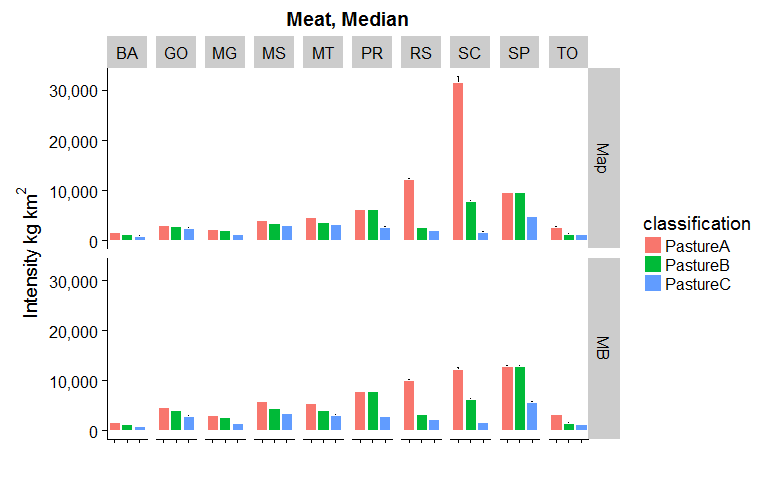

This script analyses pasture areas, meat production and dairy production (and intensities) for all states and years, and multiple classifications (see accompanying Excel file) for two data sources:

- _MB_ is the original 30m MapBiomas data
- _Map_ is our aggregated 5km map data


```r
rm(list=ls())
library(tidyverse)
library(raster)
library(readxl)      #for reading Excel sheets
library(scales)      #useful for ggplotting
library(knitr)
library(rasterVis)   #more useful raster plotting
library(cowplot)     #useful for ggplotting
```


```r
#raster to xyz  (with help from https://stackoverflow.com/a/19847419)
#sepcify input raster, whether nodata cells should be output, whether a unique cell ID should be added
#return is a matrix. note format is row (Y) then col (X)
extractXYZ <- function(raster, nodata = FALSE, addCellID = TRUE){
  
  vals <- raster::extract(raster, 1:ncell(raster))   #specify raster otherwise dplyr used
  xys <- rowColFromCell(raster,1:ncell(raster))
  combine <- cbind(xys,vals)
  
  if(addCellID){
    combine <- cbind(1:length(combine[,1]), combine)
  }
  
  if(!nodata){
    combine <- combine[!rowSums(!is.finite(combine)),]  #from https://stackoverflow.com/a/15773560
  }
  
  return(combine)
}


getLCs <- function(data)
{
  #calculates proportion of each LC in the muni (ignoring NAs, help from https://stackoverflow.com/a/44290753)
  data %>%
    group_by(muniID) %>%
    dplyr::summarise(LC1 = round(sum(map == 1, na.rm = T) / sum(!is.na(map)), 3),
                     LC2 = round(sum(map == 2, na.rm = T) / sum(!is.na(map)), 3),
                     LC3 = round(sum(map == 3, na.rm = T) / sum(!is.na(map)), 3),
                     LC4 = round(sum(map == 4, na.rm = T) / sum(!is.na(map)), 3),
                     LC5 = round(sum(map == 5, na.rm = T) / sum(!is.na(map)), 3),
                     NonNAs = sum(!is.na(map)),
                     NAs = sum(is.na(map))
    ) -> LCs

  return(LCs)
}
```


```r
unzip(zipfile="MapBiomas_23_ASCII_unclassified_allYears.zip")  # unzip all files 

#for 'suppressMessages' see https://stackoverflow.com/a/41229387
mb_data <- suppressMessages(read_csv("LandCover Data - MapBiomas - Collection 2.3 - 2018.01.04 Municipios.csv"))

unzip(zipfile="sim10_BRmunis_latlon_5km_2018-04-27.zip",files="sim10_BRmunis_latlon_5km_2018-04-27.asc",exdir="ASCII")  # unzip file 
munis.r <- raster("ASCII/sim10_BRmunis_latlon_5km_2018-04-27.asc")  #do this with zip file

#extract cell values to table format
munis.t <- extractXYZ(munis.r, addCellID = F)
munis.t <- as.data.frame(munis.t)
munis.t <- plyr::rename(munis.t, c("vals" = "muniID"))
```


```r
#Specify classifications and years to examine. Classifications should be the names of Sheets in the Classifications Excel file. Years should be between 2000 and 2015 

#classifications to loop through 
cls <- c("PastureA", "PastureB", "PastureC")

yrls <- seq(2000,2015,1)
```


```r
#lists to hold data tables 
CData_ls <- vector('list', length(cls))
CDataW_ls <- vector('list', length(cls))
SDataW_ls <- vector('list', length(cls))
Stotals_ls <- vector('list', length(cls))
SDataW_Adj_ls <- vector('list', length(cls))
mapStack_ls <- vector('list', length(cls))

names(CData_ls) <- cls
names(CDataW_ls) <- cls
names(SDataW_ls) <- cls
names(Stotals_ls) <- cls
names(SDataW_Adj_ls) <- cls
names(mapStack_ls) <- cls

#loop over classifications
for(i in seq_along(cls)){
  
  classification <- read_excel("MapBiomas_CRAFTY_classifications.xlsx", sheet = cls[i], range="B2:C21", col_names=F) 
  
  #reset mapStack for this Classification
  mapStack <- stack()

  #loop over years  
  for(j in seq_along(yrls)){

  #print(paste0("Classification: ",cls[i],", Year: ",yrls[j]))
  
  map <- raster(paste0("ASCII/brazillc_",yrls[j],"_5km_int.txt"))
  map <- reclassify(map, rcl=as.matrix(classification))
  
  
  #add categories for later plotting etc. (see https://stackoverflow.com/a/37214431)
  map <- ratify(map)     #tell R that the map raster is categorical 
  rat <- levels(map)[[1]]    #apply the levels (i.e. categories) 
 
  #not all classes may be present after classification, so conditionally construct labels
  labs <- c()
  if(1 %in% levels(map)[[1]]$ID) { labs <- c(labs, "Nature") }
  if(2 %in% levels(map)[[1]]$ID) { labs <- c(labs, "OtherAgri") }
  if(3 %in% levels(map)[[1]]$ID) { labs <- c(labs, "Agriculture") }
  if(4 %in% levels(map)[[1]]$ID) { labs <- c(labs, "Other") }
  if(5 %in% levels(map)[[1]]$ID) { labs <- c(labs, "Pasture") }
    
  rat$landcover <- labs  
  levels(map) <- rat 
  
  #add to mapStack for later plotting
  mapStack <- stack(map, mapStack)

  #extract cell values to table format
  map.t <- extractXYZ(map, addCellID = F)
  map.t <- as.data.frame(map.t)
  map.t <- plyr::rename(map.t, c("vals" = "map"))

  #so need to join 
  map_munis <- left_join(as.data.frame(munis.t), as.data.frame(map.t), by = c("row" = "row", "col" = "col"))

  #now summarise by muniID
  lcs_map_munis <- getLCs(map_munis)

  #convert cell counts to areas (km2) and add state id
  map_areas_munis <- lcs_map_munis %>%
    mutate(LC1area = round(LC1 * NonNAs) * 25) %>%
    mutate(LC2area = round(LC2 * NonNAs) * 25) %>%
    mutate(LC3area = round(LC3 * NonNAs) * 25) %>%
    mutate(LC4area = round(LC4 * NonNAs) * 25) %>%
    mutate(LC5area = round(LC5 * NonNAs) * 25) %>%
    mutate(state = substr(muniID, 1, 2))

  #drop original cell-count columns (work with area km2 from now on)
  map_areas_munis <- map_areas_munis %>% dplyr::select(-LC1, -LC2, -LC3, -LC4, -LC5, -NonNAs, -NAs)

  #summarise muni areas to state level
  map_areas <- map_areas_munis %>%
    group_by(state) %>%
    dplyr::summarise_at(vars(LC1area:LC5area),sum, na.rm=T) %>%  #use _at so state is not summarised
    mutate_if(is.character, as.integer)

  #gather to long format for union below
  map_areas <- map_areas %>%
    gather(key = LCa, value = area, -state)
  
  #recode LCs for union below
  map_areas <- map_areas %>%
    mutate(LC = if_else(LCa == "LC1area", 1, 
      if_else(LCa == "LC2area", 2,
      if_else(LCa == "LC3area", 3,
      if_else(LCa == "LC4area", 4,
      if_else(LCa == "LC5area", 5, 0)
      )))))

  #add source variable for plotting below (re-order to match map table for union below)
  map_areas <- map_areas %>%
    dplyr::select(-LCa) %>%
    mutate(source = "Map") %>%
    dplyr::select(state, LC, source, area)

  ###Summarise MapBiomas data to the states we are simulating

  #filter to get only the states we want
  mb_areas <- mb_data %>%
    filter(Estados == "TOCANTINS" | 
        Estados == "BAHIA" |
        Estados == "MINAS GERAIS" |
        Estados == "SÃO PAULO" |
        Estados == "PARANÁ" |
        Estados == "SANTA CATARINA" |
        Estados == "RIO GRANDE DO SUL" |
        Estados == "MATO GROSSO DO SUL" |
        Estados == "MATO GROSSO" |
        Estados == "GOIÁS")
  
  #add state column containing state ids
  mb_areas <- mb_areas %>%
    mutate(state = if_else(Estados == "TOCANTINS", 17, 
      if_else(Estados == "BAHIA", 29,
      if_else(Estados == "MINAS GERAIS", 31,
      if_else(Estados == "SÃO PAULO", 35,
      if_else(Estados == "PARANÁ", 41,
      if_else(Estados == "SANTA CATARINA", 42,
      if_else(Estados == "RIO GRANDE DO SUL", 43, 
      if_else(Estados == "MATO GROSSO DO SUL", 50, 
      if_else(Estados == "MATO GROSSO", 51,
      if_else(Estados == "GOIÁS", 52, 0
      ))))))))))
    )
  
      
  #select only columns we want    
  mb_areas <- mb_areas %>%
    dplyr::select(state, paste0(yrls[j]), `Classe Nivel 3`) %>% 
    dplyr::rename(area = paste0(yrls[j]))
  
  #because there is no consistency between land cover labels
  legenda = c("Forest Formations"=1, "Natural Forest Formations"=2, "Dense Forest"=3, "Savanna Formations"=4, "Mangroves"=5,"Forest Plantations"=9, "Non-Forest Natural Formations"=10, "Non Forest Wetlands"=11, "Grasslands"=12, "Other Non Forest Natural Formations"=13, "Farming"=14, "Pasture"=15, "Agriculture"=18, "Agriculture or Pasture"=21, "Non-Vegetated Areas"=22, "Dunes and Beaches"=23, "Urban Infrastructure"=24,"Other Non-Vegetated Area"=25,"Water Bodies"=26, "Non-Observed"=27)
  
  #recode to values (which match the map)
  mb_areas <- mb_areas %>%
    mutate(LC = recode(`Classe Nivel 3`, !!!legenda))
  
  #use the classification values from above to relassify land covers
  mb_areas$LC <- plyr::mapvalues(mb_areas$LC, from=as.numeric(classification$X__1), to=as.numeric(classification$X__2))
  
  #calculate total LC area by state
  mb_areas <- mb_areas %>%
    group_by(state, LC) %>%
    dplyr::summarise_at(vars(area),sum, na.rm=T) 
  
  #round to integer
  mb_areas <- mb_areas %>%
    mutate(area_km2 = round(area,0))
  
  #add source variable for plotting below (re-order to match map table for union below)
  mb_areas <- mb_areas %>%
    dplyr::select(-area) %>%
    mutate(source = "MB") %>%
    rename(area = area_km2) %>%
    dplyr::select(state, LC, source, area)
    

  CData_yr <- union_all(map_areas, mb_areas)

  #relabel states to characters
  CData_yr <- CData_yr %>%
    mutate(state = if_else(state == 17, "TO", 
      if_else(state == 29, "BA",
      if_else(state == 31, "MG",
      if_else(state == 35, "SP",
      if_else(state == 41, "PR",
      if_else(state == 42, "SC",
      if_else(state == 43, "RS", 
      if_else(state == 50, "MS",
      if_else(state == 51, "MT",
      if_else(state == 52, "GO", "NA"
      ))))))))))
    )
  
  #relabel LCs to characters
  CData_yr <- CData_yr %>%
    mutate(LC = if_else(LC == 1, "Nature", 
      if_else(LC == 2, "OtherAgri",
      if_else(LC == 3, "Agri",
      if_else(LC == 4, "Other",
      if_else(LC == 5, "Pasture", "NA"
      )))))
    )
  
  #add year column
  CData_yr <- CData_yr %>%
    mutate(year = yrls[j])
  
  #union CData for years here.
  #if first iteration of classification loop (re)create the tibble
  if(j == 1){
      CData <- CData_yr
  }
    
  #else join data to tibble (by creating another tibble, then join (ensure rows are not lost)
  else {
      CData <- union_all(CData, CData_yr)
  }
  }
  
  CData_ls[[i]] <- CData
  
  names(mapStack) <- yrls
  mapStack_ls[[i]] <- mapStack
}
```

##Pasture area by state, year and classification

```r
#add classification lable to the CData tables
for(i in seq_along(cls)){
  
  CData_ls[[i]] <- CData_ls[[i]] %>%
    mutate(classification = cls[i])
}

#union the CData tables for the different classifications
for(i in seq_along(cls)){
  
  if(i == 1) { CDataU <- CData_ls[[i]] }
  else { CDataU <- dplyr::union(CDataU, CData_ls[[i]]) }
}

#filter to pasture only
CData_Pas <- CDataU %>%
  dplyr::filter(LC == "Pasture")
```


```r
CData_Pas %>% 
  dplyr::filter(source == "Map") %>%
  ggplot(aes(x=classification, y=area, fill=classification)) + 
    geom_bar(stat="identity", colour="white", position = "dodge") +
    scale_y_continuous(name=expression(Area~km^{2}), labels = scales::comma) +
  #labs(x=expression(Data~Source),y=expression(Area~km^{2})) +
    facet_grid(year~state) +
    xlab("") +
    #ylab("Pasture Area km2") +
    theme(axis.text.x = element_blank()) +
  ggtitle("Map")
```

<!-- -->

```r
CData_Pas %>% 
  dplyr::filter(source == "MB") %>%
  ggplot(aes(x=classification, y=area, fill=classification)) + 
    geom_bar(stat="identity", colour="white", position = "dodge") +
    scale_y_continuous(name=expression(Area~km^{2}), labels = scales::comma) +
    facet_grid(year~state) +
    xlab("")+
    #ylab("Pasture Area km2") +
    theme(axis.text.x = element_blank()) +
  ggtitle("MB")
```

<!-- -->


```r
#Load Production Data
meat_prod_Astates <- read_excel("Cattle_meat_production_Kg_2000_2017_all_states.xlsx", sheet = "Plan1", skip = 1)  #data for all states Astates

#dairy data are by municiaplity for all states (Amunis)
dairy_prod_Amunis <- read_excel("dairy_Municipalities_Brazil.xlsx", sheet = "Tabela", skip = 1, na = c("", "-", "..."))
```


```r
#join to pasture areas
meat_areas <- inner_join(CData_Pas, meat_prod_Fstates_long, by = c("year", "state"))
dairy_areas <- inner_join(CData_Pas, dairy_prod_Fstates_long, by = c("year", "state"))

#calculate intensities
meat_areas <- meat_areas %>%
  mutate(intensity = kg / area)

dairy_areas <- dairy_areas %>%
  mutate(intensity = kg / area)
```

#Meat
##Production by state, year and classification
Differentiated between original 30m MapBiomas reported data ( _MB_ ) and our aggregated 5km map data ( _map_ ) and

The next two plots have the same variables on the y-axis (Intensity) but the second plot is differently scaled (some bars are not plotted because their value is greater than the limit of the axis).

```r
meat_areas %>% 
  filter(source == "Map") %>%
  ggplot(aes(x=classification, y=intensity, fill=classification)) + 
    geom_bar(stat="identity", colour="white", position = "dodge") +
    scale_y_continuous(name=expression(Intensity~kg~km^{2}),limits = c(0, 30000)) +
    facet_grid(year~state) +
    xlab("")+
    theme(axis.text.x = element_blank()) +
  ggtitle("Meat, Map")
```

```
## Warning: Removed 9 rows containing missing values (geom_bar).
```

<!-- -->

```r
meat_areas %>% 
  filter(source == "MB") %>%
  ggplot(aes(x=classification, y=intensity, fill=classification)) + 
    geom_bar(stat="identity", colour="white", position = "dodge") +
    scale_y_continuous(name=expression(Intensity~kg~km^{2}),limits = c(0, 30000)) +
    facet_grid(year~state) +
    xlab("") +
    theme(axis.text.x = element_blank()) +
  ggtitle("Meat, MB")
```

<!-- -->

We see SC, SP and RS are all high relative to other states. We also see that intensities are generally greatest for _PatureA_ classification, lower for _PastureB_ and lowest for _PastureC_.  


##Summary stats over time
Now let's summarise the data over time and examine their means and medians (with variation - error bar is one SE)


```r
meat_summary %>%
  #filter(source == "MB") %>%
  ggplot(aes(x=classification, y=int_mn, fill=classification)) + 
  geom_errorbar(aes(ymin=int_mn-int_se, ymax=int_mn+int_se), width=.1) +
  geom_bar(stat="identity", colour="white", position = "dodge") +
  facet_grid(source~state) +
  scale_y_continuous(name=expression(Intensity~kg~km^{2}), labels = scales::comma) +
  xlab("")+
  theme(axis.text.x = element_blank()) +
  ggtitle("Meat, Mean")
```

<!-- -->

```r
meat_summary %>%
  #filter(source == "Map") %>%
  ggplot(aes(x=classification, y=int_md, fill=classification)) + 
  geom_errorbar(aes(ymin=int_md-int_se, ymax=int_md+int_se), width=.1) +
  geom_bar(stat="identity", colour="white", position = "dodge") +
  facet_grid(source~state) +
  scale_y_continuous(name=expression(Intensity~kg~km^{2}), labels = scales::comma) +
  xlab("")+
  theme(axis.text.x = element_blank()) +
  ggtitle("Meat, Median")
```

<!-- -->

Again we see the same patterns; SC, SP and RS are greater than other states and _PastureA_ > _PastureB_ > _PastureC_.

If we plot again, but this time limiting the y-axis to 15,000 kg/km2

```r
meat_summary %>%
  #filter(source == "MB") %>%
  ggplot(aes(x=classification, y=int_mn, fill=classification)) + 
  geom_errorbar(aes(ymin=int_mn-int_se, ymax=int_mn+int_se), width=.1) +
  geom_bar(stat="identity", colour="white", position = "dodge") +
  facet_grid(source~state) +
  scale_y_continuous(name=expression(Intensity~kg~km^{2}), labels = scales::comma,limits = c(0, 15000)) +
  xlab("")+
  theme(axis.text.x = element_blank()) +
  ggtitle("Meat, Mean")
```

```
## Warning: Removed 1 rows containing missing values (geom_errorbar).
```

```
## Warning: Removed 1 rows containing missing values (geom_bar).
```

<!-- -->

```r
meat_summary %>%
  #filter(source == "Map") %>%
  ggplot(aes(x=classification, y=int_md, fill=classification)) + 
  geom_errorbar(aes(ymin=int_md-int_se, ymax=int_md+int_se), width=.1) +
  geom_bar(stat="identity", colour="white", position = "dodge") +
  facet_grid(source~state) +
  scale_y_continuous(name=expression(Intensity~kg~km^{2}), labels = scales::comma,limits = c(0, 15000)) +
  xlab("")+
  theme(axis.text.x = element_blank()) +
  ggtitle("Meat, Median")
```

```
## Warning: Removed 1 rows containing missing values (geom_errorbar).

## Warning: Removed 1 rows containing missing values (geom_bar).
```

<!-- -->

We can now more clearly compare classifications. In some states (PR, SP) _PastureA_ and _PastureB_ are very similar values, but in many others _PastureB_ is lower; _PastureC_ is noticably smaller than the other classifications. We also see that Intensity is greater for  _MB_ data compared to _Map_. 

**Seems feasible to use _PastureB_ classification?**

If so, the 'perfect' meat intensity would be ~9,100 kg km2 (see raw table of summary data below)

```r
kable(arrange(meat_summary, desc(int_mn), state, classification), caption="Meat data, sorted on mean production values descending")
```


Table: Meat data, sorted on mean production values descending

state   classification   source    area_mn   area_md   area_sd     prod_mn      prod_md     prod_sd   int_mn   int_md   int_sd     int_se
------  ---------------  -------  --------  --------  --------  ----------  -----------  ----------  -------  -------  -------  ---------
SC      PastureA         Map          3144      2175      2656    74131260     73967400    21868077    33072    31647    18435   1152.179
SC      PastureA         MB           6009      4734      3375    74131260     73967400    21868077    14079    12221     5689    355.539
RS      PastureA         Map         27769     27562      5014   359173016    383339288    72758858    13197    12254     3099    193.717
SP      PastureA         MB          72811     72982      8244   878686400    885858229   119385323    12191    12844     1883    117.663
SP      PastureB         MB          72872     73064      8246   878686400    885858229   119385323    12181    12834     1881    117.584
RS      PastureA         MB          35380     35848      3905   359173016    383339288    72758858    10197    10047     2099    131.188
SC      PastureB         Map          8431      7325      2603    74131260     73967400    21868077     9245     7849     3373    210.792
SP      PastureA         Map         96892     96938     12772   878686400    885858229   119385323     9202     9637     1534     95.869
SP      PastureB         Map         96908     96962     12762   878686400    885858229   119385323     9200     9637     1533     95.801
SC      PastureB         MB          10558      9354      3361    74131260     73967400    21868077     7345     6239     2613    163.312
PR      PastureA         MB          38772     39042      2489   280084706    288614877    49929771     7306     7776     1599     99.965
PR      PastureB         MB          38773     39043      2489   280084706    288614877    49929771     7306     7776     1599     99.964
MS      PastureA         MB         140393    140576      4251   833020798    816012972    77083654     5938     5787      578     36.142
PR      PastureA         Map         48111     48988      2616   280084706    288614877    49929771     5867     6187     1222     76.394
PR      PastureB         Map         48111     48988      2616   280084706    288614877    49929771     5867     6187     1222     76.394
SP      PastureC         MB         156563    156830     10074   878686400    885858229   119385323     5636     5734      818     51.112
MT      PastureA         MB         183946    188248     15110   958318285   1020597324   289662995     5125     5427     1248     78.018
SP      PastureC         Map        182548    185688     14370   878686400    885858229   119385323     4846     4869      751     46.952
GO      PastureA         MB         138150    139554      4854   643774060    655177836   123381231     4644     4631      797     49.808
MS      PastureB         MB         183896    184818      5083   833020798    816012972    77083654     4530     4436      404     25.220
MT      PastureA         Map        216455    221850     18345   958318285   1020597324   289662995     4353     4600     1048     65.507
MS      PastureA         Map        200350    201550      5324   833020798    816012972    77083654     4159     4072      378     23.611
GO      PastureB         MB         158894    159752      5393   643774060    655177836   123381231     4039     4009      707     44.183
MT      PastureB         MB         248766    254522     16432   958318285   1020597324   289662995     3799     4012      975     60.938
MS      PastureC         MB         231828    231526      2783   833020798    816012972    77083654     3596     3530      359     22.434
MS      PastureB         Map        237114    238938      5595   833020798    816012972    77083654     3514     3442      322     20.148
MT      PastureB         Map        275080    281712     19073   958318285   1020597324   289662995     3433     3627      871     54.410
TO      PastureA         MB          62120     64202      4264   204120756    208454298    57704451     3242     3250      755     47.167
RS      PastureB         MB         114163    114683      6112   359173016    383339288    72758858     3159     3288      690     43.123
MS      PastureC         Map        264227    264362      1304   833020798    816012972    77083654     3153     3092      293     18.301
GO      PastureA         Map        205253    208900      8725   643774060    655177836   123381231     3122     3112      511     31.908
MT      PastureC         Map        307350    312275      9468   958318285   1020597324   289662995     3102     3237      904     56.477
MT      PastureC         MB         318825    323696      7208   958318285   1020597324   289662995     3003     3149      913     57.044
GO      PastureC         MB         221946    221405      6000   643774060    655177836   123381231     2916     2967      629     39.285
GO      PastureB         Map        220059    223062      9109   643774060    655177836   123381231     2913     2893      484     30.266
PR      PastureC         MB         100541     99522      6494   280084706    288614877    49929771     2821     2912      631     39.446
MG      PastureA         MB         185439    186648      8655   508972814    555300819   154613474     2754     3034      828     51.729
TO      PastureA         Map         74369     76375      6235   204120756    208454298    57704451     2703     2721      594     37.131
PR      PastureC         Map        106378    105425     11194   280084706    288614877    49929771     2696     2745      680     42.489
RS      PastureB         Map        141067    140112      7721   359173016    383339288    72758858     2560     2662      570     35.650
GO      PastureC         Map        258145    258550      6681   643774060    655177836   123381231     2506     2539      539     33.678
MG      PastureB         MB         215311    216750      8344   508972814    555300819   154613474     2370     2602      712     44.507
RS      PastureC         MB         167217    169520      9757   359173016    383339288    72758858     2169     2258      516     32.264
MG      PastureA         Map        246389    246750     18155   508972814    555300819   154613474     2078     2306      615     38.457
RS      PastureC         Map        188600    191212     15415   359173016    383339288    72758858     1935     1976      495     30.954
SC      PastureC         Map         42070     42738      6608    74131260     73967400    21868077     1874     1743      815     50.962
MG      PastureB         Map        273078    274412     17617   508972814    555300819   154613474     1871     2070      551     34.411
SC      PastureC         MB          43342     43526      2828    74131260     73967400    21868077     1746     1712      612     38.257
TO      PastureB         MB         130148    131276      3763   204120756    208454298    57704451     1560     1572      420     26.264
BA      PastureA         MB         139045    140580     10877   210624063    239675206    81054216     1533     1695      622     38.902
BA      PastureA         Map        145261    148025     15042   210624063    239675206    81054216     1477     1622      618     38.608
TO      PastureB         Map        151998    153412      4818   204120756    208454298    57704451     1336     1339      358     22.403
TO      PastureC         MB         157748    157824       632   204120756    208454298    57704451     1294     1322      366     22.862
MG      PastureC         MB         400390    401018      6321   508972814    555300819   154613474     1276     1392      403     25.172
TO      PastureC         Map        162411    163225      2860   204120756    208454298    57704451     1254     1268      348     21.756
BA      PastureB         Map        185330    190238     14493   210624063    239675206    81054216     1151     1272      468     29.250
BA      PastureB         MB         186961    189788     10680   210624063    239675206    81054216     1135     1262      452     28.263
MG      PastureC         Map        454398    455775      8366   508972814    555300819   154613474     1125     1220      357     22.297
BA      PastureC         Map        253878    254375      3213   210624063    239675206    81054216      828      944      315     19.692
BA      PastureC         MB         279060    278120      2968   210624063    239675206    81054216      753      864      285     17.836

#Dairy
##Production by state, year and classification
Differentiated between original 30m MapBiomas data ( _MB_ ) and our aggregated 5km map data ( _map_ ).


```r
dairy_areas %>%
  group_by(state, classification, source) %>%
  summarise(
    area_mn = round(mean(area),0),
    area_md = round(median(area),0),
    area_sd = round(sd(area),0),
    prod_mn = round(mean(kg),0),
    prod_md = round(median(kg),0),
    prod_sd = round(sd(kg),0),
    int_mn = round(mean(intensity),0),
    int_md = round(median(intensity),0),
    int_sd = round(sd(intensity),0),
    int_se = round(sd(intensity) / length(intensity), 3)
    ) -> dairy_summary
```


```r
dairy_areas %>% 
  filter(source == "Map") %>%
  ggplot(aes(x=classification, y=intensity, fill=classification)) + 
    geom_bar(stat="identity", colour="white", position = "dodge") +
    scale_y_continuous(name=expression(Intensity~kg~km^{2}), labels = scales::comma) +
    facet_grid(year~state) +
    xlab("") +
    theme(axis.text.x = element_blank()) +
  ggtitle("Dairy, Map")
```

<!-- -->

```r
dairy_areas %>% 
  filter(source == "MB") %>%
  ggplot(aes(x=classification, y=intensity, fill=classification)) + 
    geom_bar(stat="identity", colour="white", position = "dodge") +
    scale_y_continuous(name=expression(Intensity~kg~km^{2}), labels = scales::comma) +
    facet_grid(year~state) +
    xlab("") +
    theme(axis.text.x = element_blank()) +
  ggtitle("Dairy, MB")
```

<!-- -->

The magnitude of Intensity for dairy in SC (and to some extent RS) is even more stark than for meat production, especially for our _Map_ data.   

Let's not re-scale the y-axis here, and instead go direct to the summary values. 

##Summary stats over time

```r
dairy_summary %>%
  #filter(source == "MB") %>%
  ggplot(aes(x=classification, y=int_mn, fill=classification)) + 
  geom_errorbar(aes(ymin=int_mn-int_se, ymax=int_mn+int_se), width=.1) +
  geom_bar(stat="identity", colour="white", position = "dodge") +
  facet_grid(source~state) +
  scale_y_continuous(name=expression(Intensity~kg~km^{2}), labels = scales::comma) +
  xlab("")+
  theme(axis.text.x = element_blank()) +
  ggtitle("Dairy, Mean")
```

<!-- -->

```r
dairy_summary %>%
  #filter(source == "Map") %>%
  ggplot(aes(x=classification, y=int_md, fill=classification)) + 
  geom_errorbar(aes(ymin=int_md-int_se, ymax=int_md+int_se), width=.1) +
  geom_bar(stat="identity", colour="white", position = "dodge") +
  facet_grid(source~state) +
  scale_y_continuous(name=expression(Intensity~kg~km^{2}), labels = scales::comma) +
  xlab("")+
  theme(axis.text.x = element_blank()) +
  ggtitle("Dairy, Median")
```

<!-- -->

Again, we see the very high intensities for SC, RS and PR. 

Plot the summary stats again, but this time limit the y-axis to 250,000 kg km2

```r
dairy_summary %>%
  #filter(source == "MB") %>%
  ggplot(aes(x=classification, y=int_mn, fill=classification)) + 
  geom_errorbar(aes(ymin=int_mn-int_se, ymax=int_mn+int_se), width=.1) +
  geom_bar(stat="identity", colour="white", position = "dodge") +
  facet_grid(source~state) +
  scale_y_continuous(name=expression(Intensity~kg~km^{2}), labels = scales::comma, limits = c(0, 250000)) +
  xlab("")+
  theme(axis.text.x = element_blank()) +
  ggtitle("Dairy, Mean")
```

```
## Warning: Removed 3 rows containing missing values (geom_errorbar).
```

```
## Warning: Removed 3 rows containing missing values (geom_bar).
```

<!-- -->

```r
dairy_summary %>%
  #filter(source == "Map") %>%
  ggplot(aes(x=classification, y=int_md, fill=classification)) + 
  geom_errorbar(aes(ymin=int_md-int_se, ymax=int_md+int_se), width=.1) +
  geom_bar(stat="identity", colour="white", position = "dodge") +
  facet_grid(source~state) +
  scale_y_continuous(name=expression(Intensity~kg~km^{2}), labels = scales::comma, limits = c(0, 250000)) +
  xlab("")+
  theme(axis.text.x = element_blank()) +
  ggtitle("Dairy, Median")
```

```
## Warning: Removed 2 rows containing missing values (geom_errorbar).
```

```
## Warning: Removed 2 rows containing missing values (geom_bar).
```

<!-- -->

_PastureA_ for SC is not plotted at its value is so large. 

**I think we maybe need to ignore SC as it has such high intensity (due to very low area - see plots at top)?**

**And we should use the** _PastureB_ **classification?**

If we ignore SC and use _PastureB_ the next largest _PastureB_ dairy intensity value (for Map) is PR (around 67,000; see Table below)


```r
kable(arrange(dairy_summary, desc(int_mn), state, classification), caption="Dairy data, sorted on mean values descending")
```


Table: Dairy data, sorted on mean values descending

state   classification   source    area_mn   area_md   area_sd      prod_mn      prod_md      prod_sd   int_mn   int_md   int_sd      int_se
------  ---------------  -------  --------  --------  --------  -----------  -----------  -----------  -------  -------  -------  ----------
SC      PastureA         Map          3144      2175      2656   2070105459   2055584390    725687768   897633   867759   485135   30320.969
SC      PastureA         MB           6009      4734      3375   2070105459   2055584390    725687768   379992   325408   134876    8429.780
SC      PastureB         Map          8431      7325      2603   2070105459   2055584390    725687768   254388   224853    90480    5654.972
SC      PastureB         MB          10558      9354      3361   2070105459   2055584390    725687768   200655   173254    65116    4069.739
RS      PastureA         Map         27769     27562      5014   3311088728   3223015745    946065583   124673   112529    47374    2960.882
RS      PastureA         MB          35380     35848      3905   3311088728   3223015745    946065583    95554    83993    33051    2065.716
PR      PastureA         MB          38772     39042      2489   3172269512   2848738465    999189621    83189    76060    29213    1825.810
PR      PastureB         MB          38773     39043      2489   3172269512   2848738465    999189621    83188    76060    29212    1825.742
PR      PastureA         Map         48111     48988      2616   3172269512   2848738465    999189621    66777    59834    22972    1435.754
PR      PastureB         Map         48111     48988      2616   3172269512   2848738465    999189621    66777    59834    22972    1435.754
SC      PastureC         Map         42070     42738      6608   2070105459   2055584390    725687768    53262    48092    28132    1758.259
SC      PastureC         MB          43342     43526      2828   2070105459   2055584390    725687768    48979    47239    20138    1258.612
MG      PastureA         MB         185439    186648      8655   7835349179   7690273035   1283492202    42405    41320     7503     468.928
MG      PastureB         MB         215311    216750      8344   7835349179   7690273035   1283492202    36492    35321     6373     398.294
PR      PastureC         MB         100541     99522      6494   3172269512   2848738465    999189621    32173    28673    11752     734.477
MG      PastureA         Map        246389    246750     18155   7835349179   7690273035   1283492202    31988    31845     5728     357.971
PR      PastureC         Map        106378    105425     11194   3172269512   2848738465    999189621    30905    27093    12426     776.656
RS      PastureB         MB         114163    114683      6112   3311088728   3223015745    946065583    29407    27145     9852     615.731
MG      PastureB         Map        273078    274412     17617   7835349179   7690273035   1283492202    28816    28487     5016     313.509
SP      PastureA         MB          72811     72982      8244   1756185084   1789903615     85668315    24350    23321     2438     152.356
SP      PastureB         MB          72872     73064      8246   1756185084   1789903615     85668315    24329    23294     2434     152.153
RS      PastureB         Map        141067    140112      7721   3311088728   3223015745    946065583    23824    22185     7981     498.815
GO      PastureA         MB         138150    139554      4854   3019283097   2843906735    527365834    21812    20315     3474     217.130
RS      PastureC         MB         167217    169520      9757   3311088728   3223015745    946065583    20180    19016     6994     437.154
MG      PastureC         MB         400390    401018      6321   7835349179   7690273035   1283492202    19617    19183     3499     218.713
GO      PastureB         MB         158894    159752      5393   3019283097   2843906735    527365834    18974    17550     3097     193.586
SP      PastureA         Map         96892     96938     12772   1756185084   1789903615     85668315    18366    17417     2112     131.991
SP      PastureB         Map         96908     96962     12762   1756185084   1789903615     85668315    18363    17415     2109     131.839
RS      PastureC         Map        188600    191212     15415   3311088728   3223015745    946065583    18062    16858     6697     418.547
MG      PastureC         Map        454398    455775      8366   7835349179   7690273035   1283492202    17288    16808     3109     194.288
GO      PastureA         Map        205253    208900      8725   3019283097   2843906735    527365834    14669    13600     2226     139.146
GO      PastureB         Map        220059    223062      9109   3019283097   2843906735    527365834    13687    12652     2123     132.673
GO      PastureC         MB         221946    221405      6000   3019283097   2843906735    527365834    13661    12824     2682     167.625
GO      PastureC         Map        258145    258550      6681   3019283097   2843906735    527365834    11743    11004     2300     143.737
SP      PastureC         MB         156563    156830     10074   1756185084   1789903615     85668315    11260    11064      917      57.322
SP      PastureC         Map        182548    185688     14370   1756185084   1789903615     85668315     9686     9417     1031      64.417
BA      PastureA         MB         139045    140580     10877   1004733199    987882785    185718641     7313     6744     1730     108.096
BA      PastureA         Map        145261    148025     15042   1004733199    987882785    185718641     7050     6285     1832     114.510
BA      PastureB         Map        185330    190238     14493   1004733199    987882785    185718641     5490     5050     1313      82.048
BA      PastureB         MB         186961    189788     10680   1004733199    987882785    185718641     5416     5119     1197      74.823
BA      PastureC         Map        253878    254375      3213   1004733199    987882785    185718641     3955     3892      717      44.802
TO      PastureA         MB          62120     64202      4264    241787865    228198045     50921549     3865     3666      622      38.904
BA      PastureC         MB         279060    278120      2968   1004733199    987882785    185718641     3597     3563      646      40.381
MS      PastureA         MB         140393    140576      4251    504674186    508378130     32498977     3595     3524      211      13.178
MT      PastureA         MB         183946    188248     15110    633995771    669891400    113637798     3425     3531      412      25.767
TO      PastureA         Map         74369     76375      6235    241787865    228198045     50921549     3224     3086      453      28.308
MT      PastureA         Map        216455    221850     18345    633995771    669891400    113637798     2910     2993      340      21.246
MS      PastureB         MB         183896    184818      5083    504674186    508378130     32498977     2743     2707      143       8.939
MT      PastureB         MB         248766    254522     16432    633995771    669891400    113637798     2533     2625      333      20.801
MS      PastureA         Map        200350    201550      5324    504674186    508378130     32498977     2518     2481      132       8.242
MT      PastureB         Map        275080    281712     19073    633995771    669891400    113637798     2291     2371      294      18.375
MS      PastureC         MB         231828    231526      2783    504674186    508378130     32498977     2178     2201      153       9.549
MS      PastureB         Map        237114    238938      5595    504674186    508378130     32498977     2128     2104      114       7.131
MT      PastureC         Map        307350    312275      9468    633995771    669891400    113637798     2056     2139      329      20.573
MT      PastureC         MB         318825    323696      7208    633995771    669891400    113637798     1987     2069      348      21.776
MS      PastureC         Map        264227    264362      1304    504674186    508378130     32498977     1910     1927      125       7.804
TO      PastureB         MB         130148    131276      3763    241787865    228198045     50921549     1854     1725      372      23.262
TO      PastureB         Map        151998    153412      4818    241787865    228198045     50921549     1586     1478      315      19.693
TO      PastureC         MB         157748    157824       632    241787865    228198045     50921549     1533     1444      324      20.220
TO      PastureC         Map        162411    163225      2860    241787865    228198045     50921549     1487     1387      308      19.265


```r
unlink("ASCII", recursive = T) #delete ASCII directory created above
```
