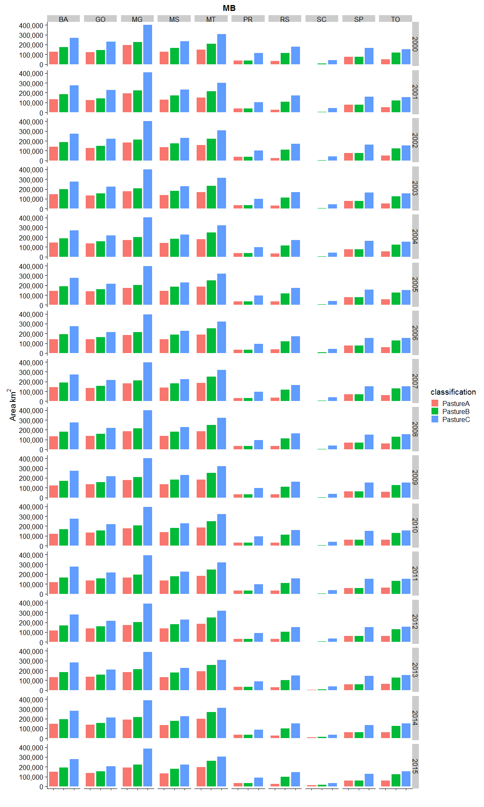
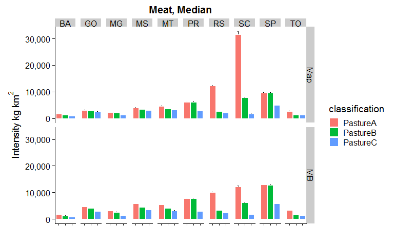
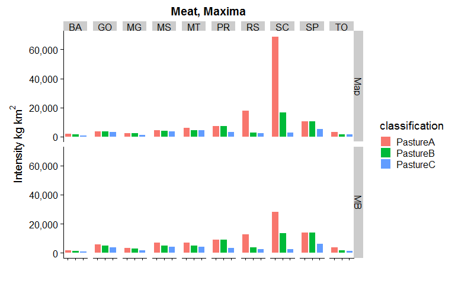
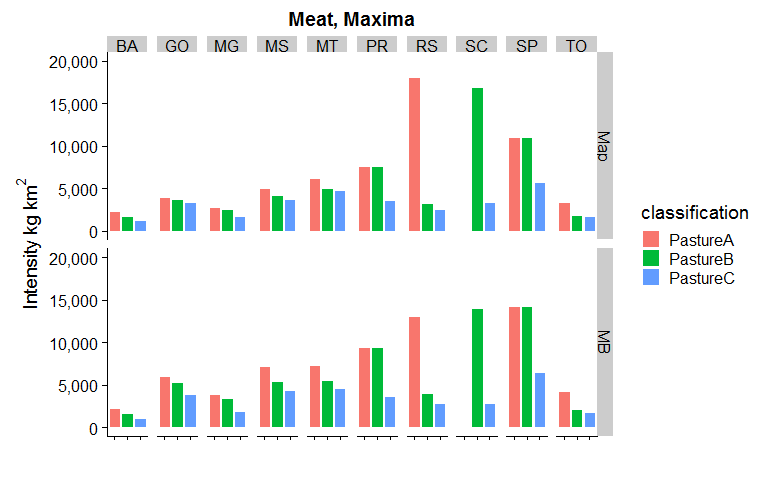
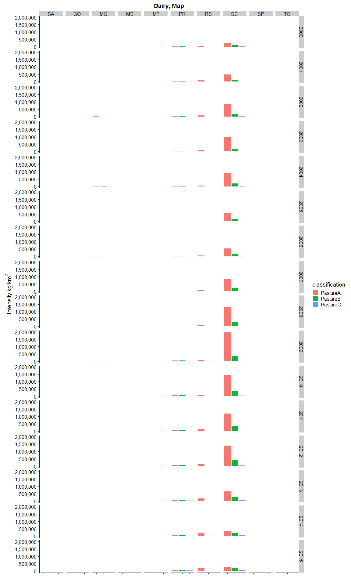
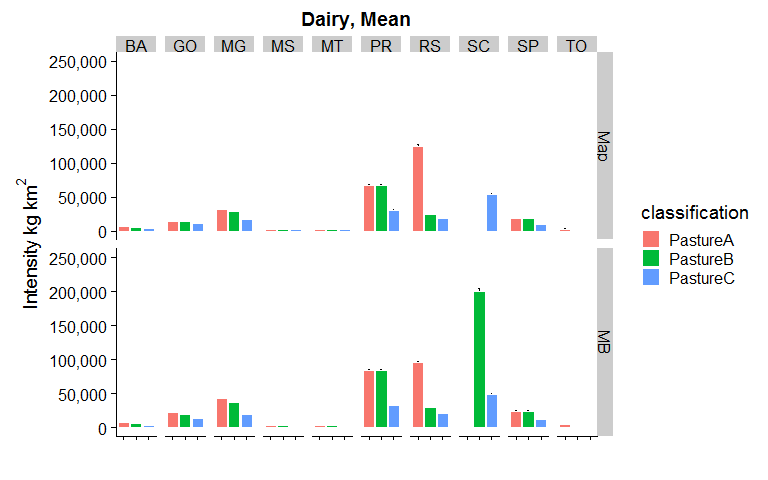

This script analyses pasture areas, meat production and dairy production (and intensities) for all states and years, and multiple classifications (see accompanying Excel file) for two data sources:

- _MB_ is the original 30m MapBiomas data
- _Map_ is our aggregated 5km map data


```r
rm(list=ls())

packages <- c(
  "tidyverse",
  "raster",
  "readxl",       #for reading Excel sheets
  "scales",       #useful for ggplotting
  "knitr",
  "rasterVis",    #more useful raster plotting
  "cowplot"       #useful for ggplotting
  )     
  
#use lapply to suppress all wanings: https://stackoverflow.com/a/46685042
invisible(lapply(packages, function(xxx) suppressMessages(require(xxx, character.only = TRUE,quietly=TRUE,warn.conflicts = FALSE))))
```


```r
#raster to xyz  (with help from https://stackoverflow.com/a/19847419)
#sepcify input raster, whether nodata cells should be output, whether a unique cell ID should be added
#return is a matrix. note format is row (Y) then col (X)
extractXYZ <- function(raster, nodata = FALSE, addCellID = TRUE){
  
  vals <- raster::extract(raster, 1:ncell(raster))   #specify raster otherwise dplyr used
  xys <- rowColFromCell(raster,1:ncell(raster))
  combine <- cbind(xys,vals)
  
  if(addCellID){
    combine <- cbind(1:length(combine[,1]), combine)
  }
  
  if(!nodata){
    combine <- combine[!rowSums(!is.finite(combine)),]  #from https://stackoverflow.com/a/15773560
  }
  
  return(combine)
}


getLCs <- function(data)
{
  #calculates proportion of each LC in the muni (ignoring NAs, help from https://stackoverflow.com/a/44290753)
  data %>%
    group_by(muniID) %>%
    dplyr::summarise(LC1 = round(sum(map == 1, na.rm = T) / sum(!is.na(map)), 3),
                     LC2 = round(sum(map == 2, na.rm = T) / sum(!is.na(map)), 3),
                     LC3 = round(sum(map == 3, na.rm = T) / sum(!is.na(map)), 3),
                     LC4 = round(sum(map == 4, na.rm = T) / sum(!is.na(map)), 3),
                     LC5 = round(sum(map == 5, na.rm = T) / sum(!is.na(map)), 3),
                     NonNAs = sum(!is.na(map)),
                     NAs = sum(is.na(map))
    ) -> LCs

  return(LCs)
}
```


```r
unzip(zipfile="MapBiomas_23_ASCII_unclassified_allYears.zip")  # unzip all files 

#for 'suppressMessages' see https://stackoverflow.com/a/41229387
mb_data <- suppressMessages(read_csv("LandCover Data - MapBiomas - Collection 2.3 - 2018.01.04 Municipios.csv"))

unzip(zipfile="sim10_BRmunis_latlon_5km_2018-04-27.zip",files="sim10_BRmunis_latlon_5km_2018-04-27.asc",exdir="ASCII")  # unzip file 
munis.r <- raster("ASCII/sim10_BRmunis_latlon_5km_2018-04-27.asc")  #do this with zip file

#extract cell values to table format
munis.t <- extractXYZ(munis.r, addCellID = F)
munis.t <- as.data.frame(munis.t)
munis.t <- plyr::rename(munis.t, c("vals" = "muniID"))
```


```r
#Specify classifications and years to examine. Classifications should be the names of Sheets in the Classifications Excel file. Years should be between 2000 and 2015 

#classifications to loop through 
cls <- c("PastureA", "PastureB", "PastureC")

yrls <- seq(2000,2015,1)
```


```r
#lists to hold data tables 
CData_ls <- vector('list', length(cls))
CDataW_ls <- vector('list', length(cls))
SDataW_ls <- vector('list', length(cls))
Stotals_ls <- vector('list', length(cls))
SDataW_Adj_ls <- vector('list', length(cls))
mapStack_ls <- vector('list', length(cls))

names(CData_ls) <- cls
names(CDataW_ls) <- cls
names(SDataW_ls) <- cls
names(Stotals_ls) <- cls
names(SDataW_Adj_ls) <- cls
names(mapStack_ls) <- cls

#loop over classifications
for(i in seq_along(cls)){
  
  classification <- read_excel("MapBiomas_CRAFTY_classifications.xlsx", sheet = cls[i], range="B2:C21", col_names=F) 
  
  #reset mapStack for this Classification
  mapStack <- stack()

  #loop over years  
  for(j in seq_along(yrls)){

  #print(paste0("Classification: ",cls[i],", Year: ",yrls[j]))
  
  map <- raster(paste0("ASCII/brazillc_",yrls[j],"_5km_int.txt"))
  map <- reclassify(map, rcl=as.matrix(classification))
  
  
  #add categories for later plotting etc. (see https://stackoverflow.com/a/37214431)
  map <- ratify(map)     #tell R that the map raster is categorical 
  rat <- levels(map)[[1]]    #apply the levels (i.e. categories) 
 
  #not all classes may be present after classification, so conditionally construct labels
  labs <- c()
  if(1 %in% levels(map)[[1]]$ID) { labs <- c(labs, "Nature") }
  if(2 %in% levels(map)[[1]]$ID) { labs <- c(labs, "OtherAgri") }
  if(3 %in% levels(map)[[1]]$ID) { labs <- c(labs, "Agriculture") }
  if(4 %in% levels(map)[[1]]$ID) { labs <- c(labs, "Other") }
  if(5 %in% levels(map)[[1]]$ID) { labs <- c(labs, "Pasture") }
    
  rat$landcover <- labs  
  levels(map) <- rat 
  
  #add to mapStack for later plotting
  mapStack <- stack(map, mapStack)

  #extract cell values to table format
  map.t <- extractXYZ(map, addCellID = F)
  map.t <- as.data.frame(map.t)
  map.t <- plyr::rename(map.t, c("vals" = "map"))

  #so need to join 
  map_munis <- left_join(as.data.frame(munis.t), as.data.frame(map.t), by = c("row" = "row", "col" = "col"))

  #now summarise by muniID
  lcs_map_munis <- getLCs(map_munis)

  #convert cell counts to areas (km2) and add state id
  map_areas_munis <- lcs_map_munis %>%
    mutate(LC1area = round(LC1 * NonNAs) * 25) %>%
    mutate(LC2area = round(LC2 * NonNAs) * 25) %>%
    mutate(LC3area = round(LC3 * NonNAs) * 25) %>%
    mutate(LC4area = round(LC4 * NonNAs) * 25) %>%
    mutate(LC5area = round(LC5 * NonNAs) * 25) %>%
    mutate(state = substr(muniID, 1, 2))

  #drop original cell-count columns (work with area km2 from now on)
  map_areas_munis <- map_areas_munis %>% dplyr::select(-LC1, -LC2, -LC3, -LC4, -LC5, -NonNAs, -NAs)

  #summarise muni areas to state level
  map_areas <- map_areas_munis %>%
    group_by(state) %>%
    dplyr::summarise_at(vars(LC1area:LC5area),sum, na.rm=T) %>%  #use _at so state is not summarised
    mutate_if(is.character, as.integer)

  #gather to long format for union below
  map_areas <- map_areas %>%
    gather(key = LCa, value = area, -state)
  
  #recode LCs for union below
  map_areas <- map_areas %>%
    mutate(LC = if_else(LCa == "LC1area", 1, 
      if_else(LCa == "LC2area", 2,
      if_else(LCa == "LC3area", 3,
      if_else(LCa == "LC4area", 4,
      if_else(LCa == "LC5area", 5, 0)
      )))))

  #add source variable for plotting below (re-order to match map table for union below)
  map_areas <- map_areas %>%
    dplyr::select(-LCa) %>%
    mutate(source = "Map") %>%
    dplyr::select(state, LC, source, area)

  ###Summarise MapBiomas data to the states we are simulating

  #filter to get only the states we want
  mb_areas <- mb_data %>%
    filter(Estados == "TOCANTINS" | 
        Estados == "BAHIA" |
        Estados == "MINAS GERAIS" |
        Estados == "SÃO PAULO" |
        Estados == "PARANÁ" |
        Estados == "SANTA CATARINA" |
        Estados == "RIO GRANDE DO SUL" |
        Estados == "MATO GROSSO DO SUL" |
        Estados == "MATO GROSSO" |
        Estados == "GOIÁS")
  
  #add state column containing state ids
  mb_areas <- mb_areas %>%
    mutate(state = if_else(Estados == "TOCANTINS", 17, 
      if_else(Estados == "BAHIA", 29,
      if_else(Estados == "MINAS GERAIS", 31,
      if_else(Estados == "SÃO PAULO", 35,
      if_else(Estados == "PARANÁ", 41,
      if_else(Estados == "SANTA CATARINA", 42,
      if_else(Estados == "RIO GRANDE DO SUL", 43, 
      if_else(Estados == "MATO GROSSO DO SUL", 50, 
      if_else(Estados == "MATO GROSSO", 51,
      if_else(Estados == "GOIÁS", 52, 0
      ))))))))))
    )
  
      
  #select only columns we want    
  mb_areas <- mb_areas %>%
    dplyr::select(state, paste0(yrls[j]), `Classe Nivel 3`) %>% 
    dplyr::rename(area = paste0(yrls[j]))
  
  #because there is no consistency between land cover labels
  legenda = c("Forest Formations"=1, "Natural Forest Formations"=2, "Dense Forest"=3, "Savanna Formations"=4, "Mangroves"=5,"Forest Plantations"=9, "Non-Forest Natural Formations"=10, "Non Forest Wetlands"=11, "Grasslands"=12, "Other Non Forest Natural Formations"=13, "Farming"=14, "Pasture"=15, "Agriculture"=18, "Agriculture or Pasture"=21, "Non-Vegetated Areas"=22, "Dunes and Beaches"=23, "Urban Infrastructure"=24,"Other Non-Vegetated Area"=25,"Water Bodies"=26, "Non-Observed"=27)
  
  #recode to values (which match the map)
  mb_areas <- mb_areas %>%
    mutate(LC = recode(`Classe Nivel 3`, !!!legenda))
  
  #use the classification values from above to relassify land covers
  mb_areas$LC <- plyr::mapvalues(mb_areas$LC, from=as.numeric(classification$X__1), to=as.numeric(classification$X__2))
  
  #calculate total LC area by state
  mb_areas <- mb_areas %>%
    group_by(state, LC) %>%
    dplyr::summarise_at(vars(area),sum, na.rm=T) 
  
  #round to integer
  mb_areas <- mb_areas %>%
    mutate(area_km2 = round(area,0))
  
  #add source variable for plotting below (re-order to match map table for union below)
  mb_areas <- mb_areas %>%
    dplyr::select(-area) %>%
    mutate(source = "MB") %>%
    rename(area = area_km2) %>%
    dplyr::select(state, LC, source, area)
    

  CData_yr <- union_all(map_areas, mb_areas)

  #relabel states to characters
  CData_yr <- CData_yr %>%
    mutate(state = if_else(state == 17, "TO", 
      if_else(state == 29, "BA",
      if_else(state == 31, "MG",
      if_else(state == 35, "SP",
      if_else(state == 41, "PR",
      if_else(state == 42, "SC",
      if_else(state == 43, "RS", 
      if_else(state == 50, "MS",
      if_else(state == 51, "MT",
      if_else(state == 52, "GO", "NA"
      ))))))))))
    )
  
  #relabel LCs to characters
  CData_yr <- CData_yr %>%
    mutate(LC = if_else(LC == 1, "Nature", 
      if_else(LC == 2, "OtherAgri",
      if_else(LC == 3, "Agri",
      if_else(LC == 4, "Other",
      if_else(LC == 5, "Pasture", "NA"
      )))))
    )
  
  #add year column
  CData_yr <- CData_yr %>%
    mutate(year = yrls[j])
  
  #union CData for years here.
  #if first iteration of classification loop (re)create the tibble
  if(j == 1){
      CData <- CData_yr
  }
    
  #else join data to tibble (by creating another tibble, then join (ensure rows are not lost)
  else {
      CData <- union_all(CData, CData_yr)
  }
  }
  
  CData_ls[[i]] <- CData
  
  names(mapStack) <- yrls
  mapStack_ls[[i]] <- mapStack
}
```

#Maps
For 2000 for the three different classifications (for quick visual comparison)

```r
for(i in seq_along(mapStack_ls)){
  
  clabs <- c()
  if(1 %in% levels(mapStack_ls[[i]])[[1]]$ID) { clabs <- c(clabs, 'forestgreen') }
  if(2 %in% levels(mapStack_ls[[i]])[[1]]$ID) { clabs <- c(clabs, 'wheat1') }
  if(3 %in% levels(mapStack_ls[[i]])[[1]]$ID) { clabs <- c(clabs, 'orange2') }
  if(4 %in% levels(mapStack_ls[[i]])[[1]]$ID) { clabs <- c(clabs, 'gray') }
  if(5 %in% levels(mapStack_ls[[i]])[[1]]$ID) { clabs <- c(clabs, 'darkolivegreen') }
  
  print(cls[i])

  print(rasterVis::levelplot(mapStack_ls[[i]]$X2000, pretty=T,att = 'landcover', col.regions=clabs, main=paste0(cls[[i]], " 2000")))
  
}
```

```
## [1] "PastureA"
```

<!-- -->

```
## [1] "PastureB"
```

<!-- -->

```
## [1] "PastureC"
```

<!-- -->


##Pasture area by state, year and classification

```r
#add classification lable to the CData tables
for(i in seq_along(cls)){
  
  CData_ls[[i]] <- CData_ls[[i]] %>%
    mutate(classification = cls[i])
}

#union the CData tables for the different classifications
for(i in seq_along(cls)){
  
  if(i == 1) { CDataU <- CData_ls[[i]] }
  else { CDataU <- dplyr::union(CDataU, CData_ls[[i]]) }
}

#filter to pasture only
CData_Pas <- CDataU %>%
  dplyr::filter(LC == "Pasture")
```


```r
CData_Pas %>% 
  dplyr::filter(source == "Map") %>%
  ggplot(aes(x=classification, y=area, fill=classification)) + 
    geom_bar(stat="identity", colour="white", position = "dodge") +
    scale_y_continuous(name=expression(Area~km^{2}), labels = scales::comma) +
  #labs(x=expression(Data~Source),y=expression(Area~km^{2})) +
    facet_grid(year~state) +
    xlab("") +
    #ylab("Pasture Area km2") +
    theme(axis.text.x = element_blank()) +
  ggtitle("Map")
```

<!-- -->

```r
CData_Pas %>% 
  dplyr::filter(source == "MB") %>%
  ggplot(aes(x=classification, y=area, fill=classification)) + 
    geom_bar(stat="identity", colour="white", position = "dodge") +
    scale_y_continuous(name=expression(Area~km^{2}), labels = scales::comma) +
    facet_grid(year~state) +
    xlab("")+
    #ylab("Pasture Area km2") +
    theme(axis.text.x = element_blank()) +
  ggtitle("MB")
```

<!-- -->


Table: Pasture areas, sorted on state and area

```r
arrange(CData_Pas, area, state, year)
```

<div data-pagedtable="false">
  <script data-pagedtable-source type="application/json">
{"columns":[{"label":["state"],"name":[1],"type":["chr"],"align":["left"]},{"label":["LC"],"name":[2],"type":["chr"],"align":["left"]},{"label":["source"],"name":[3],"type":["chr"],"align":["left"]},{"label":["area"],"name":[4],"type":["dbl"],"align":["right"]},{"label":["year"],"name":[5],"type":["dbl"],"align":["right"]},{"label":["classification"],"name":[6],"type":["chr"],"align":["left"]}],"data":[{"1":"SC","2":"Pasture","3":"Map","4":"1150","5":"2009","6":"PastureA"},{"1":"SC","2":"Pasture","3":"Map","4":"1375","5":"2003","6":"PastureA"},{"1":"SC","2":"Pasture","3":"Map","4":"1425","5":"2002","6":"PastureA"},{"1":"SC","2":"Pasture","3":"Map","4":"1625","5":"2004","6":"PastureA"},{"1":"SC","2":"Pasture","3":"Map","4":"1625","5":"2008","6":"PastureA"},{"1":"SC","2":"Pasture","3":"Map","4":"1675","5":"2010","6":"PastureA"},{"1":"SC","2":"Pasture","3":"Map","4":"1975","5":"2012","6":"PastureA"},{"1":"SC","2":"Pasture","3":"Map","4":"2150","5":"2011","6":"PastureA"},{"1":"SC","2":"Pasture","3":"Map","4":"2200","5":"2007","6":"PastureA"},{"1":"SC","2":"Pasture","3":"Map","4":"2225","5":"2001","6":"PastureA"},{"1":"SC","2":"Pasture","3":"Map","4":"2850","5":"2005","6":"PastureA"},{"1":"SC","2":"Pasture","3":"Map","4":"3150","5":"2006","6":"PastureA"},{"1":"SC","2":"Pasture","3":"MB","4":"3490","5":"2002","6":"PastureA"},{"1":"SC","2":"Pasture","3":"Map","4":"3550","5":"2000","6":"PastureA"},{"1":"SC","2":"Pasture","3":"MB","4":"3616","5":"2001","6":"PastureA"},{"1":"SC","2":"Pasture","3":"MB","4":"4070","5":"2010","6":"PastureA"},{"1":"SC","2":"Pasture","3":"MB","4":"4078","5":"2009","6":"PastureA"},{"1":"SC","2":"Pasture","3":"MB","4":"4271","5":"2003","6":"PastureA"},{"1":"SC","2":"Pasture","3":"MB","4":"4366","5":"2011","6":"PastureA"},{"1":"SC","2":"Pasture","3":"MB","4":"4431","5":"2008","6":"PastureA"},{"1":"SC","2":"Pasture","3":"Map","4":"4450","5":"2013","6":"PastureA"},{"1":"SC","2":"Pasture","3":"MB","4":"4546","5":"2000","6":"PastureA"},{"1":"SC","2":"Pasture","3":"MB","4":"4922","5":"2004","6":"PastureA"},{"1":"SC","2":"Pasture","3":"MB","4":"4945","5":"2007","6":"PastureA"},{"1":"SC","2":"Pasture","3":"MB","4":"5125","5":"2012","6":"PastureA"},{"1":"SC","2":"Pasture","3":"MB","4":"5636","5":"2005","6":"PastureA"},{"1":"SC","2":"Pasture","3":"MB","4":"5707","5":"2006","6":"PastureA"},{"1":"SC","2":"Pasture","3":"Map","4":"6100","5":"2009","6":"PastureB"},{"1":"SC","2":"Pasture","3":"Map","4":"6850","5":"2008","6":"PastureB"},{"1":"SC","2":"Pasture","3":"Map","4":"6850","5":"2012","6":"PastureB"},{"1":"SC","2":"Pasture","3":"Map","4":"6875","5":"2003","6":"PastureB"},{"1":"SC","2":"Pasture","3":"Map","4":"6875","5":"2010","6":"PastureB"},{"1":"SC","2":"Pasture","3":"Map","4":"6975","5":"2004","6":"PastureB"},{"1":"SC","2":"Pasture","3":"Map","4":"7100","5":"2002","6":"PastureB"},{"1":"SC","2":"Pasture","3":"Map","4":"7125","5":"2011","6":"PastureB"},{"1":"SC","2":"Pasture","3":"Map","4":"7525","5":"2007","6":"PastureB"},{"1":"SC","2":"Pasture","3":"Map","4":"7800","5":"2001","6":"PastureB"},{"1":"SC","2":"Pasture","3":"Map","4":"8075","5":"2014","6":"PastureA"},{"1":"SC","2":"Pasture","3":"MB","4":"8265","5":"2010","6":"PastureB"},{"1":"SC","2":"Pasture","3":"Map","4":"8275","5":"2005","6":"PastureB"},{"1":"SC","2":"Pasture","3":"MB","4":"8316","5":"2002","6":"PastureB"},{"1":"SC","2":"Pasture","3":"MB","4":"8372","5":"2009","6":"PastureB"},{"1":"SC","2":"Pasture","3":"MB","4":"8386","5":"2001","6":"PastureB"},{"1":"SC","2":"Pasture","3":"MB","4":"8467","5":"2011","6":"PastureB"},{"1":"SC","2":"Pasture","3":"Map","4":"8550","5":"2006","6":"PastureB"},{"1":"SC","2":"Pasture","3":"MB","4":"8944","5":"2008","6":"PastureB"},{"1":"SC","2":"Pasture","3":"MB","4":"8959","5":"2003","6":"PastureB"},{"1":"SC","2":"Pasture","3":"MB","4":"9122","5":"2013","6":"PastureA"},{"1":"SC","2":"Pasture","3":"MB","4":"9305","5":"2012","6":"PastureB"},{"1":"SC","2":"Pasture","3":"Map","4":"9375","5":"2000","6":"PastureB"},{"1":"SC","2":"Pasture","3":"MB","4":"9404","5":"2004","6":"PastureB"},{"1":"SC","2":"Pasture","3":"MB","4":"9471","5":"2007","6":"PastureB"},{"1":"SC","2":"Pasture","3":"Map","4":"9550","5":"2013","6":"PastureB"},{"1":"SC","2":"Pasture","3":"MB","4":"9874","5":"2000","6":"PastureB"},{"1":"SC","2":"Pasture","3":"MB","4":"10229","5":"2005","6":"PastureB"},{"1":"SC","2":"Pasture","3":"MB","4":"10381","5":"2006","6":"PastureB"},{"1":"SC","2":"Pasture","3":"Map","4":"10800","5":"2015","6":"PastureA"},{"1":"SC","2":"Pasture","3":"MB","4":"12685","5":"2014","6":"PastureA"},{"1":"SC","2":"Pasture","3":"Map","4":"13350","5":"2014","6":"PastureB"},{"1":"SC","2":"Pasture","3":"MB","4":"13752","5":"2013","6":"PastureB"},{"1":"SC","2":"Pasture","3":"MB","4":"15137","5":"2015","6":"PastureA"},{"1":"SC","2":"Pasture","3":"Map","4":"15725","5":"2015","6":"PastureB"},{"1":"SC","2":"Pasture","3":"MB","4":"17374","5":"2014","6":"PastureB"},{"1":"SC","2":"Pasture","3":"MB","4":"19433","5":"2015","6":"PastureB"},{"1":"RS","2":"Pasture","3":"Map","4":"20450","5":"2001","6":"PastureA"},{"1":"RS","2":"Pasture","3":"Map","4":"22575","5":"2002","6":"PastureA"},{"1":"RS","2":"Pasture","3":"Map","4":"22900","5":"2014","6":"PastureA"},{"1":"RS","2":"Pasture","3":"Map","4":"23400","5":"2003","6":"PastureA"},{"1":"RS","2":"Pasture","3":"Map","4":"23600","5":"2013","6":"PastureA"},{"1":"RS","2":"Pasture","3":"Map","4":"23975","5":"2015","6":"PastureA"},{"1":"RS","2":"Pasture","3":"Map","4":"24950","5":"2012","6":"PastureA"},{"1":"RS","2":"Pasture","3":"Map","4":"26975","5":"2011","6":"PastureA"},{"1":"RS","2":"Pasture","3":"Map","4":"28150","5":"2010","6":"PastureA"},{"1":"RS","2":"Pasture","3":"Map","4":"28350","5":"2009","6":"PastureA"},{"1":"RS","2":"Pasture","3":"MB","4":"29163","5":"2001","6":"PastureA"},{"1":"SC","2":"Pasture","3":"Map","4":"29650","5":"2015","6":"PastureC"},{"1":"SC","2":"Pasture","3":"Map","4":"29775","5":"2014","6":"PastureC"},{"1":"RS","2":"Pasture","3":"MB","4":"30173","5":"2015","6":"PastureA"},{"1":"RS","2":"Pasture","3":"Map","4":"30175","5":"2008","6":"PastureA"},{"1":"RS","2":"Pasture","3":"MB","4":"30547","5":"2002","6":"PastureA"},{"1":"RS","2":"Pasture","3":"Map","4":"31175","5":"2007","6":"PastureA"},{"1":"RS","2":"Pasture","3":"Map","4":"31225","5":"2004","6":"PastureA"},{"1":"RS","2":"Pasture","3":"MB","4":"31775","5":"2014","6":"PastureA"},{"1":"SC","2":"Pasture","3":"Map","4":"31950","5":"2013","6":"PastureC"},{"1":"RS","2":"Pasture","3":"MB","4":"32789","5":"2013","6":"PastureA"},{"1":"RS","2":"Pasture","3":"MB","4":"33359","5":"2003","6":"PastureA"},{"1":"RS","2":"Pasture","3":"MB","4":"33540","5":"2012","6":"PastureA"},{"1":"RS","2":"Pasture","3":"Map","4":"33575","5":"2005","6":"PastureA"},{"1":"RS","2":"Pasture","3":"MB","4":"35430","5":"2011","6":"PastureA"},{"1":"PR","2":"Pasture","3":"MB","4":"35640","5":"2011","6":"PastureA"},{"1":"PR","2":"Pasture","3":"MB","4":"35641","5":"2011","6":"PastureB"},{"1":"PR","2":"Pasture","3":"MB","4":"35747","5":"2012","6":"PastureA"},{"1":"PR","2":"Pasture","3":"MB","4":"35748","5":"2012","6":"PastureB"},{"1":"PR","2":"Pasture","3":"MB","4":"35796","5":"2009","6":"PastureB"},{"1":"PR","2":"Pasture","3":"MB","4":"35796","5":"2009","6":"PastureA"},{"1":"PR","2":"Pasture","3":"MB","4":"35837","5":"2010","6":"PastureA"},{"1":"PR","2":"Pasture","3":"MB","4":"35838","5":"2010","6":"PastureB"},{"1":"RS","2":"Pasture","3":"Map","4":"35950","5":"2006","6":"PastureA"},{"1":"RS","2":"Pasture","3":"MB","4":"36265","5":"2010","6":"PastureA"},{"1":"PR","2":"Pasture","3":"MB","4":"36539","5":"2013","6":"PastureB"},{"1":"PR","2":"Pasture","3":"MB","4":"36539","5":"2013","6":"PastureA"},{"1":"RS","2":"Pasture","3":"MB","4":"36643","5":"2009","6":"PastureA"},{"1":"RS","2":"Pasture","3":"Map","4":"36875","5":"2000","6":"PastureA"},{"1":"PR","2":"Pasture","3":"MB","4":"37203","5":"2008","6":"PastureB"},{"1":"PR","2":"Pasture","3":"MB","4":"37203","5":"2008","6":"PastureA"},{"1":"PR","2":"Pasture","3":"MB","4":"37684","5":"2007","6":"PastureB"},{"1":"PR","2":"Pasture","3":"MB","4":"37684","5":"2007","6":"PastureA"},{"1":"RS","2":"Pasture","3":"MB","4":"37949","5":"2000","6":"PastureA"},{"1":"RS","2":"Pasture","3":"MB","4":"38173","5":"2008","6":"PastureA"},{"1":"RS","2":"Pasture","3":"MB","4":"38419","5":"2004","6":"PastureA"},{"1":"PR","2":"Pasture","3":"MB","4":"38470","5":"2014","6":"PastureA"},{"1":"PR","2":"Pasture","3":"MB","4":"38471","5":"2014","6":"PastureB"},{"1":"SC","2":"Pasture","3":"MB","4":"38973","5":"2015","6":"PastureC"},{"1":"SC","2":"Pasture","3":"Map","4":"39000","5":"2012","6":"PastureC"},{"1":"RS","2":"Pasture","3":"MB","4":"39253","5":"2007","6":"PastureA"},{"1":"SC","2":"Pasture","3":"MB","4":"39303","5":"2014","6":"PastureC"},{"1":"PR","2":"Pasture","3":"MB","4":"39613","5":"2015","6":"PastureA"},{"1":"PR","2":"Pasture","3":"MB","4":"39615","5":"2015","6":"PastureB"},{"1":"PR","2":"Pasture","3":"MB","4":"39709","5":"2006","6":"PastureB"},{"1":"PR","2":"Pasture","3":"MB","4":"39709","5":"2006","6":"PastureA"},{"1":"PR","2":"Pasture","3":"MB","4":"40006","5":"2005","6":"PastureB"},{"1":"PR","2":"Pasture","3":"MB","4":"40006","5":"2005","6":"PastureA"},{"1":"SC","2":"Pasture","3":"MB","4":"40165","5":"2013","6":"PastureC"},{"1":"PR","2":"Pasture","3":"MB","4":"40414","5":"2004","6":"PastureB"},{"1":"PR","2":"Pasture","3":"MB","4":"40414","5":"2004","6":"PastureA"},{"1":"RS","2":"Pasture","3":"MB","4":"40475","5":"2005","6":"PastureA"},{"1":"SC","2":"Pasture","3":"Map","4":"40525","5":"2009","6":"PastureC"},{"1":"SC","2":"Pasture","3":"MB","4":"40620","5":"2012","6":"PastureC"},{"1":"PR","2":"Pasture","3":"MB","4":"40889","5":"2003","6":"PastureB"},{"1":"PR","2":"Pasture","3":"MB","4":"40889","5":"2003","6":"PastureA"},{"1":"SC","2":"Pasture","3":"MB","4":"41193","5":"2011","6":"PastureC"},{"1":"SC","2":"Pasture","3":"MB","4":"41200","5":"2010","6":"PastureC"},{"1":"SC","2":"Pasture","3":"Map","4":"41550","5":"2010","6":"PastureC"},{"1":"SC","2":"Pasture","3":"Map","4":"41575","5":"2011","6":"PastureC"},{"1":"PR","2":"Pasture","3":"MB","4":"41709","5":"2002","6":"PastureA"},{"1":"PR","2":"Pasture","3":"MB","4":"41710","5":"2002","6":"PastureB"},{"1":"SC","2":"Pasture","3":"MB","4":"42062","5":"2009","6":"PastureC"},{"1":"RS","2":"Pasture","3":"MB","4":"42121","5":"2006","6":"PastureA"},{"1":"PR","2":"Pasture","3":"MB","4":"42131","5":"2001","6":"PastureA"},{"1":"PR","2":"Pasture","3":"MB","4":"42132","5":"2001","6":"PastureB"},{"1":"SC","2":"Pasture","3":"Map","4":"42650","5":"2007","6":"PastureC"},{"1":"SC","2":"Pasture","3":"Map","4":"42825","5":"2008","6":"PastureC"},{"1":"PR","2":"Pasture","3":"MB","4":"42965","5":"2000","6":"PastureA"},{"1":"PR","2":"Pasture","3":"MB","4":"42966","5":"2000","6":"PastureB"},{"1":"SC","2":"Pasture","3":"MB","4":"43371","5":"2008","6":"PastureC"},{"1":"SC","2":"Pasture","3":"MB","4":"43680","5":"2007","6":"PastureC"},{"1":"PR","2":"Pasture","3":"Map","4":"44075","5":"2009","6":"PastureA"},{"1":"PR","2":"Pasture","3":"Map","4":"44075","5":"2009","6":"PastureB"},{"1":"PR","2":"Pasture","3":"Map","4":"44275","5":"2011","6":"PastureA"},{"1":"PR","2":"Pasture","3":"Map","4":"44275","5":"2011","6":"PastureB"},{"1":"PR","2":"Pasture","3":"Map","4":"44750","5":"2010","6":"PastureA"},{"1":"PR","2":"Pasture","3":"Map","4":"44750","5":"2010","6":"PastureB"},{"1":"PR","2":"Pasture","3":"Map","4":"44800","5":"2012","6":"PastureA"},{"1":"PR","2":"Pasture","3":"Map","4":"44800","5":"2012","6":"PastureB"},{"1":"SC","2":"Pasture","3":"Map","4":"45375","5":"2000","6":"PastureC"},{"1":"SC","2":"Pasture","3":"MB","4":"45442","5":"2006","6":"PastureC"},{"1":"SC","2":"Pasture","3":"MB","4":"45506","5":"2005","6":"PastureC"},{"1":"PR","2":"Pasture","3":"Map","4":"45625","5":"2013","6":"PastureA"},{"1":"PR","2":"Pasture","3":"Map","4":"45625","5":"2013","6":"PastureB"},{"1":"SC","2":"Pasture","3":"MB","4":"45885","5":"2004","6":"PastureC"},{"1":"SC","2":"Pasture","3":"MB","4":"46182","5":"2000","6":"PastureC"},{"1":"SC","2":"Pasture","3":"Map","4":"46450","5":"2004","6":"PastureC"},{"1":"SC","2":"Pasture","3":"MB","4":"46485","5":"2002","6":"PastureC"},{"1":"SC","2":"Pasture","3":"MB","4":"46676","5":"2003","6":"PastureC"},{"1":"SC","2":"Pasture","3":"MB","4":"46730","5":"2001","6":"PastureC"},{"1":"SC","2":"Pasture","3":"Map","4":"46750","5":"2005","6":"PastureC"},{"1":"PR","2":"Pasture","3":"Map","4":"47225","5":"2008","6":"PastureA"},{"1":"PR","2":"Pasture","3":"Map","4":"47225","5":"2008","6":"PastureB"},{"1":"SC","2":"Pasture","3":"Map","4":"47350","5":"2006","6":"PastureC"},{"1":"PR","2":"Pasture","3":"Map","4":"47975","5":"2007","6":"PastureA"},{"1":"PR","2":"Pasture","3":"Map","4":"47975","5":"2007","6":"PastureB"},{"1":"PR","2":"Pasture","3":"Map","4":"48350","5":"2014","6":"PastureA"},{"1":"PR","2":"Pasture","3":"Map","4":"48350","5":"2014","6":"PastureB"},{"1":"SC","2":"Pasture","3":"Map","4":"49000","5":"2003","6":"PastureC"},{"1":"SC","2":"Pasture","3":"Map","4":"49275","5":"2001","6":"PastureC"},{"1":"SC","2":"Pasture","3":"Map","4":"49425","5":"2002","6":"PastureC"},{"1":"PR","2":"Pasture","3":"Map","4":"49625","5":"2005","6":"PastureA"},{"1":"PR","2":"Pasture","3":"Map","4":"49625","5":"2005","6":"PastureB"},{"1":"PR","2":"Pasture","3":"Map","4":"49750","5":"2015","6":"PastureA"},{"1":"PR","2":"Pasture","3":"Map","4":"49750","5":"2015","6":"PastureB"},{"1":"PR","2":"Pasture","3":"Map","4":"49900","5":"2004","6":"PastureA"},{"1":"PR","2":"Pasture","3":"Map","4":"49900","5":"2004","6":"PastureB"},{"1":"PR","2":"Pasture","3":"Map","4":"50200","5":"2003","6":"PastureA"},{"1":"PR","2":"Pasture","3":"Map","4":"50200","5":"2003","6":"PastureB"},{"1":"PR","2":"Pasture","3":"Map","4":"50350","5":"2000","6":"PastureA"},{"1":"PR","2":"Pasture","3":"Map","4":"50350","5":"2000","6":"PastureB"},{"1":"PR","2":"Pasture","3":"Map","4":"50425","5":"2006","6":"PastureA"},{"1":"PR","2":"Pasture","3":"Map","4":"50425","5":"2006","6":"PastureB"},{"1":"PR","2":"Pasture","3":"Map","4":"51150","5":"2001","6":"PastureA"},{"1":"PR","2":"Pasture","3":"Map","4":"51150","5":"2001","6":"PastureB"},{"1":"PR","2":"Pasture","3":"Map","4":"51300","5":"2002","6":"PastureA"},{"1":"PR","2":"Pasture","3":"Map","4":"51300","5":"2002","6":"PastureB"},{"1":"TO","2":"Pasture","3":"MB","4":"52944","5":"2000","6":"PastureA"},{"1":"TO","2":"Pasture","3":"MB","4":"54736","5":"2001","6":"PastureA"},{"1":"TO","2":"Pasture","3":"MB","4":"56129","5":"2002","6":"PastureA"},{"1":"TO","2":"Pasture","3":"MB","4":"58778","5":"2003","6":"PastureA"},{"1":"TO","2":"Pasture","3":"MB","4":"60033","5":"2004","6":"PastureA"},{"1":"TO","2":"Pasture","3":"Map","4":"60925","5":"2000","6":"PastureA"},{"1":"TO","2":"Pasture","3":"MB","4":"62246","5":"2005","6":"PastureA"},{"1":"SP","2":"Pasture","3":"MB","4":"62726","5":"2013","6":"PastureA"},{"1":"SP","2":"Pasture","3":"MB","4":"62773","5":"2013","6":"PastureB"},{"1":"SP","2":"Pasture","3":"MB","4":"63286","5":"2011","6":"PastureA"},{"1":"SP","2":"Pasture","3":"MB","4":"63335","5":"2014","6":"PastureA"},{"1":"SP","2":"Pasture","3":"MB","4":"63344","5":"2011","6":"PastureB"},{"1":"SP","2":"Pasture","3":"MB","4":"63392","5":"2014","6":"PastureB"},{"1":"SP","2":"Pasture","3":"MB","4":"63588","5":"2015","6":"PastureA"},{"1":"SP","2":"Pasture","3":"MB","4":"63598","5":"2012","6":"PastureA"},{"1":"SP","2":"Pasture","3":"MB","4":"63648","5":"2012","6":"PastureB"},{"1":"SP","2":"Pasture","3":"MB","4":"63654","5":"2015","6":"PastureB"},{"1":"TO","2":"Pasture","3":"MB","4":"63999","5":"2008","6":"PastureA"},{"1":"TO","2":"Pasture","3":"MB","4":"64169","5":"2009","6":"PastureA"},{"1":"TO","2":"Pasture","3":"MB","4":"64236","5":"2007","6":"PastureA"},{"1":"TO","2":"Pasture","3":"MB","4":"64315","5":"2010","6":"PastureA"},{"1":"TO","2":"Pasture","3":"Map","4":"64500","5":"2001","6":"PastureA"},{"1":"TO","2":"Pasture","3":"MB","4":"64714","5":"2006","6":"PastureA"},{"1":"TO","2":"Pasture","3":"MB","4":"64778","5":"2015","6":"PastureA"},{"1":"TO","2":"Pasture","3":"Map","4":"65400","5":"2002","6":"PastureA"},{"1":"TO","2":"Pasture","3":"MB","4":"65400","5":"2013","6":"PastureA"},{"1":"TO","2":"Pasture","3":"MB","4":"65624","5":"2011","6":"PastureA"},{"1":"SP","2":"Pasture","3":"MB","4":"65692","5":"2010","6":"PastureA"},{"1":"TO","2":"Pasture","3":"MB","4":"65697","5":"2014","6":"PastureA"},{"1":"SP","2":"Pasture","3":"MB","4":"65753","5":"2010","6":"PastureB"},{"1":"TO","2":"Pasture","3":"MB","4":"66115","5":"2012","6":"PastureA"},{"1":"SP","2":"Pasture","3":"MB","4":"68516","5":"2009","6":"PastureA"},{"1":"SP","2":"Pasture","3":"MB","4":"68571","5":"2009","6":"PastureB"},{"1":"TO","2":"Pasture","3":"Map","4":"69800","5":"2003","6":"PastureA"},{"1":"SP","2":"Pasture","3":"MB","4":"71613","5":"2008","6":"PastureA"},{"1":"SP","2":"Pasture","3":"MB","4":"71695","5":"2008","6":"PastureB"},{"1":"TO","2":"Pasture","3":"Map","4":"71800","5":"2004","6":"PastureA"},{"1":"TO","2":"Pasture","3":"Map","4":"73450","5":"2005","6":"PastureA"},{"1":"SP","2":"Pasture","3":"MB","4":"74352","5":"2007","6":"PastureA"},{"1":"SP","2":"Pasture","3":"MB","4":"74432","5":"2007","6":"PastureB"},{"1":"TO","2":"Pasture","3":"Map","4":"75975","5":"2006","6":"PastureA"},{"1":"TO","2":"Pasture","3":"Map","4":"76350","5":"2007","6":"PastureA"},{"1":"TO","2":"Pasture","3":"Map","4":"76400","5":"2008","6":"PastureA"},{"1":"TO","2":"Pasture","3":"Map","4":"77025","5":"2009","6":"PastureA"},{"1":"TO","2":"Pasture","3":"Map","4":"77750","5":"2010","6":"PastureA"},{"1":"TO","2":"Pasture","3":"Map","4":"79325","5":"2011","6":"PastureA"},{"1":"TO","2":"Pasture","3":"Map","4":"79700","5":"2012","6":"PastureA"},{"1":"TO","2":"Pasture","3":"Map","4":"79775","5":"2013","6":"PastureA"},{"1":"SP","2":"Pasture","3":"Map","4":"79800","5":"2012","6":"PastureA"},{"1":"SP","2":"Pasture","3":"Map","4":"79825","5":"2012","6":"PastureB"},{"1":"SP","2":"Pasture","3":"MB","4":"79988","5":"2006","6":"PastureA"},{"1":"SP","2":"Pasture","3":"MB","4":"80055","5":"2006","6":"PastureB"},{"1":"SP","2":"Pasture","3":"Map","4":"80125","5":"2011","6":"PastureA"},{"1":"SP","2":"Pasture","3":"Map","4":"80150","5":"2011","6":"PastureB"},{"1":"TO","2":"Pasture","3":"Map","4":"80325","5":"2015","6":"PastureA"},{"1":"SP","2":"Pasture","3":"MB","4":"80537","5":"2001","6":"PastureA"},{"1":"SP","2":"Pasture","3":"MB","4":"80598","5":"2000","6":"PastureA"},{"1":"SP","2":"Pasture","3":"MB","4":"80604","5":"2001","6":"PastureB"},{"1":"SP","2":"Pasture","3":"MB","4":"80689","5":"2000","6":"PastureB"},{"1":"SP","2":"Pasture","3":"Map","4":"81225","5":"2013","6":"PastureA"},{"1":"SP","2":"Pasture","3":"Map","4":"81250","5":"2013","6":"PastureB"},{"1":"TO","2":"Pasture","3":"Map","4":"81400","5":"2014","6":"PastureA"},{"1":"SP","2":"Pasture","3":"MB","4":"81495","5":"2005","6":"PastureA"},{"1":"SP","2":"Pasture","3":"MB","4":"81540","5":"2005","6":"PastureB"},{"1":"SP","2":"Pasture","3":"MB","4":"81565","5":"2002","6":"PastureA"},{"1":"SP","2":"Pasture","3":"MB","4":"81627","5":"2002","6":"PastureB"},{"1":"SP","2":"Pasture","3":"MB","4":"81749","5":"2003","6":"PastureA"},{"1":"SP","2":"Pasture","3":"MB","4":"81810","5":"2003","6":"PastureB"},{"1":"SP","2":"Pasture","3":"MB","4":"82331","5":"2004","6":"PastureA"},{"1":"SP","2":"Pasture","3":"MB","4":"82370","5":"2004","6":"PastureB"},{"1":"SP","2":"Pasture","3":"Map","4":"84375","5":"2014","6":"PastureA"},{"1":"SP","2":"Pasture","3":"Map","4":"84400","5":"2014","6":"PastureB"},{"1":"SP","2":"Pasture","3":"Map","4":"85000","5":"2010","6":"PastureA"},{"1":"SP","2":"Pasture","3":"Map","4":"85025","5":"2010","6":"PastureB"},{"1":"SP","2":"Pasture","3":"Map","4":"86950","5":"2015","6":"PastureA"},{"1":"SP","2":"Pasture","3":"Map","4":"86975","5":"2015","6":"PastureB"},{"1":"PR","2":"Pasture","3":"Map","4":"90175","5":"2015","6":"PastureC"},{"1":"SP","2":"Pasture","3":"Map","4":"90175","5":"2009","6":"PastureA"},{"1":"SP","2":"Pasture","3":"Map","4":"90200","5":"2009","6":"PastureB"},{"1":"PR","2":"Pasture","3":"MB","4":"92166","5":"2015","6":"PastureC"},{"1":"PR","2":"Pasture","3":"Map","4":"92575","5":"2014","6":"PastureC"},{"1":"PR","2":"Pasture","3":"MB","4":"93245","5":"2014","6":"PastureC"},{"1":"PR","2":"Pasture","3":"Map","4":"93250","5":"2013","6":"PastureC"},{"1":"PR","2":"Pasture","3":"MB","4":"93410","5":"2013","6":"PastureC"},{"1":"SP","2":"Pasture","3":"Map","4":"94400","5":"2008","6":"PastureA"},{"1":"SP","2":"Pasture","3":"Map","4":"94425","5":"2008","6":"PastureB"},{"1":"PR","2":"Pasture","3":"MB","4":"95845","5":"2012","6":"PastureC"},{"1":"PR","2":"Pasture","3":"MB","4":"97839","5":"2010","6":"PastureC"},{"1":"PR","2":"Pasture","3":"Map","4":"98300","5":"2012","6":"PastureC"},{"1":"PR","2":"Pasture","3":"MB","4":"98977","5":"2007","6":"PastureC"},{"1":"PR","2":"Pasture","3":"MB","4":"99279","5":"2009","6":"PastureC"},{"1":"PR","2":"Pasture","3":"MB","4":"99466","5":"2006","6":"PastureC"},{"1":"SP","2":"Pasture","3":"Map","4":"99475","5":"2007","6":"PastureA"},{"1":"SP","2":"Pasture","3":"Map","4":"99500","5":"2007","6":"PastureB"},{"1":"PR","2":"Pasture","3":"MB","4":"99577","5":"2011","6":"PastureC"},{"1":"PR","2":"Pasture","3":"MB","4":"99626","5":"2008","6":"PastureC"},{"1":"PR","2":"Pasture","3":"MB","4":"100592","5":"2005","6":"PastureC"},{"1":"PR","2":"Pasture","3":"MB","4":"101220","5":"2004","6":"PastureC"},{"1":"RS","2":"Pasture","3":"MB","4":"102718","5":"2015","6":"PastureB"},{"1":"PR","2":"Pasture","3":"Map","4":"103850","5":"2010","6":"PastureC"},{"1":"PR","2":"Pasture","3":"MB","4":"104532","5":"2003","6":"PastureC"},{"1":"RS","2":"Pasture","3":"MB","4":"104626","5":"2014","6":"PastureB"},{"1":"PR","2":"Pasture","3":"Map","4":"104675","5":"2009","6":"PastureC"},{"1":"PR","2":"Pasture","3":"Map","4":"105025","5":"2008","6":"PastureC"},{"1":"PR","2":"Pasture","3":"Map","4":"105275","5":"2006","6":"PastureC"},{"1":"PR","2":"Pasture","3":"MB","4":"105343","5":"2002","6":"PastureC"},{"1":"PR","2":"Pasture","3":"Map","4":"105575","5":"2007","6":"PastureC"},{"1":"PR","2":"Pasture","3":"Map","4":"106275","5":"2011","6":"PastureC"},{"1":"PR","2":"Pasture","3":"Map","4":"106650","5":"2005","6":"PastureC"},{"1":"RS","2":"Pasture","3":"MB","4":"106885","5":"2013","6":"PastureB"},{"1":"PR","2":"Pasture","3":"Map","4":"107125","5":"2004","6":"PastureC"},{"1":"SP","2":"Pasture","3":"Map","4":"108500","5":"2006","6":"PastureA"},{"1":"SP","2":"Pasture","3":"Map","4":"108525","5":"2006","6":"PastureB"},{"1":"RS","2":"Pasture","3":"MB","4":"109559","5":"2012","6":"PastureB"},{"1":"SP","2":"Pasture","3":"Map","4":"109575","5":"2000","6":"PastureA"},{"1":"SP","2":"Pasture","3":"Map","4":"109575","5":"2000","6":"PastureB"},{"1":"SP","2":"Pasture","3":"Map","4":"109575","5":"2003","6":"PastureA"},{"1":"SP","2":"Pasture","3":"Map","4":"109575","5":"2003","6":"PastureB"},{"1":"PR","2":"Pasture","3":"MB","4":"109726","5":"2001","6":"PastureC"},{"1":"SP","2":"Pasture","3":"Map","4":"109850","5":"2002","6":"PastureB"},{"1":"SP","2":"Pasture","3":"Map","4":"109850","5":"2002","6":"PastureA"},{"1":"SP","2":"Pasture","3":"Map","4":"110200","5":"2004","6":"PastureA"},{"1":"SP","2":"Pasture","3":"Map","4":"110200","5":"2004","6":"PastureB"},{"1":"SP","2":"Pasture","3":"Map","4":"110375","5":"2001","6":"PastureA"},{"1":"SP","2":"Pasture","3":"Map","4":"110375","5":"2001","6":"PastureB"},{"1":"SP","2":"Pasture","3":"Map","4":"110675","5":"2005","6":"PastureA"},{"1":"SP","2":"Pasture","3":"Map","4":"110675","5":"2005","6":"PastureB"},{"1":"RS","2":"Pasture","3":"MB","4":"111141","5":"2001","6":"PastureB"},{"1":"RS","2":"Pasture","3":"MB","4":"112374","5":"2002","6":"PastureB"},{"1":"RS","2":"Pasture","3":"MB","4":"112750","5":"2011","6":"PastureB"},{"1":"PR","2":"Pasture","3":"Map","4":"113150","5":"2002","6":"PastureC"},{"1":"PR","2":"Pasture","3":"Map","4":"113300","5":"2003","6":"PastureC"},{"1":"RS","2":"Pasture","3":"MB","4":"114186","5":"2010","6":"PastureB"},{"1":"RS","2":"Pasture","3":"MB","4":"115180","5":"2003","6":"PastureB"},{"1":"RS","2":"Pasture","3":"MB","4":"115302","5":"2009","6":"PastureB"},{"1":"RS","2":"Pasture","3":"MB","4":"117567","5":"2008","6":"PastureB"},{"1":"PR","2":"Pasture","3":"MB","4":"117808","5":"2000","6":"PastureC"},{"1":"RS","2":"Pasture","3":"MB","4":"119494","5":"2000","6":"PastureB"},{"1":"RS","2":"Pasture","3":"MB","4":"119669","5":"2004","6":"PastureB"},{"1":"BA","2":"Pasture","3":"Map","4":"119825","5":"2012","6":"PastureA"},{"1":"BA","2":"Pasture","3":"Map","4":"119900","5":"2011","6":"PastureA"},{"1":"RS","2":"Pasture","3":"MB","4":"120079","5":"2007","6":"PastureB"},{"1":"PR","2":"Pasture","3":"Map","4":"121025","5":"2001","6":"PastureC"},{"1":"BA","2":"Pasture","3":"MB","4":"121163","5":"2011","6":"PastureA"},{"1":"TO","2":"Pasture","3":"MB","4":"121319","5":"2000","6":"PastureB"},{"1":"RS","2":"Pasture","3":"MB","4":"121542","5":"2005","6":"PastureB"},{"1":"BA","2":"Pasture","3":"MB","4":"121667","5":"2012","6":"PastureA"},{"1":"RS","2":"Pasture","3":"MB","4":"123533","5":"2006","6":"PastureB"},{"1":"TO","2":"Pasture","3":"MB","4":"124029","5":"2001","6":"PastureB"},{"1":"BA","2":"Pasture","3":"MB","4":"124895","5":"2010","6":"PastureA"},{"1":"TO","2":"Pasture","3":"MB","4":"125434","5":"2002","6":"PastureB"},{"1":"BA","2":"Pasture","3":"Map","4":"126575","5":"2010","6":"PastureA"},{"1":"GO","2":"Pasture","3":"MB","4":"126586","5":"2000","6":"PastureA"},{"1":"BA","2":"Pasture","3":"MB","4":"127729","5":"2009","6":"PastureA"},{"1":"GO","2":"Pasture","3":"MB","4":"128377","5":"2001","6":"PastureA"},{"1":"TO","2":"Pasture","3":"MB","4":"128444","5":"2003","6":"PastureB"},{"1":"BA","2":"Pasture","3":"Map","4":"128675","5":"2009","6":"PastureA"},{"1":"TO","2":"Pasture","3":"MB","4":"128806","5":"2015","6":"PastureB"},{"1":"RS","2":"Pasture","3":"Map","4":"129200","5":"2015","6":"PastureB"},{"1":"TO","2":"Pasture","3":"MB","4":"129395","5":"2004","6":"PastureB"},{"1":"TO","2":"Pasture","3":"MB","4":"130189","5":"2014","6":"PastureB"},{"1":"TO","2":"Pasture","3":"MB","4":"130745","5":"2013","6":"PastureB"},{"1":"SP","2":"Pasture","3":"MB","4":"130958","5":"2015","6":"PastureC"},{"1":"RS","2":"Pasture","3":"Map","4":"131000","5":"2014","6":"PastureB"},{"1":"BA","2":"Pasture","3":"MB","4":"131009","5":"2000","6":"PastureA"},{"1":"RS","2":"Pasture","3":"Map","4":"131275","5":"2013","6":"PastureB"},{"1":"TO","2":"Pasture","3":"MB","4":"131806","5":"2005","6":"PastureB"},{"1":"MS","2":"Pasture","3":"MB","4":"132347","5":"2000","6":"PastureA"},{"1":"TO","2":"Pasture","3":"MB","4":"132516","5":"2009","6":"PastureB"},{"1":"TO","2":"Pasture","3":"MB","4":"132665","5":"2010","6":"PastureB"},{"1":"TO","2":"Pasture","3":"MB","4":"132698","5":"2008","6":"PastureB"},{"1":"GO","2":"Pasture","3":"MB","4":"132815","5":"2002","6":"PastureA"},{"1":"TO","2":"Pasture","3":"MB","4":"133061","5":"2012","6":"PastureB"},{"1":"TO","2":"Pasture","3":"MB","4":"133196","5":"2007","6":"PastureB"},{"1":"MS","2":"Pasture","3":"MB","4":"133860","5":"2001","6":"PastureA"},{"1":"RS","2":"Pasture","3":"Map","4":"133975","5":"2012","6":"PastureB"},{"1":"TO","2":"Pasture","3":"MB","4":"134005","5":"2011","6":"PastureB"},{"1":"TO","2":"Pasture","3":"MB","4":"134064","5":"2006","6":"PastureB"},{"1":"PR","2":"Pasture","3":"Map","4":"135825","5":"2000","6":"PastureC"},{"1":"BA","2":"Pasture","3":"Map","4":"136525","5":"2000","6":"PastureA"},{"1":"MS","2":"Pasture","3":"MB","4":"136913","5":"2015","6":"PastureA"},{"1":"MS","2":"Pasture","3":"MB","4":"137156","5":"2014","6":"PastureA"},{"1":"BA","2":"Pasture","3":"MB","4":"137160","5":"2008","6":"PastureA"},{"1":"RS","2":"Pasture","3":"Map","4":"137300","5":"2011","6":"PastureB"},{"1":"BA","2":"Pasture","3":"MB","4":"137359","5":"2013","6":"PastureA"},{"1":"GO","2":"Pasture","3":"MB","4":"137788","5":"2003","6":"PastureA"},{"1":"BA","2":"Pasture","3":"MB","4":"137978","5":"2001","6":"PastureA"},{"1":"MS","2":"Pasture","3":"MB","4":"138127","5":"2013","6":"PastureA"},{"1":"MS","2":"Pasture","3":"MB","4":"138139","5":"2002","6":"PastureA"},{"1":"GO","2":"Pasture","3":"MB","4":"138143","5":"2010","6":"PastureA"},{"1":"GO","2":"Pasture","3":"MB","4":"138212","5":"2009","6":"PastureA"},{"1":"RS","2":"Pasture","3":"Map","4":"138400","5":"2010","6":"PastureB"},{"1":"RS","2":"Pasture","3":"Map","4":"138950","5":"2001","6":"PastureB"},{"1":"SP","2":"Pasture","3":"MB","4":"139041","5":"2014","6":"PastureC"},{"1":"GO","2":"Pasture","3":"MB","4":"139185","5":"2011","6":"PastureA"},{"1":"TO","2":"Pasture","3":"Map","4":"139500","5":"2000","6":"PastureB"},{"1":"GO","2":"Pasture","3":"MB","4":"139523","5":"2015","6":"PastureA"},{"1":"RS","2":"Pasture","3":"Map","4":"139575","5":"2009","6":"PastureB"},{"1":"GO","2":"Pasture","3":"MB","4":"139586","5":"2008","6":"PastureA"},{"1":"GO","2":"Pasture","3":"MB","4":"139814","5":"2013","6":"PastureA"},{"1":"MS","2":"Pasture","3":"MB","4":"139815","5":"2011","6":"PastureA"},{"1":"GO","2":"Pasture","3":"MB","4":"139904","5":"2007","6":"PastureA"},{"1":"MS","2":"Pasture","3":"MB","4":"140187","5":"2012","6":"PastureA"},{"1":"RS","2":"Pasture","3":"Map","4":"140650","5":"2002","6":"PastureB"},{"1":"GO","2":"Pasture","3":"MB","4":"140742","5":"2004","6":"PastureA"},{"1":"MS","2":"Pasture","3":"MB","4":"140964","5":"2010","6":"PastureA"},{"1":"GO","2":"Pasture","3":"MB","4":"140979","5":"2014","6":"PastureA"},{"1":"RS","2":"Pasture","3":"Map","4":"141225","5":"2003","6":"PastureB"},{"1":"MS","2":"Pasture","3":"MB","4":"141591","5":"2009","6":"PastureA"},{"1":"BA","2":"Pasture","3":"Map","4":"141775","5":"2008","6":"PastureA"},{"1":"GO","2":"Pasture","3":"MB","4":"142134","5":"2012","6":"PastureA"},{"1":"MS","2":"Pasture","3":"MB","4":"142140","5":"2003","6":"PastureA"},{"1":"MS","2":"Pasture","3":"MB","4":"142313","5":"2008","6":"PastureA"},{"1":"SP","2":"Pasture","3":"Map","4":"142350","5":"2015","6":"PastureC"},{"1":"GO","2":"Pasture","3":"MB","4":"142569","5":"2005","6":"PastureA"},{"1":"MS","2":"Pasture","3":"MB","4":"143096","5":"2007","6":"PastureA"},{"1":"BA","2":"Pasture","3":"MB","4":"143182","5":"2002","6":"PastureA"},{"1":"RS","2":"Pasture","3":"Map","4":"143950","5":"2008","6":"PastureB"},{"1":"GO","2":"Pasture","3":"MB","4":"144037","5":"2006","6":"PastureA"},{"1":"TO","2":"Pasture","3":"Map","4":"145050","5":"2001","6":"PastureB"},{"1":"BA","2":"Pasture","3":"Map","4":"145125","5":"2013","6":"PastureA"},{"1":"BA","2":"Pasture","3":"MB","4":"145283","5":"2005","6":"PastureA"},{"1":"MS","2":"Pasture","3":"MB","4":"145733","5":"2004","6":"PastureA"},{"1":"BA","2":"Pasture","3":"Map","4":"145800","5":"2001","6":"PastureA"},{"1":"TO","2":"Pasture","3":"Map","4":"145950","5":"2002","6":"PastureB"},{"1":"BA","2":"Pasture","3":"MB","4":"146149","5":"2007","6":"PastureA"},{"1":"GO","2":"Pasture","3":"MB","4":"146247","5":"2000","6":"PastureB"},{"1":"RS","2":"Pasture","3":"Map","4":"146800","5":"2007","6":"PastureB"},{"1":"MS","2":"Pasture","3":"MB","4":"146811","5":"2006","6":"PastureA"},{"1":"BA","2":"Pasture","3":"MB","4":"147087","5":"2006","6":"PastureA"},{"1":"MS","2":"Pasture","3":"MB","4":"147102","5":"2005","6":"PastureA"},{"1":"GO","2":"Pasture","3":"MB","4":"148105","5":"2001","6":"PastureB"},{"1":"SP","2":"Pasture","3":"MB","4":"148414","5":"2013","6":"PastureC"},{"1":"RS","2":"Pasture","3":"Map","4":"148500","5":"2004","6":"PastureB"},{"1":"BA","2":"Pasture","3":"MB","4":"148568","5":"2004","6":"PastureA"},{"1":"RS","2":"Pasture","3":"Map","4":"149500","5":"2005","6":"PastureB"},{"1":"RS","2":"Pasture","3":"MB","4":"149664","5":"2015","6":"PastureC"},{"1":"BA","2":"Pasture","3":"Map","4":"150250","5":"2002","6":"PastureA"},{"1":"TO","2":"Pasture","3":"Map","4":"150500","5":"2015","6":"PastureB"},{"1":"TO","2":"Pasture","3":"Map","4":"150650","5":"2003","6":"PastureB"},{"1":"TO","2":"Pasture","3":"Map","4":"151450","5":"2004","6":"PastureB"},{"1":"RS","2":"Pasture","3":"Map","4":"151575","5":"2006","6":"PastureB"},{"1":"BA","2":"Pasture","3":"MB","4":"151689","5":"2015","6":"PastureA"},{"1":"BA","2":"Pasture","3":"MB","4":"151798","5":"2014","6":"PastureA"},{"1":"BA","2":"Pasture","3":"MB","4":"152008","5":"2003","6":"PastureA"},{"1":"MT","2":"Pasture","3":"MB","4":"152013","5":"2000","6":"PastureA"},{"1":"TO","2":"Pasture","3":"Map","4":"152500","5":"2013","6":"PastureB"},{"1":"TO","2":"Pasture","3":"Map","4":"153025","5":"2014","6":"PastureB"},{"1":"GO","2":"Pasture","3":"MB","4":"153163","5":"2002","6":"PastureB"},{"1":"RS","2":"Pasture","3":"MB","4":"153221","5":"2013","6":"PastureC"},{"1":"BA","2":"Pasture","3":"Map","4":"153600","5":"2005","6":"PastureA"},{"1":"TO","2":"Pasture","3":"Map","4":"153800","5":"2005","6":"PastureB"},{"1":"RS","2":"Pasture","3":"MB","4":"153877","5":"2014","6":"PastureC"},{"1":"TO","2":"Pasture","3":"Map","4":"154325","5":"2012","6":"PastureB"},{"1":"BA","2":"Pasture","3":"Map","4":"154600","5":"2007","6":"PastureA"},{"1":"TO","2":"Pasture","3":"Map","4":"154700","5":"2000","6":"PastureC"},{"1":"TO","2":"Pasture","3":"Map","4":"155025","5":"2008","6":"PastureB"},{"1":"SP","2":"Pasture","3":"MB","4":"155028","5":"2010","6":"PastureC"},{"1":"RS","2":"Pasture","3":"Map","4":"155200","5":"2000","6":"PastureB"},{"1":"SP","2":"Pasture","3":"MB","4":"155201","5":"2009","6":"PastureC"},{"1":"TO","2":"Pasture","3":"Map","4":"155425","5":"2007","6":"PastureB"},{"1":"BA","2":"Pasture","3":"Map","4":"155475","5":"2006","6":"PastureA"},{"1":"TO","2":"Pasture","3":"Map","4":"155550","5":"2009","6":"PastureB"},{"1":"TO","2":"Pasture","3":"Map","4":"155900","5":"2010","6":"PastureB"},{"1":"BA","2":"Pasture","3":"Map","4":"156000","5":"2004","6":"PastureA"},{"1":"TO","2":"Pasture","3":"MB","4":"156105","5":"2000","6":"PastureC"},{"1":"TO","2":"Pasture","3":"Map","4":"156150","5":"2006","6":"PastureB"},{"1":"SP","2":"Pasture","3":"MB","4":"156155","5":"2012","6":"PastureC"},{"1":"SP","2":"Pasture","3":"MB","4":"156326","5":"2008","6":"PastureC"},{"1":"MT","2":"Pasture","3":"MB","4":"156357","5":"2001","6":"PastureA"},{"1":"SP","2":"Pasture","3":"MB","4":"156696","5":"2011","6":"PastureC"},{"1":"TO","2":"Pasture","3":"MB","4":"156841","5":"2015","6":"PastureC"},{"1":"SP","2":"Pasture","3":"MB","4":"156964","5":"2007","6":"PastureC"},{"1":"SP","2":"Pasture","3":"Map","4":"157025","5":"2014","6":"PastureC"},{"1":"TO","2":"Pasture","3":"Map","4":"157175","5":"2011","6":"PastureB"},{"1":"RS","2":"Pasture","3":"MB","4":"157213","5":"2012","6":"PastureC"},{"1":"TO","2":"Pasture","3":"MB","4":"157370","5":"2014","6":"PastureC"},{"1":"TO","2":"Pasture","3":"MB","4":"157410","5":"2013","6":"PastureC"},{"1":"TO","2":"Pasture","3":"MB","4":"157600","5":"2009","6":"PastureC"},{"1":"TO","2":"Pasture","3":"MB","4":"157664","5":"2002","6":"PastureC"},{"1":"TO","2":"Pasture","3":"MB","4":"157745","5":"2006","6":"PastureC"},{"1":"TO","2":"Pasture","3":"MB","4":"157820","5":"2005","6":"PastureC"},{"1":"TO","2":"Pasture","3":"MB","4":"157829","5":"2001","6":"PastureC"},{"1":"TO","2":"Pasture","3":"MB","4":"157830","5":"2004","6":"PastureC"},{"1":"TO","2":"Pasture","3":"MB","4":"157847","5":"2010","6":"PastureC"},{"1":"TO","2":"Pasture","3":"MB","4":"158157","5":"2008","6":"PastureC"},{"1":"TO","2":"Pasture","3":"MB","4":"158263","5":"2007","6":"PastureC"},{"1":"TO","2":"Pasture","3":"MB","4":"158321","5":"2003","6":"PastureC"},{"1":"GO","2":"Pasture","3":"MB","4":"158438","5":"2003","6":"PastureB"},{"1":"TO","2":"Pasture","3":"MB","4":"158551","5":"2011","6":"PastureC"},{"1":"TO","2":"Pasture","3":"MB","4":"158619","5":"2012","6":"PastureC"},{"1":"GO","2":"Pasture","3":"MB","4":"158776","5":"2010","6":"PastureB"},{"1":"TO","2":"Pasture","3":"Map","4":"158925","5":"2002","6":"PastureC"},{"1":"SP","2":"Pasture","3":"MB","4":"159006","5":"2006","6":"PastureC"},{"1":"TO","2":"Pasture","3":"Map","4":"159375","5":"2001","6":"PastureC"},{"1":"GO","2":"Pasture","3":"MB","4":"159381","5":"2015","6":"PastureB"},{"1":"GO","2":"Pasture","3":"MB","4":"159463","5":"2009","6":"PastureB"},{"1":"GO","2":"Pasture","3":"MB","4":"159657","5":"2011","6":"PastureB"},{"1":"GO","2":"Pasture","3":"MB","4":"159846","5":"2013","6":"PastureB"},{"1":"TO","2":"Pasture","3":"Map","4":"159950","5":"2015","6":"PastureC"},{"1":"BA","2":"Pasture","3":"Map","4":"159975","5":"2012","6":"PastureB"},{"1":"BA","2":"Pasture","3":"Map","4":"160325","5":"2011","6":"PastureB"},{"1":"RS","2":"Pasture","3":"MB","4":"160377","5":"2011","6":"PastureC"},{"1":"GO","2":"Pasture","3":"MB","4":"160782","5":"2014","6":"PastureB"},{"1":"BA","2":"Pasture","3":"Map","4":"161225","5":"2003","6":"PastureA"},{"1":"GO","2":"Pasture","3":"MB","4":"161732","5":"2008","6":"PastureB"},{"1":"GO","2":"Pasture","3":"MB","4":"161753","5":"2004","6":"PastureB"},{"1":"SP","2":"Pasture","3":"MB","4":"161757","5":"2005","6":"PastureC"},{"1":"GO","2":"Pasture","3":"MB","4":"161773","5":"2007","6":"PastureB"},{"1":"TO","2":"Pasture","3":"Map","4":"162075","5":"2013","6":"PastureC"},{"1":"RS","2":"Pasture","3":"Map","4":"162100","5":"2015","6":"PastureC"},{"1":"SP","2":"Pasture","3":"MB","4":"162429","5":"2001","6":"PastureC"},{"1":"TO","2":"Pasture","3":"Map","4":"162500","5":"2003","6":"PastureC"},{"1":"TO","2":"Pasture","3":"Map","4":"162500","5":"2014","6":"PastureC"},{"1":"MT","2":"Pasture","3":"MB","4":"162523","5":"2002","6":"PastureA"},{"1":"GO","2":"Pasture","3":"MB","4":"162765","5":"2012","6":"PastureB"},{"1":"TO","2":"Pasture","3":"Map","4":"162975","5":"2004","6":"PastureC"},{"1":"RS","2":"Pasture","3":"MB","4":"163313","5":"2010","6":"PastureC"},{"1":"TO","2":"Pasture","3":"Map","4":"163475","5":"2012","6":"PastureC"},{"1":"BA","2":"Pasture","3":"Map","4":"163650","5":"2014","6":"PastureA"},{"1":"TO","2":"Pasture","3":"Map","4":"163900","5":"2005","6":"PastureC"},{"1":"GO","2":"Pasture","3":"MB","4":"164266","5":"2005","6":"PastureB"},{"1":"TO","2":"Pasture","3":"Map","4":"164300","5":"2009","6":"PastureC"},{"1":"TO","2":"Pasture","3":"Map","4":"164500","5":"2010","6":"PastureC"},{"1":"TO","2":"Pasture","3":"Map","4":"164575","5":"2006","6":"PastureC"},{"1":"TO","2":"Pasture","3":"Map","4":"164575","5":"2007","6":"PastureC"},{"1":"TO","2":"Pasture","3":"Map","4":"165050","5":"2008","6":"PastureC"},{"1":"BA","2":"Pasture","3":"Map","4":"165175","5":"2015","6":"PastureA"},{"1":"TO","2":"Pasture","3":"Map","4":"165200","5":"2011","6":"PastureC"},{"1":"SP","2":"Pasture","3":"MB","4":"165293","5":"2004","6":"PastureC"},{"1":"RS","2":"Pasture","3":"Map","4":"165375","5":"2013","6":"PastureC"},{"1":"GO","2":"Pasture","3":"MB","4":"166161","5":"2006","6":"PastureB"},{"1":"SP","2":"Pasture","3":"MB","4":"166298","5":"2002","6":"PastureC"},{"1":"SP","2":"Pasture","3":"MB","4":"166842","5":"2003","6":"PastureC"},{"1":"BA","2":"Pasture","3":"Map","4":"167150","5":"2010","6":"PastureB"},{"1":"RS","2":"Pasture","3":"MB","4":"167201","5":"2009","6":"PastureC"},{"1":"RS","2":"Pasture","3":"Map","4":"167700","5":"2014","6":"PastureC"},{"1":"BA","2":"Pasture","3":"Map","4":"167950","5":"2009","6":"PastureB"},{"1":"BA","2":"Pasture","3":"MB","4":"168298","5":"2011","6":"PastureB"},{"1":"SP","2":"Pasture","3":"MB","4":"168595","5":"2000","6":"PastureC"},{"1":"RS","2":"Pasture","3":"MB","4":"168985","5":"2008","6":"PastureC"},{"1":"RS","2":"Pasture","3":"MB","4":"170056","5":"2007","6":"PastureC"},{"1":"BA","2":"Pasture","3":"MB","4":"170212","5":"2012","6":"PastureB"},{"1":"MG","2":"Pasture","3":"MB","4":"170789","5":"2011","6":"PastureA"},{"1":"MS","2":"Pasture","3":"MB","4":"171140","5":"2000","6":"PastureB"},{"1":"BA","2":"Pasture","3":"MB","4":"172689","5":"2010","6":"PastureB"},{"1":"SP","2":"Pasture","3":"Map","4":"173400","5":"2013","6":"PastureC"},{"1":"MT","2":"Pasture","3":"MB","4":"173417","5":"2003","6":"PastureA"},{"1":"RS","2":"Pasture","3":"MB","4":"173726","5":"2006","6":"PastureC"},{"1":"RS","2":"Pasture","3":"Map","4":"174225","5":"2012","6":"PastureC"},{"1":"RS","2":"Pasture","3":"MB","4":"174508","5":"2003","6":"PastureC"},{"1":"RS","2":"Pasture","3":"MB","4":"174796","5":"2001","6":"PastureC"},{"1":"BA","2":"Pasture","3":"MB","4":"175235","5":"2009","6":"PastureB"},{"1":"MS","2":"Pasture","3":"MB","4":"175339","5":"2001","6":"PastureB"},{"1":"RS","2":"Pasture","3":"MB","4":"175510","5":"2002","6":"PastureC"},{"1":"RS","2":"Pasture","3":"MB","4":"175582","5":"2005","6":"PastureC"},{"1":"RS","2":"Pasture","3":"MB","4":"175856","5":"2004","6":"PastureC"},{"1":"MG","2":"Pasture","3":"MB","4":"176095","5":"2004","6":"PastureA"},{"1":"MG","2":"Pasture","3":"MB","4":"176157","5":"2005","6":"PastureA"},{"1":"MG","2":"Pasture","3":"MB","4":"176495","5":"2012","6":"PastureA"},{"1":"MT","2":"Pasture","3":"Map","4":"177825","5":"2000","6":"PastureA"},{"1":"BA","2":"Pasture","3":"Map","4":"178250","5":"2000","6":"PastureB"},{"1":"MG","2":"Pasture","3":"MB","4":"178418","5":"2010","6":"PastureA"},{"1":"BA","2":"Pasture","3":"MB","4":"178986","5":"2000","6":"PastureB"},{"1":"RS","2":"Pasture","3":"Map","4":"179350","5":"2011","6":"PastureC"},{"1":"MS","2":"Pasture","3":"MB","4":"180016","5":"2002","6":"PastureB"},{"1":"MG","2":"Pasture","3":"MB","4":"181237","5":"2003","6":"PastureA"},{"1":"RS","2":"Pasture","3":"MB","4":"181587","5":"2000","6":"PastureC"},{"1":"MT","2":"Pasture","3":"Map","4":"181825","5":"2001","6":"PastureA"},{"1":"SP","2":"Pasture","3":"Map","4":"181875","5":"2009","6":"PastureC"},{"1":"RS","2":"Pasture","3":"Map","4":"182150","5":"2010","6":"PastureC"},{"1":"MS","2":"Pasture","3":"MB","4":"182515","5":"2015","6":"PastureB"},{"1":"MS","2":"Pasture","3":"MB","4":"182841","5":"2014","6":"PastureB"},{"1":"SP","2":"Pasture","3":"Map","4":"182925","5":"2008","6":"PastureC"},{"1":"SP","2":"Pasture","3":"Map","4":"183025","5":"2007","6":"PastureC"},{"1":"BA","2":"Pasture","3":"Map","4":"183075","5":"2008","6":"PastureB"},{"1":"MG","2":"Pasture","3":"MB","4":"183187","5":"2009","6":"PastureA"},{"1":"MS","2":"Pasture","3":"MB","4":"183770","5":"2003","6":"PastureB"},{"1":"MS","2":"Pasture","3":"MB","4":"183846","5":"2013","6":"PastureB"},{"1":"GO","2":"Pasture","3":"Map","4":"184225","5":"2000","6":"PastureA"},{"1":"SP","2":"Pasture","3":"Map","4":"184625","5":"2006","6":"PastureC"},{"1":"MS","2":"Pasture","3":"MB","4":"184677","5":"2011","6":"PastureB"},{"1":"MS","2":"Pasture","3":"MB","4":"184959","5":"2008","6":"PastureB"},{"1":"MT","2":"Pasture","3":"MB","4":"185116","5":"2004","6":"PastureA"},{"1":"MT","2":"Pasture","3":"MB","4":"185295","5":"2011","6":"PastureA"},{"1":"MS","2":"Pasture","3":"MB","4":"185483","5":"2009","6":"PastureB"},{"1":"SP","2":"Pasture","3":"Map","4":"185525","5":"2010","6":"PastureC"},{"1":"MS","2":"Pasture","3":"MB","4":"185637","5":"2010","6":"PastureB"},{"1":"SP","2":"Pasture","3":"Map","4":"185850","5":"2012","6":"PastureC"},{"1":"MS","2":"Pasture","3":"MB","4":"185901","5":"2012","6":"PastureB"},{"1":"BA","2":"Pasture","3":"MB","4":"186018","5":"2008","6":"PastureB"},{"1":"MS","2":"Pasture","3":"MB","4":"186089","5":"2007","6":"PastureB"},{"1":"MG","2":"Pasture","3":"MB","4":"186598","5":"2013","6":"PastureA"},{"1":"MG","2":"Pasture","3":"MB","4":"186697","5":"2008","6":"PastureA"},{"1":"MG","2":"Pasture","3":"MB","4":"186701","5":"2007","6":"PastureA"},{"1":"GO","2":"Pasture","3":"Map","4":"186775","5":"2001","6":"PastureA"},{"1":"BA","2":"Pasture","3":"Map","4":"186875","5":"2013","6":"PastureB"},{"1":"BA","2":"Pasture","3":"MB","4":"186879","5":"2013","6":"PastureB"},{"1":"MS","2":"Pasture","3":"Map","4":"187000","5":"2000","6":"PastureA"},{"1":"RS","2":"Pasture","3":"Map","4":"187150","5":"2009","6":"PastureC"},{"1":"MG","2":"Pasture","3":"MB","4":"187924","5":"2006","6":"PastureA"},{"1":"MT","2":"Pasture","3":"MB","4":"188049","5":"2009","6":"PastureA"},{"1":"MT","2":"Pasture","3":"MB","4":"188081","5":"2010","6":"PastureA"},{"1":"SP","2":"Pasture","3":"Map","4":"188100","5":"2001","6":"PastureC"},{"1":"MT","2":"Pasture","3":"MB","4":"188416","5":"2008","6":"PastureA"},{"1":"MS","2":"Pasture","3":"MB","4":"188455","5":"2004","6":"PastureB"},{"1":"SP","2":"Pasture","3":"Map","4":"188475","5":"2011","6":"PastureC"},{"1":"BA","2":"Pasture","3":"MB","4":"188499","5":"2001","6":"PastureB"},{"1":"SP","2":"Pasture","3":"Map","4":"188925","5":"2005","6":"PastureC"},{"1":"BA","2":"Pasture","3":"Map","4":"188950","5":"2001","6":"PastureB"},{"1":"MG","2":"Pasture","3":"MB","4":"189244","5":"2002","6":"PastureA"},{"1":"MT","2":"Pasture","3":"MB","4":"189824","5":"2005","6":"PastureA"},{"1":"MT","2":"Pasture","3":"MB","4":"190242","5":"2007","6":"PastureA"},{"1":"MT","2":"Pasture","3":"MB","4":"190309","5":"2012","6":"PastureA"},{"1":"MT","2":"Pasture","3":"Map","4":"190500","5":"2002","6":"PastureA"},{"1":"MS","2":"Pasture","3":"MB","4":"190531","5":"2006","6":"PastureB"},{"1":"RS","2":"Pasture","3":"Map","4":"190750","5":"2008","6":"PastureC"},{"1":"BA","2":"Pasture","3":"MB","4":"191077","5":"2002","6":"PastureB"},{"1":"MS","2":"Pasture","3":"MB","4":"191145","5":"2005","6":"PastureB"},{"1":"SP","2":"Pasture","3":"Map","4":"191375","5":"2004","6":"PastureC"},{"1":"BA","2":"Pasture","3":"Map","4":"191525","5":"2002","6":"PastureB"},{"1":"RS","2":"Pasture","3":"Map","4":"191675","5":"2007","6":"PastureC"},{"1":"MS","2":"Pasture","3":"Map","4":"191775","5":"2001","6":"PastureA"},{"1":"BA","2":"Pasture","3":"Map","4":"192075","5":"2004","6":"PastureB"},{"1":"MG","2":"Pasture","3":"MB","4":"192158","5":"2014","6":"PastureA"},{"1":"BA","2":"Pasture","3":"Map","4":"192325","5":"2005","6":"PastureB"},{"1":"BA","2":"Pasture","3":"MB","4":"192386","5":"2005","6":"PastureB"},{"1":"MT","2":"Pasture","3":"MB","4":"192627","5":"2006","6":"PastureA"},{"1":"BA","2":"Pasture","3":"MB","4":"193898","5":"2004","6":"PastureB"},{"1":"BA","2":"Pasture","3":"MB","4":"194052","5":"2007","6":"PastureB"},{"1":"SP","2":"Pasture","3":"Map","4":"194175","5":"2003","6":"PastureC"},{"1":"BA","2":"Pasture","3":"Map","4":"194375","5":"2007","6":"PastureB"},{"1":"SP","2":"Pasture","3":"Map","4":"194425","5":"2002","6":"PastureC"},{"1":"BA","2":"Pasture","3":"MB","4":"195219","5":"2006","6":"PastureB"},{"1":"GO","2":"Pasture","3":"Map","4":"195675","5":"2002","6":"PastureA"},{"1":"BA","2":"Pasture","3":"Map","4":"196050","5":"2006","6":"PastureB"},{"1":"MT","2":"Pasture","3":"MB","4":"196464","5":"2013","6":"PastureA"},{"1":"MG","2":"Pasture","3":"MB","4":"196834","5":"2015","6":"PastureA"},{"1":"MS","2":"Pasture","3":"Map","4":"196975","5":"2002","6":"PastureA"},{"1":"RS","2":"Pasture","3":"Map","4":"197000","5":"2006","6":"PastureC"},{"1":"MS","2":"Pasture","3":"Map","4":"197600","5":"2015","6":"PastureA"},{"1":"MS","2":"Pasture","3":"Map","4":"197800","5":"2014","6":"PastureA"},{"1":"GO","2":"Pasture","3":"Map","4":"197975","5":"2000","6":"PastureB"},{"1":"MG","2":"Pasture","3":"MB","4":"198174","5":"2001","6":"PastureA"},{"1":"BA","2":"Pasture","3":"MB","4":"198310","5":"2015","6":"PastureB"},{"1":"RS","2":"Pasture","3":"Map","4":"198500","5":"2003","6":"PastureC"},{"1":"SP","2":"Pasture","3":"Map","4":"198700","5":"2000","6":"PastureC"},{"1":"BA","2":"Pasture","3":"MB","4":"198789","5":"2014","6":"PastureB"},{"1":"MS","2":"Pasture","3":"Map","4":"200150","5":"2013","6":"PastureA"},{"1":"RS","2":"Pasture","3":"Map","4":"200275","5":"2005","6":"PastureC"},{"1":"MG","2":"Pasture","3":"MB","4":"200313","5":"2000","6":"PastureA"},{"1":"MS","2":"Pasture","3":"Map","4":"200425","5":"2003","6":"PastureA"},{"1":"BA","2":"Pasture","3":"Map","4":"200725","5":"2003","6":"PastureB"},{"1":"MG","2":"Pasture","3":"MB","4":"200775","5":"2011","6":"PastureB"},{"1":"GO","2":"Pasture","3":"Map","4":"200800","5":"2001","6":"PastureB"},{"1":"MT","2":"Pasture","3":"MB","4":"200805","5":"2015","6":"PastureA"},{"1":"BA","2":"Pasture","3":"MB","4":"200827","5":"2003","6":"PastureB"},{"1":"MS","2":"Pasture","3":"Map","4":"201050","5":"2009","6":"PastureA"},{"1":"RS","2":"Pasture","3":"Map","4":"201425","5":"2004","6":"PastureC"},{"1":"MS","2":"Pasture","3":"Map","4":"202050","5":"2011","6":"PastureA"},{"1":"MS","2":"Pasture","3":"Map","4":"202150","5":"2008","6":"PastureA"},{"1":"RS","2":"Pasture","3":"Map","4":"202150","5":"2001","6":"PastureC"},{"1":"BA","2":"Pasture","3":"Map","4":"202200","5":"2014","6":"PastureB"},{"1":"MS","2":"Pasture","3":"Map","4":"202625","5":"2012","6":"PastureA"},{"1":"MS","2":"Pasture","3":"Map","4":"202900","5":"2010","6":"PastureA"},{"1":"MS","2":"Pasture","3":"Map","4":"202975","5":"2007","6":"PastureA"},{"1":"GO","2":"Pasture","3":"Map","4":"203225","5":"2003","6":"PastureA"},{"1":"RS","2":"Pasture","3":"Map","4":"203425","5":"2002","6":"PastureC"},{"1":"BA","2":"Pasture","3":"Map","4":"203450","5":"2015","6":"PastureB"},{"1":"MT","2":"Pasture","3":"MB","4":"203595","5":"2014","6":"PastureA"},{"1":"MT","2":"Pasture","3":"Map","4":"204000","5":"2003","6":"PastureA"},{"1":"MS","2":"Pasture","3":"Map","4":"205775","5":"2004","6":"PastureA"},{"1":"GO","2":"Pasture","3":"Map","4":"206025","5":"2010","6":"PastureA"},{"1":"MG","2":"Pasture","3":"MB","4":"206081","5":"2004","6":"PastureB"},{"1":"MG","2":"Pasture","3":"MB","4":"206333","5":"2012","6":"PastureB"},{"1":"MG","2":"Pasture","3":"MB","4":"206533","5":"2005","6":"PastureB"},{"1":"GO","2":"Pasture","3":"Map","4":"206675","5":"2009","6":"PastureA"},{"1":"MS","2":"Pasture","3":"Map","4":"206900","5":"2006","6":"PastureA"},{"1":"MS","2":"Pasture","3":"Map","4":"207450","5":"2005","6":"PastureA"},{"1":"GO","2":"Pasture","3":"Map","4":"207875","5":"2004","6":"PastureA"},{"1":"MG","2":"Pasture","3":"MB","4":"208565","5":"2010","6":"PastureB"},{"1":"GO","2":"Pasture","3":"Map","4":"208675","5":"2011","6":"PastureA"},{"1":"GO","2":"Pasture","3":"Map","4":"209125","5":"2013","6":"PastureA"},{"1":"GO","2":"Pasture","3":"Map","4":"209500","5":"2008","6":"PastureA"},{"1":"GO","2":"Pasture","3":"Map","4":"209725","5":"2015","6":"PastureA"},{"1":"GO","2":"Pasture","3":"Map","4":"209800","5":"2007","6":"PastureA"},{"1":"GO","2":"Pasture","3":"MB","4":"210160","5":"2015","6":"PastureC"},{"1":"GO","2":"Pasture","3":"Map","4":"210275","5":"2002","6":"PastureB"},{"1":"GO","2":"Pasture","3":"Map","4":"210775","5":"2005","6":"PastureA"},{"1":"MG","2":"Pasture","3":"MB","4":"210919","5":"2003","6":"PastureB"},{"1":"GO","2":"Pasture","3":"Map","4":"211450","5":"2014","6":"PastureA"},{"1":"GO","2":"Pasture","3":"Map","4":"211875","5":"2012","6":"PastureA"},{"1":"GO","2":"Pasture","3":"Map","4":"212650","5":"2006","6":"PastureA"},{"1":"MT","2":"Pasture","3":"MB","4":"213373","5":"2000","6":"PastureB"},{"1":"MG","2":"Pasture","3":"MB","4":"214062","5":"2009","6":"PastureB"},{"1":"GO","2":"Pasture","3":"MB","4":"214140","5":"2013","6":"PastureC"},{"1":"RS","2":"Pasture","3":"Map","4":"214350","5":"2000","6":"PastureC"},{"1":"GO","2":"Pasture","3":"MB","4":"214497","5":"2014","6":"PastureC"},{"1":"MG","2":"Pasture","3":"MB","4":"215814","5":"2013","6":"PastureB"},{"1":"MG","2":"Pasture","3":"MB","4":"217687","5":"2007","6":"PastureB"},{"1":"MG","2":"Pasture","3":"MB","4":"217893","5":"2002","6":"PastureB"},{"1":"MG","2":"Pasture","3":"MB","4":"217948","5":"2008","6":"PastureB"},{"1":"MT","2":"Pasture","3":"Map","4":"218025","5":"2004","6":"PastureA"},{"1":"GO","2":"Pasture","3":"Map","4":"218200","5":"2003","6":"PastureB"},{"1":"MG","2":"Pasture","3":"MB","4":"218623","5":"2006","6":"PastureB"},{"1":"MT","2":"Pasture","3":"MB","4":"219091","5":"2001","6":"PastureB"},{"1":"GO","2":"Pasture","3":"MB","4":"220030","5":"2006","6":"PastureC"},{"1":"GO","2":"Pasture","3":"MB","4":"220225","5":"2007","6":"PastureC"},{"1":"MT","2":"Pasture","3":"Map","4":"220700","5":"2011","6":"PastureA"},{"1":"GO","2":"Pasture","3":"MB","4":"220711","5":"2005","6":"PastureC"},{"1":"MG","2":"Pasture","3":"MB","4":"221066","5":"2014","6":"PastureB"},{"1":"GO","2":"Pasture","3":"Map","4":"221150","5":"2010","6":"PastureB"},{"1":"GO","2":"Pasture","3":"MB","4":"221182","5":"2011","6":"PastureC"},{"1":"GO","2":"Pasture","3":"MB","4":"221393","5":"2010","6":"PastureC"},{"1":"GO","2":"Pasture","3":"MB","4":"221417","5":"2012","6":"PastureC"},{"1":"MT","2":"Pasture","3":"Map","4":"221625","5":"2008","6":"PastureA"},{"1":"MT","2":"Pasture","3":"Map","4":"221800","5":"2009","6":"PastureA"},{"1":"MT","2":"Pasture","3":"Map","4":"221900","5":"2010","6":"PastureA"},{"1":"GO","2":"Pasture","3":"MB","4":"222026","5":"2009","6":"PastureC"},{"1":"MG","2":"Pasture","3":"Map","4":"222125","5":"2011","6":"PastureA"},{"1":"GO","2":"Pasture","3":"Map","4":"222425","5":"2009","6":"PastureB"},{"1":"GO","2":"Pasture","3":"Map","4":"222700","5":"2011","6":"PastureB"},{"1":"GO","2":"Pasture","3":"MB","4":"222729","5":"2008","6":"PastureC"},{"1":"GO","2":"Pasture","3":"Map","4":"222775","5":"2004","6":"PastureB"},{"1":"MS","2":"Pasture","3":"Map","4":"222850","5":"2000","6":"PastureB"},{"1":"MT","2":"Pasture","3":"Map","4":"223100","5":"2005","6":"PastureA"},{"1":"GO","2":"Pasture","3":"Map","4":"223350","5":"2013","6":"PastureB"},{"1":"MG","2":"Pasture","3":"Map","4":"223500","5":"2005","6":"PastureA"},{"1":"MT","2":"Pasture","3":"Map","4":"223500","5":"2007","6":"PastureA"},{"1":"GO","2":"Pasture","3":"Map","4":"223875","5":"2015","6":"PastureB"},{"1":"MG","2":"Pasture","3":"Map","4":"223950","5":"2004","6":"PastureA"},{"1":"MT","2":"Pasture","3":"Map","4":"223975","5":"2012","6":"PastureA"},{"1":"GO","2":"Pasture","3":"MB","4":"224015","5":"2004","6":"PastureC"},{"1":"MT","2":"Pasture","3":"MB","4":"225152","5":"2002","6":"PastureB"},{"1":"GO","2":"Pasture","3":"Map","4":"225250","5":"2008","6":"PastureB"},{"1":"GO","2":"Pasture","3":"Map","4":"225325","5":"2014","6":"PastureB"},{"1":"GO","2":"Pasture","3":"Map","4":"225350","5":"2007","6":"PastureB"},{"1":"MG","2":"Pasture","3":"MB","4":"225786","5":"2015","6":"PastureB"},{"1":"GO","2":"Pasture","3":"Map","4":"225825","5":"2012","6":"PastureB"},{"1":"MT","2":"Pasture","3":"Map","4":"226375","5":"2006","6":"PastureA"},{"1":"GO","2":"Pasture","3":"MB","4":"226438","5":"2003","6":"PastureC"},{"1":"MS","2":"Pasture","3":"MB","4":"226495","5":"2015","6":"PastureC"},{"1":"GO","2":"Pasture","3":"Map","4":"226525","5":"2005","6":"PastureB"},{"1":"MG","2":"Pasture","3":"MB","4":"226805","5":"2001","6":"PastureB"},{"1":"GO","2":"Pasture","3":"MB","4":"227400","5":"2002","6":"PastureC"},{"1":"MS","2":"Pasture","3":"MB","4":"227528","5":"2014","6":"PastureC"},{"1":"GO","2":"Pasture","3":"Map","4":"229150","5":"2006","6":"PastureB"},{"1":"MS","2":"Pasture","3":"Map","4":"229400","5":"2001","6":"PastureB"},{"1":"MS","2":"Pasture","3":"MB","4":"229788","5":"2013","6":"PastureC"},{"1":"MG","2":"Pasture","3":"MB","4":"230093","5":"2000","6":"PastureB"},{"1":"MS","2":"Pasture","3":"MB","4":"230500","5":"2008","6":"PastureC"},{"1":"MS","2":"Pasture","3":"MB","4":"230878","5":"2010","6":"PastureC"},{"1":"MS","2":"Pasture","3":"MB","4":"231031","5":"2007","6":"PastureC"},{"1":"GO","2":"Pasture","3":"MB","4":"231278","5":"2001","6":"PastureC"},{"1":"MS","2":"Pasture","3":"MB","4":"231465","5":"2006","6":"PastureC"},{"1":"MS","2":"Pasture","3":"MB","4":"231493","5":"2005","6":"PastureC"},{"1":"MS","2":"Pasture","3":"MB","4":"231558","5":"2012","6":"PastureC"},{"1":"MS","2":"Pasture","3":"MB","4":"231559","5":"2011","6":"PastureC"},{"1":"MG","2":"Pasture","3":"Map","4":"232325","5":"2012","6":"PastureA"},{"1":"MS","2":"Pasture","3":"MB","4":"232655","5":"2004","6":"PastureC"},{"1":"MS","2":"Pasture","3":"MB","4":"232748","5":"2009","6":"PastureC"},{"1":"MT","2":"Pasture","3":"Map","4":"232750","5":"2013","6":"PastureA"},{"1":"MS","2":"Pasture","3":"Map","4":"233425","5":"2014","6":"PastureB"},{"1":"GO","2":"Pasture","3":"MB","4":"233496","5":"2000","6":"PastureC"},{"1":"MG","2":"Pasture","3":"Map","4":"233550","5":"2003","6":"PastureA"},{"1":"MS","2":"Pasture","3":"MB","4":"233623","5":"2003","6":"PastureC"},{"1":"MS","2":"Pasture","3":"Map","4":"233750","5":"2015","6":"PastureB"},{"1":"MT","2":"Pasture","3":"Map","4":"233975","5":"2000","6":"PastureB"},{"1":"MS","2":"Pasture","3":"Map","4":"234175","5":"2002","6":"PastureB"},{"1":"MS","2":"Pasture","3":"MB","4":"234579","5":"2002","6":"PastureC"},{"1":"MG","2":"Pasture","3":"Map","4":"234750","5":"2010","6":"PastureA"},{"1":"MS","2":"Pasture","3":"MB","4":"235634","5":"2001","6":"PastureC"},{"1":"MS","2":"Pasture","3":"Map","4":"235750","5":"2003","6":"PastureB"},{"1":"MT","2":"Pasture","3":"Map","4":"235925","5":"2015","6":"PastureA"},{"1":"MS","2":"Pasture","3":"Map","4":"236450","5":"2013","6":"PastureB"},{"1":"MT","2":"Pasture","3":"MB","4":"237296","5":"2003","6":"PastureB"},{"1":"MS","2":"Pasture","3":"MB","4":"237708","5":"2000","6":"PastureC"},{"1":"MS","2":"Pasture","3":"Map","4":"238750","5":"2008","6":"PastureB"},{"1":"MS","2":"Pasture","3":"Map","4":"239125","5":"2011","6":"PastureB"},{"1":"MS","2":"Pasture","3":"Map","4":"239175","5":"2009","6":"PastureB"},{"1":"MT","2":"Pasture","3":"Map","4":"239450","5":"2014","6":"PastureA"},{"1":"MS","2":"Pasture","3":"Map","4":"239925","5":"2007","6":"PastureB"},{"1":"MG","2":"Pasture","3":"Map","4":"239950","5":"2009","6":"PastureA"},{"1":"MS","2":"Pasture","3":"Map","4":"239975","5":"2012","6":"PastureB"},{"1":"MT","2":"Pasture","3":"Map","4":"240175","5":"2001","6":"PastureB"},{"1":"MS","2":"Pasture","3":"Map","4":"240250","5":"2010","6":"PastureB"},{"1":"MS","2":"Pasture","3":"Map","4":"241400","5":"2004","6":"PastureB"},{"1":"GO","2":"Pasture","3":"Map","4":"244175","5":"2015","6":"PastureC"},{"1":"MS","2":"Pasture","3":"Map","4":"244575","5":"2006","6":"PastureB"},{"1":"MS","2":"Pasture","3":"Map","4":"244850","5":"2005","6":"PastureB"},{"1":"BA","2":"Pasture","3":"Map","4":"245100","5":"2000","6":"PastureC"},{"1":"MG","2":"Pasture","3":"Map","4":"246475","5":"2006","6":"PastureA"},{"1":"MG","2":"Pasture","3":"Map","4":"247025","5":"2007","6":"PastureA"},{"1":"MG","2":"Pasture","3":"Map","4":"247625","5":"2008","6":"PastureA"},{"1":"MT","2":"Pasture","3":"Map","4":"247700","5":"2002","6":"PastureB"},{"1":"GO","2":"Pasture","3":"Map","4":"248425","5":"2013","6":"PastureC"},{"1":"GO","2":"Pasture","3":"Map","4":"249100","5":"2014","6":"PastureC"},{"1":"BA","2":"Pasture","3":"Map","4":"249325","5":"2004","6":"PastureC"},{"1":"MG","2":"Pasture","3":"Map","4":"249650","5":"2011","6":"PastureB"},{"1":"MG","2":"Pasture","3":"Map","4":"249775","5":"2004","6":"PastureB"},{"1":"MT","2":"Pasture","3":"MB","4":"250000","5":"2004","6":"PastureB"},{"1":"MG","2":"Pasture","3":"Map","4":"250200","5":"2005","6":"PastureB"},{"1":"MT","2":"Pasture","3":"MB","4":"250342","5":"2011","6":"PastureB"},{"1":"MG","2":"Pasture","3":"Map","4":"251275","5":"2013","6":"PastureA"},{"1":"BA","2":"Pasture","3":"Map","4":"252000","5":"2009","6":"PastureC"},{"1":"MG","2":"Pasture","3":"Map","4":"252750","5":"2002","6":"PastureA"},{"1":"BA","2":"Pasture","3":"Map","4":"253150","5":"2010","6":"PastureC"},{"1":"BA","2":"Pasture","3":"Map","4":"253300","5":"2007","6":"PastureC"},{"1":"BA","2":"Pasture","3":"Map","4":"253625","5":"2011","6":"PastureC"},{"1":"BA","2":"Pasture","3":"Map","4":"253775","5":"2001","6":"PastureC"},{"1":"MT","2":"Pasture","3":"MB","4":"254088","5":"2010","6":"PastureB"},{"1":"BA","2":"Pasture","3":"Map","4":"254350","5":"2008","6":"PastureC"},{"1":"BA","2":"Pasture","3":"Map","4":"254400","5":"2003","6":"PastureC"},{"1":"MT","2":"Pasture","3":"MB","4":"254402","5":"2008","6":"PastureB"},{"1":"MT","2":"Pasture","3":"MB","4":"254642","5":"2009","6":"PastureB"},{"1":"MT","2":"Pasture","3":"MB","4":"254740","5":"2012","6":"PastureB"},{"1":"BA","2":"Pasture","3":"Map","4":"254750","5":"2015","6":"PastureC"},{"1":"BA","2":"Pasture","3":"Map","4":"254925","5":"2005","6":"PastureC"},{"1":"BA","2":"Pasture","3":"Map","4":"255000","5":"2014","6":"PastureC"},{"1":"BA","2":"Pasture","3":"Map","4":"255025","5":"2002","6":"PastureC"},{"1":"MT","2":"Pasture","3":"MB","4":"255447","5":"2005","6":"PastureB"},{"1":"MT","2":"Pasture","3":"MB","4":"255918","5":"2007","6":"PastureB"},{"1":"BA","2":"Pasture","3":"Map","4":"256750","5":"2006","6":"PastureC"},{"1":"GO","2":"Pasture","3":"Map","4":"257125","5":"2005","6":"PastureC"},{"1":"GO","2":"Pasture","3":"Map","4":"257150","5":"2006","6":"PastureC"},{"1":"GO","2":"Pasture","3":"Map","4":"257375","5":"2007","6":"PastureC"},{"1":"GO","2":"Pasture","3":"Map","4":"257600","5":"2012","6":"PastureC"},{"1":"BA","2":"Pasture","3":"Map","4":"257750","5":"2012","6":"PastureC"},{"1":"MT","2":"Pasture","3":"MB","4":"258260","5":"2006","6":"PastureB"},{"1":"GO","2":"Pasture","3":"Map","4":"258375","5":"2011","6":"PastureC"},{"1":"GO","2":"Pasture","3":"Map","4":"258725","5":"2010","6":"PastureC"},{"1":"GO","2":"Pasture","3":"Map","4":"258775","5":"2009","6":"PastureC"},{"1":"BA","2":"Pasture","3":"Map","4":"258825","5":"2013","6":"PastureC"},{"1":"MG","2":"Pasture","3":"Map","4":"259300","5":"2003","6":"PastureB"},{"1":"MG","2":"Pasture","3":"Map","4":"259475","5":"2012","6":"PastureB"},{"1":"GO","2":"Pasture","3":"Map","4":"259650","5":"2008","6":"PastureC"},{"1":"GO","2":"Pasture","3":"Map","4":"260250","5":"2004","6":"PastureC"},{"1":"MT","2":"Pasture","3":"MB","4":"261276","5":"2013","6":"PastureB"},{"1":"MS","2":"Pasture","3":"Map","4":"261825","5":"2008","6":"PastureC"},{"1":"MT","2":"Pasture","3":"Map","4":"262025","5":"2003","6":"PastureB"},{"1":"GO","2":"Pasture","3":"Map","4":"262275","5":"2003","6":"PastureC"},{"1":"MS","2":"Pasture","3":"Map","4":"262750","5":"2015","6":"PastureC"},{"1":"MG","2":"Pasture","3":"Map","4":"262900","5":"2010","6":"PastureB"},{"1":"MS","2":"Pasture","3":"Map","4":"262900","5":"2010","6":"PastureC"},{"1":"GO","2":"Pasture","3":"Map","4":"262975","5":"2002","6":"PastureC"},{"1":"MG","2":"Pasture","3":"Map","4":"263025","5":"2014","6":"PastureA"},{"1":"MS","2":"Pasture","3":"Map","4":"263100","5":"2014","6":"PastureC"},{"1":"MS","2":"Pasture","3":"Map","4":"263300","5":"2007","6":"PastureC"},{"1":"MS","2":"Pasture","3":"Map","4":"263675","5":"2003","6":"PastureC"},{"1":"MS","2":"Pasture","3":"Map","4":"263700","5":"2013","6":"PastureC"},{"1":"MS","2":"Pasture","3":"Map","4":"264250","5":"2001","6":"PastureC"},{"1":"MS","2":"Pasture","3":"Map","4":"264475","5":"2002","6":"PastureC"},{"1":"MS","2":"Pasture","3":"Map","4":"264850","5":"2009","6":"PastureC"},{"1":"MS","2":"Pasture","3":"Map","4":"264925","5":"2006","6":"PastureC"},{"1":"MS","2":"Pasture","3":"Map","4":"265050","5":"2011","6":"PastureC"},{"1":"MS","2":"Pasture","3":"Map","4":"265100","5":"2004","6":"PastureC"},{"1":"MS","2":"Pasture","3":"Map","4":"265100","5":"2005","6":"PastureC"},{"1":"MS","2":"Pasture","3":"Map","4":"265525","5":"2012","6":"PastureC"},{"1":"MT","2":"Pasture","3":"MB","4":"266943","5":"2015","6":"PastureB"},{"1":"MS","2":"Pasture","3":"Map","4":"267100","5":"2000","6":"PastureC"},{"1":"GO","2":"Pasture","3":"Map","4":"267775","5":"2001","6":"PastureC"},{"1":"MG","2":"Pasture","3":"Map","4":"268225","5":"2009","6":"PastureB"},{"1":"MT","2":"Pasture","3":"MB","4":"269278","5":"2014","6":"PastureB"},{"1":"MG","2":"Pasture","3":"Map","4":"270500","5":"2001","6":"PastureA"},{"1":"GO","2":"Pasture","3":"Map","4":"270575","5":"2000","6":"PastureC"},{"1":"MG","2":"Pasture","3":"Map","4":"273050","5":"2015","6":"PastureA"},{"1":"MG","2":"Pasture","3":"Map","4":"274000","5":"2006","6":"PastureB"},{"1":"BA","2":"Pasture","3":"MB","4":"274470","5":"2000","6":"PastureC"},{"1":"MG","2":"Pasture","3":"Map","4":"274825","5":"2007","6":"PastureB"},{"1":"BA","2":"Pasture","3":"MB","4":"275468","5":"2004","6":"PastureC"},{"1":"MG","2":"Pasture","3":"Map","4":"276425","5":"2008","6":"PastureB"},{"1":"MT","2":"Pasture","3":"Map","4":"276600","5":"2004","6":"PastureB"},{"1":"BA","2":"Pasture","3":"MB","4":"276607","5":"2007","6":"PastureC"},{"1":"MG","2":"Pasture","3":"Map","4":"277275","5":"2002","6":"PastureB"},{"1":"BA","2":"Pasture","3":"MB","4":"277593","5":"2002","6":"PastureC"},{"1":"MG","2":"Pasture","3":"Map","4":"277875","5":"2013","6":"PastureB"},{"1":"BA","2":"Pasture","3":"MB","4":"277910","5":"2008","6":"PastureC"},{"1":"BA","2":"Pasture","3":"MB","4":"277988","5":"2006","6":"PastureC"},{"1":"BA","2":"Pasture","3":"MB","4":"278006","5":"2010","6":"PastureC"},{"1":"BA","2":"Pasture","3":"MB","4":"278109","5":"2005","6":"PastureC"},{"1":"BA","2":"Pasture","3":"MB","4":"278130","5":"2009","6":"PastureC"},{"1":"BA","2":"Pasture","3":"MB","4":"278694","5":"2003","6":"PastureC"},{"1":"MT","2":"Pasture","3":"Map","4":"278875","5":"2011","6":"PastureB"},{"1":"BA","2":"Pasture","3":"MB","4":"279182","5":"2001","6":"PastureC"},{"1":"BA","2":"Pasture","3":"MB","4":"279317","5":"2011","6":"PastureC"},{"1":"MG","2":"Pasture","3":"Map","4":"280350","5":"2000","6":"PastureA"},{"1":"MT","2":"Pasture","3":"Map","4":"280600","5":"2010","6":"PastureB"},{"1":"BA","2":"Pasture","3":"MB","4":"281356","5":"2015","6":"PastureC"},{"1":"MT","2":"Pasture","3":"Map","4":"281525","5":"2012","6":"PastureB"},{"1":"MT","2":"Pasture","3":"Map","4":"281900","5":"2008","6":"PastureB"},{"1":"MT","2":"Pasture","3":"Map","4":"282175","5":"2005","6":"PastureB"},{"1":"MT","2":"Pasture","3":"Map","4":"282225","5":"2009","6":"PastureB"},{"1":"BA","2":"Pasture","3":"MB","4":"282583","5":"2014","6":"PastureC"},{"1":"MT","2":"Pasture","3":"Map","4":"283200","5":"2007","6":"PastureB"},{"1":"BA","2":"Pasture","3":"MB","4":"283926","5":"2012","6":"PastureC"},{"1":"MT","2":"Pasture","3":"Map","4":"285450","5":"2006","6":"PastureB"},{"1":"BA","2":"Pasture","3":"MB","4":"285624","5":"2013","6":"PastureC"},{"1":"MT","2":"Pasture","3":"Map","4":"288300","5":"2001","6":"PastureC"},{"1":"MG","2":"Pasture","3":"Map","4":"289500","5":"2014","6":"PastureB"},{"1":"MT","2":"Pasture","3":"Map","4":"289975","5":"2000","6":"PastureC"},{"1":"MT","2":"Pasture","3":"Map","4":"290925","5":"2013","6":"PastureB"},{"1":"MT","2":"Pasture","3":"Map","4":"292125","5":"2002","6":"PastureC"},{"1":"MT","2":"Pasture","3":"Map","4":"294775","5":"2015","6":"PastureB"},{"1":"MG","2":"Pasture","3":"Map","4":"295400","5":"2001","6":"PastureB"},{"1":"MT","2":"Pasture","3":"Map","4":"299150","5":"2014","6":"PastureB"},{"1":"MG","2":"Pasture","3":"Map","4":"299300","5":"2015","6":"PastureB"},{"1":"MT","2":"Pasture","3":"Map","4":"302675","5":"2003","6":"PastureC"},{"1":"MT","2":"Pasture","3":"Map","4":"304125","5":"2013","6":"PastureC"},{"1":"MG","2":"Pasture","3":"Map","4":"305125","5":"2000","6":"PastureB"},{"1":"MT","2":"Pasture","3":"Map","4":"305200","5":"2015","6":"PastureC"},{"1":"MT","2":"Pasture","3":"MB","4":"307073","5":"2001","6":"PastureC"},{"1":"MT","2":"Pasture","3":"MB","4":"307643","5":"2015","6":"PastureC"},{"1":"MT","2":"Pasture","3":"MB","4":"309268","5":"2000","6":"PastureC"},{"1":"MT","2":"Pasture","3":"Map","4":"310025","5":"2014","6":"PastureC"},{"1":"MT","2":"Pasture","3":"MB","4":"311445","5":"2002","6":"PastureC"},{"1":"MT","2":"Pasture","3":"MB","4":"311576","5":"2013","6":"PastureC"},{"1":"MT","2":"Pasture","3":"Map","4":"312225","5":"2004","6":"PastureC"},{"1":"MT","2":"Pasture","3":"Map","4":"312325","5":"2007","6":"PastureC"},{"1":"MT","2":"Pasture","3":"Map","4":"312450","5":"2005","6":"PastureC"},{"1":"MT","2":"Pasture","3":"Map","4":"313125","5":"2006","6":"PastureC"},{"1":"MT","2":"Pasture","3":"Map","4":"313925","5":"2008","6":"PastureC"},{"1":"MT","2":"Pasture","3":"MB","4":"314184","5":"2014","6":"PastureC"},{"1":"MT","2":"Pasture","3":"Map","4":"314500","5":"2012","6":"PastureC"},{"1":"MT","2":"Pasture","3":"Map","4":"315175","5":"2010","6":"PastureC"},{"1":"MT","2":"Pasture","3":"Map","4":"315375","5":"2009","6":"PastureC"},{"1":"MT","2":"Pasture","3":"Map","4":"316075","5":"2011","6":"PastureC"},{"1":"MT","2":"Pasture","3":"MB","4":"319822","5":"2003","6":"PastureC"},{"1":"MT","2":"Pasture","3":"MB","4":"323490","5":"2007","6":"PastureC"},{"1":"MT","2":"Pasture","3":"MB","4":"323902","5":"2009","6":"PastureC"},{"1":"MT","2":"Pasture","3":"MB","4":"323966","5":"2008","6":"PastureC"},{"1":"MT","2":"Pasture","3":"MB","4":"324067","5":"2012","6":"PastureC"},{"1":"MT","2":"Pasture","3":"MB","4":"324107","5":"2006","6":"PastureC"},{"1":"MT","2":"Pasture","3":"MB","4":"324196","5":"2011","6":"PastureC"},{"1":"MT","2":"Pasture","3":"MB","4":"324277","5":"2010","6":"PastureC"},{"1":"MT","2":"Pasture","3":"MB","4":"325123","5":"2005","6":"PastureC"},{"1":"MT","2":"Pasture","3":"MB","4":"327056","5":"2004","6":"PastureC"},{"1":"MG","2":"Pasture","3":"MB","4":"388668","5":"2015","6":"PastureC"},{"1":"MG","2":"Pasture","3":"MB","4":"389740","5":"2014","6":"PastureC"},{"1":"MG","2":"Pasture","3":"MB","4":"392887","5":"2013","6":"PastureC"},{"1":"MG","2":"Pasture","3":"MB","4":"396090","5":"2011","6":"PastureC"},{"1":"MG","2":"Pasture","3":"MB","4":"397473","5":"2012","6":"PastureC"},{"1":"MG","2":"Pasture","3":"MB","4":"397922","5":"2010","6":"PastureC"},{"1":"MG","2":"Pasture","3":"MB","4":"399666","5":"2007","6":"PastureC"},{"1":"MG","2":"Pasture","3":"MB","4":"399958","5":"2006","6":"PastureC"},{"1":"MG","2":"Pasture","3":"MB","4":"402078","5":"2008","6":"PastureC"},{"1":"MG","2":"Pasture","3":"MB","4":"402390","5":"2005","6":"PastureC"},{"1":"MG","2":"Pasture","3":"MB","4":"404617","5":"2009","6":"PastureC"},{"1":"MG","2":"Pasture","3":"MB","4":"405100","5":"2000","6":"PastureC"},{"1":"MG","2":"Pasture","3":"MB","4":"405456","5":"2004","6":"PastureC"},{"1":"MG","2":"Pasture","3":"MB","4":"406248","5":"2003","6":"PastureC"},{"1":"MG","2":"Pasture","3":"MB","4":"407521","5":"2002","6":"PastureC"},{"1":"MG","2":"Pasture","3":"MB","4":"410423","5":"2001","6":"PastureC"},{"1":"MG","2":"Pasture","3":"Map","4":"436900","5":"2015","6":"PastureC"},{"1":"MG","2":"Pasture","3":"Map","4":"438625","5":"2014","6":"PastureC"},{"1":"MG","2":"Pasture","3":"Map","4":"441900","5":"2013","6":"PastureC"},{"1":"MG","2":"Pasture","3":"Map","4":"451525","5":"2011","6":"PastureC"},{"1":"MG","2":"Pasture","3":"Map","4":"452650","5":"2012","6":"PastureC"},{"1":"MG","2":"Pasture","3":"Map","4":"454825","5":"2000","6":"PastureC"},{"1":"MG","2":"Pasture","3":"Map","4":"455000","5":"2006","6":"PastureC"},{"1":"MG","2":"Pasture","3":"Map","4":"455300","5":"2010","6":"PastureC"},{"1":"MG","2":"Pasture","3":"Map","4":"456250","5":"2007","6":"PastureC"},{"1":"MG","2":"Pasture","3":"Map","4":"458775","5":"2008","6":"PastureC"},{"1":"MG","2":"Pasture","3":"Map","4":"459550","5":"2005","6":"PastureC"},{"1":"MG","2":"Pasture","3":"Map","4":"460650","5":"2003","6":"PastureC"},{"1":"MG","2":"Pasture","3":"Map","4":"461900","5":"2009","6":"PastureC"},{"1":"MG","2":"Pasture","3":"Map","4":"462000","5":"2004","6":"PastureC"},{"1":"MG","2":"Pasture","3":"Map","4":"462125","5":"2002","6":"PastureC"},{"1":"MG","2":"Pasture","3":"Map","4":"462400","5":"2001","6":"PastureC"}],"options":{"columns":{"min":{},"max":[10]},"rows":{"min":[30],"max":[30]},"pages":{}}}
  </script>
</div>


```r
#Load Production Data
meat_prod_Astates <- read_excel("Cattle_meat_production_Kg_2000_2017_all_states.xlsx", sheet = "Plan1", skip = 1)  #data for all states Astates

#dairy data are by municiaplity for all states (Amunis)
dairy_prod_Amunis <- read_excel("dairy_Municipalities_Brazil.xlsx", sheet = "Tabela", skip = 1, na = c("", "-", "..."))
```


```r
#join to pasture areas
meat_areas <- inner_join(CData_Pas, meat_prod_Fstates_long, by = c("year", "state"))
dairy_areas <- inner_join(CData_Pas, dairy_prod_Fstates_long, by = c("year", "state"))

#calculate intensities
meat_areas <- meat_areas %>%
  mutate(intensity = kg / area)

dairy_areas <- dairy_areas %>%
  mutate(intensity = kg / area)
```

#Meat
##Production by state, year and classification
Differentiated between original 30m MapBiomas reported data ( _MB_ ) and our aggregated 5km map data ( _map_ ) and

The next two plots have the same variables on the y-axis (Intensity) but the second plot is differently scaled (some bars are not plotted because their value is greater than the limit of the axis).

```r
meat_areas %>% 
  filter(source == "Map") %>%
  ggplot(aes(x=classification, y=intensity, fill=classification)) + 
    geom_bar(stat="identity", colour="white", position = "dodge") +
    scale_y_continuous(name=expression(Intensity~kg~km^{2}),limits = c(0, 30000)) +
    facet_grid(year~state) +
    xlab("")+
    theme(axis.text.x = element_blank()) +
  ggtitle("Meat, Map")
```

```
## Warning: Removed 9 rows containing missing values (geom_bar).
```

<!-- -->

```r
meat_areas %>% 
  filter(source == "MB") %>%
  ggplot(aes(x=classification, y=intensity, fill=classification)) + 
    geom_bar(stat="identity", colour="white", position = "dodge") +
    scale_y_continuous(name=expression(Intensity~kg~km^{2}),limits = c(0, 30000)) +
    facet_grid(year~state) +
    xlab("") +
    theme(axis.text.x = element_blank()) +
  ggtitle("Meat, MB")
```

<!-- -->

We see SC, SP and RS are all high relative to other states. We also see that intensities are generally greatest for _PatureA_ classification, lower for _PastureB_ and lowest for _PastureC_.  


##Summary stats over time
Now let's summarise the data over time and examine their means and medians (with variation - error bar is one SE)


```r
meat_summary %>%
  #filter(source == "MB") %>%
  ggplot(aes(x=classification, y=int_mn, fill=classification)) + 
  geom_errorbar(aes(ymin=int_mn-int_se, ymax=int_mn+int_se), width=.1) +
  geom_bar(stat="identity", colour="white", position = "dodge") +
  facet_grid(source~state) +
  scale_y_continuous(name=expression(Intensity~kg~km^{2}), labels = scales::comma) +
  xlab("")+
  theme(axis.text.x = element_blank()) +
  ggtitle("Meat, Mean")
```

<!-- -->

```r
meat_summary %>%
  #filter(source == "Map") %>%
  ggplot(aes(x=classification, y=int_md, fill=classification)) + 
  geom_errorbar(aes(ymin=int_md-int_se, ymax=int_md+int_se), width=.1) +
  geom_bar(stat="identity", colour="white", position = "dodge") +
  facet_grid(source~state) +
  scale_y_continuous(name=expression(Intensity~kg~km^{2}), labels = scales::comma) +
  xlab("")+
  theme(axis.text.x = element_blank()) +
  ggtitle("Meat, Median")
```

<!-- -->

```r
meat_summary %>%
  #filter(source == "Map") %>%
  ggplot(aes(x=classification, y=int_max, fill=classification)) + 
  #geom_errorbar(aes(ymin=int_md-int_se, ymax=int_md+int_se), width=.1) +
  geom_bar(stat="identity", colour="white", position = "dodge") +
  facet_grid(source~state) +
  scale_y_continuous(name=expression(Intensity~kg~km^{2}), labels = scales::comma) +
  xlab("")+
  theme(axis.text.x = element_blank()) +
  ggtitle("Meat, Maxima")
```

<!-- -->

Again we see the same patterns; SC, SP and RS are greater than other states and _PastureA_ > _PastureB_ > _PastureC_.

If we plot again, but this time limiting the y-axis to 15,000 kg/km2 (max at 20,000)

```r
meat_summary %>%
  #filter(source == "MB") %>%
  ggplot(aes(x=classification, y=int_mn, fill=classification)) + 
  geom_errorbar(aes(ymin=int_mn-int_se, ymax=int_mn+int_se), width=.1) +
  geom_bar(stat="identity", colour="white", position = "dodge") +
  facet_grid(source~state) +
  scale_y_continuous(name=expression(Intensity~kg~km^{2}), labels = scales::comma,limits = c(0, 15000)) +
  xlab("")+
  theme(axis.text.x = element_blank()) +
  ggtitle("Meat, Mean")
```

```
## Warning: Removed 1 rows containing missing values (geom_errorbar).
```

```
## Warning: Removed 1 rows containing missing values (geom_bar).
```

<!-- -->

```r
meat_summary %>%
  #filter(source == "Map") %>%
  ggplot(aes(x=classification, y=int_md, fill=classification)) + 
  geom_errorbar(aes(ymin=int_md-int_se, ymax=int_md+int_se), width=.1) +
  geom_bar(stat="identity", colour="white", position = "dodge") +
  facet_grid(source~state) +
  scale_y_continuous(name=expression(Intensity~kg~km^{2}), labels = scales::comma,limits = c(0, 15000)) +
  xlab("")+
  theme(axis.text.x = element_blank()) +
  ggtitle("Meat, Median")
```

```
## Warning: Removed 1 rows containing missing values (geom_errorbar).

## Warning: Removed 1 rows containing missing values (geom_bar).
```

<!-- -->

```r
meat_summary %>%
  #filter(source == "Map") %>%
  ggplot(aes(x=classification, y=int_max, fill=classification)) + 
  #geom_errorbar(aes(ymin=int_md-int_se, ymax=int_md+int_se), width=.1) +
  geom_bar(stat="identity", colour="white", position = "dodge") +
  facet_grid(source~state) +
  scale_y_continuous(name=expression(Intensity~kg~km^{2}), labels = scales::comma,limits = c(0, 20000)) +
  xlab("")+
  theme(axis.text.x = element_blank()) +
  ggtitle("Meat, Maxima")
```

```
## Warning: Removed 2 rows containing missing values (geom_bar).
```

<!-- -->

We can now more clearly compare classifications. In some states (PR, SP) _PastureA_ and _PastureB_ are very similar values, but in many others _PastureB_ is lower; _PastureC_ is noticably smaller than the other classifications. We also see that Intensity is greater for  _MB_ data compared to _Map_. (NB: _PastureB_ for SC is very similar for MB data)

**Seems feasible to use _PastureB_ classification?**

If so, the 'perfect' meat intensity would be ~9,200 kg km2 if using mean/median or ~11,000 if using max (see raw tables of summary data below)


```r
meat_summary %>%
  filter(source == "Map" & classification == "PastureB") %>%
  dplyr::select(-starts_with("prod"), -int_sd, -int_se) %>%
  filter(state != "SC") 
```

<div data-pagedtable="false">
  <script data-pagedtable-source type="application/json">
{"columns":[{"label":["state"],"name":[1],"type":["chr"],"align":["left"]},{"label":["classification"],"name":[2],"type":["chr"],"align":["left"]},{"label":["source"],"name":[3],"type":["chr"],"align":["left"]},{"label":["area_mn"],"name":[4],"type":["dbl"],"align":["right"]},{"label":["area_md"],"name":[5],"type":["dbl"],"align":["right"]},{"label":["area_sd"],"name":[6],"type":["dbl"],"align":["right"]},{"label":["int_mn"],"name":[7],"type":["dbl"],"align":["right"]},{"label":["int_md"],"name":[8],"type":["dbl"],"align":["right"]},{"label":["int_max"],"name":[9],"type":["dbl"],"align":["right"]}],"data":[{"1":"BA","2":"PastureB","3":"Map","4":"185330","5":"190238","6":"14493","7":"1151","8":"1272","9":"1710"},{"1":"GO","2":"PastureB","3":"Map","4":"220059","5":"223062","6":"9109","7":"2913","8":"2893","9":"3764"},{"1":"MG","2":"PastureB","3":"Map","4":"273078","5":"274412","6":"17617","7":"1871","8":"2070","9":"2576"},{"1":"MS","2":"PastureB","3":"Map","4":"237114","5":"238938","6":"5595","7":"3514","8":"3442","9":"4206"},{"1":"MT","2":"PastureB","3":"Map","4":"275080","5":"281712","6":"19073","7":"3433","8":"3627","9":"4967"},{"1":"PR","2":"PastureB","3":"Map","4":"48111","5":"48988","6":"2616","7":"5867","8":"6187","9":"7566"},{"1":"RS","2":"PastureB","3":"Map","4":"141067","5":"140112","6":"7721","7":"2560","8":"2662","9":"3240"},{"1":"SP","2":"PastureB","3":"Map","4":"96908","5":"96962","6":"12762","7":"9200","8":"9637","9":"11012"},{"1":"TO","2":"PastureB","3":"Map","4":"151998","5":"153412","6":"4818","7":"1336","8":"1339","9":"1820"}],"options":{"columns":{"min":{},"max":[10]},"rows":{"min":[10],"max":[10]},"pages":{}}}
  </script>
</div>


Or, mean of maxima (without SC) is ~4,500


```r
meat_summary %>%
  filter(source == "Map" & classification == "PastureB") %>%
  dplyr::select(-starts_with("prod"), -int_sd, -int_se) %>%
  filter(state != "SC") %>%
  group_by(classification) %>%
  summarise_at(vars(int_max), mean)
```

<div data-pagedtable="false">
  <script data-pagedtable-source type="application/json">
{"columns":[{"label":["classification"],"name":[1],"type":["chr"],"align":["left"]},{"label":["int_max"],"name":[2],"type":["dbl"],"align":["right"]}],"data":[{"1":"PastureB","2":"4540.111"}],"options":{"columns":{"min":{},"max":[10]},"rows":{"min":[10],"max":[10]},"pages":{}}}
  </script>
</div>

In discussion with Ramon (email 06/07/18): 

"the pasture B seems very reasonable to me. More realistic than the other situations.
To make sure our assumptions based on the results, I was checking some data from the livestock sector and I found [this report](http://csr.ufmg.br/pecuaria/portfolio-item/cenarios-para-o-brasil/). All in Portuguese, but the tables and figures is not hard to understand.

The point is: based on future scenarios to the livestock sector in Brazil, they expect a productivity of 87.3kg/hectare in 2030 if the Brazilian sector modernize. It means that the potential is that the same as exactly the "perfect" meat intensity that you found based on the mapabiomas data (that is 9,100kg/km2).

*See the table row "Produção de @/hectare". @ is equivalent to 15kg."

87.3 kg/ha == 8,730 kg/sq km

This is comforting as it is the same order of magnitude as we found above. **Given we want some indication of 'perfect' we will use the higher value of 11,000 kg/sq km (the maximum of all states bar SC in PastureB land cover re-classification**


In turn, 11,000 kg/sq km == **0.275 gg/25sq km**

Full meat summary data table for reference:


```r
kable(arrange(meat_summary, desc(int_mn), state, classification), caption="Meat data, sorted on mean production values descending")
```


Table: Meat data, sorted on mean production values descending

state   classification   source    area_mn   area_md   area_sd     prod_mn      prod_md     prod_sd   int_mn   int_md   int_max   int_sd     int_se
------  ---------------  -------  --------  --------  --------  ----------  -----------  ----------  -------  -------  --------  -------  ---------
SC      PastureA         Map          3144      2175      2656    74131260     73967400    21868077    33072    31647     69329    18435   1152.179
SC      PastureA         MB           6009      4734      3375    74131260     73967400    21868077    14079    12221     28532     5689    355.539
RS      PastureA         Map         27769     27562      5014   359173016    383339288    72758858    13197    12254     18091     3099    193.717
SP      PastureA         MB          72811     72982      8244   878686400    885858229   119385323    12191    12844     14264     1883    117.663
SP      PastureB         MB          72872     73064      8246   878686400    885858229   119385323    12181    12834     14254     1881    117.584
RS      PastureA         MB          35380     35848      3905   359173016    383339288    72758858    10197    10047     13103     2099    131.188
SC      PastureB         Map          8431      7325      2603    74131260     73967400    21868077     9245     7849     16891     3373    210.792
SP      PastureA         Map         96892     96938     12772   878686400    885858229   119385323     9202     9637     11016     1534     95.869
SP      PastureB         Map         96908     96962     12762   878686400    885858229   119385323     9200     9637     11012     1533     95.801
SC      PastureB         MB          10558      9354      3361    74131260     73967400    21868077     7345     6239     14050     2613    163.312
PR      PastureA         MB          38772     39042      2489   280084706    288614877    49929771     7306     7776      9448     1599     99.965
PR      PastureB         MB          38773     39043      2489   280084706    288614877    49929771     7306     7776      9448     1599     99.964
MS      PastureA         MB         140393    140576      4251   833020798    816012972    77083654     5938     5787      7200      578     36.142
PR      PastureA         Map         48111     48988      2616   280084706    288614877    49929771     5867     6187      7566     1222     76.394
PR      PastureB         Map         48111     48988      2616   280084706    288614877    49929771     5867     6187      7566     1222     76.394
SP      PastureC         MB         156563    156830     10074   878686400    885858229   119385323     5636     5734      6517      818     51.112
MT      PastureA         MB         183946    188248     15110   958318285   1020597324   289662995     5125     5427      7355     1248     78.018
SP      PastureC         Map        182548    185688     14370   878686400    885858229   119385323     4846     4869      5684      751     46.952
GO      PastureA         MB         138150    139554      4854   643774060    655177836   123381231     4644     4631      6013      797     49.808
MS      PastureB         MB         183896    184818      5083   833020798    816012972    77083654     4530     4436      5409      404     25.220
MT      PastureA         Map        216455    221850     18345   958318285   1020597324   289662995     4353     4600      6209     1048     65.507
MS      PastureA         Map        200350    201550      5324   833020798    816012972    77083654     4159     4072      4969      378     23.611
GO      PastureB         MB         158894    159752      5393   643774060    655177836   123381231     4039     4009      5259      707     44.183
MT      PastureB         MB         248766    254522     16432   958318285   1020597324   289662995     3799     4012      5531      975     60.938
MS      PastureC         MB         231828    231526      2783   833020798    816012972    77083654     3596     3530      4328      359     22.434
MS      PastureB         Map        237114    238938      5595   833020798    816012972    77083654     3514     3442      4206      322     20.148
MT      PastureB         Map        275080    281712     19073   958318285   1020597324   289662995     3433     3627      4967      871     54.410
TO      PastureA         MB          62120     64202      4264   204120756    208454298    57704451     3242     3250      4229      755     47.167
RS      PastureB         MB         114163    114683      6112   359173016    383339288    72758858     3159     3288      3979      690     43.123
MS      PastureC         Map        264227    264362      1304   833020798    816012972    77083654     3153     3092      3771      293     18.301
GO      PastureA         Map        205253    208900      8725   643774060    655177836   123381231     3122     3112      4020      511     31.908
MT      PastureC         Map        307350    312275      9468   958318285   1020597324   289662995     3102     3237      4752      904     56.477
MT      PastureC         MB         318825    323696      7208   958318285   1020597324   289662995     3003     3149      4638      913     57.044
GO      PastureC         MB         221946    221405      6000   643774060    655177836   123381231     2916     2967      3936      629     39.285
GO      PastureB         Map        220059    223062      9109   643774060    655177836   123381231     2913     2893      3764      484     30.266
PR      PastureC         MB         100541     99522      6494   280084706    288614877    49929771     2821     2912      3614      631     39.446
MG      PastureA         MB         185439    186648      8655   508972814    555300819   154613474     2754     3034      3881      828     51.729
TO      PastureA         Map         74369     76375      6235   204120756    208454298    57704451     2703     2721      3427      594     37.131
PR      PastureC         Map        106378    105425     11194   280084706    288614877    49929771     2696     2745      3640      680     42.489
RS      PastureB         Map        141067    140112      7721   359173016    383339288    72758858     2560     2662      3240      570     35.650
GO      PastureC         Map        258145    258550      6681   643774060    655177836   123381231     2506     2539      3390      539     33.678
MG      PastureB         MB         215311    216750      8344   508972814    555300819   154613474     2370     2602      3374      712     44.507
RS      PastureC         MB         167217    169520      9757   359173016    383339288    72758858     2169     2258      2776      516     32.264
MG      PastureA         Map        246389    246750     18155   508972814    555300819   154613474     2078     2306      2836      615     38.457
RS      PastureC         Map        188600    191212     15415   359173016    383339288    72758858     1935     1976      2572      495     30.954
SC      PastureC         Map         42070     42738      6608    74131260     73967400    21868077     1874     1743      3327      815     50.962
MG      PastureB         Map        273078    274412     17617   508972814    555300819   154613474     1871     2070      2576      551     34.411
SC      PastureC         MB          43342     43526      2828    74131260     73967400    21868077     1746     1712      2819      612     38.257
TO      PastureB         MB         130148    131276      3763   204120756    208454298    57704451     1560     1572      2127      420     26.264
BA      PastureA         MB         139045    140580     10877   210624063    239675206    81054216     1533     1695      2248      622     38.902
BA      PastureA         Map        145261    148025     15042   210624063    239675206    81054216     1477     1622      2283      618     38.608
TO      PastureB         Map        151998    153412      4818   204120756    208454298    57704451     1336     1339      1820      358     22.403
TO      PastureC         MB         157748    157824       632   204120756    208454298    57704451     1294     1322      1747      366     22.862
MG      PastureC         MB         400390    401018      6321   508972814    555300819   154613474     1276     1392      1914      403     25.172
TO      PastureC         Map        162411    163225      2860   204120756    208454298    57704451     1254     1268      1713      348     21.756
BA      PastureB         Map        185330    190238     14493   210624063    239675206    81054216     1151     1272      1710      468     29.250
BA      PastureB         MB         186961    189788     10680   210624063    239675206    81054216     1135     1262      1607      452     28.263
MG      PastureC         Map        454398    455775      8366   508972814    555300819   154613474     1125     1220      1700      357     22.297
BA      PastureC         Map        253878    254375      3213   210624063    239675206    81054216      828      944      1246      315     19.692
BA      PastureC         MB         279060    278120      2968   210624063    239675206    81054216      753      864      1125      285     17.836

#Dairy
##Production by state, year and classification
Differentiated between original 30m MapBiomas data ( _MB_ ) and our aggregated 5km map data ( _map_ ).


```r
dairy_areas %>%
  group_by(state, classification, source) %>%
  summarise(
    area_mn = round(mean(area),0),
    area_md = round(median(area),0),
    area_sd = round(sd(area),0),
    prod_mn = round(mean(kg),0),
    prod_md = round(median(kg),0),
    prod_sd = round(sd(kg),0),
    int_mn = round(mean(intensity),0),
    int_md = round(median(intensity),0),
    int_max = round(max(intensity),0),
    int_sd = round(sd(intensity),0),
    int_se = round(sd(intensity) / length(intensity), 3)
    ) -> dairy_summary
```


```r
dairy_areas %>% 
  filter(source == "Map") %>%
  ggplot(aes(x=classification, y=intensity, fill=classification)) + 
    geom_bar(stat="identity", colour="white", position = "dodge") +
    scale_y_continuous(name=expression(Intensity~kg~km^{2}), labels = scales::comma) +
    facet_grid(year~state) +
    xlab("") +
    theme(axis.text.x = element_blank()) +
  ggtitle("Dairy, Map")
```

<!-- -->

```r
dairy_areas %>% 
  filter(source == "MB") %>%
  ggplot(aes(x=classification, y=intensity, fill=classification)) + 
    geom_bar(stat="identity", colour="white", position = "dodge") +
    scale_y_continuous(name=expression(Intensity~kg~km^{2}), labels = scales::comma) +
    facet_grid(year~state) +
    xlab("") +
    theme(axis.text.x = element_blank()) +
  ggtitle("Dairy, MB")
```

<!-- -->

The magnitude of Intensity for dairy in SC (and to some extent RS) is even more stark than for meat production, especially for our _Map_ data.   

Let's not re-scale the y-axis here, and instead go direct to the summary values. 

##Summary stats over time

```r
dairy_summary %>%
  #filter(source == "MB") %>%
  ggplot(aes(x=classification, y=int_mn, fill=classification)) + 
  geom_errorbar(aes(ymin=int_mn-int_se, ymax=int_mn+int_se), width=.1) +
  geom_bar(stat="identity", colour="white", position = "dodge") +
  facet_grid(source~state) +
  scale_y_continuous(name=expression(Intensity~kg~km^{2}), labels = scales::comma) +
  xlab("")+
  theme(axis.text.x = element_blank()) +
  ggtitle("Dairy, Mean")
```

<!-- -->

```r
dairy_summary %>%
  #filter(source == "Map") %>%
  ggplot(aes(x=classification, y=int_md, fill=classification)) + 
  geom_errorbar(aes(ymin=int_md-int_se, ymax=int_md+int_se), width=.1) +
  geom_bar(stat="identity", colour="white", position = "dodge") +
  facet_grid(source~state) +
  scale_y_continuous(name=expression(Intensity~kg~km^{2}), labels = scales::comma) +
  xlab("")+
  theme(axis.text.x = element_blank()) +
  ggtitle("Dairy, Median")
```

<!-- -->

```r
dairy_summary %>%
  #filter(source == "Map") %>%
  ggplot(aes(x=classification, y=int_max, fill=classification)) + 
  #geom_errorbar(aes(ymin=int_md-int_se, ymax=int_md+int_se), width=.1) +
  geom_bar(stat="identity", colour="white", position = "dodge") +
  facet_grid(source~state) +
  scale_y_continuous(name=expression(Intensity~kg~km^{2}), labels = scales::comma) +
  xlab("")+
  theme(axis.text.x = element_blank()) +
  ggtitle("Dairy, Maxima")
```

<!-- -->

Again, we see the very high intensities for SC, RS and PR. 

Plot the summary stats again, but this time limit the y-axis to 250,000 kg km2

```r
dairy_summary %>%
  #filter(source == "MB") %>%
  ggplot(aes(x=classification, y=int_mn, fill=classification)) + 
  geom_errorbar(aes(ymin=int_mn-int_se, ymax=int_mn+int_se), width=.1) +
  geom_bar(stat="identity", colour="white", position = "dodge") +
  facet_grid(source~state) +
  scale_y_continuous(name=expression(Intensity~kg~km^{2}), labels = scales::comma, limits = c(0, 250000)) +
  xlab("")+
  theme(axis.text.x = element_blank()) +
  ggtitle("Dairy, Mean")
```

```
## Warning: Removed 3 rows containing missing values (geom_errorbar).
```

```
## Warning: Removed 3 rows containing missing values (geom_bar).
```

<!-- -->

```r
dairy_summary %>%
  #filter(source == "Map") %>%
  ggplot(aes(x=classification, y=int_md, fill=classification)) + 
  geom_errorbar(aes(ymin=int_md-int_se, ymax=int_md+int_se), width=.1) +
  geom_bar(stat="identity", colour="white", position = "dodge") +
  facet_grid(source~state) +
  scale_y_continuous(name=expression(Intensity~kg~km^{2}), labels = scales::comma, limits = c(0, 250000)) +
  xlab("")+
  theme(axis.text.x = element_blank()) +
  ggtitle("Dairy, Median")
```

```
## Warning: Removed 2 rows containing missing values (geom_errorbar).
```

```
## Warning: Removed 2 rows containing missing values (geom_bar).
```

<!-- -->

```r
dairy_summary %>%
  #filter(source == "Map") %>%
  ggplot(aes(x=classification, y=int_max, fill=classification)) + 
  #geom_errorbar(aes(ymin=int_md-int_se, ymax=int_md+int_se), width=.1) +
  geom_bar(stat="identity", colour="white", position = "dodge") +
  facet_grid(source~state) +
  scale_y_continuous(name=expression(Intensity~kg~km^{2}), labels = scales::comma, limits = c(0, 250000)) +
  xlab("")+
  theme(axis.text.x = element_blank()) +
  ggtitle("Dairy, Maxima")
```

```
## Warning: Removed 4 rows containing missing values (geom_bar).
```

<!-- -->

_PastureA_ for SC is not plotted at its value is so large. 

**I think we maybe need to ignore SC as it has such high intensity?**  (High intensity is due to very low area - see plots at top, and raw areas table at bottom, of this file)

**And we should use the** _PastureB_ **classification?**

If we ignore SC and use _PastureB_ the next largest _PastureB_ dairy intensity value (for Map) is PR (~67,000 for mean/median, ~98,000 for max; see Table below)


```r
dairy_summary %>%
  filter(source == "Map" & classification == "PastureB") %>%
  dplyr::select(-starts_with("prod"), -int_sd, -int_se) %>%
  filter(state != "SC") 
```

<div data-pagedtable="false">
  <script data-pagedtable-source type="application/json">
{"columns":[{"label":["state"],"name":[1],"type":["chr"],"align":["left"]},{"label":["classification"],"name":[2],"type":["chr"],"align":["left"]},{"label":["source"],"name":[3],"type":["chr"],"align":["left"]},{"label":["area_mn"],"name":[4],"type":["dbl"],"align":["right"]},{"label":["area_md"],"name":[5],"type":["dbl"],"align":["right"]},{"label":["area_sd"],"name":[6],"type":["dbl"],"align":["right"]},{"label":["int_mn"],"name":[7],"type":["dbl"],"align":["right"]},{"label":["int_md"],"name":[8],"type":["dbl"],"align":["right"]},{"label":["int_max"],"name":[9],"type":["dbl"],"align":["right"]}],"data":[{"1":"BA","2":"PastureB","3":"Map","4":"185330","5":"190238","6":"14493","7":"5490","8":"5050","9":"7632"},{"1":"GO","2":"PastureB","3":"Map","4":"220059","5":"223062","6":"9109","7":"13687","8":"12652","9":"17417"},{"1":"MG","2":"PastureB","3":"Map","4":"273078","5":"274412","6":"17617","7":"28816","8":"28487","9":"36126"},{"1":"MS","2":"PastureB","3":"Map","4":"237114","5":"238938","6":"5595","7":"2128","8":"2104","9":"2333"},{"1":"MT","2":"PastureB","3":"Map","4":"275080","5":"281712","6":"19073","7":"2291","8":"2371","9":"2745"},{"1":"PR","2":"PastureB","3":"Map","4":"48111","5":"48988","6":"2616","7":"66777","8":"59834","9":"98146"},{"1":"RS","2":"PastureB","3":"Map","4":"141067","5":"140112","6":"7721","7":"23824","8":"22185","9":"36856"},{"1":"SP","2":"PastureB","3":"Map","4":"96908","5":"96962","6":"12762","7":"18363","8":"17415","9":"21803"},{"1":"TO","2":"PastureB","3":"Map","4":"151998","5":"153412","6":"4818","7":"1586","8":"1478","9":"2214"}],"options":{"columns":{"min":{},"max":[10]},"rows":{"min":[10],"max":[10]},"pages":{}}}
  </script>
</div>


Or, mean of the maxima (excluding SC) is ~25,000

Table: Summary Dairy data _PastureB_ classification for _Map_ 

```r
dairy_summary %>%
  filter(source == "Map" & classification == "PastureB") %>%
  dplyr::select(-starts_with("prod"), -int_sd, -int_se) %>%
  filter(state != "SC") %>%
  group_by(classification) %>%
  summarise_at(vars(int_max), mean)
```

<div data-pagedtable="false">
  <script data-pagedtable-source type="application/json">
{"columns":[{"label":["classification"],"name":[1],"type":["chr"],"align":["left"]},{"label":["int_max"],"name":[2],"type":["dbl"],"align":["right"]}],"data":[{"1":"PastureB","2":"25030.22"}],"options":{"columns":{"min":{},"max":[10]},"rows":{"min":[10],"max":[10]},"pages":{}}}
  </script>
</div>


In discussion with Ramon (email 10/07/18):

"about the data to support the model results for dairy production, probably will not be "simple" as we found to the meat. For dairy production there are many variables and land is just one. Technology and feed supply are just two to mention. We know that the same variables are important for meat but in dairy production is higher significant. Other issue is that for dairy production the productivity is usually measuredTherefore,  by other ways, such as liters/number of animals. However, I am sure taht we can find data to better help us to understand the model's result.

Therefore, based on [a study from Embrapa](https://www.infoteca.cnptia.embrapa.br/bitstream/doc/890118/1/Areasdeconcentracao.pdf), in 2006 the higher productivity was 89 thousand liters of milk per square.kilometer.

Converting to liters to kg:

89,000 * 1.03 = 91,670

As above for meat, this is comforting as it shows the correct order of magnitde. Again, **given we want some indication of 'perfect' we will use the higher value of 100,000 kg/sq km (the maximum of all states bar SC in PastureB land cover re-classification**


In turn, 100,000 kg/sq km == **2.5 gg/25sq km**

Full table for reference below.

Table: Dairy data, sorted on mean values descending

```r
arrange(dairy_summary, desc(int_mn), state, classification)
```

<div data-pagedtable="false">
  <script data-pagedtable-source type="application/json">
{"columns":[{"label":["state"],"name":[1],"type":["chr"],"align":["left"]},{"label":["classification"],"name":[2],"type":["chr"],"align":["left"]},{"label":["source"],"name":[3],"type":["chr"],"align":["left"]},{"label":["area_mn"],"name":[4],"type":["dbl"],"align":["right"]},{"label":["area_md"],"name":[5],"type":["dbl"],"align":["right"]},{"label":["area_sd"],"name":[6],"type":["dbl"],"align":["right"]},{"label":["prod_mn"],"name":[7],"type":["dbl"],"align":["right"]},{"label":["prod_md"],"name":[8],"type":["dbl"],"align":["right"]},{"label":["prod_sd"],"name":[9],"type":["dbl"],"align":["right"]},{"label":["int_mn"],"name":[10],"type":["dbl"],"align":["right"]},{"label":["int_md"],"name":[11],"type":["dbl"],"align":["right"]},{"label":["int_max"],"name":[12],"type":["dbl"],"align":["right"]},{"label":["int_sd"],"name":[13],"type":["dbl"],"align":["right"]},{"label":["int_se"],"name":[14],"type":["dbl"],"align":["right"]}],"data":[{"1":"SC","2":"PastureA","3":"Map","4":"3144","5":"2175","6":"2656","7":"2070105459","8":"2055584390","9":"725687768","10":"897633","11":"867759","12":"1986381","13":"485135","14":"30320.969"},{"1":"SC","2":"PastureA","3":"MB","4":"6009","5":"4734","6":"3375","7":"2070105459","8":"2055584390","9":"725687768","10":"379992","11":"325408","12":"602596","13":"134876","14":"8429.780"},{"1":"SC","2":"PastureB","3":"Map","4":"8431","5":"7325","6":"2603","7":"2070105459","8":"2055584390","9":"725687768","10":"254388","11":"224853","12":"408640","13":"90480","14":"5654.972"},{"1":"SC","2":"PastureB","3":"MB","4":"10558","5":"9354","6":"3361","7":"2070105459","8":"2055584390","9":"725687768","10":"200655","11":"173254","12":"307913","13":"65116","14":"4069.739"},{"1":"RS","2":"PastureA","3":"Map","4":"27769","5":"27562","6":"5014","7":"3311088728","8":"3223015745","9":"946065583","10":"124673","11":"112529","12":"210835","13":"47374","14":"2960.882"},{"1":"RS","2":"PastureA","3":"MB","4":"35380","5":"35848","6":"3905","7":"3311088728","8":"3223015745","9":"946065583","10":"95554","11":"83993","12":"157025","13":"33051","14":"2065.716"},{"1":"PR","2":"PastureA","3":"MB","4":"38772","5":"39042","6":"2489","7":"3172269512","8":"2848738465","9":"999189621","10":"83189","11":"76060","12":"122552","13":"29213","14":"1825.810"},{"1":"PR","2":"PastureB","3":"MB","4":"38773","5":"39043","6":"2489","7":"3172269512","8":"2848738465","9":"999189621","10":"83188","11":"76060","12":"122552","13":"29212","14":"1825.742"},{"1":"PR","2":"PastureA","3":"Map","4":"48111","5":"48988","6":"2616","7":"3172269512","8":"2848738465","9":"999189621","10":"66777","11":"59834","12":"98146","13":"22972","14":"1435.754"},{"1":"PR","2":"PastureB","3":"Map","4":"48111","5":"48988","6":"2616","7":"3172269512","8":"2848738465","9":"999189621","10":"66777","11":"59834","12":"98146","13":"22972","14":"1435.754"},{"1":"SC","2":"PastureC","3":"Map","4":"42070","5":"42738","6":"6608","7":"2070105459","8":"2055584390","9":"725687768","10":"53262","11":"48092","12":"106297","13":"28132","14":"1758.259"},{"1":"SC","2":"PastureC","3":"MB","4":"43342","5":"43526","6":"2828","7":"2070105459","8":"2055584390","9":"725687768","10":"48979","11":"47239","12":"80869","13":"20138","14":"1258.612"},{"1":"MG","2":"PastureA","3":"MB","4":"185439","5":"186648","6":"8655","7":"7835349179","8":"7690273035","9":"1283492202","10":"42405","11":"41320","12":"52807","13":"7503","14":"468.928"},{"1":"MG","2":"PastureB","3":"MB","4":"215311","5":"216750","6":"8344","7":"7835349179","8":"7690273035","9":"1283492202","10":"36492","11":"35321","12":"44920","13":"6373","14":"398.294"},{"1":"PR","2":"PastureC","3":"MB","4":"100541","5":"99522","6":"6494","7":"3172269512","8":"2848738465","9":"999189621","10":"32173","11":"28673","12":"52073","13":"11752","14":"734.477"},{"1":"MG","2":"PastureA","3":"Map","4":"246389","5":"246750","6":"18155","7":"7835349179","8":"7690273035","9":"1283492202","10":"31988","11":"31845","12":"40602","13":"5728","14":"357.971"},{"1":"PR","2":"PastureC","3":"Map","4":"106378","5":"105425","6":"11194","7":"3172269512","8":"2848738465","9":"999189621","10":"30905","11":"27093","12":"53222","13":"12426","14":"776.656"},{"1":"RS","2":"PastureB","3":"MB","4":"114163","5":"114683","6":"6112","7":"3311088728","8":"3223015745","9":"946065583","10":"29407","11":"27145","12":"46146","13":"9852","14":"615.731"},{"1":"MG","2":"PastureB","3":"Map","4":"273078","5":"274412","6":"17617","7":"7835349179","8":"7690273035","9":"1283492202","10":"28816","11":"28487","12":"36126","13":"5016","14":"313.509"},{"1":"SP","2":"PastureA","3":"MB","4":"72811","5":"72982","6":"8244","7":"1756185084","8":"1789903615","9":"85668315","10":"24350","11":"23321","12":"28645","13":"2438","14":"152.356"},{"1":"SP","2":"PastureB","3":"MB","4":"72872","5":"73064","6":"8246","7":"1756185084","8":"1789903615","9":"85668315","10":"24329","11":"23294","12":"28615","13":"2434","14":"152.153"},{"1":"RS","2":"PastureB","3":"Map","4":"141067","5":"140112","6":"7721","7":"3311088728","8":"3223015745","9":"946065583","10":"23824","11":"22185","12":"36856","13":"7981","14":"498.815"},{"1":"GO","2":"PastureA","3":"MB","4":"138150","5":"139554","6":"4854","7":"3019283097","8":"2843906735","9":"527365834","10":"21812","11":"20315","12":"27823","13":"3474","14":"217.130"},{"1":"RS","2":"PastureC","3":"MB","4":"167217","5":"169520","6":"9757","7":"3311088728","8":"3223015745","9":"946065583","10":"20180","11":"19016","12":"31657","13":"6994","14":"437.154"},{"1":"MG","2":"PastureC","3":"MB","4":"400390","5":"401018","6":"6321","7":"7835349179","8":"7690273035","9":"1283492202","10":"19617","11":"19183","12":"24764","13":"3499","14":"218.713"},{"1":"GO","2":"PastureB","3":"MB","4":"158894","5":"159752","6":"5393","7":"3019283097","8":"2843906735","9":"527365834","10":"18974","11":"17550","12":"24337","13":"3097","14":"193.586"},{"1":"SP","2":"PastureA","3":"Map","4":"96892","5":"96938","6":"12772","7":"1756185084","8":"1789903615","9":"85668315","10":"18366","11":"17417","12":"21810","13":"2112","14":"131.991"},{"1":"SP","2":"PastureB","3":"Map","4":"96908","5":"96962","6":"12762","7":"1756185084","8":"1789903615","9":"85668315","10":"18363","11":"17415","12":"21803","13":"2109","14":"131.839"},{"1":"RS","2":"PastureC","3":"Map","4":"188600","5":"191212","6":"15415","7":"3311088728","8":"3223015745","9":"946065583","10":"18062","11":"16858","12":"29228","13":"6697","14":"418.547"},{"1":"MG","2":"PastureC","3":"Map","4":"454398","5":"455775","6":"8366","7":"7835349179","8":"7690273035","9":"1283492202","10":"17288","11":"16808","12":"22004","13":"3109","14":"194.288"},{"1":"GO","2":"PastureA","3":"Map","4":"205253","5":"208900","6":"8725","7":"3019283097","8":"2843906735","9":"527365834","10":"14669","11":"13600","12":"18602","13":"2226","14":"139.146"},{"1":"GO","2":"PastureB","3":"Map","4":"220059","5":"223062","6":"9109","7":"3019283097","8":"2843906735","9":"527365834","10":"13687","11":"12652","12":"17417","13":"2123","14":"132.673"},{"1":"GO","2":"PastureC","3":"MB","4":"221946","5":"221405","6":"6000","7":"3019283097","8":"2843906735","9":"527365834","10":"13661","11":"12824","12":"18166","13":"2682","14":"167.625"},{"1":"GO","2":"PastureC","3":"Map","4":"258145","5":"258550","6":"6681","7":"3019283097","8":"2843906735","9":"527365834","10":"11743","11":"11004","12":"15659","13":"2300","14":"143.737"},{"1":"SP","2":"PastureC","3":"MB","4":"156563","5":"156830","6":"10074","7":"1756185084","8":"1789903615","9":"85668315","10":"11260","11":"11064","12":"13909","13":"917","14":"57.322"},{"1":"SP","2":"PastureC","3":"Map","4":"182548","5":"185688","6":"14370","7":"1756185084","8":"1789903615","9":"85668315","10":"9686","11":"9417","12":"12796","13":"1031","14":"64.417"},{"1":"BA","2":"PastureA","3":"MB","4":"139045","5":"140580","6":"10877","7":"1004733199","8":"987882785","9":"185718641","10":"7313","11":"6744","12":"10214","13":"1730","14":"108.096"},{"1":"BA","2":"PastureA","3":"Map","4":"145261","5":"148025","6":"15042","7":"1004733199","8":"987882785","9":"185718641","10":"7050","11":"6285","12":"10148","13":"1832","14":"114.510"},{"1":"BA","2":"PastureB","3":"Map","4":"185330","5":"190238","6":"14493","7":"1004733199","8":"987882785","9":"185718641","10":"5490","11":"5050","12":"7632","13":"1313","14":"82.048"},{"1":"BA","2":"PastureB","3":"MB","4":"186961","5":"189788","6":"10680","7":"1004733199","8":"987882785","9":"185718641","10":"5416","11":"5119","12":"7387","13":"1197","14":"74.823"},{"1":"BA","2":"PastureC","3":"Map","4":"253878","5":"254375","6":"3213","7":"1004733199","8":"987882785","9":"185718641","10":"3955","11":"3892","12":"5039","13":"717","14":"44.802"},{"1":"TO","2":"PastureA","3":"MB","4":"62120","5":"64202","6":"4264","7":"241787865","8":"228198045","9":"50921549","10":"3865","11":"3666","12":"5145","13":"622","14":"38.904"},{"1":"BA","2":"PastureC","3":"MB","4":"279060","5":"278120","6":"2968","7":"1004733199","8":"987882785","9":"185718641","10":"3597","11":"3563","12":"4589","13":"646","14":"40.381"},{"1":"MS","2":"PastureA","3":"MB","4":"140393","5":"140576","6":"4251","7":"504674186","8":"508378130","9":"32498977","10":"3595","11":"3524","12":"3971","13":"211","14":"13.178"},{"1":"MT","2":"PastureA","3":"MB","4":"183946","5":"188248","6":"15110","7":"633995771","8":"669891400","9":"113637798","10":"3425","11":"3531","12":"4131","13":"412","14":"25.767"},{"1":"TO","2":"PastureA","3":"Map","4":"74369","5":"76375","6":"6235","7":"241787865","8":"228198045","9":"50921549","10":"3224","11":"3086","12":"4149","13":"453","14":"28.308"},{"1":"MT","2":"PastureA","3":"Map","4":"216455","5":"221850","6":"18345","7":"633995771","8":"669891400","9":"113637798","10":"2910","11":"2993","12":"3468","13":"340","14":"21.246"},{"1":"MS","2":"PastureB","3":"MB","4":"183896","5":"184818","6":"5083","7":"504674186","8":"508378130","9":"32498977","10":"2743","11":"2707","12":"2979","13":"143","14":"8.939"},{"1":"MT","2":"PastureB","3":"MB","4":"248766","5":"254522","6":"16432","7":"633995771","8":"669891400","9":"113637798","10":"2533","11":"2625","12":"3058","13":"333","14":"20.801"},{"1":"MS","2":"PastureA","3":"Map","4":"200350","5":"201550","6":"5324","7":"504674186","8":"508378130","9":"32498977","10":"2518","11":"2481","12":"2753","13":"132","14":"8.242"},{"1":"MT","2":"PastureB","3":"Map","4":"275080","5":"281712","6":"19073","7":"633995771","8":"669891400","9":"113637798","10":"2291","11":"2371","12":"2745","13":"294","14":"18.375"},{"1":"MS","2":"PastureC","3":"MB","4":"231828","5":"231526","6":"2783","7":"504674186","8":"508378130","9":"32498977","10":"2178","11":"2201","12":"2394","13":"153","14":"9.549"},{"1":"MS","2":"PastureB","3":"Map","4":"237114","5":"238938","6":"5595","7":"504674186","8":"508378130","9":"32498977","10":"2128","11":"2104","12":"2333","13":"114","14":"7.131"},{"1":"MT","2":"PastureC","3":"Map","4":"307350","5":"312275","6":"9468","7":"633995771","8":"669891400","9":"113637798","10":"2056","11":"2139","12":"2477","13":"329","14":"20.573"},{"1":"MT","2":"PastureC","3":"MB","4":"318825","5":"323696","6":"7208","7":"633995771","8":"669891400","9":"113637798","10":"1987","11":"2069","12":"2458","13":"348","14":"21.776"},{"1":"MS","2":"PastureC","3":"Map","4":"264227","5":"264362","6":"1304","7":"504674186","8":"508378130","9":"32498977","10":"1910","11":"1927","12":"2070","13":"125","14":"7.804"},{"1":"TO","2":"PastureB","3":"MB","4":"130148","5":"131276","6":"3763","7":"241787865","8":"228198045","9":"50921549","10":"1854","11":"1725","12":"2587","13":"372","14":"23.262"},{"1":"TO","2":"PastureB","3":"Map","4":"151998","5":"153412","6":"4818","7":"241787865","8":"228198045","9":"50921549","10":"1586","11":"1478","12":"2214","13":"315","14":"19.693"},{"1":"TO","2":"PastureC","3":"MB","4":"157748","5":"157824","6":"632","7":"241787865","8":"228198045","9":"50921549","10":"1533","11":"1444","12":"2128","13":"324","14":"20.220"},{"1":"TO","2":"PastureC","3":"Map","4":"162411","5":"163225","6":"2860","7":"241787865","8":"228198045","9":"50921549","10":"1487","11":"1387","12":"2084","13":"308","14":"19.265"}],"options":{"columns":{"min":{},"max":[10]},"rows":{"min":[15],"max":[15]},"pages":{}}}
  </script>
</div>


```r
unlink("ASCII", recursive = T) #delete ASCII directory created above
```
