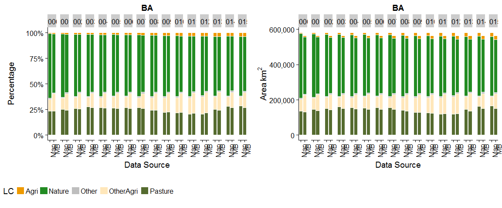
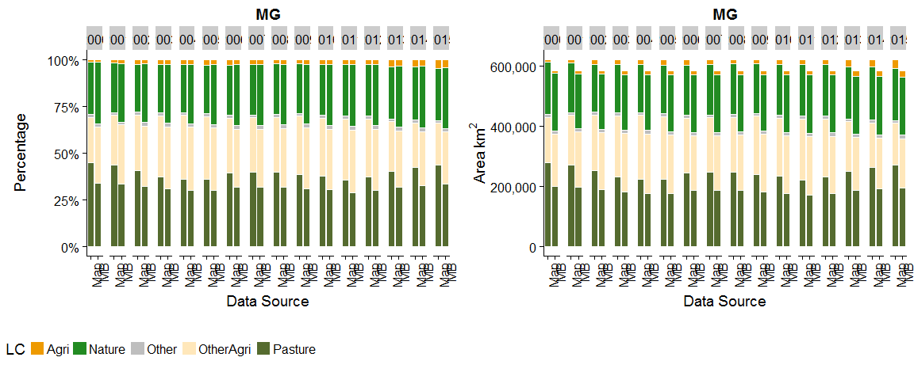
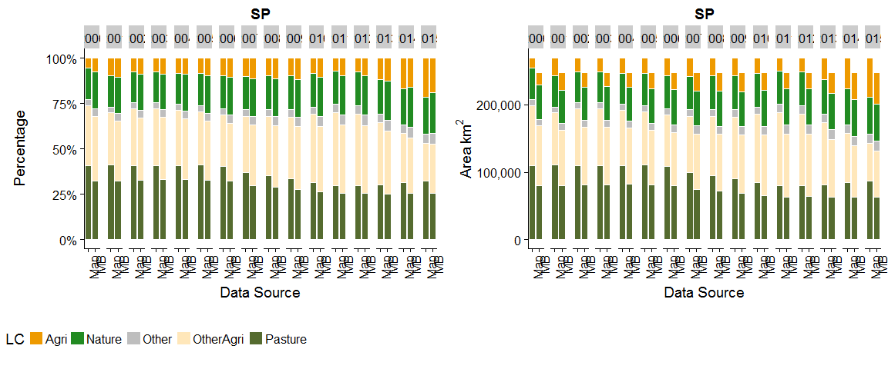
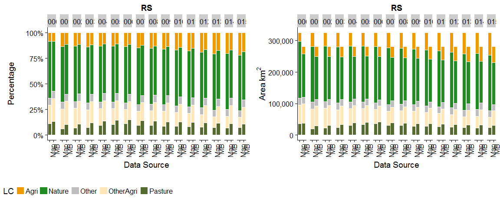
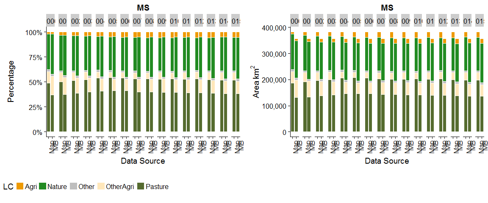
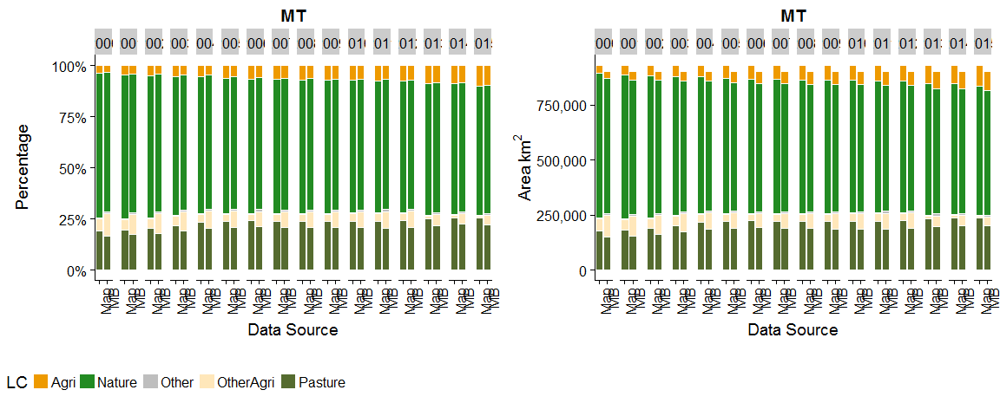

This script analyses all years for a single classification


```r
rm(list=ls())
library(tidyverse)
library(raster)
library(readxl)
library(scales)
library(knitr)
library(rasterVis)   #more useful raster plotting
library(cowplot)
```


```r
#raster to xyz  (with help from https://stackoverflow.com/a/19847419)
#sepcify input raster, whether nodata cells should be output, whether a unique cell ID should be added
#return is a matrix. note format is row (Y) then col (X)
extractXYZ <- function(raster, nodata = FALSE, addCellID = TRUE){
  
  vals <- raster::extract(raster, 1:ncell(raster))   #specify raster otherwise dplyr used
  xys <- rowColFromCell(raster,1:ncell(raster))
  combine <- cbind(xys,vals)
  
  if(addCellID){
    combine <- cbind(1:length(combine[,1]), combine)
  }
  
  if(!nodata){
    combine <- combine[!rowSums(!is.finite(combine)),]  #from https://stackoverflow.com/a/15773560
  }
  
  return(combine)
}


getLCs <- function(data)
{
  #calculates proportion of each LC in the muni (ignoring NAs, help from https://stackoverflow.com/a/44290753)
  data %>%
    group_by(muniID) %>%
    dplyr::summarise(LC1 = round(sum(map == 1, na.rm = T) / sum(!is.na(map)), 3),
                     LC2 = round(sum(map == 2, na.rm = T) / sum(!is.na(map)), 3),
                     LC3 = round(sum(map == 3, na.rm = T) / sum(!is.na(map)), 3),
                     LC4 = round(sum(map == 4, na.rm = T) / sum(!is.na(map)), 3),
                     LC5 = round(sum(map == 5, na.rm = T) / sum(!is.na(map)), 3),
                     NonNAs = sum(!is.na(map)),
                     NAs = sum(is.na(map))
    ) -> LCs

  return(LCs)
}
```


##Load Data

```r
unzip(zipfile="MapBiomas_23_ASCII_unclassified_allYears.zip")  # unzip all file 


csheet <- "PastureA"

classification <- read_excel("MapBiomas_CRAFTY_classifications.xlsx", sheet = csheet, range="B2:C21", col_names=F)  

  
mb_data <- read_csv("LandCover Data - MapBiomas - Collection 2.3 - 2018.01.04 Municipios.csv")  

unzip(zipfile="sim10_BRmunis_latlon_5km_2018-04-27.zip",files="sim10_BRmunis_latlon_5km_2018-04-27.asc",exdir="ASCII")  # unzip file 
munis.r <- raster("ASCII/sim10_BRmunis_latlon_5km_2018-04-27.asc")  #do this with zip file

#extract cell values to table format
munis.t <- extractXYZ(munis.r, addCellID = F)
munis.t <- as.data.frame(munis.t)
munis.t <- plyr::rename(munis.t, c("vals" = "muniID"))
```

**Classification is** PastureA


```r
#Loop over years creating CData table for all years

yrls <- seq(2000,2015,1)
mapStack <- stack()

for(i in seq_along(yrls)){

  map <- raster(paste0("ASCII/brazillc_",yrls[i],"_5km_int.txt"))
  map <- reclassify(map, rcl=as.matrix(classification))
  
  #add categories for later plottin etc.
  map <- ratify(map)     #tell R that the map raster is categorical 
  rat <- levels(map)[[1]]    #apply the levels (i.e. categories) 
  rat$landcover <- c("Nature", "OtherAgri", "Agriculture", "Other", "Pasture") 
  levels(map) <- rat 
  
  #add to mapStack for later plotting
  mapStack <- stack(map, mapStack)

  #extract cell values to table format
  map.t <- extractXYZ(map, addCellID = F)
  map.t <- as.data.frame(map.t)
  map.t <- plyr::rename(map.t, c("vals" = "map"))

  #so need to join 
  map_munis <- left_join(as.data.frame(munis.t), as.data.frame(map.t), by = c("row" = "row", "col" = "col"))

  #now summarise by muniID
  lcs_map_munis <- getLCs(map_munis)

  #convert cell counts to areas (km2) and add state id
  map_areas_munis <- lcs_map_munis %>%
    mutate(LC1area = round(LC1 * NonNAs) * 25) %>%
    mutate(LC2area = round(LC2 * NonNAs) * 25) %>%
    mutate(LC3area = round(LC3 * NonNAs) * 25) %>%
    mutate(LC4area = round(LC4 * NonNAs) * 25) %>%
    mutate(LC5area = round(LC5 * NonNAs) * 25) %>%
    mutate(state = substr(muniID, 1, 2))

  #drop original cell-count columns (work with area km2 from now on)
  map_areas_munis <- map_areas_munis %>% dplyr::select(-LC1, -LC2, -LC3, -LC4, -LC5, -NonNAs, -NAs)

  #summarise muni areas to state level
  map_areas <- map_areas_munis %>%
    group_by(state) %>%
    dplyr::summarise_at(vars(LC1area:LC5area),sum, na.rm=T) %>%  #use _at so state is not summarised
    mutate_if(is.character, as.integer)

  #gather to long format for union below
  map_areas <- map_areas %>%
    gather(key = LCa, value = area, -state)
  
  #recode LCs for union below
  map_areas <- map_areas %>%
    mutate(LC = if_else(LCa == "LC1area", 1, 
      if_else(LCa == "LC2area", 2,
      if_else(LCa == "LC3area", 3,
      if_else(LCa == "LC4area", 4,
      if_else(LCa == "LC5area", 5, 0)
      )))))

  #add source variable for plotting below (re-order to match map table for union below)
  map_areas <- map_areas %>%
    dplyr::select(-LCa) %>%
    mutate(source = "Map") %>%
    dplyr::select(state, LC, source, area)

  ###Summarise MapBiomas data to the states we are simulating

  #filter to get only the states we want
  mb_areas <- mb_data %>%
    filter(Estados == "TOCANTINS" | 
        Estados == "BAHIA" |
        Estados == "MINAS GERAIS" |
        Estados == "SÃO PAULO" |
        Estados == "PARANÁ" |
        Estados == "SANTA CATARINA" |
        Estados == "RIO GRANDE DO SUL" |
        Estados == "MATO GROSSO DO SUL" |
        Estados == "MATO GROSSO" |
        Estados == "GOIÁS")
  
  #add state column containing state ids
  mb_areas <- mb_areas %>%
    mutate(state = if_else(Estados == "TOCANTINS", 17, 
      if_else(Estados == "BAHIA", 29,
      if_else(Estados == "MINAS GERAIS", 31,
      if_else(Estados == "SÃO PAULO", 35,
      if_else(Estados == "PARANÁ", 41,
      if_else(Estados == "SANTA CATARINA", 42,
      if_else(Estados == "RIO GRANDE DO SUL", 43, 
      if_else(Estados == "MATO GROSSO DO SUL", 50, 
      if_else(Estados == "MATO GROSSO", 51,
      if_else(Estados == "GOIÁS", 52, 0
      ))))))))))
    )
  
  #!need to think about what tables to include year in...
  #!change needed here to access the year
  
  #select only columns we want    
  mb_areas <- mb_areas %>%
    dplyr::select(state, paste0(yrls[i]), `Classe Nivel 3`) %>% 
    dplyr::rename(area = paste0(yrls[i]))
  
  #because there is no consistency between land cover labels
  legenda = c("Forest Formations"=1, "Natural Forest Formations"=2, "Dense Forest"=3, "Savanna Formations"=4, "Mangroves"=5,"Forest Plantations"=9, "Non-Forest Natural Formations"=10, "Non Forest Wetlands"=11, "Grasslands"=12, "Other Non Forest Natural Formations"=13, "Farming"=14, "Pasture"=15, "Agriculture"=18, "Agriculture or Pasture"=21, "Non-Vegetated Areas"=22, "Dunes and Beaches"=23, "Urban Infrastructure"=24,"Other Non-Vegetated Area"=25,"Water Bodies"=26, "Non-Observed"=27)
  
  #recode to values (which match the map)
  mb_areas <- mb_areas %>%
    mutate(LC = recode(`Classe Nivel 3`, !!!legenda))
  
  #use the classification values from above to relassify land covers
  mb_areas$LC <- plyr::mapvalues(mb_areas$LC, from=as.numeric(classification$X__1), to=as.numeric(classification$X__2))
  
  #calculate total LC area by state
  mb_areas <- mb_areas %>%
    group_by(state, LC) %>%
    dplyr::summarise_at(vars(area),sum, na.rm=T) 
  
  #round to integer
  mb_areas <- mb_areas %>%
    mutate(area_km2 = round(area,0))
  
  #add source variable for plotting below (re-order to match map table for union below)
  mb_areas <- mb_areas %>%
    dplyr::select(-area) %>%
    mutate(source = "MB") %>%
    rename(area = area_km2) %>%
    dplyr::select(state, LC, source, area)
    
  
  #create CData table just for this year
  CData_yr <- union_all(map_areas, mb_areas)

  #relabel states to characters
  CData_yr <- CData_yr %>%
    mutate(state = if_else(state == 17, "TO", 
      if_else(state == 29, "BA",
      if_else(state == 31, "MG",
      if_else(state == 35, "SP",
      if_else(state == 41, "PR",
      if_else(state == 42, "SC",
      if_else(state == 43, "RS", 
      if_else(state == 50, "MS",
      if_else(state == 51, "MT",
      if_else(state == 52, "GO", "NA"
      ))))))))))
    )
  
  #relabel LCs to characters
  CData_yr <- CData_yr %>%
    mutate(LC = if_else(LC == 1, "Nature", 
      if_else(LC == 2, "OtherAgri",
      if_else(LC == 3, "Agri",
      if_else(LC == 4, "Other",
      if_else(LC == 5, "Pasture", "NA"
      )))))
    )
  
  
  #add year column
  CData_yr <- CData_yr %>%
    mutate(year = yrls[i])
  
  
  #union CData for years here.
  #if first iteration of loop create the tibble
  if(i == 1){
      CData <- CData_yr
  }
    
  #else join data to tibble (by creating another tibble, then join (ensure rows are not lost)
  else {
      CData <- union_all(CData, CData_yr)
  }
  
}  
```

##Maps

```r
names(mapStack) <- yrls
rasterVis::levelplot(mapStack, pretty=T,att = 'landcover', col.regions=c('forestgreen','wheat1', 'orange2', 'gray', 'darkolivegreen'))  
```

<!-- -->

##Plots of areas by year for each state

```r
#**Plots of areas by year for each state**

stls <- c("TO", "BA", "MG", "SP", "PR", "SC", "RS", "MS", "MT", "GO")
cols <- c("Agri" = 'orange2', "Nature" ='forestgreen', "Other"='gray', "OtherAgri"='wheat1', "Pasture"='darkolivegreen')

for(st in stls){

  #filter (remove) missing LCs
  CData_st <- CData %>%
    dplyr::filter(state == st) %>%
    dplyr::filter(area > 0)
  
  P1 <- ggplot(CData_st, aes(x=source, y=area, fill=LC)) + 
    geom_bar(stat="identity", colour="white", position = "fill") +
    scale_fill_manual(values=cols) +
    scale_y_continuous(labels = percent_format()) +
    facet_grid(.~year) +
    xlab("Data Source")+ylab("Percentage") +
    ggtitle(st) +
    theme(axis.text.x = element_text(angle = 90, hjust = 1))
  
  P2 <- ggplot(CData_st, aes(x=source, y=area, fill=LC)) +
    scale_fill_manual(values=cols) +
    geom_bar(stat="identity", colour="white") +
    scale_y_continuous(labels = comma_format()) +
    labs(x=expression(Data~Source),y=expression(Area~km^{2})) +
    facet_grid(.~year) +
    ggtitle(st) +
    theme(axis.text.x = element_text(angle = 90, hjust = 1))
  
  #https://stackoverflow.com/a/44765950
  prow <- cowplot::plot_grid(
    P1 + theme(legend.position="none"),
    P2 + theme(legend.position="none"),
    align = 'vh',
    hjust = -1,
    nrow = 1)
  
  legend_b <- cowplot::get_legend(P1 + theme(legend.position="bottom"))
  p <- plot_grid(prow, legend_b, ncol=1, rel_heights = c(1, 0.2))
  print(p)
}
```

<!-- --><!-- --><!-- --><!-- --><!-- --><!-- --><!-- --><!-- --><!-- --><!-- -->


##All states for all years

```r
##All States
SDataW <- CData %>%
  mutate(sourceState = paste(source, state, sep=" ")) %>%
  dplyr::select(-source, -state) %>%
  spread(key = c(sourceState), value = area)

#following with help from https://stackoverflow.com/a/42015507
SDataW <- SDataW %>%
  mutate(MapTotal = rowSums(.[grep("Map", names(.))], na.rm =TRUE)) %>%
  mutate(MBTotal = rowSums(.[grep("MB", names(.))], na.rm =TRUE)) %>%
  dplyr::select(LC, year, MapTotal, MBTotal) %>%
  mutate(AbsDiffc = MBTotal - MapTotal) %>%
  mutate(PropDiffc = round(AbsDiffc / MBTotal,3))

Stotals <- SDataW %>%
  dplyr::select(-AbsDiffc, -PropDiffc) %>%
  gather(key = source, value = area, -LC, -year)

cols <- c("Agri" = 'orange2', "Nature" ='forestgreen', "Other"='gray', "OtherAgri"='wheat1', "Pasture"='darkolivegreen')

ggplot(Stotals, aes(x=source, y=area, fill=LC)) + 
  geom_bar(stat="identity", colour="white", position = "fill") +
  scale_fill_manual(values=cols) +
  facet_grid(.~year) +
  scale_y_continuous(labels = percent_format()) +
  xlab("Data Source")+ylab("Percentage") +
    theme(axis.text.x = element_text(angle = 90, hjust = 1))
```

<!-- -->

```r
ggplot(Stotals, aes(x=source, y=area, fill=LC)) + 
  scale_fill_manual(values=cols) +
  geom_bar(stat="identity", colour="white") +
  scale_y_continuous(labels = comma_format()) +
  labs(x=expression(Data~Source),y=expression(Area~km^{2})) +
  facet_grid(.~year) +
  theme(axis.text.x = element_text(angle = 90, hjust = 1))
```

<!-- -->


```r
ggplot(SDataW , aes(x=LC, y=AbsDiffc, fill=LC)) + 
  geom_bar(stat="identity", colour="white", position = "dodge") +
  scale_fill_manual(values=cols) +
  scale_y_continuous(labels = comma_format()) +
  facet_grid(.~year) +
  xlab("")+ylab("Abs Diff") +
  theme(axis.text.x = element_text(angle = 90, hjust = 1))
```

<!-- -->

```r
ggplot(SDataW , aes(x=LC, y=PropDiffc, fill=LC)) + 
  geom_bar(stat="identity", colour="white", position = "dodge") +
  scale_fill_manual(values=cols) +
  facet_grid(.~year) +
  xlab("")+ylab("Prop Diff") +
  theme(axis.text.x = element_text(angle = 90, hjust = 1))
```

<!-- -->

```r
MBTotalArea = sum(SDataW$MBTotal) 
MapTotalArea = sum(SDataW$MapTotal) 
ADiffc = MBTotalArea - MapTotalArea
PDiffc = ADiffc / MBTotalArea

SDataW <- bind_rows(SDataW, list(LC = 'Total', MapTotal = MapTotalArea, MBTotal = MBTotalArea, AbsDiffc = ADiffc, PropDiffc = round(PDiffc,3)))

#kable(SDataW)
```

##Adjusted

Adjust areas by systematic difference between MB and Map

```r
TotalArea <- SDataW %>% 
  dplyr::filter(LC != "Total") %>%
  group_by(year) %>%
  dplyr::summarise_at(vars(MapTotal, MBTotal),sum, na.rm=T) %>%
  mutate(prop = MBTotal / MapTotal)

adj <- mean(TotalArea$prop)

##All States
SDataW_Adj <- CData %>%
  mutate(sourceState = paste(source, state, sep=" ")) %>%
  dplyr::select(-source, -state) %>%
  spread(key = c(sourceState), value = area)

#following with help from https://stackoverflow.com/a/42015507
SDataW_Adj <- SDataW_Adj %>%
  mutate(MapTotal = round(adj * rowSums(.[grep("Map", names(.))], na.rm =TRUE),0)) %>%
  mutate(MBTotal = rowSums(.[grep("MB", names(.))], na.rm =TRUE)) %>%
  dplyr::select(LC, year, MapTotal, MBTotal) %>%
  mutate(AbsDiffc = MBTotal - MapTotal) %>%
  mutate(PropDiffc = round(AbsDiffc / MBTotal,3))

Stotals_Adj <- SDataW_Adj %>%
  dplyr::select(-AbsDiffc, -PropDiffc) %>%
  gather(key = source, value = area, -LC, -year)

ggplot(Stotals_Adj, aes(x=source, y=area, fill=LC)) +
  scale_fill_manual(values=cols) + 
  geom_bar(stat="identity", colour="white") +
  scale_y_continuous(labels = comma_format()) +
  facet_grid(.~year) +
  labs(x=expression(Data~Source),y=expression(Area~km^{2})) +
  theme(axis.text.x = element_blank())
```

<!-- -->

```r
ggplot(SDataW_Adj, aes(x=LC, y=AbsDiffc, fill=LC)) + 
  geom_bar(stat="identity", colour="white", position = "dodge") +
  scale_fill_manual(values=cols) +
  facet_grid(.~year) +
  xlab("")+ylab("Abs Diff") +
  theme(axis.text.x = element_blank())
```

<!-- -->

```r
MBTotalArea_Adj = sum(SDataW_Adj$MBTotal) 
MapTotalArea_Adj = sum(SDataW_Adj$MapTotal) 
ADiffc_Adj = MBTotalArea_Adj - MapTotalArea_Adj
PDiffc_Adj = ADiffc_Adj / MBTotalArea_Adj

SDataW_Adj <- bind_rows(SDataW_Adj, list(LC = 'Total', MapTotal = round(MapTotalArea_Adj,0), MBTotal = MBTotalArea_Adj, AbsDiffc = round(ADiffc_Adj,3), PropDiffc = round(PDiffc_Adj,3)))


#kable(SDataW_Adj)
```


##Clean up

```r
unlink("ASCII", recursive = T) #delete ASCII directory created above
```
