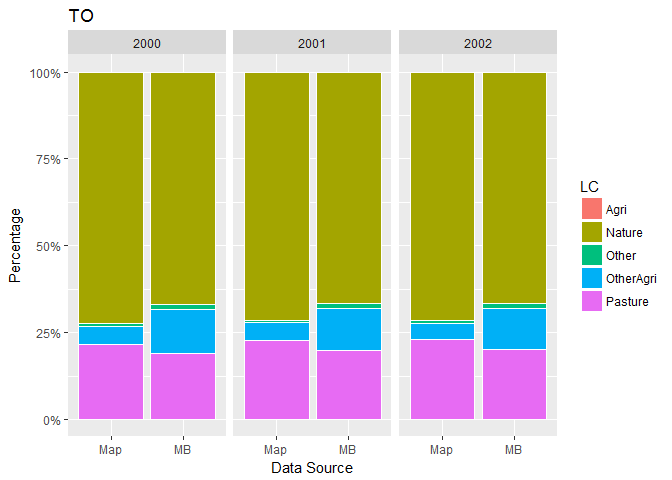

This script analyses all years for a single classification

##Load Libraries

```r
rm(list=ls())
library(tidyverse)
library(raster)
library(readxl)
library(scales)
library(knitr)
```

##Functions

```r
#raster to xyz  (with help from https://stackoverflow.com/a/19847419)
#sepcify input raster, whether nodata cells should be output, whether a unique cell ID should be added
#return is a matrix. note format is row (Y) then col (X)
extractXYZ <- function(raster, nodata = FALSE, addCellID = TRUE){
  
  vals <- raster::extract(raster, 1:ncell(raster))   #specify raster otherwise dplyr used
  xys <- rowColFromCell(raster,1:ncell(raster))
  combine <- cbind(xys,vals)
  
  if(addCellID){
    combine <- cbind(1:length(combine[,1]), combine)
  }
  
  if(!nodata){
    combine <- combine[!rowSums(!is.finite(combine)),]  #from https://stackoverflow.com/a/15773560
  }
  
  return(combine)
}


getLCs <- function(data)
{
  #calculates proportion of each LC in the muni (ignoring NAs, help from https://stackoverflow.com/a/44290753)
  data %>%
    group_by(muniID) %>%
    dplyr::summarise(LC1 = round(sum(map == 1, na.rm = T) / sum(!is.na(map)), 3),
                     LC2 = round(sum(map == 2, na.rm = T) / sum(!is.na(map)), 3),
                     LC3 = round(sum(map == 3, na.rm = T) / sum(!is.na(map)), 3),
                     LC4 = round(sum(map == 4, na.rm = T) / sum(!is.na(map)), 3),
                     LC5 = round(sum(map == 5, na.rm = T) / sum(!is.na(map)), 3),
                     NonNAs = sum(!is.na(map)),
                     NAs = sum(is.na(map))
    ) -> LCs

  return(LCs)
}
```


```r
unzip(zipfile="MapBiomas_23_ASCII_unclassified_allYears.zip")  # unzip all file 


csheet <- "PastureA"

classification <- read_excel("MapBiomas_CRAFTY_classifications.xlsx", sheet = csheet, range="B2:C21", col_names=F)  

  
mb_data <- read_csv("LandCover Data - MapBiomas - Collection 2.3 - 2018.01.04 Municipios.csv")  
```

```
## Parsed with column specification:
## cols(
##   .default = col_double(),
##   Municípios = col_character(),
##   Estados = col_character(),
##   `Classe Nivel 1` = col_character(),
##   `Classe Nivel 2` = col_character(),
##   `Classe Nivel 3` = col_character()
## )
```

```
## See spec(...) for full column specifications.
```

```r
unzip(zipfile="sim10_BRmunis_latlon_5km_2018-04-27.zip",files="sim10_BRmunis_latlon_5km_2018-04-27.asc",exdir="ASCII")  # unzip file 
munis.r <- raster("ASCII/sim10_BRmunis_latlon_5km_2018-04-27.asc")  #do this with zip file

#extract cell values to table format
munis.t <- extractXYZ(munis.r, addCellID = F)
munis.t <- as.data.frame(munis.t)
munis.t <- plyr::rename(munis.t, c("vals" = "muniID"))
```

**Classification is** 

Loop over years creating CData table for all years


```r
yrls <- seq(2000,2002,1)

for(i in seq_along(yrls)){

  print(yrls[i])
  
  map <- raster(paste0("ASCII/brazillc_",yrls[i],"_5km_int.txt"))

  map <- reclassify(map, rcl=as.matrix(classification))
  plot(map, col=c("green", "pink", "yellow", "grey", "brown"))
  
  
  #extract cell values to table format
  map.t <- extractXYZ(map, addCellID = F)
  map.t <- as.data.frame(map.t)
  map.t <- plyr::rename(map.t, c("vals" = "map"))

  #so need to join 
  map_munis <- left_join(as.data.frame(munis.t), as.data.frame(map.t), by = c("row" = "row", "col" = "col"))

  #now summarise by muniID
  lcs_map_munis <- getLCs(map_munis)

  #convert cell counts to areas (km2) and add state id
  map_areas_munis <- lcs_map_munis %>%
    mutate(LC1area = round(LC1 * NonNAs) * 25) %>%
    mutate(LC2area = round(LC2 * NonNAs) * 25) %>%
    mutate(LC3area = round(LC3 * NonNAs) * 25) %>%
    mutate(LC4area = round(LC4 * NonNAs) * 25) %>%
    mutate(LC5area = round(LC5 * NonNAs) * 25) %>%
    mutate(state = substr(muniID, 1, 2))

  #drop original cell-count columns (work with area km2 from now on)
  map_areas_munis <- map_areas_munis %>% dplyr::select(-LC1, -LC2, -LC3, -LC4, -LC5, -NonNAs, -NAs)

  #summarise muni areas to state level
  map_areas <- map_areas_munis %>%
    group_by(state) %>%
    dplyr::summarise_at(vars(LC1area:LC5area),sum, na.rm=T) %>%  #use _at so state is not summarised
    mutate_if(is.character, as.integer)

  #gather to long format for union below
  map_areas <- map_areas %>%
    gather(key = LCa, value = area, -state)
  
  #recode LCs for union below
  map_areas <- map_areas %>%
    mutate(LC = if_else(LCa == "LC1area", 1, 
      if_else(LCa == "LC2area", 2,
      if_else(LCa == "LC3area", 3,
      if_else(LCa == "LC4area", 4,
      if_else(LCa == "LC5area", 5, 0)
      )))))

  #add source variable for plotting below (re-order to match map table for union below)
  map_areas <- map_areas %>%
    dplyr::select(-LCa) %>%
    mutate(source = "Map") %>%
    dplyr::select(state, LC, source, area)

  ###Summarise MapBiomas data to the states we are simulating

  #filter to get only the states we want
  mb_areas <- mb_data %>%
    filter(Estados == "TOCANTINS" | 
        Estados == "BAHIA" |
        Estados == "MINAS GERAIS" |
        Estados == "SÃO PAULO" |
        Estados == "PARANÁ" |
        Estados == "SANTA CATARINA" |
        Estados == "RIO GRANDE DO SUL" |
        Estados == "MATO GROSSO DO SUL" |
        Estados == "MATO GROSSO" |
        Estados == "GOIÁS")
  
  #add state column containing state ids
  mb_areas <- mb_areas %>%
    mutate(state = if_else(Estados == "TOCANTINS", 17, 
      if_else(Estados == "BAHIA", 29,
      if_else(Estados == "MINAS GERAIS", 31,
      if_else(Estados == "SÃO PAULO", 35,
      if_else(Estados == "PARANÁ", 41,
      if_else(Estados == "SANTA CATARINA", 42,
      if_else(Estados == "RIO GRANDE DO SUL", 43, 
      if_else(Estados == "MATO GROSSO DO SUL", 50, 
      if_else(Estados == "MATO GROSSO", 51,
      if_else(Estados == "GOIÁS", 52, 0
      ))))))))))
    )
  
  #!need to think about what tables to include year in...
  #!change needed here to access the year
  
  #select only columns we want    
  mb_areas <- mb_areas %>%
    dplyr::select(state, paste0(yrls[i]), `Classe Nivel 3`) %>% 
    dplyr::rename(area = paste0(yrls[i]))
  
  #because there is no consistency between land cover labels
  legenda = c("Forest Formations"=1, "Natural Forest Formations"=2, "Dense Forest"=3, "Savanna Formations"=4, "Mangroves"=5,"Forest Plantations"=9, "Non-Forest Natural Formations"=10, "Non Forest Wetlands"=11, "Grasslands"=12, "Other Non Forest Natural Formations"=13, "Farming"=14, "Pasture"=15, "Agriculture"=18, "Agriculture or Pasture"=21, "Non-Vegetated Areas"=22, "Dunes and Beaches"=23, "Urban Infrastructure"=24,"Other Non-Vegetated Area"=25,"Water Bodies"=26, "Non-Observed"=27)
  
  #recode to values (which match the map)
  mb_areas <- mb_areas %>%
    mutate(LC = recode(`Classe Nivel 3`, !!!legenda))
  
  #use the classification values from above to relassify land covers
  mb_areas$LC <- plyr::mapvalues(mb_areas$LC, from=as.numeric(classification$X__1), to=as.numeric(classification$X__2))
  
  #calculate total LC area by state
  mb_areas <- mb_areas %>%
    group_by(state, LC) %>%
    dplyr::summarise_at(vars(area),sum, na.rm=T) 
  
  #round to integer
  mb_areas <- mb_areas %>%
    mutate(area_km2 = round(area,0))
  
  #add source variable for plotting below (re-order to match map table for union below)
  mb_areas <- mb_areas %>%
    dplyr::select(-area) %>%
    mutate(source = "MB") %>%
    rename(area = area_km2) %>%
    dplyr::select(state, LC, source, area)
    
  
  #create CData table just for this year
  CData_yr <- union_all(map_areas, mb_areas)

  #relabel states to characters
  CData_yr <- CData_yr %>%
    mutate(state = if_else(state == 17, "TO", 
      if_else(state == 29, "BA",
      if_else(state == 31, "MG",
      if_else(state == 35, "SP",
      if_else(state == 41, "PR",
      if_else(state == 42, "SC",
      if_else(state == 43, "RS", 
      if_else(state == 50, "MS",
      if_else(state == 51, "MT",
      if_else(state == 52, "GO", "NA"
      ))))))))))
    )
  
  #relabel LCs to characters
  CData_yr <- CData_yr %>%
    mutate(LC = if_else(LC == 1, "Nature", 
      if_else(LC == 2, "OtherAgri",
      if_else(LC == 3, "Agri",
      if_else(LC == 4, "Other",
      if_else(LC == 5, "Pasture", "NA"
      )))))
    )
  
  
  #add year column
  CData_yr <- CData_yr %>%
    mutate(year = yrls[i])
  
  
  #union CData for years here.
  #if first iteration of loop create the tibble
  if(i == 1){
      CData <- CData_yr
  }
    
  #else join data to tibble (by creating another tibble, then join (ensure rows are not lost)
  else {
      CData <- union_all(CData, CData_yr)
  }
  
}  
```

```
## [1] 2000
```

```
## The following `from` values were not present in `x`: 2, 3, 10, 14
```

<!-- -->

```
## [1] 2001
```

```
## The following `from` values were not present in `x`: 2, 3, 10, 14
```

<!-- -->

```
## [1] 2002
```

```
## The following `from` values were not present in `x`: 2, 3, 10, 14
```

<!-- -->


Plot areas by state for a given year


```r
yr <- 2000

#filter (remove) missing LCs
CData_yr <- CData %>%
  dplyr::filter(year == yr) %>%
  dplyr::filter(area > 0)

ggplot(CData_yr, aes(x=source, y=area, fill=LC)) + 
  geom_bar(stat="identity", colour="white", position = "fill") +
  scale_y_continuous(labels = percent_format()) +
  facet_grid(.~state) +
  xlab("Data Source")+ylab("Percentage") +
  ggtitle(yr)
```

<!-- -->

```r
ggplot(CData_yr, aes(x=source, y=area, fill=LC)) + 
  geom_bar(stat="identity", colour="white") +
  facet_grid(.~state) +
  xlab("Data Source")+ylab("Area km2") +
  ggtitle(yr)
```

<!-- -->


Plot areas by year for a given state

```r
st <- "TO"

#filter (remove) missing LCs
CData_st <- CData %>%
  dplyr::filter(state == st) %>%
  dplyr::filter(area > 0)

ggplot(CData_st, aes(x=source, y=area, fill=LC)) + 
  geom_bar(stat="identity", colour="white", position = "fill") +
  scale_y_continuous(labels = percent_format()) +
  facet_grid(.~year) +
  xlab("Data Source")+ylab("Percentage") +
  ggtitle(st)
```

<!-- -->

```r
ggplot(CData_st, aes(x=source, y=area, fill=LC)) + 
  geom_bar(stat="identity", colour="white") +
  facet_grid(.~year) +
  xlab("Data Source")+ylab("Area km2") +
  ggtitle(st)
```

<!-- -->

Differences by year for a given state

```r
st <- "TO"

#filter (remove) missing LCs
CData_st <- CData %>%
  dplyr::filter(state == st) %>%
  dplyr::filter(area > 0)

###Quantitative Differences
  CDataW <- CData_st %>%
    mutate(sourceLC = paste0(source, LC)) %>%
    dplyr::select(-source, -LC) %>%
    spread(key = c(sourceLC), value = area) %>%
    dplyr::select(year, starts_with("Map"), starts_with("MB"))
    
  kable(CDataW)
```


 year   MapAgri   MapNature   MapOther   MapOtherAgri   MapPasture   MBAgri   MBNature   MBOther   MBOtherAgri   MBPasture
-----  --------  ----------  ---------  -------------  -----------  -------  ---------  --------  ------------  ----------
 2000        75      205600       2025          15200        60925      166     185541      3759         34786       52944
 2001       275      202825       1900          14325        64500      331     184671      3657         33801       54736
 2002       550      202175       2725          12975        65400      511     184122      4203         32230       56129

```r
  #it may be that in a given classification some LCs may not exist. so to calculate summarise we need to do some dplyr programming
  
  #get the names of LCs that exist in this classification in a list
  d <- unlist(distinct(CData, LC), use.names=F)
  
  #iterate over the list of LC names
  #mustate lines with help from https://stackoverflow.com/a/26003971 and https://stackoverflow.com/a/44622499
  for(j in seq_along(d)){
    CDataW <- CDataW %>%
      mutate(!!paste0(d[j],"AbsDiffc") := .data[[paste0("MB",d[j])]] - .data[[paste0("Map",d[j])]]) %>%
      mutate(!!paste0(d[j],"PropDiffc") := round(.data[[paste0(d[j],"AbsDiffc")]] / .data[[paste0("MB",d[j])]],3)) 
  }

  ###Absolute Differences
  abs <- CDataW %>%
    dplyr::select(-starts_with("MB"), -starts_with("Map"), -ends_with("PropDiffc"))
  
  kable(abs)
```


 year   NatureAbsDiffc   OtherAgriAbsDiffc   AgriAbsDiffc   OtherAbsDiffc   PastureAbsDiffc
-----  ---------------  ------------------  -------------  --------------  ----------------
 2000           -20059               19586             91            1734             -7981
 2001           -18154               19476             56            1757             -9764
 2002           -18053               19255            -39            1478             -9271

```r
  abs <- abs %>%
    gather(key = LC, value = area, -year)
  
  ggplot(abs, aes(x=year, y=area, fill=LC)) + 
    geom_bar(stat="identity", colour="white", position = "dodge") +
    xlab("Data Source")+ylab("Abs Diff km2") +
    ggtitle(st)
```

<!-- -->

```r
  ###Proportional Diferences
  prop <- CDataW %>%
    dplyr::select(-starts_with("MB"), -starts_with("Map"), -ends_with("AbsDiffc")) 
  
  kable(prop)
```


 year   NaturePropDiffc   OtherAgriPropDiffc   AgriPropDiffc   OtherPropDiffc   PasturePropDiffc
-----  ----------------  -------------------  --------------  ---------------  -----------------
 2000            -0.108                0.563           0.548            0.461             -0.151
 2001            -0.098                0.576           0.169            0.480             -0.178
 2002            -0.098                0.597          -0.076            0.352             -0.165

```r
  prop <- prop %>%
    gather(key = LC, value = area, -year)
  
  ggplot(prop, aes(x=year, y=area, fill=LC)) + 
    geom_bar(stat="identity", colour="white", position = "dodge") +
    xlab("Data Source")+ylab("Prop Diff") +
    ggtitle(st)
```

<!-- -->


All states for all years


```r
##All States
SDataW <- CData %>%
  mutate(sourceState = paste(source, state, sep=" ")) %>%
  dplyr::select(-source, -state) %>%
  spread(key = c(sourceState), value = area)

#following with help from https://stackoverflow.com/a/42015507
SDataW <- SDataW %>%
  mutate(MapTotal = rowSums(.[grep("Map", names(.))], na.rm =TRUE)) %>%
  mutate(MBTotal = rowSums(.[grep("MB", names(.))], na.rm =TRUE)) %>%
  dplyr::select(LC, year, MapTotal, MBTotal) %>%
  mutate(AbsDiffc = MBTotal - MapTotal) %>%
  mutate(PropDiffc = round(AbsDiffc / MBTotal,3))

Stotals <- SDataW %>%
  dplyr::select(-AbsDiffc, -PropDiffc) %>%
  gather(key = source, value = area, -LC, -year)

ggplot(Stotals, aes(x=source, y=area, fill=LC)) + 
  geom_bar(stat="identity", colour="white", position = "fill") +
  facet_grid(.~year) +
  scale_y_continuous(labels = percent_format()) +
  xlab("Data Source")+ylab("Percentage")
```

<!-- -->

```r
ggplot(Stotals, aes(x=source, y=area, fill=LC)) + 
  geom_bar(stat="identity", colour="white") +
  facet_grid(.~year) +
  xlab("Data Source")+ylab("Area km2")
```

<!-- -->


```r
ggplot(SDataW , aes(x=LC, y=AbsDiffc, fill=LC)) + 
  geom_bar(stat="identity", colour="white", position = "dodge") +
  facet_grid(.~year) +
  xlab("")+ylab("Abs Diff") +
  theme(axis.text.x = element_blank())
```

<!-- -->

```r
ggplot(SDataW , aes(x=LC, y=PropDiffc, fill=LC)) + 
  geom_bar(stat="identity", colour="white", position = "dodge") +
  facet_grid(.~year) +
  xlab("")+ylab("Prop Diff") +
  theme(axis.text.x = element_blank())
```

<!-- -->

```r
MBTotalArea = sum(SDataW$MBTotal) 
MapTotalArea = sum(SDataW$MapTotal) 
ADiffc = MBTotalArea - MapTotalArea
PDiffc = ADiffc / MBTotalArea

SDataW <- bind_rows(SDataW, list(LC = 'Total', MapTotal = MapTotalArea, MBTotal = MBTotalArea, AbsDiffc = ADiffc, PropDiffc = round(PDiffc,3)))

summary(SDataW)
```

```
##       LC                 year         MapTotal           MBTotal        
##  Length:16          Min.   :2000   Min.   :   62725   Min.   :   75831  
##  Class :character   1st Qu.:2000   1st Qu.:  196275   1st Qu.:  171759  
##  Mode  :character   Median :2001   Median :  661362   Median :  803554  
##                     Mean   :2001   Mean   : 1527994   Mean   : 1443837  
##                     3rd Qu.:2002   3rd Qu.: 1403331   3rd Qu.: 1191303  
##                     Max.   :2002   Max.   :12223950   Max.   :11550694  
##                     NA's   :1                                           
##     AbsDiffc         PropDiffc       
##  Min.   :-673256   Min.   :-0.27700  
##  1st Qu.:-143680   1st Qu.:-0.17025  
##  Median : -33314   Median :-0.05150  
##  Mean   : -84157   Mean   :-0.02475  
##  3rd Qu.:  12885   3rd Qu.: 0.16900  
##  Max.   : 142595   Max.   : 0.18000  
## 
```

```r
kable(SDataW)
```


LC           year   MapTotal    MBTotal   AbsDiffc   PropDiffc
----------  -----  ---------  ---------  ---------  ----------
Agri         2000     142425     135122      -7303      -0.054
Agri         2001     214225     183971     -30254      -0.164
Agri         2002     228725     192352     -36373      -0.189
Nature       2000    1967225    1861438    -105787      -0.057
Nature       2001    1923950    1834532     -89418      -0.049
Nature       2002    1903225    1827182     -76043      -0.042
Other        2000      63450      76261      12811       0.168
Other        2001      62725      75831      13106       0.173
Other        2002      65725      78283      12558       0.160
OtherAgri    2000     674350     816139     141789       0.174
OtherAgri    2001     648375     790970     142595       0.180
OtherAgri    2002     640275     773071     132796       0.172
Pasture      2000    1227200     961270    -265930      -0.277
Pasture      2001    1225375     964929    -260446      -0.270
Pasture      2002    1236700     979343    -257357      -0.263
Total          NA   12223950   11550694    -673256      -0.058

Adjust areas by systematic difference between MB and Map


```r
TotalArea <- SDataW %>% 
  dplyr::filter(LC != "Total") %>%
  group_by(year) %>%
  dplyr::summarise_at(vars(MapTotal, MBTotal),sum, na.rm=T) %>%
  mutate(prop = MBTotal / MapTotal)

adj <- mean(TotalArea$prop)

##All States
SDataW_Adj <- CData %>%
  mutate(sourceState = paste(source, state, sep=" ")) %>%
  dplyr::select(-source, -state) %>%
  spread(key = c(sourceState), value = area)

#following with help from https://stackoverflow.com/a/42015507
SDataW_Adj <- SDataW_Adj %>%
  mutate(MapTotal = round(adj * rowSums(.[grep("Map", names(.))], na.rm =TRUE),0)) %>%
  mutate(MBTotal = rowSums(.[grep("MB", names(.))], na.rm =TRUE)) %>%
  dplyr::select(LC, year, MapTotal, MBTotal) %>%
  mutate(AbsDiffc = MBTotal - MapTotal) %>%
  mutate(PropDiffc = round(AbsDiffc / MBTotal,3))

Stotals_Adj <- SDataW_Adj %>%
  dplyr::select(-AbsDiffc, -PropDiffc) %>%
  gather(key = source, value = area, -LC, -year)

ggplot(Stotals_Adj, aes(x=source, y=area, fill=LC)) + 
  geom_bar(stat="identity", colour="white") +
  facet_grid(.~year) +
  xlab("Data Source")+ylab("Area km2")
```

<!-- -->

```r
ggplot(SDataW_Adj, aes(x=LC, y=AbsDiffc, fill=LC)) + 
  geom_bar(stat="identity", colour="white", position = "dodge") +
  facet_grid(.~year) +
  xlab("")+ylab("Abs Diff") +
  theme(axis.text.x = element_blank())
```

<!-- -->

```r
MBTotalArea_Adj = sum(SDataW_Adj$MBTotal) 
MapTotalArea_Adj = sum(SDataW_Adj$MapTotal) 
ADiffc_Adj = MBTotalArea_Adj - MapTotalArea_Adj
PDiffc_Adj = ADiffc_Adj / MBTotalArea_Adj

SDataW_Adj <- rbind(SDataW_Adj, c('Total', 0000, round(MapTotalArea_Adj,0), MBTotalArea_Adj, round(ADiffc_Adj,3), round(PDiffc_Adj,3)))

kable(SDataW_Adj)
```


LC          year   MapTotal   MBTotal    AbsDiffc   PropDiffc 
----------  -----  ---------  ---------  ---------  ----------
Agri        2000   134581     135122     541        0.004     
Agri        2001   202426     183971     -18455     -0.1      
Agri        2002   216128     192352     -23776     -0.124    
Nature      2000   1858877    1861438    2561       0.001     
Nature      2001   1817985    1834532    16547      0.009     
Nature      2002   1798401    1827182    28781      0.016     
Other       2000   59955      76261      16306      0.214     
Other       2001   59270      75831      16561      0.218     
Other       2002   62105      78283      16178      0.207     
OtherAgri   2000   637209     816139     178930     0.219     
OtherAgri   2001   612665     790970     178305     0.225     
OtherAgri   2002   605011     773071     168060     0.217     
Pasture     2000   1159610    961270     -198340    -0.206    
Pasture     2001   1157885    964929     -192956    -0.2      
Pasture     2002   1168587    979343     -189244    -0.193    
Total       0      11550695   11550694   -1         0         


##Clean up

```r
unlink("ASCII", recursive = T) #delete ASCII directory created above
```
