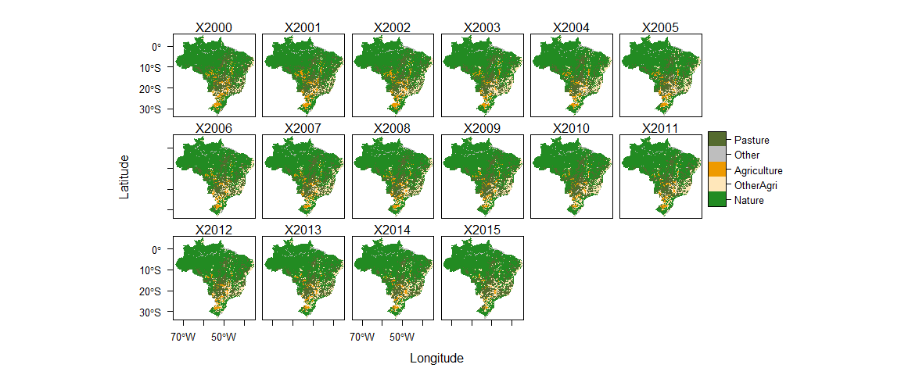
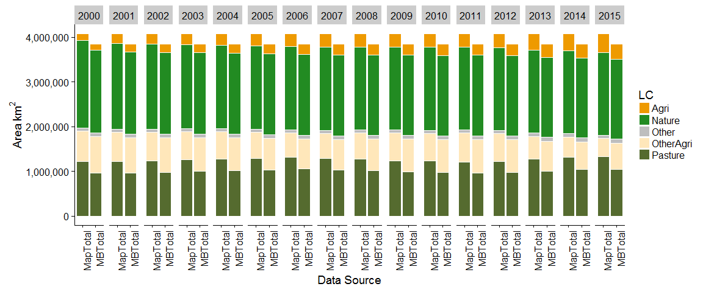
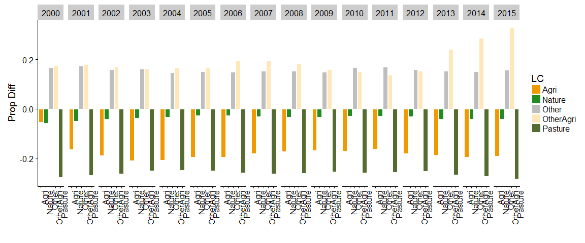

This script analyses all years for a single classification


##Load Data

```r
unzip(zipfile="MapBiomas_23_ASCII_unclassified_allYears.zip")  # unzip all file 


csheet <- "PastureA"

classification <- read_excel("MapBiomas_CRAFTY_classifications.xlsx", sheet = csheet, range="B2:C21", col_names=F)  

  
mb_data <- read_csv("LandCover Data - MapBiomas - Collection 2.3 - 2018.01.04 Municipios.csv")  
```

```
## Parsed with column specification:
## cols(
##   .default = col_double(),
##   Municípios = col_character(),
##   Estados = col_character(),
##   `Classe Nivel 1` = col_character(),
##   `Classe Nivel 2` = col_character(),
##   `Classe Nivel 3` = col_character()
## )
```

```
## See spec(...) for full column specifications.
```

```r
unzip(zipfile="sim10_BRmunis_latlon_5km_2018-04-27.zip",files="sim10_BRmunis_latlon_5km_2018-04-27.asc",exdir="ASCII")  # unzip file 
munis.r <- raster("ASCII/sim10_BRmunis_latlon_5km_2018-04-27.asc")  #do this with zip file

#extract cell values to table format
munis.t <- extractXYZ(munis.r, addCellID = F)
munis.t <- as.data.frame(munis.t)
munis.t <- plyr::rename(munis.t, c("vals" = "muniID"))
```

**Classification is** PastureA


##Maps
<!-- -->


**All states for all years**

<!-- --><!-- -->

<!-- --><!-- -->

##Adjusted

Adjust areas by systematic difference between MB and Map

<!-- --><!-- -->


##Clean up

```r
unlink("ASCII", recursive = T) #delete ASCII directory created above
```
