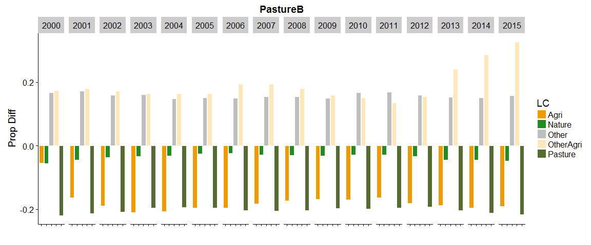
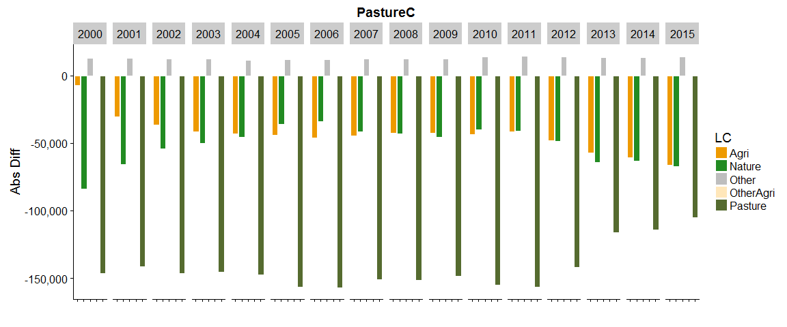

This script (will eventually) analyses all years for multiple classifications


```r
rm(list=ls())
library(tidyverse)
library(raster)
library(readxl)      #for reading Excel sheets
library(scales)      #useful for ggplotting
library(knitr)
library(rasterVis)   #more useful raster plotting
library(cowplot)     #useful for ggplotting
```


```r
#raster to xyz  (with help from https://stackoverflow.com/a/19847419)
#sepcify input raster, whether nodata cells should be output, whether a unique cell ID should be added
#return is a matrix. note format is row (Y) then col (X)
extractXYZ <- function(raster, nodata = FALSE, addCellID = TRUE){
  
  vals <- raster::extract(raster, 1:ncell(raster))   #specify raster otherwise dplyr used
  xys <- rowColFromCell(raster,1:ncell(raster))
  combine <- cbind(xys,vals)
  
  if(addCellID){
    combine <- cbind(1:length(combine[,1]), combine)
  }
  
  if(!nodata){
    combine <- combine[!rowSums(!is.finite(combine)),]  #from https://stackoverflow.com/a/15773560
  }
  
  return(combine)
}


getLCs <- function(data)
{
  #calculates proportion of each LC in the muni (ignoring NAs, help from https://stackoverflow.com/a/44290753)
  data %>%
    group_by(muniID) %>%
    dplyr::summarise(LC1 = round(sum(map == 1, na.rm = T) / sum(!is.na(map)), 3),
                     LC2 = round(sum(map == 2, na.rm = T) / sum(!is.na(map)), 3),
                     LC3 = round(sum(map == 3, na.rm = T) / sum(!is.na(map)), 3),
                     LC4 = round(sum(map == 4, na.rm = T) / sum(!is.na(map)), 3),
                     LC5 = round(sum(map == 5, na.rm = T) / sum(!is.na(map)), 3),
                     NonNAs = sum(!is.na(map)),
                     NAs = sum(is.na(map))
    ) -> LCs

  return(LCs)
}
```


```r
unzip(zipfile="MapBiomas_23_ASCII_unclassified_allYears.zip")  # unzip all files 

mb_data <- read_csv("LandCover Data - MapBiomas - Collection 2.3 - 2018.01.04 Municipios.csv")  
```

```
## Parsed with column specification:
## cols(
##   .default = col_double(),
##   Municípios = col_character(),
##   Estados = col_character(),
##   `Classe Nivel 1` = col_character(),
##   `Classe Nivel 2` = col_character(),
##   `Classe Nivel 3` = col_character()
## )
```

```
## See spec(...) for full column specifications.
```

```r
unzip(zipfile="sim10_BRmunis_latlon_5km_2018-04-27.zip",files="sim10_BRmunis_latlon_5km_2018-04-27.asc",exdir="ASCII")  # unzip file 
munis.r <- raster("ASCII/sim10_BRmunis_latlon_5km_2018-04-27.asc")  #do this with zip file

#extract cell values to table format
munis.t <- extractXYZ(munis.r, addCellID = F)
munis.t <- as.data.frame(munis.t)
munis.t <- plyr::rename(munis.t, c("vals" = "muniID"))
```

Specify classifications and years to examine. Classifications should be the names of Sheets in the Classifications Excel file. Years should be between 2000 and 2015 

```r
#classifications to loop through 
cls <- c("PastureA", "PastureB", "PastureC")

yrls <- seq(2000,2015,1)
```

Loop over classifications and years


```r
#lists to hold data tables 
CData_ls <- vector('list', length(cls))
CDataW_ls <- vector('list', length(cls))
SDataW_ls <- vector('list', length(cls))
Stotals_ls <- vector('list', length(cls))
SDataW_Adj_ls <- vector('list', length(cls))
mapStack_ls <- vector('list', length(cls))

names(CData_ls) <- cls
names(CDataW_ls) <- cls
names(SDataW_ls) <- cls
names(Stotals_ls) <- cls
names(SDataW_Adj_ls) <- cls
names(mapStack_ls) <- cls

#loop over classifications
for(i in seq_along(cls)){
  
  classification <- read_excel("MapBiomas_CRAFTY_classifications.xlsx", sheet = cls[i], range="B2:C21", col_names=F) 
  
  #reset mapStack for this Classification
  mapStack <- stack()

  #loop over years  
  for(j in seq_along(yrls)){

  #print(paste0("Classification: ",cls[i],", Year: ",yrls[j]))
  
  map <- raster(paste0("ASCII/brazillc_",yrls[j],"_5km_int.txt"))
  map <- reclassify(map, rcl=as.matrix(classification))
  
  
  #add categories for later plotting etc. (see https://stackoverflow.com/a/37214431)
  map <- ratify(map)     #tell R that the map raster is categorical 
  rat <- levels(map)[[1]]    #apply the levels (i.e. categories) 
 
  #not all classes may be present after classification, so conditionally construct labels
  labs <- c()
  if(1 %in% levels(map)[[1]]$ID) { labs <- c(labs, "Nature") }
  if(2 %in% levels(map)[[1]]$ID) { labs <- c(labs, "OtherAgri") }
  if(3 %in% levels(map)[[1]]$ID) { labs <- c(labs, "Agriculture") }
  if(4 %in% levels(map)[[1]]$ID) { labs <- c(labs, "Other") }
  if(5 %in% levels(map)[[1]]$ID) { labs <- c(labs, "Pasture") }
    
  rat$landcover <- labs  
  levels(map) <- rat 
  
  #add to mapStack for later plotting
  mapStack <- stack(map, mapStack)

  #extract cell values to table format
  map.t <- extractXYZ(map, addCellID = F)
  map.t <- as.data.frame(map.t)
  map.t <- plyr::rename(map.t, c("vals" = "map"))

  #so need to join 
  map_munis <- left_join(as.data.frame(munis.t), as.data.frame(map.t), by = c("row" = "row", "col" = "col"))

  #now summarise by muniID
  lcs_map_munis <- getLCs(map_munis)

  #convert cell counts to areas (km2) and add state id
  map_areas_munis <- lcs_map_munis %>%
    mutate(LC1area = round(LC1 * NonNAs) * 25) %>%
    mutate(LC2area = round(LC2 * NonNAs) * 25) %>%
    mutate(LC3area = round(LC3 * NonNAs) * 25) %>%
    mutate(LC4area = round(LC4 * NonNAs) * 25) %>%
    mutate(LC5area = round(LC5 * NonNAs) * 25) %>%
    mutate(state = substr(muniID, 1, 2))

  #drop original cell-count columns (work with area km2 from now on)
  map_areas_munis <- map_areas_munis %>% dplyr::select(-LC1, -LC2, -LC3, -LC4, -LC5, -NonNAs, -NAs)

  #summarise muni areas to state level
  map_areas <- map_areas_munis %>%
    group_by(state) %>%
    dplyr::summarise_at(vars(LC1area:LC5area),sum, na.rm=T) %>%  #use _at so state is not summarised
    mutate_if(is.character, as.integer)

  #gather to long format for union below
  map_areas <- map_areas %>%
    gather(key = LCa, value = area, -state)
  
  #recode LCs for union below
  map_areas <- map_areas %>%
    mutate(LC = if_else(LCa == "LC1area", 1, 
      if_else(LCa == "LC2area", 2,
      if_else(LCa == "LC3area", 3,
      if_else(LCa == "LC4area", 4,
      if_else(LCa == "LC5area", 5, 0)
      )))))

  #add source variable for plotting below (re-order to match map table for union below)
  map_areas <- map_areas %>%
    dplyr::select(-LCa) %>%
    mutate(source = "Map") %>%
    dplyr::select(state, LC, source, area)

  ###Summarise MapBiomas data to the states we are simulating

  #filter to get only the states we want
  mb_areas <- mb_data %>%
    filter(Estados == "TOCANTINS" | 
        Estados == "BAHIA" |
        Estados == "MINAS GERAIS" |
        Estados == "SÃO PAULO" |
        Estados == "PARANÁ" |
        Estados == "SANTA CATARINA" |
        Estados == "RIO GRANDE DO SUL" |
        Estados == "MATO GROSSO DO SUL" |
        Estados == "MATO GROSSO" |
        Estados == "GOIÁS")
  
  #add state column containing state ids
  mb_areas <- mb_areas %>%
    mutate(state = if_else(Estados == "TOCANTINS", 17, 
      if_else(Estados == "BAHIA", 29,
      if_else(Estados == "MINAS GERAIS", 31,
      if_else(Estados == "SÃO PAULO", 35,
      if_else(Estados == "PARANÁ", 41,
      if_else(Estados == "SANTA CATARINA", 42,
      if_else(Estados == "RIO GRANDE DO SUL", 43, 
      if_else(Estados == "MATO GROSSO DO SUL", 50, 
      if_else(Estados == "MATO GROSSO", 51,
      if_else(Estados == "GOIÁS", 52, 0
      ))))))))))
    )
  
      
  #select only columns we want    
  mb_areas <- mb_areas %>%
    dplyr::select(state, paste0(yrls[j]), `Classe Nivel 3`) %>% 
    dplyr::rename(area = paste0(yrls[j]))
  
  #because there is no consistency between land cover labels
  legenda = c("Forest Formations"=1, "Natural Forest Formations"=2, "Dense Forest"=3, "Savanna Formations"=4, "Mangroves"=5,"Forest Plantations"=9, "Non-Forest Natural Formations"=10, "Non Forest Wetlands"=11, "Grasslands"=12, "Other Non Forest Natural Formations"=13, "Farming"=14, "Pasture"=15, "Agriculture"=18, "Agriculture or Pasture"=21, "Non-Vegetated Areas"=22, "Dunes and Beaches"=23, "Urban Infrastructure"=24,"Other Non-Vegetated Area"=25,"Water Bodies"=26, "Non-Observed"=27)
  
  #recode to values (which match the map)
  mb_areas <- mb_areas %>%
    mutate(LC = recode(`Classe Nivel 3`, !!!legenda))
  
  #use the classification values from above to relassify land covers
  mb_areas$LC <- plyr::mapvalues(mb_areas$LC, from=as.numeric(classification$X__1), to=as.numeric(classification$X__2))
  
  #calculate total LC area by state
  mb_areas <- mb_areas %>%
    group_by(state, LC) %>%
    dplyr::summarise_at(vars(area),sum, na.rm=T) 
  
  #round to integer
  mb_areas <- mb_areas %>%
    mutate(area_km2 = round(area,0))
  
  #add source variable for plotting below (re-order to match map table for union below)
  mb_areas <- mb_areas %>%
    dplyr::select(-area) %>%
    mutate(source = "MB") %>%
    rename(area = area_km2) %>%
    dplyr::select(state, LC, source, area)
    

  CData_yr <- union_all(map_areas, mb_areas)

  #relabel states to characters
  CData_yr <- CData_yr %>%
    mutate(state = if_else(state == 17, "TO", 
      if_else(state == 29, "BA",
      if_else(state == 31, "MG",
      if_else(state == 35, "SP",
      if_else(state == 41, "PR",
      if_else(state == 42, "SC",
      if_else(state == 43, "RS", 
      if_else(state == 50, "MS",
      if_else(state == 51, "MT",
      if_else(state == 52, "GO", "NA"
      ))))))))))
    )
  
  #relabel LCs to characters
  CData_yr <- CData_yr %>%
    mutate(LC = if_else(LC == 1, "Nature", 
      if_else(LC == 2, "OtherAgri",
      if_else(LC == 3, "Agri",
      if_else(LC == 4, "Other",
      if_else(LC == 5, "Pasture", "NA"
      )))))
    )
  
  #add year column
  CData_yr <- CData_yr %>%
    mutate(year = yrls[j])
  
  #union CData for years here.
  #if first iteration of classification loop (re)create the tibble
  if(j == 1){
      CData <- CData_yr
  }
    
  #else join data to tibble (by creating another tibble, then join (ensure rows are not lost)
  else {
      CData <- union_all(CData, CData_yr)
  }
  }
  
  CData_ls[[i]] <- CData
  
  names(mapStack) <- yrls
  mapStack_ls[[i]] <- mapStack
}
```

##Maps

```r
#use loop instead of lapply to construct approproate palette
for(i in seq_along(mapStack_ls)){

  clabs <- c()
  if(1 %in% levels(mapStack_ls[[i]])[[1]]$ID) { clabs <- c(clabs, 'forestgreen') }
  if(2 %in% levels(mapStack_ls[[i]])[[1]]$ID) { clabs <- c(clabs, 'wheat1') }
  if(3 %in% levels(mapStack_ls[[i]])[[1]]$ID) { clabs <- c(clabs, 'orange2') }
  if(4 %in% levels(mapStack_ls[[i]])[[1]]$ID) { clabs <- c(clabs, 'gray') }
  if(5 %in% levels(mapStack_ls[[i]])[[1]]$ID) { clabs <- c(clabs, 'darkolivegreen') }
  
  print(cls[i])
  print(rasterVis::levelplot(mapStack_ls[[i]], pretty=T,att = 'landcover', col.regions=clabs), main=paste0(cls[i]))
  
}
```

```
## [1] "PastureA"
```

<!-- -->

```
## [1] "PastureB"
```

<!-- -->

```
## [1] "PastureC"
```

<!-- -->

##All states for all years by classification

```r
for(i in seq_along(cls)){

  ##All States
  SDataW <- CData_ls[[i]] %>%
    mutate(sourceState = paste(source, state, sep=" ")) %>%
    dplyr::select(-source, -state) %>%
    spread(key = c(sourceState), value = area)
  
  #following with help from https://stackoverflow.com/a/42015507
  SDataW <- SDataW %>%
    mutate(MapTotal = rowSums(.[grep("Map", names(.))], na.rm =TRUE)) %>%
    mutate(MBTotal = rowSums(.[grep("MB", names(.))], na.rm =TRUE)) %>%
    dplyr::select(LC, year, MapTotal, MBTotal) %>%
    mutate(AbsDiffc = MBTotal - MapTotal) %>%
    mutate(PropDiffc = round(AbsDiffc / MBTotal,3))
  
  Stotals <- SDataW %>%
    dplyr::select(-AbsDiffc, -PropDiffc) %>%
    gather(key = source, value = area, -LC, -year)
  
  SDataW_ls[[i]] <- SDataW
  Stotals_ls[[i]] <- Stotals
}
```


```r
for(i in seq_along(cls)){
  
  clabs <- c("Agri" = 'orange2', "Nature" ='forestgreen', "Other"='gray', "OtherAgri"='wheat1', "Pasture"='darkolivegreen')
  
  p1 <- ggplot(Stotals_ls[[i]], aes(x=source, y=area, fill=LC)) + 
    geom_bar(stat="identity", colour="white", position = "fill") +
    scale_fill_manual(values=clabs) +
    facet_grid(.~year) +
    scale_y_continuous(labels = percent_format()) +
    xlab("Data Source")+ylab("Percentage") +
      theme(axis.text.x = element_text(angle = 90, hjust = 1)) +
    ggtitle(cls[i])
  
  p2 <- ggplot(Stotals_ls[[i]], aes(x=source, y=area, fill=LC)) + 
    scale_fill_manual(values=clabs) +
    geom_bar(stat="identity", colour="white") +
    scale_y_continuous(labels = comma_format()) +
    labs(x=expression(Data~Source),y=expression(Area~km^{2})) +
    facet_grid(.~year) +
    theme(axis.text.x = element_text(angle = 90, hjust = 1)) +
    ggtitle(cls[i])
  
  print(p1)
  print(p2)
}
```

<!-- --><!-- --><!-- --><!-- --><!-- --><!-- -->


```r
for(i in seq_along(cls)){
  
  clabs <- c("Agri" = 'orange2', "Nature" ='forestgreen', "Other"='gray', "OtherAgri"='wheat1', "Pasture"='darkolivegreen')
  
  p1 <- ggplot(SDataW_ls[[i]], aes(x=LC, y=AbsDiffc, fill=LC)) + 
    geom_bar(stat="identity", colour="white", position = "dodge") +
    scale_fill_manual(values=clabs) +
    scale_y_continuous(labels = comma_format()) +
    facet_grid(.~year) +
    xlab("")+ylab("Abs Diff") +
    theme(axis.text.x = element_blank()) +
    ggtitle(cls[i])
  
  p2 <- ggplot(SDataW_ls[[i]], aes(x=LC, y=PropDiffc, fill=LC)) + 
    geom_bar(stat="identity", colour="white", position = "dodge") +
    scale_fill_manual(values=clabs) +
    facet_grid(.~year) +
    xlab("")+ylab("Prop Diff") +
    theme(axis.text.x = element_blank()) +
    ggtitle(cls[i])
  
  print(p1)
  print(p2)
  
  MBTotalArea = sum(SDataW_ls[[i]]$MBTotal) 
  MapTotalArea = sum(SDataW_ls[[i]]$MapTotal) 
  ADiffc = MBTotalArea - MapTotalArea
  PDiffc = ADiffc / MBTotalArea
  
  SDataW_ls[[i]] <- bind_rows(SDataW_ls[[i]], list(LC = 'Total', MapTotal = MapTotalArea, MBTotal = MBTotalArea, AbsDiffc = ADiffc, PropDiffc = round(PDiffc,3)))

  
}
```

<!-- --><!-- --><!-- --><!-- --><!-- --><!-- -->


```r
for(i in seq_along(cls)){
  print(kable(SDataW_ls[[i]], caption=paste0(cls[i]) ))
}
```


Table: PastureA

LC           year   MapTotal    MBTotal   AbsDiffc   PropDiffc
----------  -----  ---------  ---------  ---------  ----------
Agri         2000     142425     135122      -7303      -0.054
Agri         2001     214225     183971     -30254      -0.164
Agri         2002     228725     192352     -36373      -0.189
Agri         2003     240475     198790     -41685      -0.210
Agri         2004     250375     207424     -42951      -0.207
Agri         2005     267225     223400     -43825      -0.196
Agri         2006     280425     234583     -45842      -0.195
Agri         2007     288675     244208     -44467      -0.182
Agri         2008     288100     245586     -42514      -0.173
Agri         2009     293675     251299     -42376      -0.169
Agri         2010     298550     255195     -43355      -0.170
Agri         2011     294825     253439     -41386      -0.163
Agri         2012     312950     264888     -48062      -0.181
Agri         2013     363700     306525     -57175      -0.187
Agri         2014     369875     309374     -60501      -0.196
Agri         2015     413525     347256     -66269      -0.191
Nature       2000    1967225    1861438    -105787      -0.057
Nature       2001    1923950    1834532     -89418      -0.049
Nature       2002    1903225    1827182     -76043      -0.042
Nature       2003    1884975    1818191     -66784      -0.037
Nature       2004    1871500    1811702     -59798      -0.033
Nature       2005    1862775    1811515     -51260      -0.028
Nature       2006    1862050    1811314     -50736      -0.028
Nature       2007    1866200    1808660     -57540      -0.032
Nature       2008    1862125    1802154     -59971      -0.033
Nature       2009    1856025    1795074     -60951      -0.034
Nature       2010    1856050    1802116     -53934      -0.030
Nature       2011    1852450    1798535     -53915      -0.030
Nature       2012    1843625    1786902     -56723      -0.032
Nature       2013    1855775    1782221     -73554      -0.041
Nature       2014    1863300    1789857     -73443      -0.041
Nature       2015    1852825    1779907     -72918      -0.041
Other        2000      63450      76261      12811       0.168
Other        2001      62725      75831      13106       0.173
Other        2002      65725      78283      12558       0.160
Other        2003      65800      78442      12642       0.161
Other        2004      67700      79437      11737       0.148
Other        2005      68225      80339      12114       0.151
Other        2006      69000      81216      12216       0.150
Other        2007      69575      82223      12648       0.154
Other        2008      69700      82419      12719       0.154
Other        2009      70175      82563      12388       0.150
Other        2010      70825      84999      14174       0.167
Other        2011      72200      86881      14681       0.169
Other        2012      73900      87901      14001       0.159
Other        2013      74750      88267      13517       0.153
Other        2014      75425      88792      13367       0.151
Other        2015      74350      88256      13906       0.158
OtherAgri    2000     674350     816139     141789       0.174
OtherAgri    2001     648375     790970     142595       0.180
OtherAgri    2002     640275     773071     132796       0.172
OtherAgri    2003     626625     749172     122547       0.164
OtherAgri    2004     608675     729296     120621       0.165
OtherAgri    2005     587775     704182     116407       0.165
OtherAgri    2006     541325     672398     131073       0.195
OtherAgri    2007     555125     688580     133455       0.194
OtherAgri    2008     582225     710484     128259       0.181
OtherAgri    2009     615875     733324     117449       0.160
OtherAgri    2010     619800     731243     111443       0.152
OtherAgri    2011     648825     750781     101956       0.136
OtherAgri    2012     622325     735623     113298       0.154
OtherAgri    2013     507350     668280     160930       0.241
OtherAgri    2014     445650     624558     178908       0.286
OtherAgri    2015     400700     595762     195062       0.327
Pasture      2000    1227200     961270    -265930      -0.277
Pasture      2001    1225375     964929    -260446      -0.270
Pasture      2002    1236700     979343    -257357      -0.263
Pasture      2003    1256775    1005636    -251139      -0.250
Pasture      2004    1276375    1022373    -254002      -0.248
Pasture      2005    1288600    1030793    -257807      -0.250
Pasture      2006    1321875    1050725    -271150      -0.258
Pasture      2007    1295075    1026562    -268513      -0.262
Pasture      2008    1272500    1009591    -262909      -0.260
Pasture      2009    1238925     987970    -250955      -0.254
Pasture      2010    1229475     976680    -252795      -0.259
Pasture      2011    1206300     960593    -245707      -0.256
Pasture      2012    1221850     974917    -246933      -0.253
Pasture      2013    1273100    1004938    -268162      -0.267
Pasture      2014    1320475    1037648    -282827      -0.273
Pasture      2015    1333275    1039053    -294222      -0.283
Total          NA   65194500   61603706   -3590794      -0.058


Table: PastureB

LC           year   MapTotal    MBTotal   AbsDiffc   PropDiffc
----------  -----  ---------  ---------  ---------  ----------
Agri         2000     142425     135122      -7303      -0.054
Agri         2001     214225     183971     -30254      -0.164
Agri         2002     228725     192352     -36373      -0.189
Agri         2003     240475     198790     -41685      -0.210
Agri         2004     250375     207424     -42951      -0.207
Agri         2005     267225     223400     -43825      -0.196
Agri         2006     280425     234583     -45842      -0.195
Agri         2007     288675     244208     -44467      -0.182
Agri         2008     288100     245586     -42514      -0.173
Agri         2009     293675     251299     -42376      -0.169
Agri         2010     298550     255195     -43355      -0.170
Agri         2011     294825     253439     -41386      -0.163
Agri         2012     312950     264888     -48062      -0.181
Agri         2013     363700     306525     -57175      -0.187
Agri         2014     369875     309374     -60501      -0.196
Agri         2015     413525     347256     -66269      -0.191
Nature       2000    1592250    1508529     -83721      -0.055
Nature       2001    1541275    1475331     -65944      -0.045
Nature       2002    1524050    1469762     -54288      -0.037
Nature       2003    1507225    1457294     -49931      -0.034
Nature       2004    1498250    1452635     -45615      -0.031
Nature       2005    1483475    1447409     -36066      -0.025
Nature       2006    1479450    1445503     -33947      -0.023
Nature       2007    1486375    1444841     -41534      -0.029
Nature       2008    1481750    1438579     -43171      -0.030
Nature       2009    1479375    1433602     -45773      -0.032
Nature       2010    1482525    1442332     -40193      -0.028
Nature       2011    1482100    1441174     -40926      -0.028
Nature       2012    1478950    1430548     -48402      -0.034
Nature       2013    1493175    1428803     -64372      -0.045
Nature       2014    1503975    1440695     -63280      -0.044
Nature       2015    1498825    1431796     -67029      -0.047
Other        2000      63450      76261      12811       0.168
Other        2001      62725      75831      13106       0.173
Other        2002      65725      78283      12558       0.160
Other        2003      65800      78442      12642       0.161
Other        2004      67700      79437      11737       0.148
Other        2005      68225      80339      12114       0.151
Other        2006      69000      81216      12216       0.150
Other        2007      69575      82223      12648       0.154
Other        2008      69700      82419      12719       0.154
Other        2009      70175      82563      12388       0.150
Other        2010      70825      84999      14174       0.167
Other        2011      72200      86881      14681       0.169
Other        2012      73900      87901      14001       0.159
Other        2013      74750      88267      13517       0.153
Other        2014      75425      88792      13367       0.151
Other        2015      74350      88256      13906       0.158
OtherAgri    2000     674350     816139     141789       0.174
OtherAgri    2001     648375     790970     142595       0.180
OtherAgri    2002     640275     773071     132796       0.172
OtherAgri    2003     626625     749172     122547       0.164
OtherAgri    2004     608675     729296     120621       0.165
OtherAgri    2005     587775     704182     116407       0.165
OtherAgri    2006     541325     672398     131073       0.195
OtherAgri    2007     555125     688580     133455       0.194
OtherAgri    2008     582225     710484     128259       0.181
OtherAgri    2009     615875     733324     117449       0.160
OtherAgri    2010     619800     731243     111443       0.152
OtherAgri    2011     648825     750781     101956       0.136
OtherAgri    2012     622325     735623     113298       0.154
OtherAgri    2013     507350     668280     160930       0.241
OtherAgri    2014     445650     624558     178908       0.286
OtherAgri    2015     400700     595762     195062       0.327
Pasture      2000    1602175    1314181    -287994      -0.219
Pasture      2001    1608050    1324131    -283919      -0.214
Pasture      2002    1615800    1336762    -279038      -0.209
Pasture      2003    1634525    1366532    -267993      -0.196
Pasture      2004    1649650    1381439    -268211      -0.194
Pasture      2005    1667950    1394900    -273050      -0.196
Pasture      2006    1704450    1416536    -287914      -0.203
Pasture      2007    1674900    1390381    -284519      -0.205
Pasture      2008    1652875    1373166    -279709      -0.204
Pasture      2009    1615500    1349442    -266058      -0.197
Pasture      2010    1603000    1336462    -266538      -0.199
Pasture      2011    1576700    1317956    -258744      -0.196
Pasture      2012    1586550    1331272    -255278      -0.192
Pasture      2013    1635675    1358355    -277320      -0.204
Pasture      2014    1679725    1386808    -292917      -0.211
Pasture      2015    1687300    1387161    -300139      -0.216
Total          NA   65194400   61603702   -3590698      -0.058


Table: PastureC

LC           year   MapTotal    MBTotal   AbsDiffc   PropDiffc
----------  -----  ---------  ---------  ---------  ----------
Agri         2000     142425     135122      -7303      -0.054
Agri         2001     214225     183971     -30254      -0.164
Agri         2002     228725     192352     -36373      -0.189
Agri         2003     240475     198790     -41685      -0.210
Agri         2004     250375     207424     -42951      -0.207
Agri         2005     267225     223400     -43825      -0.196
Agri         2006     280425     234583     -45842      -0.195
Agri         2007     288675     244208     -44467      -0.182
Agri         2008     288100     245586     -42514      -0.173
Agri         2009     293675     251299     -42376      -0.169
Agri         2010     298550     255195     -43355      -0.170
Agri         2011     294825     253439     -41386      -0.163
Agri         2012     312950     264888     -48062      -0.181
Agri         2013     363700     306525     -57175      -0.187
Agri         2014     369875     309374     -60501      -0.196
Agri         2015     413525     347256     -66269      -0.191
Nature       2000    1592250    1508529     -83721      -0.055
Nature       2001    1541275    1475331     -65944      -0.045
Nature       2002    1524050    1469762     -54288      -0.037
Nature       2003    1507225    1457294     -49931      -0.034
Nature       2004    1498250    1452635     -45615      -0.031
Nature       2005    1483475    1447409     -36066      -0.025
Nature       2006    1479450    1445503     -33947      -0.023
Nature       2007    1486375    1444841     -41534      -0.029
Nature       2008    1481750    1438579     -43171      -0.030
Nature       2009    1479375    1433602     -45773      -0.032
Nature       2010    1482525    1442332     -40193      -0.028
Nature       2011    1482100    1441174     -40926      -0.028
Nature       2012    1478950    1430548     -48402      -0.034
Nature       2013    1493175    1428803     -64372      -0.045
Nature       2014    1503975    1440695     -63280      -0.044
Nature       2015    1498825    1431796     -67029      -0.047
Other        2000      63450      76261      12811       0.168
Other        2001      62725      75831      13106       0.173
Other        2002      65725      78283      12558       0.160
Other        2003      65800      78442      12642       0.161
Other        2004      67700      79437      11737       0.148
Other        2005      68225      80339      12114       0.151
Other        2006      69000      81216      12216       0.150
Other        2007      69575      82223      12648       0.154
Other        2008      69700      82419      12719       0.154
Other        2009      70175      82563      12388       0.150
Other        2010      70825      84999      14174       0.167
Other        2011      72200      86881      14681       0.169
Other        2012      73900      87901      14001       0.159
Other        2013      74750      88267      13517       0.153
Other        2014      75425      88792      13367       0.151
Other        2015      74350      88256      13906       0.158
OtherAgri    2000          0          0          0         NaN
OtherAgri    2001          0          0          0         NaN
OtherAgri    2002          0          0          0         NaN
OtherAgri    2003          0          0          0         NaN
OtherAgri    2004          0          0          0         NaN
OtherAgri    2005          0          0          0         NaN
OtherAgri    2006          0          0          0         NaN
OtherAgri    2007          0          0          0         NaN
OtherAgri    2008          0          0          0         NaN
OtherAgri    2009          0          0          0         NaN
OtherAgri    2010          0          0          0         NaN
OtherAgri    2011          0          0          0         NaN
OtherAgri    2012          0          0          0         NaN
OtherAgri    2013          0          0          0         NaN
OtherAgri    2014          0          0          0         NaN
OtherAgri    2015          0          0          0         NaN
Pasture      2000    2276525    2130319    -146206      -0.069
Pasture      2001    2256425    2115100    -141325      -0.067
Pasture      2002    2256075    2109838    -146237      -0.069
Pasture      2003    2261150    2115704    -145446      -0.069
Pasture      2004    2258250    2110734    -147516      -0.070
Pasture      2005    2255650    2099083    -156567      -0.075
Pasture      2006    2245775    2088933    -156842      -0.075
Pasture      2007    2230050    2078959    -151091      -0.073
Pasture      2008    2235100    2083648    -151452      -0.073
Pasture      2009    2231425    2082766    -148659      -0.071
Pasture      2010    2222825    2067703    -155122      -0.075
Pasture      2011    2225525    2068738    -156787      -0.076
Pasture      2012    2208875    2066893    -141982      -0.069
Pasture      2013    2143025    2026635    -116390      -0.057
Pasture      2014    2125425    2011368    -114057      -0.057
Pasture      2015    2088000    1982924    -105076      -0.053
Total          NA   65194400   61603700   -3590700      -0.058

##Adjusted

Adjust areas by systematic difference between MB and Map

```r
for(i in seq_along(cls)){
  
  TotalArea <- SDataW_ls[[i]] %>% 
    dplyr::filter(LC != "Total") %>%
    group_by(year) %>%
    dplyr::summarise_at(vars(MapTotal, MBTotal),sum, na.rm=T) %>%
    mutate(prop = MBTotal / MapTotal)
  
  adj <- mean(TotalArea$prop)
  
  ##All States
  SDataW_Adj <- CData_ls[[i]] %>%
    mutate(sourceState = paste(source, state, sep=" ")) %>%
    dplyr::select(-source, -state) %>%
    spread(key = c(sourceState), value = area)
  
  #following with help from https://stackoverflow.com/a/42015507
  SDataW_Adj <- SDataW_Adj %>%
    mutate(MapTotal = round(adj * rowSums(.[grep("Map", names(.))], na.rm =TRUE),0)) %>%
    mutate(MBTotal = rowSums(.[grep("MB", names(.))], na.rm =TRUE)) %>%
    dplyr::select(LC, year, MapTotal, MBTotal) %>%
    mutate(AbsDiffc = MBTotal - MapTotal) %>%
    mutate(PropDiffc = round(AbsDiffc / MBTotal,3))
  
  Stotals_Adj <- SDataW_Adj %>%
    dplyr::select(-AbsDiffc, -PropDiffc) %>%
    gather(key = source, value = area, -LC, -year)
  
  p1 <- ggplot(Stotals_Adj, aes(x=source, y=area, fill=LC)) +
    scale_fill_manual(values=clabs) + 
    geom_bar(stat="identity", colour="white") +
    scale_y_continuous(labels = comma_format()) +
    facet_grid(.~year) +
    labs(x=expression(Data~Source),y=expression(Area~km^{2})) +
    theme(axis.text.x = element_text(angle = 90, hjust = 1)) +
    ggtitle(cls[i])
  
  p2 <- ggplot(SDataW_Adj, aes(x=LC, y=AbsDiffc, fill=LC)) + 
    geom_bar(stat="identity", colour="white", position = "dodge") +
    scale_fill_manual(values=clabs) +
    facet_grid(.~year) +
    xlab("")+ylab("Abs Diff") +
    theme(axis.text.x = element_blank()) +
    ggtitle(cls[i])
  
  print(p1)
  print(p2)
  
  MBTotalArea_Adj = sum(SDataW_Adj$MBTotal) 
  MapTotalArea_Adj = sum(SDataW_Adj$MapTotal) 
  ADiffc_Adj = MBTotalArea_Adj - MapTotalArea_Adj
  PDiffc_Adj = ADiffc_Adj / MBTotalArea_Adj
  
  SDataW_Adj <- bind_rows(SDataW_Adj, list(LC = 'Total', MapTotal = round(MapTotalArea_Adj,0), MBTotal = MBTotalArea_Adj, AbsDiffc = round(ADiffc_Adj,3), PropDiffc = round(PDiffc_Adj,3)))

  SDataW_Adj_ls[[i]] <- SDataW_Adj
}
```

<!-- --><!-- --><!-- --><!-- --><!-- --><!-- -->


```r
for(i in seq_along(cls)){
  print(kable(SDataW_Adj_ls[[i]], caption=paste0(cls[i])))
}
```


Table: PastureA

LC           year   MapTotal    MBTotal   AbsDiffc   PropDiffc
----------  -----  ---------  ---------  ---------  ----------
Agri         2000     134580     135122        542       0.004
Agri         2001     202426     183971     -18455      -0.100
Agri         2002     216127     192352     -23775      -0.124
Agri         2003     227230     198790     -28440      -0.143
Agri         2004     236585     207424     -29161      -0.141
Agri         2005     252507     223400     -29107      -0.130
Agri         2006     264980     234583     -30397      -0.130
Agri         2007     272775     244208     -28567      -0.117
Agri         2008     272232     245586     -26646      -0.108
Agri         2009     277500     251299     -26201      -0.104
Agri         2010     282106     255195     -26911      -0.105
Agri         2011     278587     253439     -25148      -0.099
Agri         2012     295713     264888     -30825      -0.116
Agri         2013     343668     306525     -37143      -0.121
Agri         2014     349503     309374     -40129      -0.130
Agri         2015     390749     347256     -43493      -0.125
Nature       2000    1858874    1861438       2564       0.001
Nature       2001    1817982    1834532      16550       0.009
Nature       2002    1798399    1827182      28783       0.016
Nature       2003    1781154    1818191      37037       0.020
Nature       2004    1768421    1811702      43281       0.024
Nature       2005    1760177    1811515      51338       0.028
Nature       2006    1759492    1811314      51822       0.029
Nature       2007    1763413    1808660      45247       0.025
Nature       2008    1759563    1802154      42591       0.024
Nature       2009    1753799    1795074      41275       0.023
Nature       2010    1753822    1802116      48294       0.027
Nature       2011    1750420    1798535      48115       0.027
Nature       2012    1742082    1786902      44820       0.025
Nature       2013    1753562    1782221      28659       0.016
Nature       2014    1760673    1789857      29184       0.016
Nature       2015    1750775    1779907      29132       0.016
Other        2000      59955      76261      16306       0.214
Other        2001      59270      75831      16561       0.218
Other        2002      62105      78283      16178       0.207
Other        2003      62176      78442      16266       0.207
Other        2004      63971      79437      15466       0.195
Other        2005      64467      80339      15872       0.198
Other        2006      65200      81216      16016       0.197
Other        2007      65743      82223      16480       0.200
Other        2008      65861      82419      16558       0.201
Other        2009      66310      82563      16253       0.197
Other        2010      66924      84999      18075       0.213
Other        2011      68223      86881      18658       0.215
Other        2012      69830      87901      18071       0.206
Other        2013      70633      88267      17634       0.200
Other        2014      71271      88792      17521       0.197
Other        2015      70255      88256      18001       0.204
OtherAgri    2000     637208     816139     178931       0.219
OtherAgri    2001     612664     790970     178306       0.225
OtherAgri    2002     605010     773071     168061       0.217
OtherAgri    2003     592112     749172     157060       0.210
OtherAgri    2004     575150     729296     154146       0.211
OtherAgri    2005     555401     704182     148781       0.211
OtherAgri    2006     511510     672398     160888       0.239
OtherAgri    2007     524550     688580     164030       0.238
OtherAgri    2008     550157     710484     160327       0.226
OtherAgri    2009     581954     733324     151370       0.206
OtherAgri    2010     585663     731243     145580       0.199
OtherAgri    2011     613089     750781     137692       0.183
OtherAgri    2012     588048     735623     147575       0.201
OtherAgri    2013     479406     668280     188874       0.283
OtherAgri    2014     421104     624558     203454       0.326
OtherAgri    2015     378630     595762     217132       0.364
Pasture      2000    1159608     961270    -198338      -0.206
Pasture      2001    1157884     964929    -192955      -0.200
Pasture      2002    1168585     979343    -189242      -0.193
Pasture      2003    1187554    1005636    -181918      -0.181
Pasture      2004    1206075    1022373    -183702      -0.180
Pasture      2005    1217626    1030793    -186833      -0.181
Pasture      2006    1249069    1050725    -198344      -0.189
Pasture      2007    1223745    1026562    -197183      -0.192
Pasture      2008    1202413    1009591    -192822      -0.191
Pasture      2009    1170687     987970    -182717      -0.185
Pasture      2010    1161758     976680    -185078      -0.189
Pasture      2011    1139859     960593    -179266      -0.187
Pasture      2012    1154553     974917    -179636      -0.184
Pasture      2013    1202980    1004938    -198042      -0.197
Pasture      2014    1247746    1037648    -210098      -0.202
Pasture      2015    1259841    1039053    -220788      -0.212
Total          NA   61603709   61603706         -3       0.000


Table: PastureB

LC           year   MapTotal    MBTotal   AbsDiffc   PropDiffc
----------  -----  ---------  ---------  ---------  ----------
Agri         2000     134581     135122        541       0.004
Agri         2001     202426     183971     -18455      -0.100
Agri         2002     216128     192352     -23776      -0.124
Agri         2003     227230     198790     -28440      -0.143
Agri         2004     236585     207424     -29161      -0.141
Agri         2005     252507     223400     -29107      -0.130
Agri         2006     264980     234583     -30397      -0.130
Agri         2007     272776     244208     -28568      -0.117
Agri         2008     272232     245586     -26646      -0.108
Agri         2009     277500     251299     -26201      -0.104
Agri         2010     282107     255195     -26912      -0.105
Agri         2011     278587     253439     -25148      -0.099
Agri         2012     295714     264888     -30826      -0.116
Agri         2013     343669     306525     -37144      -0.121
Agri         2014     349503     309374     -40129      -0.130
Agri         2015     390749     347256     -43493      -0.125
Nature       2000    1504554    1508529       3975       0.003
Nature       2001    1456387    1475331      18944       0.013
Nature       2002    1440110    1469762      29652       0.020
Nature       2003    1424212    1457294      33082       0.023
Nature       2004    1415731    1452635      36904       0.025
Nature       2005    1401770    1447409      45639       0.032
Nature       2006    1397967    1445503      47536       0.033
Nature       2007    1404510    1444841      40331       0.028
Nature       2008    1400140    1438579      38439       0.027
Nature       2009    1397896    1433602      35706       0.025
Nature       2010    1400872    1442332      41460       0.029
Nature       2011    1400471    1441174      40703       0.028
Nature       2012    1397494    1430548      33054       0.023
Nature       2013    1410936    1428803      17867       0.013
Nature       2014    1421141    1440695      19554       0.014
Nature       2015    1416275    1431796      15521       0.011
Other        2000      59955      76261      16306       0.214
Other        2001      59270      75831      16561       0.218
Other        2002      62105      78283      16178       0.207
Other        2003      62176      78442      16266       0.207
Other        2004      63971      79437      15466       0.195
Other        2005      64467      80339      15872       0.198
Other        2006      65200      81216      16016       0.197
Other        2007      65743      82223      16480       0.200
Other        2008      65861      82419      16558       0.201
Other        2009      66310      82563      16253       0.197
Other        2010      66924      84999      18075       0.213
Other        2011      68223      86881      18658       0.215
Other        2012      69830      87901      18071       0.206
Other        2013      70633      88267      17634       0.200
Other        2014      71271      88792      17521       0.197
Other        2015      70255      88256      18001       0.204
OtherAgri    2000     637209     816139     178930       0.219
OtherAgri    2001     612665     790970     178305       0.225
OtherAgri    2002     605011     773071     168060       0.217
OtherAgri    2003     592113     749172     157059       0.210
OtherAgri    2004     575151     729296     154145       0.211
OtherAgri    2005     555402     704182     148780       0.211
OtherAgri    2006     511511     672398     160887       0.239
OtherAgri    2007     524550     688580     164030       0.238
OtherAgri    2008     550158     710484     160326       0.226
OtherAgri    2009     581955     733324     151369       0.206
OtherAgri    2010     585663     731243     145580       0.199
OtherAgri    2011     613090     750781     137691       0.183
OtherAgri    2012     588049     735623     147574       0.201
OtherAgri    2013     479407     668280     188873       0.283
OtherAgri    2014     421105     624558     203453       0.326
OtherAgri    2015     378631     595762     217131       0.364
Pasture      2000    1513932    1314181    -199751      -0.152
Pasture      2001    1519484    1324131    -195353      -0.148
Pasture      2002    1526807    1336762    -190045      -0.142
Pasture      2003    1544501    1366532    -177969      -0.130
Pasture      2004    1558793    1381439    -177354      -0.128
Pasture      2005    1576085    1394900    -181185      -0.130
Pasture      2006    1610574    1416536    -194038      -0.137
Pasture      2007    1582652    1390381    -192271      -0.138
Pasture      2008    1561840    1373166    -188674      -0.137
Pasture      2009    1526523    1349442    -177081      -0.131
Pasture      2010    1514712    1336462    -178250      -0.133
Pasture      2011    1489860    1317956    -171904      -0.130
Pasture      2012    1499168    1331272    -167896      -0.126
Pasture      2013    1545587    1358355    -187232      -0.138
Pasture      2014    1587211    1386808    -200403      -0.145
Pasture      2015    1594369    1387161    -207208      -0.149
Total          NA   61603702   61603702          0       0.000


Table: PastureC

LC           year   MapTotal    MBTotal   AbsDiffc   PropDiffc
----------  -----  ---------  ---------  ---------  ----------
Agri         2000     134581     135122        541       0.004
Agri         2001     202426     183971     -18455      -0.100
Agri         2002     216128     192352     -23776      -0.124
Agri         2003     227230     198790     -28440      -0.143
Agri         2004     236585     207424     -29161      -0.141
Agri         2005     252507     223400     -29107      -0.130
Agri         2006     264980     234583     -30397      -0.130
Agri         2007     272776     244208     -28568      -0.117
Agri         2008     272232     245586     -26646      -0.108
Agri         2009     277500     251299     -26201      -0.104
Agri         2010     282107     255195     -26912      -0.105
Agri         2011     278587     253439     -25148      -0.099
Agri         2012     295714     264888     -30826      -0.116
Agri         2013     343669     306525     -37144      -0.121
Agri         2014     349503     309374     -40129      -0.130
Agri         2015     390749     347256     -43493      -0.125
Nature       2000    1504554    1508529       3975       0.003
Nature       2001    1456386    1475331      18945       0.013
Nature       2002    1440110    1469762      29652       0.020
Nature       2003    1424212    1457294      33082       0.023
Nature       2004    1415731    1452635      36904       0.025
Nature       2005    1401770    1447409      45639       0.032
Nature       2006    1397967    1445503      47536       0.033
Nature       2007    1404510    1444841      40331       0.028
Nature       2008    1400140    1438579      38439       0.027
Nature       2009    1397896    1433602      35706       0.025
Nature       2010    1400872    1442332      41460       0.029
Nature       2011    1400471    1441174      40703       0.028
Nature       2012    1397494    1430548      33054       0.023
Nature       2013    1410936    1428803      17867       0.013
Nature       2014    1421141    1440695      19554       0.014
Nature       2015    1416274    1431796      15522       0.011
Other        2000      59955      76261      16306       0.214
Other        2001      59270      75831      16561       0.218
Other        2002      62105      78283      16178       0.207
Other        2003      62176      78442      16266       0.207
Other        2004      63971      79437      15466       0.195
Other        2005      64467      80339      15872       0.198
Other        2006      65200      81216      16016       0.197
Other        2007      65743      82223      16480       0.200
Other        2008      65861      82419      16558       0.201
Other        2009      66310      82563      16253       0.197
Other        2010      66924      84999      18075       0.213
Other        2011      68223      86881      18658       0.215
Other        2012      69830      87901      18071       0.206
Other        2013      70633      88267      17634       0.200
Other        2014      71271      88792      17521       0.197
Other        2015      70255      88256      18001       0.204
OtherAgri    2000          0          0          0         NaN
OtherAgri    2001          0          0          0         NaN
OtherAgri    2002          0          0          0         NaN
OtherAgri    2003          0          0          0         NaN
OtherAgri    2004          0          0          0         NaN
OtherAgri    2005          0          0          0         NaN
OtherAgri    2006          0          0          0         NaN
OtherAgri    2007          0          0          0         NaN
OtherAgri    2008          0          0          0         NaN
OtherAgri    2009          0          0          0         NaN
OtherAgri    2010          0          0          0         NaN
OtherAgri    2011          0          0          0         NaN
OtherAgri    2012          0          0          0         NaN
OtherAgri    2013          0          0          0         NaN
OtherAgri    2014          0          0          0         NaN
OtherAgri    2015          0          0          0         NaN
Pasture      2000    2151141    2130319     -20822      -0.010
Pasture      2001    2132148    2115100     -17048      -0.008
Pasture      2002    2131818    2109838     -21980      -0.010
Pasture      2003    2136613    2115704     -20909      -0.010
Pasture      2004    2133873    2110734     -23139      -0.011
Pasture      2005    2131416    2099083     -32333      -0.015
Pasture      2006    2122085    2088933     -33152      -0.016
Pasture      2007    2107226    2078959     -28267      -0.014
Pasture      2008    2111998    2083648     -28350      -0.014
Pasture      2009    2108525    2082766     -25759      -0.012
Pasture      2010    2100399    2067703     -32696      -0.016
Pasture      2011    2102950    2068738     -34212      -0.017
Pasture      2012    2087217    2066893     -20324      -0.010
Pasture      2013    2024994    2026635       1641       0.001
Pasture      2014    2008363    2011368       3005       0.001
Pasture      2015    1973000    1982924       9924       0.005
Total          NA   61603698   61603700          2       0.000

##Clean up

```r
unlink("ASCII", recursive = T) #delete ASCII directory created above
```
