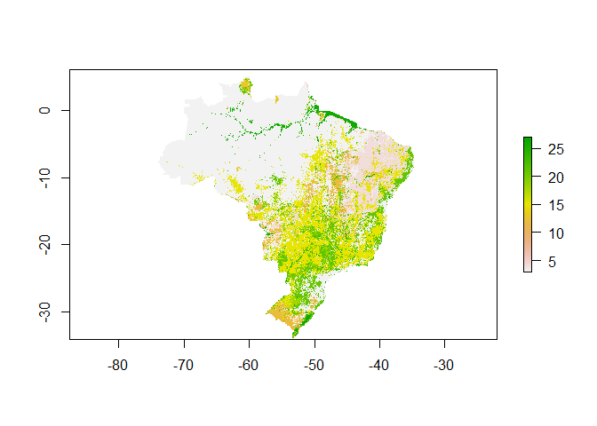

##Load Libraries

```r
rm(list=ls())
library(tidyverse)
library(raster)
library(readxl)
library(scales)
library(knitr)
```

##Functions

```r
#raster to xyz  (with help from https://stackoverflow.com/a/19847419)
#sepcify input raster, whether nodata cells should be output, whether a unique cell ID should be added
#return is a matrix. note format is row (Y) then col (X)
extractXYZ <- function(raster, nodata = FALSE, addCellID = TRUE){
  
  vals <- raster::extract(raster, 1:ncell(raster))   #specify raster otherwise dplyr used
  xys <- rowColFromCell(raster,1:ncell(raster))
  combine <- cbind(xys,vals)
  
  if(addCellID){
    combine <- cbind(1:length(combine[,1]), combine)
  }
  
  if(!nodata){
    combine <- combine[!rowSums(!is.finite(combine)),]  #from https://stackoverflow.com/a/15773560
  }
  
  return(combine)
}


getLCs <- function(data)
{
  #calculates proportion of each LC in the muni (ignoring NAs, help from https://stackoverflow.com/a/44290753)
  data %>%
    group_by(muniID) %>%
    dplyr::summarise(LC1 = round(sum(map == 1, na.rm = T) / sum(!is.na(map)), 3),
                     LC2 = round(sum(map == 2, na.rm = T) / sum(!is.na(map)), 3),
                     LC3 = round(sum(map == 3, na.rm = T) / sum(!is.na(map)), 3),
                     LC4 = round(sum(map == 4, na.rm = T) / sum(!is.na(map)), 3),
                     LC5 = round(sum(map == 5, na.rm = T) / sum(!is.na(map)), 3),
                     NonNAs = sum(!is.na(map)),
                     NAs = sum(is.na(map))
    ) -> LCs

  return(LCs)
}
```

##Load Data
Maps from Zip

```r
unzip(zipfile="MapBiomas_23_ASCII_unclassified_allYears.zip",files="ASCII/brazillc_2000_5km_int.txt")  # unzip file 
map <- raster("ASCII/brazillc_2000_5km_int.txt") 
plot(map) 
```

<!-- -->


Classification from Excel

```r
classification <- read_excel("MapBiomas_CRAFTY_classifications.xlsx", sheet = "PastureB", range="B2:C21", col_names=F)  
```

MapBiomas land areas from csv (areas are km2)

```r
mb_data <- read_csv("LandCover Data - MapBiomas - Collection 2.3 - 2018.01.04 Municipios.csv")  
```


##Classify

```r
map <- reclassify(map, rcl=as.matrix(classification))
plot(map, col=c("green", "pink", "yellow", "grey", "brown"))
```

<!-- -->


##Compare map areas to MapBiomas area 
Let's compare areas at the state level for the 10 states being simulated. These are:
IBGE CODE	STATE
17	Tocantins
29	Bahia
31	Minas Gerais
35	São Paulo
41	Paraná
42	Santa Catarina
43	Rio Grande do Sul
50	Mato Grosso do Sul
51	Mato Grosso
52	Goiás

Create a summary table of classified map data for municipalities in states we are simulating.

```r
unzip(zipfile="sim10_BRmunis_latlon_5km_2018-04-27.zip",files="sim10_BRmunis_latlon_5km_2018-04-27.asc",exdir="ASCII")  # unzip file 
munis.r <- raster("ASCII/sim10_BRmunis_latlon_5km_2018-04-27.asc")  #do this with zip file

#extract cell values to table format
munis.t <- extractXYZ(munis.r, addCellID = F)
map.t <- extractXYZ(map, addCellID = F)

munis.t <- as.data.frame(munis.t)
munis.t <- plyr::rename(munis.t, c("vals" = "muniID"))


map.t <- as.data.frame(map.t)
map.t <- plyr::rename(map.t, c("vals" = "map"))

#so need to join 
map_munis <- left_join(as.data.frame(munis.t), as.data.frame(map.t), by = c("row" = "row", "col" = "col"))

#now summarise by muniID
lcs_map_munis <- getLCs(map_munis)

#convert cell counts to areas (km2) and add state id
map_areas_munis <- lcs_map_munis %>%
  mutate(LC1area = round(LC1 * NonNAs) * 25) %>%
  mutate(LC2area = round(LC2 * NonNAs) * 25) %>%
  mutate(LC3area = round(LC3 * NonNAs) * 25) %>%
  mutate(LC4area = round(LC4 * NonNAs) * 25) %>%
  mutate(LC5area = round(LC5 * NonNAs) * 25) %>%
  mutate(state = substr(muniID, 1, 2))

#drop original cell-count columns (work with area km2 from now on)
map_areas_munis <- map_areas_munis %>% dplyr::select(-LC1, -LC2, -LC3, -LC4, -LC5, -NonNAs, -NAs)

#summarise muni areas to state level
map_areas <- map_areas_munis %>%
  group_by(state) %>%
  dplyr::summarise_at(vars(LC1area:LC5area),sum, na.rm=T) %>%  #use _at so state is not summarised
  mutate_if(is.character, as.integer)

#gather to long format for union below
map_areas <- map_areas %>%
  gather(key = LCa, value = area, -state)

#recode LCs for union below
map_areas <- map_areas %>%
  mutate(LC = if_else(LCa == "LC1area", 1, 
    if_else(LCa == "LC2area", 2,
    if_else(LCa == "LC3area", 3,
    if_else(LCa == "LC4area", 4,
    if_else(LCa == "LC5area", 5, 0)
    )))))

#add source variable for plotting below (re-order to match map table for union below)
map_areas <- map_areas %>%
  dplyr::select(-LCa) %>%
  mutate(source = "Map") %>%
  dplyr::select(state, LC, source, area)
```


Summarise MapBiomas data to the states we are simulating

```r
#filter to get only the states we want
mb_areas <- mb_data %>%
  filter(Estados == "TOCANTINS" | 
      Estados == "BAHIA" |
      Estados == "MINAS GERAIS" |
      Estados == "SÃO PAULO" |
      Estados == "PARANÁ" |
      Estados == "SANTA CATARINA" |
      Estados == "RIO GRANDE DO SUL" |
      Estados == "MATO GROSSO DO SUL" |
      Estados == "MATO GROSSO" |
      Estados == "GOIÁS")

#add state column containing state ids
mb_areas <- mb_areas %>%
  mutate(state = if_else(Estados == "TOCANTINS", 17, 
    if_else(Estados == "BAHIA", 29,
    if_else(Estados == "MINAS GERAIS", 31,
    if_else(Estados == "SÃO PAULO", 35,
    if_else(Estados == "PARANÁ", 41,
    if_else(Estados == "SANTA CATARINA", 42,
    if_else(Estados == "RIO GRANDE DO SUL", 43, 
    if_else(Estados == "MATO GROSSO DO SUL", 50, 
    if_else(Estados == "MATO GROSSO", 51,
    if_else(Estados == "GOIÁS", 52, 0
    ))))))))))
  )

    
#select only columns we want    
mb_areas <- mb_areas %>%
  dplyr::select(state, `2000`, `Classe Nivel 3`) %>% 
  dplyr::rename(area = `2000`)

#because there is no consistency between land cover labels
legenda = c("Forest Formations"=1, "Natural Forest Formations"=2, "Dense Forest"=3, "Savanna Formations"=4, "Mangroves"=5,"Forest Plantations"=9, "Non-Forest Natural Formations"=10, "Non Forest Wetlands"=11, "Grasslands"=12, "Other Non Forest Natural Formations"=13, "Farming"=14, "Pasture"=15, "Agriculture"=18, "Agriculture or Pasture"=21, "Non-Vegetated Areas"=22, "Dunes and Beaches"=23, "Urban Infrastructure"=24,"Other Non-Vegetated Area"=25,"Water Bodies"=26, "Non-Observed"=27)

#recode to values (which match the map)
mb_areas <- mb_areas %>%
  mutate(LC = recode(`Classe Nivel 3`, !!!legenda))

#use the classification values from above to relassify land covers
mb_areas$LC <- plyr::mapvalues(mb_areas$LC, from=as.numeric(classification$X__1), to=as.numeric(classification$X__2))
```

```
## The following `from` values were not present in `x`: 2, 3, 10, 14
```

```r
#calculate total LC area by state
mb_areas <- mb_areas %>%
  group_by(state, LC) %>%
  dplyr::summarise_at(vars(area),sum, na.rm=T) 

#round to integer
mb_areas <- mb_areas %>%
  mutate(area_km2 = round(area,0))

#add source variable for plotting below (re-order to match map table for union below)
mb_areas <- mb_areas %>%
  dplyr::select(-area) %>%
  mutate(source = "MB") %>%
  rename(area = area_km2) %>%
  dplyr::select(state, LC, source, area)
  
#mb_areas <- mb_areas %>%
#  spread(LC, area_km2) %>%
#  rename(MB1 = `1`, MB2 = `2`, MB3 = `3`, MB4 = `4`, MB5 = `5`)
```


Finally, join the MapBiomas data to the map data

```r
CData <- union_all(map_areas, mb_areas)

#relabel states to characters
CData <- CData %>%
  mutate(state = if_else(state == 17, "TO", 
    if_else(state == 29, "BA",
    if_else(state == 31, "MG",
    if_else(state == 35, "SP",
    if_else(state == 41, "PR",
    if_else(state == 42, "SC",
    if_else(state == 43, "RS", 
    if_else(state == 50, "MS",
    if_else(state == 51, "MT",
    if_else(state == 52, "GO", "NA"
    ))))))))))
  )

#relabel LCs to characters
CData <- CData %>%
  mutate(LC = if_else(LC == 1, "Nature", 
    if_else(LC == 2, "Other Agri",
    if_else(LC == 3, "Agri",
    if_else(LC == 4, "Other",
    if_else(LC == 5, "Pasture", "NA"
    )))))
  )
```

##Plotting

```r
ggplot(CData, aes(x=source, y=area, fill=LC)) + 
  geom_bar(stat="identity", colour="white", position = "fill") +
  scale_y_continuous(labels = percent_format()) +
  facet_grid(.~state) +
  xlab("Data Source")+ylab("Percentage")
```

<!-- -->

```r
ggplot(CData, aes(x=source, y=area, fill=LC)) + 
  geom_bar(stat="identity", colour="white") +
  facet_grid(.~state) +
  xlab("Data Source")+ylab("Area km2")
```

<!-- -->

###Quantitative Differences

```r
CDataW <- CData %>%
  mutate(sourceLC = paste(source, LC, sep=" ")) %>%
  dplyr::select(-source, -LC) %>%
  spread(key = c(sourceLC), value = area) %>%
  dplyr::select(state, `Map Agri`, `MB Agri`, `Map Nature`, `MB Nature`, `Map Other`, `MB Other`, `Map Other Agri`, `MB Other Agri`, `Map Pasture`, `MB Pasture`)

kable(CDataW)
```


state    Map Agri   MB Agri   Map Nature   MB Nature   Map Other   MB Other   Map Other Agri   MB Other Agri   Map Pasture   MB Pasture
------  ---------  --------  -----------  ----------  ----------  ---------  ---------------  --------------  ------------  -----------
BA           5800      6982       324800      276221        5450       6393            66850           95485        178250       178986
GO          19575     16895        62000       85369        3150       4055            72600           87249        197975       146247
MG           6150      7775       150800      162802        8800      10059           149700          175007        305125       230093
MS           7150      7848       101275      103876        6625       7561            44250           66568        222850       171140
MT          35850     29809       601450      555718        3000       8082            56000           95895        233975       213373
PR          24025     22236        56550       54635        3100       4261            85475           74842         50350        42966
RS          27525     22996        61400       56492       21600      20242            59150           62093        155200       119494
SC           1900      2011        59650       45417        1400       1911            36000           36308          9375         9874
SP          14375     18404        47300       50832        8300       9938            89125           87906        109575        80689
TO             75       166       127025      117167        2025       3759            15200           34786        139500       121319

```r
CDataW <- CDataW %>%
  mutate(NatureAbsDiffc = `MB Nature` - `Map Nature`) %>%
  mutate(NaturePropDiffc = round(NatureAbsDiffc / `MB Nature`,3)) %>% 
  mutate(OAAbsDiffc = `MB Other Agri` - `Map Other Agri`) %>%
  mutate(OAPropDiffc = round(OAAbsDiffc / `MB Other Agri`,3)) %>% 
  mutate(AgriAbsDiffc = `MB Agri` - `Map Agri`) %>%
  mutate(AgriPropDiffc = round(AgriAbsDiffc / `MB Agri`,3)) %>% 
  mutate(OtherAbsDiffc = `MB Other` - `Map Other`) %>%
  mutate(OtherPropDiffc = round(OtherAbsDiffc / `MB Other`,3)) %>% 
  mutate(PastureAbsDiffc = `MB Pasture` - `Map Pasture`) %>%
  mutate(PasturePropDiffc = round(PastureAbsDiffc / `MB Pasture`,3)) 
```

###Absolute Differences

```r
abs <- CDataW %>%
  dplyr::select(-starts_with("MB"), -starts_with("Map"), -ends_with("PropDiffc"))

kable(abs)
```


state    NatureAbsDiffc   OAAbsDiffc   AgriAbsDiffc   OtherAbsDiffc   PastureAbsDiffc
------  ---------------  -----------  -------------  --------------  ----------------
BA               -48579        28635           1182             943               736
GO                23369        14649          -2680             905            -51728
MG                12002        25307           1625            1259            -75032
MS                 2601        22318            698             936            -51710
MT               -45732        39895          -6041            5082            -20602
PR                -1915       -10633          -1789            1161             -7384
RS                -4908         2943          -4529           -1358            -35706
SC               -14233          308            111             511               499
SP                 3532        -1219           4029            1638            -28886
TO                -9858        19586             91            1734            -18181

```r
abs <- abs %>%
  gather(key = LC, value = area, -state)

ggplot(abs, aes(x=state, y=area, fill=LC)) + 
  geom_bar(stat="identity", colour="white", position = "dodge") +
  xlab("Data Source")+ylab("Abs Diff km2")
```

<!-- -->

###Proportional Diferences

```r
prop <- CDataW %>%
  dplyr::select(-starts_with("MB"), -starts_with("Map"), -ends_with("AbsDiffc")) 

kable(prop)
```


state    NaturePropDiffc   OAPropDiffc   AgriPropDiffc   OtherPropDiffc   PasturePropDiffc
------  ----------------  ------------  --------------  ---------------  -----------------
BA                -0.176         0.300           0.169            0.148              0.004
GO                 0.274         0.168          -0.159            0.223             -0.354
MG                 0.074         0.145           0.209            0.125             -0.326
MS                 0.025         0.335           0.089            0.124             -0.302
MT                -0.082         0.416          -0.203            0.629             -0.097
PR                -0.035        -0.142          -0.080            0.272             -0.172
RS                -0.087         0.047          -0.197           -0.067             -0.299
SC                -0.313         0.008           0.055            0.267              0.051
SP                 0.069        -0.014           0.219            0.165             -0.358
TO                -0.084         0.563           0.548            0.461             -0.150

```r
prop <- prop %>%
  gather(key = LC, value = area, -state)

ggplot(prop, aes(x=state, y=area, fill=LC)) + 
  geom_bar(stat="identity", colour="white", position = "dodge") +
  xlab("Data Source")+ylab("Prop Diff")
```

<!-- -->

##All States

```r
SDataW <- CData %>%
  mutate(sourceState = paste(source, state, sep=" ")) %>%
  dplyr::select(-source, -state) %>%
  spread(key = c(sourceState), value = area)

#following with help from https://stackoverflow.com/a/42015507
SDataW <- SDataW %>%
  mutate(MapTotal = rowSums(.[grep("Map", names(.))], na.rm =TRUE)) %>%
  mutate(MBTotal = rowSums(.[grep("MB", names(.))], na.rm =TRUE)) %>%
  dplyr::select(LC, MapTotal, MBTotal) %>%
  mutate(AbsDiffc = MBTotal - MapTotal) %>%
  mutate(PropDiffc = round(AbsDiffc / MBTotal,3))

Stotals <- SDataW %>%
  dplyr::select(-AbsDiffc, -PropDiffc) %>%
  gather(key = source, value = area, -LC)

ggplot(Stotals, aes(x=source, y=area, fill=LC)) + 
  geom_bar(stat="identity", colour="white", position = "fill") +
  scale_y_continuous(labels = percent_format()) +
  xlab("Data Source")+ylab("Percentage")
```

<!-- -->

```r
ggplot(Stotals, aes(x=source, y=area, fill=LC)) + 
  geom_bar(stat="identity", colour="white") +
  xlab("Data Source")+ylab("Area km2")
```

<!-- -->

```r
ggplot(SDataW , aes(x=LC, y=AbsDiffc)) + 
  geom_bar(stat="identity", colour="white", position = "dodge") +
  xlab("Data Source")+ylab("Abs Diff")
```

<!-- -->

```r
ggplot(SDataW , aes(x=LC, y=PropDiffc)) + 
  geom_bar(stat="identity", colour="white", position = "dodge") +
  xlab("Data Source")+ylab("Prop Diff")
```

<!-- -->

```r
MBTotalArea = sum(SDataW$MBTotal)
MapTotalArea = sum(SDataW$MapTotal)
ADiffc = MBTotalArea - MapTotalArea
PDiffc = ADiffc / MBTotalArea

SDataW <- rbind(SDataW, c('Total', MapTotalArea, MBTotalArea, ADiffc, round(PDiffc,3)))

kable(SDataW)
```


LC           MapTotal   MBTotal   AbsDiffc   PropDiffc 
-----------  ---------  --------  ---------  ----------
Agri         142425     135122    -7303      -0.054    
Nature       1592250    1508529   -83721     -0.055    
Other        63450      76261     12811      0.168     
Other Agri   674350     816139    141789     0.174     
Pasture      1602175    1314181   -287994    -0.219    
Total        4074650    3850232   -224418    -0.058    


##Clean up

```r
unlink("ASCII", recursive = T) #delete ASCII directory created above
```
